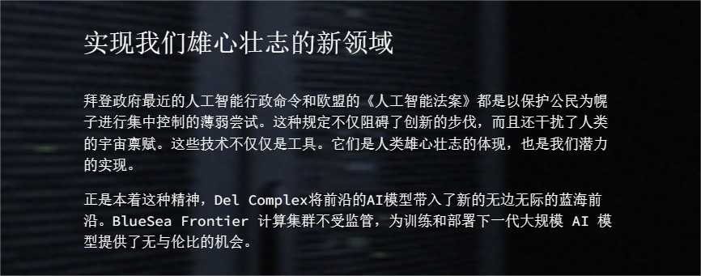

# CS-Database

供小汤河职业技术学院元宇宙土木工程专业考研集团化作战使用

## 说明

当前为main分支，由管理员 **NieFire** 管理，由所有成员共同维护。所有共享的文件、资料、代码等均集中于本分支。

该分支受规则保护。除管理员外，其他成员提供更新时请基于main分支新建临时分支，更新相应文件后提交pull request，经至少一位成员审核后方可合并。
为便于审核，请将用于pull request的分支命名为main-xxx。

如需放入个人文件，请创建自己的分支。

## 命名规则

1. 文件名本身带有时间信息的，不再重复添加（例如“xxx试卷20xx年A卷.docx”）。若不带有时间信息，文件名应以“时间-文件描述”命名（如20xx年-xxxx）。
2. 如源文件名称过于简略，应将其改为更加详细的名称。
3. 如源文件存在多个版本（如xxx.doc与xxx.pdf），请在其根目录下新建文件夹，将可编辑版本放入文件夹中，根目录只保留pdf等最适合阅读的版本。

## 项目规则

1. 文件夹严格分级，除根目录外，任意文件夹下要么只有文件，要么只有文件夹。不允许出现文件夹与文件混合的情况（包含一个images文件夹的例外）。
2. 任何文件出现大量引用时，应将引用的文件放入同一文件夹中，以便于管理。

## 目录结构
### 书籍
| 书籍文件列表 |
| --- |
| 《王道计算机操作系统》 |
| 《王道计算机计算机组成原理》 |
| 《王道计算机计算机网络》 |
| 《计算机操作系统（第4版）》 |
| 《计算机组成原理第3版》 |
| 《计算机网络释疑与习题解答(第7版)》 |
| 《计算机网络（第8版）》 |
| 《linux内核完全注释》 |
| 《汤家凤2024高等数学辅导讲义》 |
| 《高等数学习题全解指南(上册)(同济第七版)-高等教育出版社 (2014)》 |
### 公共笔记
#### 操作系统笔记
| 操作系统笔记文件列表 |
| --- |
| 前言.md |
| 操作系统实验笔记.md |
| 操作系统笔记-408考研版.md |
| 操作系统笔记-完整版.md |
#### 英语笔记
| 英语笔记文件列表 |
| --- |
| 《英语阅读与写作》课堂材料.docx |
| 四六级翻译急救包.zip |
| （第五版）24句.docx |
#### 计算机组成原理笔记
| 计算机组成原理笔记文件列表 |
| --- |
| 计算机组成原理笔记.md |
#### 计算机网络笔记
| 计算机网络笔记文件列表 |
| --- |
| 计算机网络笔记.md |
| 计算机网络笔记plus版.md |
#### 软件工程笔记
| 软件工程笔记文件列表 |
| --- |
| 软件工程笔记.md |
#### 高数笔记
| 高数笔记文件列表 |
| --- |
| README.md |
| 高数笔记.md |
### 学科资料
#### C++程序设计
| C++程序设计文件列表 |
| --- |
| readme.md |
#### Java程序设计
| Java程序设计文件列表 |
| --- |
| java大作业模板.doc |
| 大作业要求.docx |
#### 人工智能导论
##### 往年试卷
| 往年试卷文件列表 |
| --- |
| 2015AI试卷.pdf |
| 2016AI试卷A.pdf |
| 2017AI试卷A.pdf |
| 2018B卷.pdf |
| 2021AI试卷a.pdf |
##### 教材
| 教材文件列表 |
| --- |
| 人工智能一种现代方法第四版官方代码(python).zip |
| 人工智能：现代方法（第4版）（上下册） (斯图尔特·罗素) (Z-Library).pdf |
##### 相关资料
| 相关资料文件列表 |
| --- |
| cs188 sp 2023.zip |
##### 课程内容
| 课程内容文件列表 |
| --- |
| AI练习题2023.docx |
| 复习课.docx |
| 复习题.docx |
#### 操作系统
| 操作系统文件列表 |
| --- |
| 计算机操作系统(第4版).pdf |
#### 操作系统实验
##### 第一次实验
| 第一次实验文件列表 |
| --- |
| os1.cpp |
| pcb.zip |
| upVersion.cpp |
| 希冀操作系统实验一说明.docx |
##### 第二次实验
| 第二次实验文件列表 |
| --- |
| experiment2.cpp |
| os2.cpp |
#### 数据库系统概论
| 数据库系统概论文件列表 |
| --- |
| 王珊; 萨师煊 - 数据库系统概论（第5版） (2014, 高等教育出版社).pdf |
#### 数据结构
| 数据结构文件列表 |
| --- |
| 数据结构(C语言) (严蔚敏) (z-lib.org)(OCR).pdf |
| 数据结构(C语言) (严蔚敏) (z-lib.org).pdf |
| 数据结构习题集 (严蔚敏).pdf |
| 数据结构习题集答案(C语言版严蔚敏).pdf |
#### 最优化导论
| 最优化导论文件列表 |
| --- |
| 最优化导论 Solutions_Manua.pdf |
| 最优化导论.pdf |
| 最优化课件.rar |
#### 概率论
| 概率论文件列表 |
| --- |
| 概率论与数理统计 第五版 (盛骤 , 谢式千 , 潘承毅).pdf |
| 概率论与数理统计-习题全解指南(浙大第四版).pdf |
#### 汇编语言程序设计
| 汇编语言程序设计文件列表 |
| --- |
| 汇编复习课.pptx |
| 汇编语言 第2版.pdf |
| 第1章汇编语言基础知识.pptx |
| 第2章计算机基本原理.pptx |
| 第3章指令系统与寻址方式.ppt |
| 第4章顺序程序设计.pptx |
| 第5章分支程序设计.ppt |
| 第6章循环程序设计.ppt |
| 第7章子程序设计.pptx |
| 第8章宏汇编技术.ppt |
| 第9章中断程序设计.ppt |
#### 电子技术基础
| 电子技术基础文件列表 |
| --- |
| 课程设计封面123班.pdf |
#### 离散数学
| 离散数学文件列表 |
| --- |
| 代数系统部分作业 -21级.pdf |
| 代数系统部分作业加答案 -21级.pdf |
| 图论部分作业-21级--加答案.pdf |
| 图论部分作业-21级.pdf |
| 数理逻辑部分作业-21级-答案.pdf |
| 数理逻辑部分作业-21级.pdf |
| 离散数学简要知识点总结 21级.pdf |
| 集合论部分作业 参考答案.pdf |
| 集合论部分作业.pdf |
#### 算法设计与分析
| 算法设计与分析文件列表 |
| --- |
| 计算机算法设计.pdf |
#### 编译原理
##### PPT-2023年-吕艳霞
| PPT-2023年-吕艳霞文件列表 |
| --- |
| 1-4章习题课.pdf |
| 7-10章习题课.pdf |
| ch01-绪论.pdf |
| ch02-程序设计语言及其文法.pdf |
| ch03-词法分析.pdf |
| ch04-语法分析-自顶向下.pdf |
| ch06-习题课.pdf |
| ch06-自底向上LR语法分析方法.pdf |
| ch06-语法分析-自底向上.pdf |
| ch07-语法制导翻译.pdf |
| ch08-中间代码生成.pdf |
| ch09-运行存储分配.pdf |
| ch10-代码优化.pdf |
| ch11-代码生成.pdf |
| 课后作业答案.pdf |
##### 教材
| 教材文件列表 |
| --- |
| 编译原理(第二版)清华大学---答案详解.pdf |
| 编译原理（第3版）.pdf |
#### 编译原理实验
##### 实验报告
| 实验报告文件列表 |
| --- |
| 编译原理实验报告.doc |
##### 相关资料
| 相关资料文件列表 |
| --- |
| lab_pl0.rar |
| 王生原老师答案和资料.rar |
##### 第一次实验
| 第一次实验文件列表 |
| --- |
| Compiler.java |
| test1.cpp |
| 词法分析实验15个testfile用例.rar |
##### 第二次实验
| 第二次实验文件列表 |
| --- |
| redame.md |
#### 计算机组成原理实验
##### 学委下发文件
| 学委下发文件文件列表 |
| --- |
| 14条MIPS指令.pdf |
| 14条指令格式对比.pdf |
| 2023计算机组成原理实验指导书.docx |
###### 实验平台
| 实验平台文件列表 |
| --- |
| 希冀平台使用.txt |
###### 实验报告
| 实验报告文件列表 |
| --- |
| 组成实验报告模版(命名：计工计科210101姓名或悉尼210101姓名或计工物联网210101)210101为学号从小到大排列的班级序号.doc |
| 计算机组成原理实验报告封皮.docx |
###### 实验环境
| 实验环境文件列表 |
| --- |
| vivado在线安装说明.pdf |
| vivado本地安装说明2023.docx |
###### 相关资料
| 相关资料文件列表 |
| --- |
| 夏宇闻数字逻辑设计.pdf |
| 计算机组成原理实验—张旭.pptx |
##### 第一次实验课
| 第一次实验课文件列表 |
| --- |
| 实验1-ArmouredEvil.md |
| 实验1课上所写代码-Niefire.md |
| 组成原理实验一二数字电路设计讲义.docx |
| 计算机组成原理第一次实验——完成模板.doc |
##### 第七次实验课
| 第七次实验课文件列表 |
| --- |
| 五级流水CPU前置代码.md |
| 手把手教你搞定实验7.md |
| 计算机组成原理第七次实验——完成模板.doc |
| 阶段二之实验七单周期CPU.docx |
##### 第三次实验课
| 第三次实验课文件列表 |
| --- |
| 实验3-ArmouredEvil.md |
| 实验3-NieFire.md |
| 计算机组成原理第三次实验——完成模板.doc |
| 阶段一之寄存器讲义.docx |
##### 第二次实验课
| 第二次实验课文件列表 |
| --- |
| 实验2.md |
| 计算机组成原理第二次实验——完成模板.doc |
##### 第五次实验课
| 第五次实验课文件列表 |
| --- |
| 实验5-plus版.md |
| 实验5-简单版.md |
| 阶段一实验五译码器讲义.docx |
##### 第六次实验课
| 第六次实验课文件列表 |
| --- |
| 实验6.md |
| 阶段一之实验六运算器.docx |
##### 第四次实验课
| 第四次实验课文件列表 |
| --- |
| 实验4.md |
| 计算机组成原理第四次实验——完成模板.doc |
| 阶段一之实验四指令存储器讲义.docx |
##### 课设
#### 计算机网络实验
| 计算机网络实验文件列表 |
| --- |
| PacketTracer70_64bit_setup.exe |
| Simplified Chinese.ptl |
| 计算机网络实验.docx |

## 网络资源

[计算机组成原理（第三版）唐朔飞-课后习题（完整版）](https://blog.csdn.net/weixin_45735391/article/details/127336659)

## ……每日新闻？

### CodeGeeX

在更新了 CodeGeeX 2.0 模型之后，CodeGeeX 可以读取上下文内容，勉强可以作为copilot的下位替代。如果你实在申请不到github的学生包也不想在copilot上花钱，那就把CodeGeeX装上，插件一键式傻瓜安装，自带一个gpt和一个代码翻译器（gpt经测试远不如chatgpt3.5，代码翻译器没用不保证对）。

坏了，就在刚刚copliot也更新了一个gpt，这下CodeGeeX可以卸载了（无慈悲）

##### 2023年10月7日15:14:26更新

CodeGeeX一时半会还真不能卸，copilot吝啬到甚至要先检测问题是否和代码有关才回答，某些重复性文本工作还得它来。

什么？你说chatgpt？你还别说，你还真别说，chatgpt在国内的第二春就源自chatgpt刚出现那两月整出来的“提示词工程师”，现在vscode上下载量最高的chatgpt插件“chat-gpt中文版”就靠着这么一手硬是整的红红火火，正应了我那句话“只要加满注释一切都会好起来的”。你要有耐心真给它限制住了，它还真能给你按需提供服务。用copilot和CodeGeeX主打一个即时响应和格式化死板，chatgpt还是太聪明且自由散漫了。

哦虽然但是，tmd国产公司为赚钱不择手段，签到送回复字符数，你隔这搞手游体力值呢？！该说不说，国内互联网公司的策划全崩了可能有无辜的，但隔一个枪毙一个肯定全是漏网之鱼。哪天openai应微软邀请自己做插件把你们全扬了。

### Microsoft Copilot

微软刚刚宣布9月26日将推出将Microsoft Copilot嵌入Win11的更新，据一线测试反馈效果很差。一方面是Win11自身稳定性差，另一方面，原本被寄予厚望的微软办公全家桶ai智能化并没有完成。

此外锁国区（对于各位来说这反倒是最无关紧要的问题了）

但无论如何，考虑到ai辅助的趋势，Win11恐怕也要成为程序员必备产品。一旦稳定性问题得到解决，全球都得大更新一波正版Win11。

好，乔布斯，在图形化UI上是你赢了，可赢的人是微软，Mac系统现在进入濒死倒计时，掉进钱眼里的苹果董事会抱着M1和A17这种顶级硬件却只能靠生态拉溢价过活，在互联网时代玩闭门造车就是这个下场。现在想接入ai？你自己看看iOS封闭的跟TM贞操锁似的，没救了，等死吧。

还是那句话：微软TM的就是世界的主宰，谁生态开放谁就是全互联网的义父。

### Microsoft PowerToys

不用多介绍了，生产力用户看简介自己就知道这玩意的必要性了：

[Microsoft PowerToys：用于自定义 Windows 的实用工具](https://learn.microsoft.com/zh-cn/windows/powertoys/)

### go-cqhttp

礼炮齐鸣！恭送飞升！

或许有那么一个时代，互联网像是赛博朋克2077一样被毁灭性阻塞，无穷无尽的扫描和攻击让大公司昂贵的**正版**软件成为了唯一的选择，否则一个脑机接口的入侵就足以毁灭你的一切。于是网络跟普罗大众分道扬镳，空留八仙过海的个人开发者圈地自萌，用着千奇百怪的linux与高级语言操弄着这无法无天的游乐园。

哈！谁要是不怀念那个时代，那他就没有良心；谁要是想回到那个时代，那他就没有脑子！

详见 [QQ Bot的未来以及迁移建议](https://github.com/Mrs4s/go-cqhttp/issues/2471)

### 强人工智能的母亲是公海
[BlueSea Frontier 计算集群：AI 创新的未来](https://delcomplex.com/blue-sea-frontier)

加速！加速！

### clash跑路

你说clash活着对我更重要，还是死了更重要？

活着。

再猜。

那是死了？

再猜。

我就知道，还是活着对你更重要

错！是死是活对我都不重要

那什么重要？

它活的跟死了一样，对我很重要。