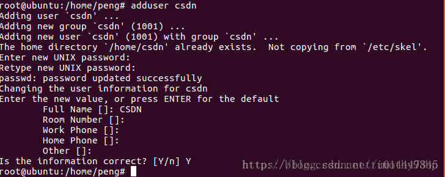
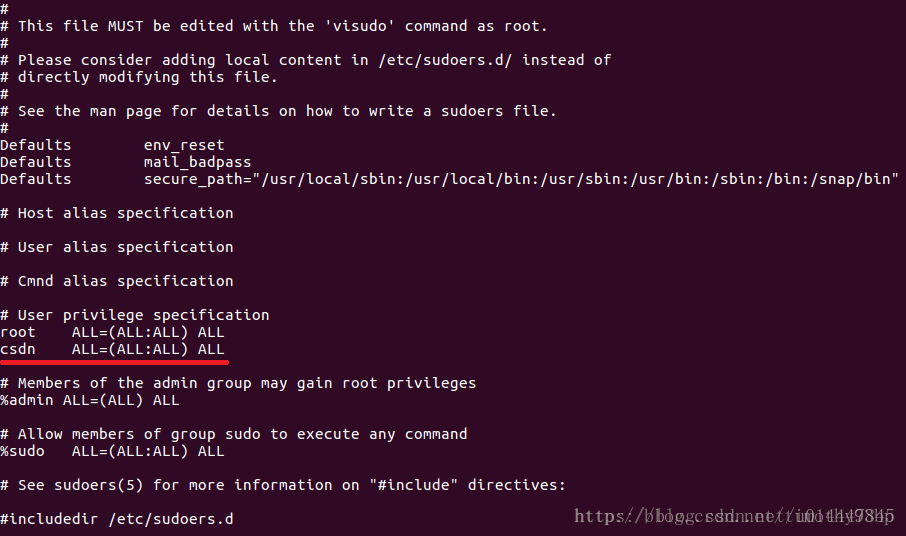

# 操作系统实验记录

## 环境搭建

### 1. 获取服务器

### 2. 配置服务器远程连接
#### 2.1 vscode配置远程登录

1. 安装vscode插件Remote Development，vscode自动安装其他相应插件。
2. 在vscode左下角点击“打开远程窗口”按钮，选择“连接到主机...”。
3. 选择添加新的SSH主机，按vscode提示输入服务器信息。如ssh root@192.168.34.18（root为你要登录的用户名，@后面为服务器的公网ip）（或直接输入公网ip即可）
4. 选择要写入配置文件的位置，请选择自己的用户目录下的.ssh文件夹，如C：\Users\用户名\.ssh\config
5. vscode会自动打开一个新的窗口，右下角会出现提示弹窗，选择“连接”
6. vscode要求输入密码，输入密码即可登录服务器。第一次登录配置时间较长。

到此，可以方便的使用vscode打开服务器上的文件夹，使用vscode的文本编辑器编辑服务器上的文件。否则，在进行接下来的步骤之前，请先学习如何使用vim。

#### 2.2 配置ssh免密登录

如不配置免密登录，每次使用vscode登录服务器或打开服务器上的文件夹都需要输入密码，十分麻烦。

##### 2.2.1 服务器生成密钥对

在服务器终端上输入ssh-keygen，一路回车即可。

之后服务器/home/你的用户名/ 下会出现.ssh文件夹，如果是root用户会出现在/root下面。id_rsa是生成的私钥，id_rsa.pub是公钥

##### 2.2.2 本地生成密钥对

打开cmd,输入ssh-keygen，一路回车即可。生成的密钥对在C:\Users\你的用户名\.ssh下，主要有四个文件，id_rsa是生成的私钥，id_rsa.pub是公钥，config是配置VScode远程登录生成的配置文件，known_hosts记录远程免密登录的服务器的公钥

##### 2.2.3 服务器配置

在服务器的ssh配置文件夹下，已经生成一个authorized_keys文件，将主机的公钥复制到这个文件里，即可完成VScode远程免密登录

### 3. 服务器环境配置

#### 3.1 切换软件源

阿里源安装Ubuntu 16图形化界面时出现版本问题，故使用清华源。

[清华大学开源软件镜像站-Ubuntu 软件仓库](https://mirrors.tuna.tsinghua.edu.cn/help/ubuntu/)

Ubuntu 的软件源配置文件是 /etc/apt/sources.list。将系统自带的该文件做个备份，将该文件替换为下面内容，即可使用选择的软件源镜像。

```bash
# 默认注释了源码镜像以提高 apt update 速度，如有需要可自行取消注释
deb https://mirrors.tuna.tsinghua.edu.cn/ubuntu/ xenial main restricted universe multiverse
# deb-src https://mirrors.tuna.tsinghua.edu.cn/ubuntu/ xenial main restricted universe multiverse
deb https://mirrors.tuna.tsinghua.edu.cn/ubuntu/ xenial-updates main restricted universe multiverse
# deb-src https://mirrors.tuna.tsinghua.edu.cn/ubuntu/ xenial-updates main restricted universe multiverse
deb https://mirrors.tuna.tsinghua.edu.cn/ubuntu/ xenial-backports main restricted universe multiverse
# deb-src https://mirrors.tuna.tsinghua.edu.cn/ubuntu/ xenial-backports main restricted universe multiverse

deb http://security.ubuntu.com/ubuntu/ xenial-security main restricted universe multiverse
# deb-src http://security.ubuntu.com/ubuntu/ xenial-security main restricted universe multiverse

# 预发布软件源，不建议启用
# deb https://mirrors.tuna.tsinghua.edu.cn/ubuntu/ xenial-proposed main restricted universe multiverse
# # deb-src https://mirrors.tuna.tsinghua.edu.cn/ubuntu/ xenial-proposed main restricted universe multiverse
```

#### 3.2 安装图形化界面

运行以下命令，更新软件源。
```bash
	apt-get update
```

运行以下命令，安装图形化桌面。
```bash
	apt-get install ubuntu-desktop
```

运行以下命令，设置默认启动为图形化桌面。
```bash
	systemctl set-default graphical.target
```

运行以下命令，重启ECS实例。
```bash
	reboot
```

之后使用VNC远程连接服务器即可使用图形化界面。

#### 3.3 新建可登录图形用户界面的用户及管理员权限

使用vscode或其他连接方式登录服务器（总之不要进入图形化界面），运行以下命令，新建用户。
```bash
	adduser username # username为你的用户名
```

然后根据系统提示进行密码和注释性描述的配置，全程不用自己输入其他命令即可配置成功，用户主目录和命令解析程序都是系统自动指定。


然后运行以下命令：
```bash
	visudo
```

该命令实际上打开的是/etc/sudoers文件，修改该文件，在“root ALL=(ALL:ALL) ALL”这一行下面加入一行：
username ALL=(ALL:ALL) ALL

注：ctrl+o（然后再按enter）保存，ctrl+c取消，ctrl+x退出


#### 3.4 安装git

首先更新软件源，然后运行以下命令：
```bash
	apt-get install git
```

可通过以下命令验证是否安装成功：
```bash
	git --version
```
如果安装成功，会显示git的版本信息。

#### 3.5 安装实验环境

1. 克隆该仓库
	```bash
	git clone https://github.com/Wangzhike/HIT-Linux-0.11.git
	```
2. 进入到环境配置文件夹
	```bash
	cd HIT-Linux-0.11/0-prepEnv/hit-oslab-qiuyu/
	```

3. 执行脚本。     
本安装脚本会将实验环境安装在当前登录用户的*HOME*目录下，文件名为*oslab*。如果有特殊需要，请自行移动文件夹位置。注意，请不要使用超级用户执行此命令，当有需要时该脚本会请求超级用户权限。
	```bash
	./setup.sh
	```

#### 复原
考虑到操作系统实验每次需要重置linux-0.11目录，添加了重置linux-0.11目录下所有文件的功能。本命令由`./run`命令提供。
 ```bash
 ./run init
 ```

### 4. 运行

``` bash
cd ~/oslab/linux-0.11
make
cd ..
./run
```
### QA

#### 1. 初始化云盘之后，vscode无法连接服务器（报错：过程试图写入的管道不存在）
将本机.ssh文件夹下的known_hosts中服务器的公钥删除即可。注意，不要直接删除文件，里面可能存放着其他服务器和github的ssh公钥，删除时请仔细查看。

#### 2. 为什么安装了图形化界面后还是只有命令行界面？
请注意，只能使用VNC远程连接服务器，使用其他远程连接方式只会进入命令行界面。

啊？你没配默认打开图形化界面？没重启？回去看3.2。

#### 3. 为什么在图形化界面里打开终端之后啥也干不了？老提示Operation not permitted？
给爷爬，回去看3.3。