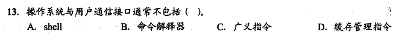
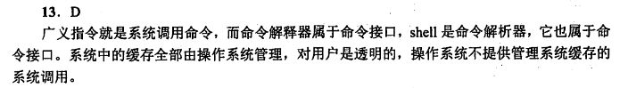
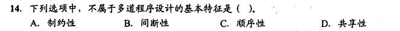
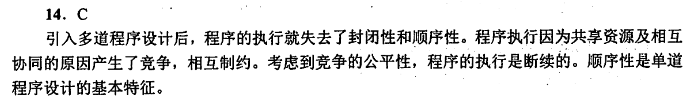
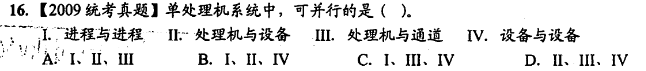
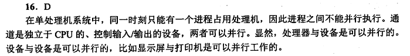

# 操作系统笔记-408考研版

## 第一章 计算机系统概述

### 1.1 计算机系统的基本概念

#### 1.1.1 操作系统的概念

略

#### 1.1.2 操作系统的特征

1. 并发

    注意并发和并行的区别
2. 共享
3. 虚拟
4. 异步

#### 1.1.3 操作系统的目标和功能

注意：
1. 操作系统提供两类接口：命令接口和程序接口

    命令接口：按作业控制方式的不同，将命令接口分为联机命令接口和脱机命令接口

    联机命令接口又称交互式命令接口，用户输入一条命令，命令解释程序就解释并执行。

    脱机命令接口又称批处理命令接口，用户事先将一批命令写成文件，提交给操作系统，由操作系统按顺序执行。

    程序接口：由一组系统调用（广义指令）组成，供用户程序调用。当前最流行的是图形用户界面（GUI），即图形接口。GUI是调用程序接口实现的。

#### 1.1例题

在上面的题目中提到了shell和通道两概念，前者可在教材第九章“操作系统接口”找到，后者可在教材第一章的 1.4.3 设备管理功能的 2.设备分配找到（笔记已在完整版补充）。