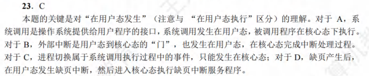

# 操作系统笔记-408考研版

## 前言

25年回看，王道书大改，笔记要重写，任重而道远。

## 第一章 计算机系统概述

### 1.1 计算机系统的基本概念

#### 1.1.1 操作系统的概念

略

#### 1.1.2 操作系统的特征

1. 并发（注意并发和并行的区别）
2. 共享
3. 虚拟
4. 异步

#### 1.1.3 操作系统的目标和功能

注意：
1. 操作系统提供两类接口：命令接口和程序接口

    命令接口：按作业控制方式的不同，将命令接口分为联机命令接口和脱机命令接口

    联机命令接口又称交互式命令接口，用户输入一条命令，命令解释程序就解释并执行。

    脱机命令接口又称批处理命令接口，用户事先将一批命令写成文件，提交给操作系统，由操作系统按顺序执行。

    程序接口：由一组系统调用（广义指令）组成，供用户程序调用。当前最流行的是图形用户界面（GUI），即图形接口。GUI是调用程序接口实现的。

#### 1.1 例题

### 1.2 操作系统发展历程

#### 1.2.1 手工操作阶段

略

#### 1.2.2 批处理阶段

为了解决人机矛盾及CPU和I/O设备之间速度不匹配的矛盾，出现了批处理系统。按发展历程又分为单道批处理系统、多道批处理系统（多道程序设计技术出现以后）。

1. 单道批处理系统
   
    单道批处理系统解决人机矛盾及CPU和I/O设备速率不匹配的矛盾。

    此时面临的问题是：每次主机内存中仅存放一道作业，每当它在运行期间(注意这里是“运行时”而不是“完成后”)发出输入/输出请求后，高速的CPU便处于等待低速的I/O完成的状态。为了进一步提高资源的利用率和系统的吞吐量，引入了多道程序技术。

2. 多道批处理系统

    多道批处理系统的主要特征有：多道、宏观上并行、微观上串行。

    多道批处理系统资源利用率高，系统吞吐量大，但没有交互性

#### 1.2.3 分时操作系统

分时操作系统的主要特征有：同时性、交互性、独立性、及时性。

#### 1.2.4 实时操作系统

为了能在某个时间限制内完成某些紧急任务而不需要时间片排队，诞生了实时操作系统。

这里的时间限制可以分为两种情况：

若某个动作必须绝对地在规定的时刻（或规定的时间范围）发生，则称为**硬实时系统**，如飞行器的飞行自动控制系统，这类系统必须提供绝对保证，让某个特定的动作在规定的时间内完成。

若能够接受偶尔违反时间规定且不会引起任何永久性的损害，则称为**软实时系统**，如飞机订票系统、银行管理系统。

#### 1.2.5 网络操作系统和分布式计算机系统

网络操作系统最主要的特点是网络中各种资源的共享及各台计算机之间的通信。

用于管理分布式计算机系统的操作系统称为分布式计算机系统。该系统的主要特点是:分布性和并行性。分布式操作系统与网络操作系统的本质不同是，分布式操作系统中的若干计算机相互协同完成**同一任务**。

### 1.3 操作系统运行环境

#### 1.3.1 处理器运行模式

注意：CPU的运行状态分为用户态（目态）和核心态（管态、核心态）。用户态只能使用非特权指令，核心态可以使用特权指令和非特权指令。

现代操作系统几乎都是分层式结构。操作系统的各项功能分别被设置在不同的层次上。与硬件关联较紧密的模块，如时钟管理、中断处理、设备驱动等处于最低层。其次是运行频率较高的程序，如进程管理、存储器管理和设备管理等。这两部分内容构成了操作系统的内核。这部分内容的指令操作工作在核心态。

大多数操作系统的内核包括4方面的内容：

1. 时钟管理
2. 中断机制

    注意：中断机制中，只有一小部分功能属于内核，其负责保护和恢复中断现场的信息，转移控制权到相关的处理程序。这样可以减少中断的处理时间，提高系统的并行处理能力。

3. 原语

    定义原语的直接方法是关中断，让其所有动作不可分割地完成后再打开中断。系统中的设备驱动、CPU切换、进程通信等功能中的部分操作都可定义为原语，使它们成为内核的组成部分。

4. 系统控制的数据结构及处理

    包括作业控制块、进程控制块（PCB）、设备控制块、各类链表、消息队列、缓冲区、空闲区登记表、内存分配表等。

    核心态指令包括系统调用类指令和一些针对时钟、中断和原语的操作指令

#### 1.3.2 中断和异常的概念

##### 1.中断和异常的定义

中断（Interrupt）也称外中断，指来自CPU执行指令外部的事件。例如设备发出的I/O中断、时钟中断等

异常（Exception）也称内中断，指CPU执行指令内部的事件。例如非法操作码、地址越界、运算溢出、虚拟存储系统缺页、专门的陷入指令等。异常不能被屏蔽。

##### 2.中断和异常的分类

**外中断分为可屏蔽中断和不可屏蔽中断。**

① 可屏蔽中断是指通过INTR线发出的中断请求，通过改变屏蔽字可以实现多重中断，从而使得中断处理更加灵活。

② 不可屏蔽中断NMI是指通过NMI线发出的中断请求，通常是紧急的硬件故障，如电源掉电等。此外，异常也是不能被屏蔽的。

****

**内中断（异常）可分为故障、自陷和终止。**

故障（Fault）通常是由指令执行引起的异常，如非法操作码、缺页故障、除数为0、运算溢出等。

自陷（Trap、陷入、访管）是一种事先安排的“异常”事件，用于在用户态下调用操作系统内核程序，如条件陷阱指令。

终止（Abor）是指出现了使得CPU无法继续执行的硬件故障，如控制器出错、存储器校验错等。

故障异常和自陷异常属于软件中断（程序性异常），终止异常和外部中断属于硬件中断。

#### 1.3.3 系统调用

系统调用的功能有：

**设备管理**。完成设备的请求或释放，以及设备启动等功能。

**文件管理**。完成文件的读、写、创建及删除等功能，

**进程控制**。完成进程的创建、撤销、阻塞及唤醒等功能。

**进程通信**。完成进程之间的消息传递或信号传递等功能，

**内存管理**。完成内存的分配、回收以及获取作业占用内存区大小和起始地址等功能，

系统调用的处理需要由操作系统内核程序负责完成，要运行在核心态。

****

系统调用的处理过程:第一步：

**用户程序**首先将系统调用号和所需的参数压入堆栈;

接着，**用户程序**调用实际的调用指令;

然后**硬件**执行一个陷入指令，将CPU状态从**用户态转为核心态**；

再后，由硬件和操作系统内核程序保护被中断进程的现场。中断隐指令通过 **硬件** 将 **程序计数器(PC)、程序状态字(PSW)** 压栈，通用寄存器内容是否压栈取决于系统调用是否需要使用这些内容，如果要使用并修改，就由 **操作系统** 压栈。

总结为**提供参数，进入调用，进核心态，保护现场**

第二步是，分析系统调用类型，**转入**相应的系统调用处理子程序。

在系统中配置了一张系统调用入口表，表中的每个表项都对应一个系统调用，根据系统调用号可以找到该系统调用处理子程序的入口地址。

第三步是，在系统调用处理子程序执行结束后，恢复被中断的或设置新进程的CPU现场，然后返回被中断进程或新进程，继续往下执行。

#### 1.3例题

本题涉及的知识可在汇编语言中找到，在操作系统教材中则位于 41 页（2）处理机状态处。

在教材191页 (2)保护被中断进程的CPU环境 中写到：

> ……首先需要保存的是，从中断现场恢复到当前进程运行所需要的信息。通常由**硬件**自动将处理机状态字（PSW）和保存在程序计数器（PC）中下一条指令的地址保存在中断保留区（栈）中。
>
> 然后，把被中断进程的CPU现场信息，即将包括所有CPU寄存器的（如通用寄存器、段寄存器等）内容都压入中断栈中。因为在中断处理时可能会用到这些寄存器。

注意中断向量表由操作系统初始化，请将其作为补充知识点记忆。中断屏蔽字相关知识位于计算机组成原理教材 365 页 3.屏蔽技术处。

### 1.4 操作系统结构

本节只可能考小题，大概率是对比各种体系结构间的优缺点，注意理解课件中给大家的总结的那张表即可

### 1.5 操作系统引导

2022 年大纲新增内容

操作系统引导是指计算机利用CPU运行特定程序，通过程序识别硬盘，识别硬盘分区，识别硬盘分区上的操作系统，最后通过程序启动操作系统，一环扣一环地完成上述过程。

常见操作系统的引导过程如下:

①激活CPU。激活的CPU读取 ROM 中的boot程序，将指令寄存器置为BIOS(基本输入/输出系统)的第一条指令，即开始执行BIOS的指令。

②硬件自检。BIOS程序在内存最开始的空间构建中断向量表，接下来的POST过程要用到中断功能。然后进行通电自检，检查硬件是否出现故障。如有故障，主板会发出不同含义的蜂鸣，启动中止；如无故障，屏幕会显示CPU、内存、硬盘等信息

③加载带有操作系统的硬盘。通电自检后，BIOS 开始读取Boot Sequence(通过CMOS里保存的启动顺序，或者通过与用户交互的方式)，将控制权交给启动顺序排在第一位的存储设备，然后CPU将该存储设备引导扇区的内容加载到内存中。

④加载主引导记录(MBR)。硬盘以特定的标识符区分引导硬盘和非引导硬盘。如果发现一个存储设备不是可引导盘，就检查下一个存储设备。如无其他启动设备，就会死机。主引导记录 MBR 的作用是告诉CPU去硬盘的哪个主分区去找操作系统。

⑤扫描硬盘分区表，并加载硬盘活动分区。MBR包含硬盘分区表，硬盘分区表以特定的标识符区分活动分区和非活动分区。主引导记录扫描硬盘分区表，进而识别含有操作系统的硬盘分区(活动分区)。找到硬盘活动分区后，开始加载硬盘活动分区，将控制权交给活动分区。

⑥加载分区引导记录(PBR)。读取活动分区的第一个扇区，这个扇区称为分区引导记录(PBR)，其作用是寻找并激活分区根目录下用于引导操作系统的程序(启动管理器)。

⑦加载启动管理器。分区引导记录搜索活动分区中的启动管理器，加载启动管理器。

⑧加载操作系统的初始化程序。

### 1.6 虚拟机

2022 大纲新增内容，今年如果考，大概率是对比第一类和第二类虚拟机的特性，注意理解课件中给大家的总结的那张表即可

## 第二章 进程与线程

### 2.1 进程与线程

本节内容多，概念杂，但难度不高，主要考选择题。

概念性的内容不必多说，科班对这些都熟悉。

#### 2.1.3 进程的状态与转换

#### 2.1.4 进程控制

#### 2.1.5 进程的通信

1. 共享存储
2. 消息传递。分直接通信（每个进程有自己的消息缓冲队列）、间接通信（信箱）
3. 管道通信

#### 2.1.6 线程和多线程模型

注意：

1. 线程是CPU的独立调度单位。
2. 多线程模型中的一对一/多对一/多对多指用户级线程-对-内核级进程。对操作系统而言，其只能看到内核级进程。

#### 2.1例题

### 2.2 CPU调度

#### 2.2.1 调度的概念

调度层次：

1. 高级调度（作业调度）：内存与辅存间的调度，为作业分配内存、IO设备等。每个作业只调入一次、调出一次。
2. 中级调度（内存调度）：提高内存利用率与系统吞吐量。
3. 低级调度（进程调度）：即常说的调度。

### 2.3 同步与互斥

注：swap是系统提供的原子级操作

### 2.4 死锁

