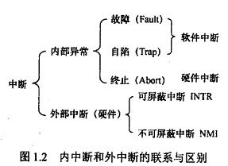

# 操作系统笔记-完整版

## 第一章 计算机系统概述

### 1.1 计算机系统的基本概念

#### 1.1.1 操作系统的概念

略

#### 1.1.2 操作系统的特征

##### 1. 并发

1. 并行与并发

    并行性是指两个或多个事件在同一时发生。而并发性是指两个或多个事件在同一时间间隔内发生。在多道程序环境下，并发性是指在一段时间内宏观上有多个程序在同时运行，但在单处理机系统中，每一时刻却仅能有一道程序执行，故微观上这些程序只能是分时地交替执行。
    
    例如，在1秒钟时间内，0~15ms程序A运行：15~30ms程序B运行；30~45ms程序C运行：45~60ms程序D运行，因此可以说，在1秒钟时间间隔内，宏观上有四道程序在同时运行，但微观上，程序A、B、C、D是分时地交替执行的。

    倘若在计算机系统中有多个处理机，这些可以并发执行的程序便可被分配到多个处理
    机上，实现并行执行，即利用每个处理机来处理一个可并发执行的程序。这样，多个程序便可同时执行。

2. 引入进程

    在一个未引入进程的系统中，在属于同一个应用程序的计算程序和I/O程序之间只能
    是顺序执行，即只有在计算程序执行告一段落后，才允许1/O程序执行；反之，在程序执行I/O操作时，计算程序也不能执行。
    
    但在为计算程序和I/O程序分别建立一个进程（Process）后，这两个进程便可并发执行。若对内存中的多个程序都分别建立一个进程，它们就可以并发执行，这样便能极大地提高系统资源的利用率，增加系统的吞吐量。

##### 2. 共享

1. 互斥共享方式
2. 同时访问方式

##### 3. 虚拟

1. 时分复用技术

    在计算机领域中，广泛利用时分复用技术来实现虚拟处理机、虚拟设备等，使资源的
    利用率得以提高。

    （1）虚拟处理机技术。利用多道程序设计技术，为每道程序建立至少一个进程，让多
    道程序并发执行。此时虽然系统中只有一台处理机，但通过分时复用的方法，能实现同时(宏观上)为多个用户服务，使每个终端用户都认为是有一个处理机在专门为他服务。亦即，利用多道程序设计技术，可将一台物理上的处理机虚拟为多台逻辑上的处理机，在每台逻辑处理机上运行一道程序，我们把用户所感觉到的处理机称为虚拟处理器。

    (2)虚拟设备技术。我们还可以利用虚拟设备技术，也通过分时复用的方法，将一台
    物理I/O设备虚拟为多台逻辑上的I/O设备，并允许每个用户占用一台逻辑上的I/O设备。这样便可使原来仅允许在一段时间内由一个用户访问的设备(即临界资源)，变为允许多个用户“同时”访问的共享设备，既宏观上能“同时”为多个用户服务。例如原来的打印机属于临界资源，而通过虚拟设备技术又可以把它变为多台逻辑上的打印机，供多个用户“同时”打印。关于虚拟设备技术将在第五章中介绍。

2. 空分复用技术

    计算机中把空分复用技术用于对存储空间的管理，用以提高存储空间的利用率。
    空分复用技术利用存储器的空闲空间分区域存放和运行其它的多道程序，以此来提高内存的利用率。

    但是，单纯的空分复用存储器只能提高内存的利用率，并不能实现在逻辑上扩大存储
    器容量的功能，还必须引入虚拟存储技术才能达到此目的。虚拟存储技术在本质上是实现内存的分时复用，即可以通过分时复用内存的方式，使一道程序仅在远小于它的内存空间中运行。例如，一个100MB的应用程序之所以可以运行在30MB的内存空间，实质上
    就是每次只把用户程序的一部分调入内存运行，运行完成后将该部分换出，再换入另一部分到内存中运行，通过这样的置换功能，便实现了用户程序的各个部分分时地进入内存运行。

##### 4. 异步

略

#### 1.1.3 操作系统的目标和功能

##### 1. 处理机管理

1. 进程控制
2. 进程同步
3. 进程通信
4. 调度

    调度包括作业调度和进程调度

##### 2. 存储器管理

1. 内存分配

    OS在实现内存分配时，可采取静态和动态两种方式：

    （1）静态分配方式。每个作业的内存空间是在作业装入时确定的，在作业装入后的整
    个运行期间不允许该作业再申请新的内存空间，也不允许作业在内存中“移动”。

    (2)动态分配方式。每个作业所要求的基本内存空间虽然也是在装入时确定的，但允
    许作业在运行过程中继续申请新的附加内存空间，以适应程序和数据的动态增长，也允许作业在内存中“移动”。

2. 内存保护

    为了确保每道程序都只在自己的内存区中运行，必须设置内存保护机制。一种比较简
    单的内存保护机制是设置两个界限寄存器，分别用于存放正在执行程序的上界和下界。在程序运行时，系统须对每条指令所要访问的地址进行检查，如果发生越界，便发出越界中断请求，以停止该程序的执行。

3. 地址映射，即能够将地址空间中的逻辑地址转换为内存空间中与之对应的物理地址。该功能应在硬件的支持下完成。

4. 内存扩充

    借助于虚拟存储技术，从逻辑上扩充内存容量，以便让更多的用户程序能并发运行。为了能在逻辑上扩充内存，系统必须设置内存扩充机制(包含少量的硬件)，用于实现下述各功能：

    （1）请求调入功能，系统允许在仅装入部分用户程序和数据的情况下，便能启动该程
    序运行。在程序运行过程中，若发现要继续运行时所需的程序和数据尚未装入内存，可向OS发出请求，由OS从磁盘中将所需部分调入内存，以便继续运行。

    (2)置换功能，若发现在内存中已无足够的空间来装入需要调入的程序和数据时，系
    统应能将内存中的一部分暂时不用的程序和数据调至硬盘上，以腾出内存空间，然后再将所需调入的部分装入内存。

##### 3. 设备管理

1. 缓冲管理

    如果在I/O设备和CPU之间引入缓冲，则可有效地缓和CPU和I/O设备速度不匹配的
    矛盾，提高CPU的利用率，进而提高系统吞吐量。
    
    在现代OS中，无一例外地在内存中设置了缓冲区，而且还可通过增加缓冲区容量的方法来改善系统的性能。
    
    不同的系统可采用不同的缓冲区机制。最常见的缓冲区机制有：单缓冲机制、能实现双向同时传送数据的双缓冲机制、能供多个设备同时使用的公用缓冲池机制。上述这些缓冲区都由OS缓冲管理机制将它们管理起来。

2. 设备分配

    设备分配的基本任务是根据用户进程的I/O请求、系统现有资源情况以及按照某种设
    备分配策略，为之分配其所需的设备。如果在I/O设备和CPU之间还存在着设备控制器和
    I/O通道，则还需为分配出去的设备分配相应的控制器和通道。

3. 设备处理
   
    设备处理程序又称为设备驱动程序。其基本任务是用于实现CPU和设备控制器之间的
    通信，即由CPU向设备控制器发出I/O命令，要求它完成指定的I/O操作：反之，由CPU
    接收从控制器发来的中断请求，并给予迅速的响应和相应的处理。

    设备处理过程是：首先检查I/O请求的合法性，了解设备状态是否是空闲的，读取有
    关的传递参数及设置设备的工作方式。然后向设备控制器发出I/O命令，启动L/O设备完
    成指定的I/O操作。此外设备驱动程序还应能及时响应由控制器发来的中断请求，并根据
    该中断请求的类型，调用相应的中断处理程序进行处理。对于设置了通道的计算机系统，
    设备处理程序还应能根据用户的I/O请求自动地构成通道程序。

##### 4. 文件管理

文件管理的主要任务是对用户文件和系统文件进行管理以方便用户使用，并保证文件
的安全性。为此，文件管理应具有对文件存储空间的管理、目录管理、文件的读/写管理以
及文件的共享与保护等功能。

##### 5. 操作系统与用户之间的接口

 操作系统提供两类接口：命令接口和程序接口

 1. 命令接口：按作业控制方式的不同，将命令接口分为联机命令接口和脱机命令接口

    联机命令接口又称交互式命令接口，用户输入一条命令，命令解释程序就解释并执行。

    脱机命令接口又称批处理命令接口，用户事先将一批命令写成文件，提交给操作系统，由操作系统按顺序执行。

 2. 程序接口：由一组系统调用（广义指令）组成，供用户程序调用。当前最流行的是图形用户界面（GUI），即图形接口。GUI是调用程序接口实现的。

    早期的系统调用都是用汇编语言提供的，只有在用汇编语言书写的程序中才能直接使用系统调用。但在高级语言以及C语言中，往往提供了与各系统调用一一对应的库函数，这样，应用程序便可通过调用对应的库函数来使用系统调用。
    
    但在近几年所推出的操作系统中，如UNIX、OS/2版本中，其系统调用本身已经采用C语言编写，并以函数形式提供，故在用C语言编制的程序中，可直接使用系统调用。

### 1.2 操作系统发展历程

#### 1.2.1 手工操作阶段

略

#### 1.2.2 批处理阶段

为了解决人机矛盾及CPU和I/O设备之间速度不匹配的矛盾，出现了批处理系统。按发展历
程又分为单道批处理系统、多道批处理系统（多道程序设计技术出现以后）。

1. 单道批处理系统
   
    单道批处理系统解决人机矛盾及CPU和I/O设备速率不匹配的矛盾。
    
    单道批处理系统的主要特征有：自动性、顺序性、单道性。

    此时面临的问题是：每次主机内存中仅存放一道作业，每当它在运行期间(注意这里是“运行时”而不是“完成后”)发出输入/输出请求后，高速的CPU便处于等待低速的I/O完成的状态。为了进一步提高资源的利用率和系统的吞吐量，引入了多道程序技术。

2. 多道批处理系统

    多道批处理系统的主要特征有：多道、宏观上并行、微观上串行。

    多道批处理系统资源利用率高，系统吞吐量大，但没有交互性

#### 1.2.3 分时操作系统

分时操作系统的主要特征有：同时性、交互性、独立性、及时性。

#### 1.2.4 实时操作系统

为了能在某个时间限制内完成某些紧急任务而不需要时间片排队，诞生了实时操作系统。

这里的时间限制可以分为两种情况：

若某个动作必须绝对地在规定的时刻（或规定的时间范围）发生，则称为**硬实时系统**，如飞行器的飞行自动控制系统，这类系统必须提供绝对保证，让某个特定的动作在规定的时间内完成。

若能够接受偶尔违反时间规定且不会引起任何永久性的损害，则称为**软实时系统**，如飞机订票系统、银行管理系统。

### 1.3 操作系统运行环境

#### 1.3.1 处理器运行模式

注意：CPU的运行状态分为用户态（目态）和核心态（管态、核心态）。用户态只能使用非特权指令，核心态可以使用特权指令和非特权指令。

在软件工程思想和结构化程序设计方法影响下诞生的现代操作系统，几乎都是分层式的结构。操作系统的各项功能分别被设置在不同的层次上。一些与硬件关联较紧密的模块，如时钟管理、中断处理、设备驱动等处于最低层。其次是运行频率较高的程序，如进程管理、存储器管理和设备管理等。这两部分内容构成了操作系统的内核。这部分内容的指令操作工作在核心态。

大多数操作系统的内核包括4方面的内容：

1. 时钟管理
2. 中断机制

    注意：中断机制中，只有一小部分功能属于内核，其负责保护和恢复中断现场的信息，转移控制权到相关的处理程序。

3. 原语
4. 系统控制的数据结构及处理

    包括作业控制块、进程控制块（PCB）、设备控制块、各类链表、消息队列、缓冲区、空闲区登记表、内存分配表。

#### 1.3.2 中断和异常的概念

##### 1.中断和异常的定义

中断（Interrupt）也称外中断，指来自CPU执行指令外部的事件。例如设备发出的I/O中断、时钟中断等

异常（Exception）也称内中断，指CPU执行指令内部的事件。例如非法操作码、地址越界、运算一处、虚拟存储系统缺页、专门的陷入指令等。异常不能被屏蔽。

##### 2.中断和异常的分类

外中断分为可屏蔽中断和不可屏蔽中断。

可屏蔽中断是指通过INTR线发出的中断请求，通过改变屏蔽字可以实现多重中断，从而使得中断处理更加灵活。

不可屏蔽中断NMI是指通过NMI线发出的中断请求，通常是紧急的硬件故障，如电源掉电等。此外，异常也是不能被屏蔽的。

异常可分为故障、自陷和终止。

故障(Fault)通常是由指令执行引起的异常，如非法操作码、缺页故障、除数为0、运算溢出等。

自陷（Trap）是一种事先安排的“异常”事件，用于在用户态下调用操作系统内核程序，如条件陷阱指令。

终止（Abor）是指出现了使得CPU无法继续执行的硬件故障，如控制器出错、存储器校验错等。

故障异常和自陷异常属于软件中断（程序性异常），终止异常和外部中断属于硬件中断。

#### 1.3.3 系统调用

……这段有内容吗？