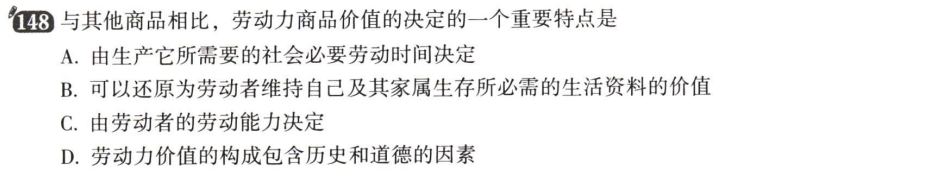
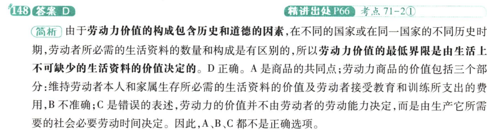
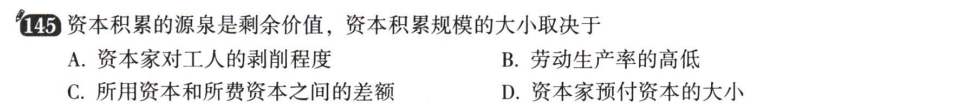
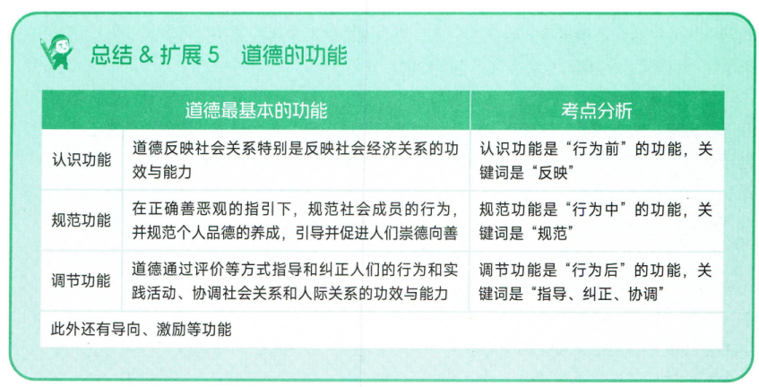
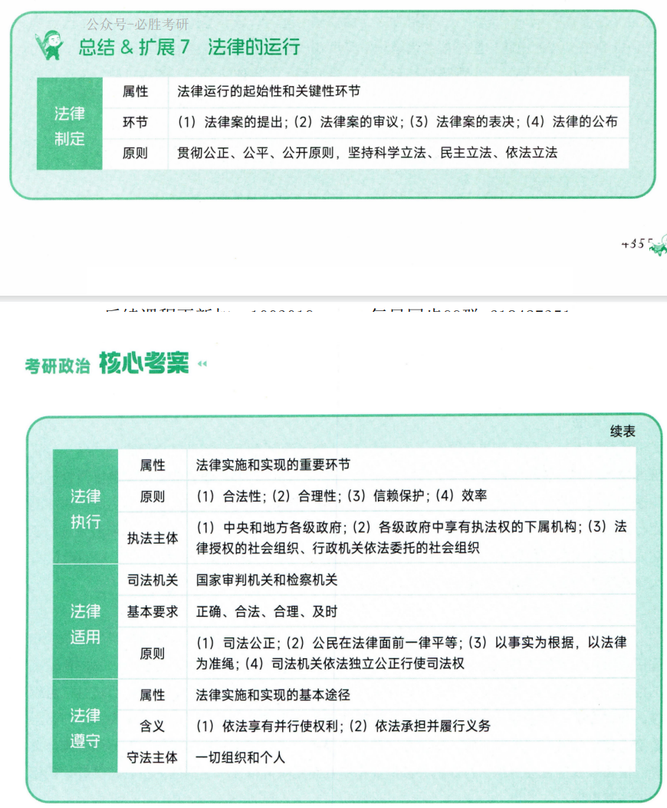
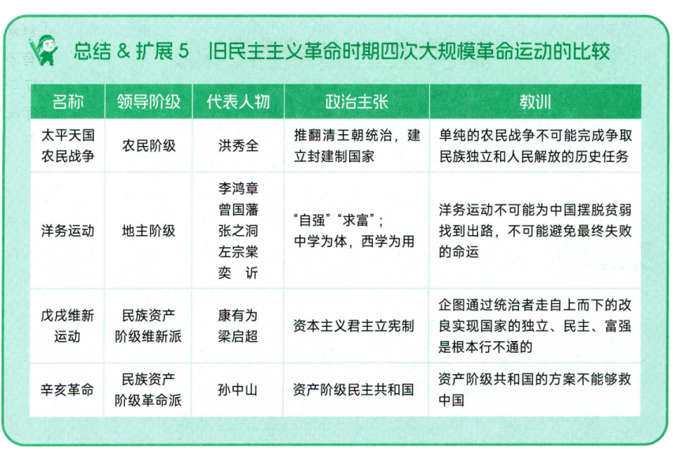
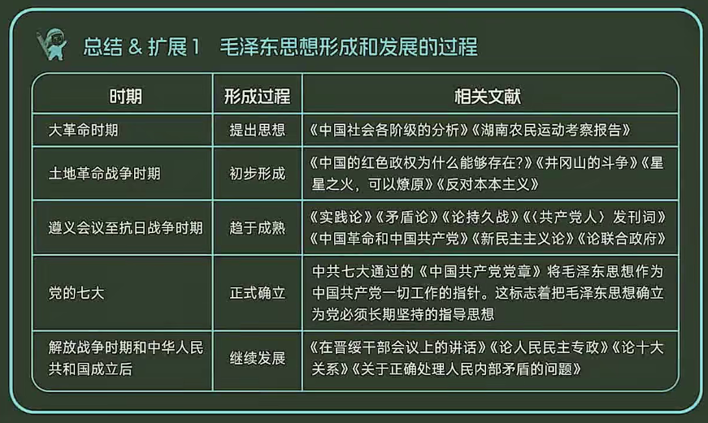
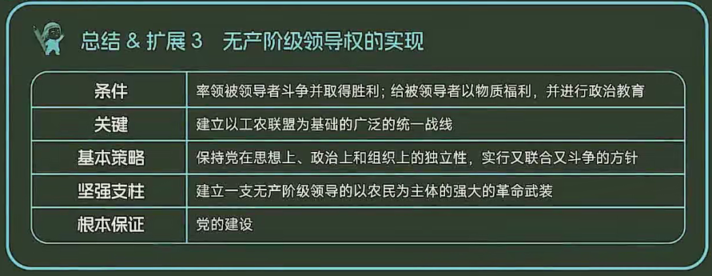
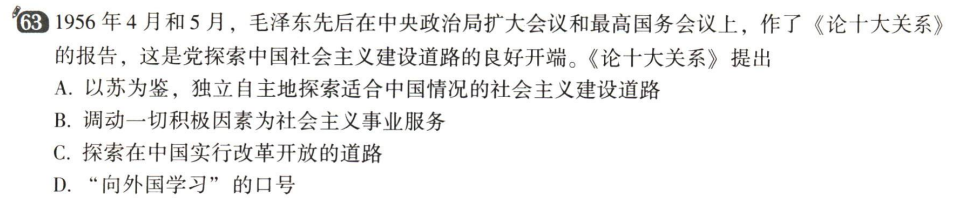
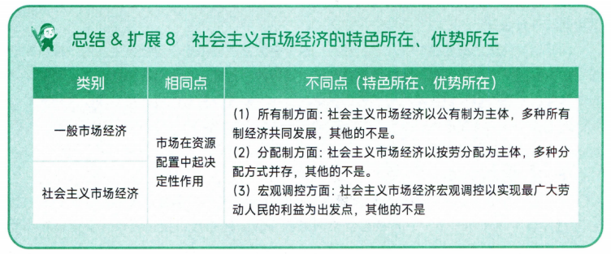

# 导论
## 第一节 马克思主义的创立与发展

### 考点 1 马克思主义的内涵及构成

马克思主义的构成：马克思主义哲学，马克思主义政治经济学，科学社会主义

1. 关系：

马哲-基础/方法

政经-主体理论

科社-目的/归宿

2. 出处：

恩格斯于《反杜林论》首次将马克思的理论分为三个部分进行阐述

### 考点 2 马克思主义的基本立场、基本观点和基本方法

马克思主义的基本方法：辩证唯物主义和历史唯物主义。主要包括实事求是、辩证分析、社会基本矛盾和主要矛盾分析的方法、历史分析的方法、阶级分析的方法、群众路线的方法等

### 考点 3 马克思主义的创立（重点）

正义者同盟（工人组织）-> 共产主义者同盟（世界上第一个无产阶级政党），其党纲为共产党宣言

马克思主义的产生的社会根源、阶级基础和思想渊源：

**社会根源**（经济、社会背景）：资本主义生产方式在西欧有了相当的发展

**阶级基础**（实践基础）：无产阶级在反抗资产阶级剥削和压迫的斗争中，逐步走向自觉，并渴望科学理论指导。

现代无产阶级作为独立的政治力量登上历史舞台的标志：法国、英国、德国工人运动

中国无产阶级作为独立的政治力量登上历史舞台的标志：五四运动

**思想渊源**：

马哲-德国古典哲学

政经-英国古典政治经济学

科社-英法空想社会主义

### 考点 4 马克思主义的发展（非重点）

马恩列经典著作总结：

|重要程度|分类|著作|内容/标志|补充说明|作者
:--|:--|:--|:--|:--|:--
**一级重点**|3+1|《德意志意识形态》|首次系统阐述(或创立)了唯物史观标志着马克思主义哲学的诞生|唯物史观/马哲的创立|马恩合著
**一级重点**|3+1|《资本论》|系统阐述了剩余价值理论，标志这马克思主义政治经济学的诞生|工人阶级的圣经|马克思
**一级重点**|3+1|《共产党宣言》|标志着科学社会主义的诞生、马克思主义的诞生、世界上第一个无产阶级政党的党纲|注意三个标志|马恩合著
**一级重点**|3+1|《反杜林论》|全面阐述了马克思主义理论体系|首次分三部分阐述|恩格斯
**一级重点**|大事件|《关于费尔巴哈的提纲》|首次确立了科学的实践观|历史唯物主义的起源|马克思
二级重点|大事件|《德法年鉴》|标志着马恩二人的两个转变|从唯心主义转向唯物主义、从革命民主主义转向共产主义，为马恩创立自己的理论奠定了思想前提|马恩
二级重点|大事件|《法兰西内战》|科学总结了巴黎公社的经验教训|巴黎公社是世界上第一个无产阶级政权|马克思
二级重点|其他事件|《家庭、私有制和国家的起源》|马恩的国家学说|与列宁的国家学说作区分|恩格斯
二级重点|革命|《帝国主义是资本主义的最高阶段》|指出帝国主义是无产阶级革命的前夜|帝国主义即垄断资本主义|列宁
二级重点|革命|《论欧洲联邦口号》《无产阶级革命的军事纲领》|首次提出一国胜利论/进一步发挥一国胜利论|同时胜利论的革新|列宁
二级重点|革命|《国家与革命》《无产阶级革命的军事纲领》|列宁的国家学说|与马恩的国家学说作区分|列宁

## 第二节 马克思主义的基本特征和当代价值

### 考点 5 马克思主义的基本特征（重点）

科学性、人民性、实践性、发展性

科学性：独有特征。正确性

人民性：本质属性。人民至上的立场

实践性：独有特征。

发展性：与时俱进。

革命性=人民性+实践性+发展性，所以，马克思主义的基本特征，用一句话来概括就是科学性与革命性的统一

# 马克思主义哲学

## 第一章 辩证唯物论

### 考点 7 哲学基本问题及不同哲学流派

哲学的基本问题是思维和存在（意识和物质）的关系问题

第一性问题区分唯物主义与唯心主义。

同一性问题区分可知论与不可知论。

（马克思在哲学史上的两大历史贡献：1.创立唯物史观；2.形成了辩证唯物主义。）

### 考点 8 物质范畴及其理论意义（理论意义非重点）

马哲认为：

① 物质是不依赖于人类的意识而存在 （反唯心）
② 物质是能为人类的意识所反映的客观实在（反不可知论）
③ 这种客观实在僧，是从自然存在和社会存在中抽象出的共同特性。（反旧唯物）

### 考点 9 物质和运动

在考研政治中，“运动” = “变化”，两名词通用。

运动是物质的**存在方式**和**根本属性**。

物质和运动的关系：不可分割

### 考点 10 运动和静止

运动和静止的关系：对立统一

静止是运动的一种特殊状态。包括两种状态：空间相对位置暂时不变和事物根本性质暂时不变（即量变）

### 考点 11 物质运动和时空

物质运动与时空的关系：不可分割

注意：

**物质**的存在方式——运动

**运动的物质/物质运动**的存在方式——时空

时空的特点：

时空有客观性

具体物质形态的时空是有限的

整个物质世界的时空是无限的

物质运动时间和空间的客观实在性是绝对的

物质运动时间和空间的具体特性是相对的（如高速运动，时间变慢）

### 考点 12 物质世界的二重化

人类诞生后，从自然界中分化出人类社会，从客观世界中分化出主观世界。

一方面，世界分化为自然界与人类社会。人类社会是最高级的物质存在形态。自然界与人类社会不是截然分开的，而是交叉重叠和相互作用的。

另一方面，世界分化为客观世界和主观世界。主观世界从客观世界中分化出来，具有相对独立性。
但主观世界并非独立存在的实体，也不是一个超然于客观世界而孤立存在的世界，它不能完全脱离客观世界，而是**从属于**客观世界。

人的实践活动是自然界与人类社会、客观世界与主观世界相分化的关键（基础、前提），也是它们相统一的关键。

### 考点 13 物质与意识的辩证关系

1. 物质对意识的决定作用

意识是**人脑的机能和属性**，是**客观世界的主观映像**

**意识的起源**：一方面，意识是自然界长期发展的产物。另一方面，意识也是社会历史发展的产物。

注意：社会实践，特别是劳动，在意识的产生和发展中起着**决定**性的作用。语言对……有促进、重要影响。

**意识的本质**：意识是人脑的机能和属性。意识在内容上是客观的，在形式上是主观的。意识是物质的产物，但不是物质。

2. 意识对物质的反作用（意识的能动作用） ***论述考点**

意识的能动作用主要表现在：

第一，意识具有目的性和计划性。

第二，意识具有创造性。

第三，意识具有指导实践改造客观世界的作用。

第四，意识具有调控人的行为和生理活动的作用。

### 考点 14 主观能动性和客观规律性的辩证统一

一方面，尊重客观规律是正确发挥主观能动性的前提（先客观再能动）

另一方面，只有充分发挥主观能动性，才能正确认识和利用客观规律

实践是客观规律性与主观能动性统一的基础。人们要正确发挥主观能动性，应当注意以下三个方面的前提和条件：

第一，从实际出发是正确发挥人的主观能动性的前提。

第二，实践是正确发挥人的主观能动性的根本途径。

第三，正确发挥人的主观能动性，还要依赖于一定的物质条件和物质手段。

### 考点 15 意识与人工智能

人工智能实质上是对人脑组织结构与思维运行机制的模仿，是人类智能的物化。

人工智能不能真正具有人的意识，不能取代或超越人类智能。（总的不能超越，部分领域可以超越）

### 考点 16 世界的物质统一性原理

第一，自然界是物质的。

人类的实践活动能够改变自然事物的形态和面貌，在自然界打上人类的印记，使之成为人化的自然，但不能改变自然界的客观实在性。

实践不能改变：（物质的）物质性、客观实在性、客观存在

实践可以改变：（物质的）性质、结构、存在状态

第二，人类社会本质上是生产实践基础上形成的物质体系。

人类社会为什么是物质：自然界是物质的，生产方式是物质的，建立在两者之上的人类社会是物质的

第三，人的意识统一于物质。

意识来源于/派生于/统一于物质。

**方法论**：**世界的物质统一性原理是辩证唯物主义最基本、最核心的观点**，是马克思主义的基石，**一切从实际出发**，是世界的物质统一性原理在现实生活中和实际工作中的生动体现

## 第二章 唯物辩证法

### 考点 17 唯物辩证法两大总特征

**联系和发展是唯物辩证法的总观点和总特征。**

1. 事物的普遍联系

联系的特点：

第一，联系具有客观性。

第二，联系具有普遍性。

第三，联系具有多样性。

第四，联系具有条件性。

2. 事物的变化发展

运动变化的基本趋势是发展。（运动是绝对的，发展不是绝对的。可以说发展是永恒的。

### 考点 18 对立统一规律(唯物辩证法第一规律) ***论述考点**

**对立统一规律是唯物辩证法的实质和核心。**

1. 矛盾的同一性和斗争性及其辩证关系

对立统一规律又称矛盾规律，矛盾是辩证法的核心概念。矛盾是反映事物内部或事物之间对立统一关系的哲学范畴。简言之，矛盾即对立统一。

对立和统一分别体现了矛盾的两种基本属性。矛盾的对立属性又称斗争性，矛盾的统一属性又称同一性。

矛盾的同一性是指矛盾着的对立面相互依存、相互贯通的性质和趋势。它有两个方面的含义：一是矛盾着的对立面相互依存，互为存在的前提，并共处于一个统一体中；二是矛盾着的对立面相互贯通，在一定条件下可以相互转化。

矛盾的斗争性是指矛盾着的对立面相互排斥、相互分离的性质和趋势。

矛盾的同一性和斗争性是相互联结、相辅相成的。争性寓于同一性之中，在事物的矛盾中，矛盾的斗争性是无条件的、绝对的，矛盾的同一性是有条件的、相对的。

2. 矛盾的同一性和斗争性在事物发展中的作用

矛盾的同一性有关发展（三点），斗争性有关量变与质变（两点）

3. 矛盾的普遍性和特殊性及其辩证关系

4. 矛盾的不平衡发展原理

### 考点 19 量变质变规律(唯物辩证法第二规律) ***选择考点**

认识质是认识和实践的起点和基础。只有认识质，才能区别事物。

第一，量变是质变的必要准备。

第二，质变是量变的必然结果。

### 考点 20 否定之否定规律(唯物辩证法第三规律) ***选择考点**

辩证否定观的基本内容：

第一，否定是事物的**自我**否定、自我发展

第二，否定是事物发展的环节

第三，否定是新旧事物联系的环节，新事物孕育产生于旧事物，新旧事物是通过否定环节联系起来的。

第四，辩证否定的实质是“**扬弃**”

### 考点 21 内容和形式

内容指构成事物的一切要素的总和，是事物存在的基础；形式指把诸要素统一起来的结构或表现内容的方式。

### 考点 22 现象和本质 *重点

### 考点 23 原因和结果 *重点

### 考点 24 必然和偶然 *重点

### 考点 25 可能和现实

### 考点 26 非重点跳过
### 考点 27 客观辩证法与主观辩证法的统一

客观即物质 主观即意识

### 考点 28 非重点跳过

## 第三章 认识论
### 考点 29 实践的本质和基本特征

实践性是马克思主义理论区别于其他理论的根本特征。实践的观点是马克思主义的基本观点。

### 考点 30 实践的基本结构和形式

实践的主体、客体和中介是实践活动的三项基本要素，三者的有机统一构成实践的基本结构。

实践主体的能力包括自然能力和精神能力，精神能力又包括知识性因素和非知识性因素。其中，知识性因素是首要的能力

客观事物只有在被纳入主体实践活动的范围之内，为主体实践活动所指向并与主体相互作用时才成为现实的实践客体。

实践的中介系统可分为两个子系统：一是作为人的肢体延长、感官延伸、体能放大的物质性工具系统，二是语言符号工具系统

实践的主体和客体相互作用的关系，包括实践关系、认识关系和价值关系，其中**实践关系是最根本的关系。实践的主体和客体与认识的主体和客体在本质上是一致的。**

从内容上看，实践的形式可分为三种基本类型：一是物质生产实践；二是社会政治实践；三是科学文化实践。

物质生产实践是最基本的实践活动，它构成全部社会生活的基础。

虚拟实践是实践活动的派生形式，具有相对独立性。

### 考点 31 实践对认识的决定作用

实践是认识的基础，实践在认识活动中起着决定性的作用。“实践的观点是辩证唯物论的认识论之第一的和基本的观点。

第一，实践是认识的来源。

第二，实践是认识发展的动力。

第三，实践是认识的目的。

第四，实践是检验认识真理性的唯一标准。】

### 考点 32 认识的本质

辩证唯物主义认识论认为，认识的本质是主体在实践基础上对客体的能动反映。

这种能动反映不但具有反映客体内容的反映性特征，而且具有实践所要求的主体能动的、创造性的特征。一方面，认识的反映特性是人类认识的基本规定性。认识的反映特性是指人的认识必然要以客观事物为原型和摹本，在思维中再现或摹写客观事物的状态、属性和本质。另一方面，认识作为能动反映具有创造特性。认识是一种在思维中的能动的、创造性的活动，而不是主观对客观对象简单、直接的描摹或照镜子式的原物映现。

认识的反映特性和创造特性之间的关系：不可分割。

### 考点 33 认识的过程(两次飞跃)

1. 从实践到认识(感性认识到理性认识的飞跃)

感性认识是人们在实践基础上，由感觉器官直接感受到的关于事物的现象、事物的外部联系、事物的各个方面的认识，包括感觉、知觉和表象三种形式。感性认识是认识的初级阶段，直接性是感性认识的突出特点。

理性认识的对象：事物的本质、全体、内部联系和事物自身规律性。

理性认识包括概念、判断、推理三种形式。理性认识的特点是它的间接性和抽象性。

关系：辩证统一

第一，理性认识依赖于感性认识。感性认识是认识过程的起点，是达到理性认识的必经阶段，理性认识对感性认识的这种依赖关系，是认识对实践依赖关系的重要表现。

第二，感性认识有待于发展和深化为理性认识。

第三，感性认识和理性认识相互渗透、相互包含。

2. 从认识到实践(理性认识到实践的飞跃)

这是认识过程的第二次能动的飞跃，是认识过程中更为重要的一次飞跃

### 考点 34 认识过程中的影响因素(理性因素和非理性因素)

理性因素：指人的理性直观、理性思维等能力，它在认识活动中的作用主要有指导作用、解释作用和预见作用等。

非理性因素：主要指认识主体的情感和意志。从广义上看，人们还常把认识能力中具有不自觉、非逻辑性等特点的认识形式，如联想、想象、猜测、顿悟、灵感等，也包括在人的非理性因素中。非理性因素对于人的认识能力和认识活动具有激活、驱动和控制作用。

### 考点 35 认识的两大规律(反复性和无限性)

认识过程的反复性是指，人们对于一个复杂事物的认识往往要经过由感性认识到理性认识、再由理性认识到实践的多次反复才能完成。这是因为在认识过程中始终存在着主观和客观的矛盾。

从客观方面看，事物的各个侧面及其本质的暴露有一个过程；从主观方面看，人的认识能力有一个提高的过程。

认识发展的无限性是指，对于事物发展过程的推移来说，人类的认识是永无止境、无限发展的，它表现为“实践一认识一再实践一再认识”的无限循环。这种认识的无限发展过程，在形式上是循环往复的，在实质上是前进上升的。

### 考点 36 非重点跳过
### 考点 37 真理及其特性

真理具有客观性：真理的内容是客观的（真理的内容是客观物质世界），真理的标准是客观的（真理的标准是实践）

真理的形式是主观的。

真理的客观性决定了真理的一元性。

****

真理有绝对性与相对性。真理的绝对性和相对性是相互依存、相互包含的。

### 考点 38 真理和谬误 论述考点
真理和谬误的辩证关系：

一方面，真理和谬误是相伴而生的，由于真理
和谬误决定于认识的内容是否如实地反映了客观事物，因此真理和谬误是性质不同的两种认识，它们是对立的。

另一方面，真理和谬误又是统一的，它们相互依存、相互转化。真理和谬误相比较而存在，
没有真理也无所谓谬误，没有谬误也无所谓真理；真理中包含着某种以后会暴露出来的错误的方面或因素，谬误中也隐藏着以后会显露出来的真理的成分或萌芽；在一定条件下，真理和谬误可以相互转化。真理和谬误在一定范围内的对立是绝对的，但超出一定范围，它们就会相互转化，真理变成谬误，谬误变成真理。

### 考点 39 真理的检验标准

1. 真理的检验标准：实践

实践是检验真理的唯一标准

真理的本性是主观和客观的一致、符合。

实践是主观见之于客观的物质活动，

实践是检验真理的唯一标准，并不排斥逻辑证明的作用

2. 实践标准的确定性与不确定性

实践作为检验认识真理性的标准，既是确定的，又是不确定的。

实践标准的确定性即绝对性：实践是检验真理的唯一标准，此外再无别的标准；凡经过实践证明了的一切认识都是客观真理，都具有不可推翻的性质；实践能够检验一切认识，即使当前的实践还不能加以判定，最终也会被以后的实践作出裁决。

实践标准的不确定性：一定历史阶段上的具体实践具有局限性，它往往不能充分证明或驳倒某一认识的真理性；实践检验真理是一个过程，不是一次完成的；已被实践检验过的真理还要继续经受实践的检验。

实践不断发展，真理也不断发展，在发展的实践中不断验证认识的真理性。这就是实践检验真理的辩证发展过程。

### 考点 40 真理与价值的辩证统一

价值有主体性（主体为中心）、客观性（客体客观存在）、多维性、社会历史性

### 考点 41 非重点
### 考点 42 非重点
### 考点 43 从必然走向自由

认识必然和争取自由，是人类认识世界和改造世界的根本目标

自由不是摆脱必然（规律）的束缚和制约，自由是对必然（规律）的认识和利用（来改造世界）

自由是历史发展的产物，自由是有条件的：一是认识条件；二是实践条件。

## 第四章 唯物史观

### 考点 44 唯物史观和唯心史观的对立

社会历史观的基本问题：社会存在和社会意识的关系问题。

### 考点 45 社会存在和社会意识及其辩证关系

社会存在是社会生活的**物质**方面，主要包括物质生产方式、自然地理环境和人口因素。

自然地理环境和人口因素是人类社会生存和发展的必要条件。

物质生产方式就是劳动者和劳动资料结合的特殊方式，是生产力和生产关系的统一体，它集中体现了人类社会的物质性。

生产方式 = 生产力+生产关系。起决定性作用。

另两个因素只起重要影响作用。

****

社会意识是社会生活的精神方面。

根据不同的层次：社会意识可分为社会心理和社会意识形式。

社会心理——低层次、自发

社会意识形式——高层次、自觉。与阶级有关：社会意识形态。与阶级无关：非社会意识形态。 

****

社会意识具有相对独立性

首先，社会意识与社会存在发展具有不完全同步性和不平衡性。

其次，社会意识内部各种形式之间存在相互影响且各自具有历史继承性。

最后，社会意识对社会存在具有能动的反作用，这是社会意识相对独立性的**突出**表现。

### 考点 46 生产力和生产关系矛盾运动的规律(第一对社会基本矛盾)

生产力是标志人类改造自然的实际程度和实际能力的范畴，它表示人与自然的关系。

生产力的基本要素：

一是劳动资料，即劳动手段。其中，最重要的是生产工具，它是生产力发展水平的客观尺度，是区分社会经济时代的客观依据。

二是劳动对象。劳动资料和劳动对象合称为生产资料。

三是劳动者。

****

生产关系**是不以人的意志为转移**的经济关系。生产关系是社会关系中最基本的关系。包括生产资料所有制关系、生产中人与人的关系和产品分配关系。在生产关系中，生产资料所有制关系是最基本的、决定性的，它构成全部生产关系的基础，是区分不同生产方式、判定社会经济结构性质的客观依据。

生产关系是一种人与人的关系

****

在社会生产中，生产力是生产的物质内容，生产关系是生产的社会形式，二者的有机统一构成社会的生产方式。生产力决定生产关系，生产关系反作用于生产力。

生产关系一定要适合生产力状况的规律

### 考点 47 经济基础和上层建筑矛盾运动的规律(第二对社会基本矛盾)

经济基础是指由社会一定发展阶段的生产力所决定的**生产关系**的总和。

上层建筑是指建立在一定经济基础之上的意识形态以及与之相适应的制度、组织和设施。意识形态又称观念上层建筑，政治法律制度及设施和政治组织又称政治上层建筑。

观念上层建筑的核心——政治法律思想

政治上层建筑的核心——国家政权

在整个上层建筑中，政治上层建筑居主导地位。

****

上层建筑对经济基础具有反作用。这种反作用集中表现在为自己的经济基础服务。上层建筑反作用的性质，取决于它所服务的经济基础的性质，归根到底取决于它是否有利于生产力的发展。

### 考点 48 人类普遍交往与世界历史的形成发展

交往是与生产力的发展相伴随的。

生产方式的发展变革是世界历史形成和发展的基础。**普遍交往是世界历史的基本特征**。（资本主义之前没有世界史）

### 考点 49 社会进步与社会形态更替

社会进步作为对社会前进发展的总概括，主要表现在两个方面：一是社会形态从低级到高级的发展。二是同一社会形态内部的发展。

人的发展最根本的是人的自由程度的提高。人人的发展从低级到高级依次概括为三个阶段，即人的依赖关系占统治地位的阶段、以物的依赖关系为基础的人的独立性的阶段、自由个性的阶段。

****

社会形态是关于社会运动的具体形式、发展阶段和不同质态的范畴，是同生产力发展一定阶段相适应的经济基础与上层建筑的统一体。社会形态包括社会的经济形态、政治形态和意识形态，是三者具体的、历史的统一。

社会形态更替的特点：

第一，社会形态更替的统一性和多样性

第二，社会形态更替中的必然性与人们的历史选择性。生产力的发展具有最终的决定意义。生产力与生产关系矛盾运动的规律性，从根本上规定了社会形态更替的必然性。

第三，社会形态更替的前进性与曲折性。

### 考点 50 社会基本矛盾是历史发展的根本动力

生产力和生产关系、经济基础和上层建筑的矛盾是社会基本矛盾。

社会基本矛盾作为历史发展的**根本动力**。社会基本矛盾特别是生产力和生产关系的矛盾，是“一切历史冲突的根源”,决定着社会中其他矛盾的存在和发展。

### 考点 51 阶级斗争、社会革命在社会发展中的作用

阶级斗争是社会基本矛盾在阶级社会中的直接表现，是阶级社会发展的**直接动力**。
### 考点 52 改革是推动社会发展的又一重要动力。
### 考点 53 科学技术革命是社会动力体系中的一种重要动力。
### 考点 54 文化是推动社会发展的重要力量。
### 考点 55 关于历史创造者问题

谁是历史的创造者，这是唯物史观与唯心史观的分水岭。

唯物史观考察历史创造者的原则：首先，唯物史观立足于**现实的人**及其本质来把握历史的创造者。人是一切社会关系的总和。人的本质属性是社会属性，而不是自然属性。

其次，唯物史观立足于整体的社会历史过程来探究谁是历史的创造者。

再其次，唯物史观从社会历史发展的**必然性/规律性**入手来考察和说明谁是历史的创造者。

最后，唯物史观从人与历史关系的不同层次上考察谁是历史的创造者。

### 考点 56 人民群众创造历史

从质上说，人民群众是指一切对社会历史发展起推动作用的人；从量上说，人民群众是指社会人口中的绝大多数。在不同的历史时期，人民群众有着不同的内容，包含着不同的阶级、阶层和集团。人民群众中最稳定的主体部分始终是从事物质资料生产的劳动群众。

在社会历史发展过程中，人民群众起着决定性的作用。

历史是人民群众创造的，但人民群众创造历史的活动又受到一定社会历史条件的制约。包括经济条件、政治条件和精神文化条件。

### 考点 57 个人在社会历史中的作用

不管什么样的历史人物，在历史上发挥什么样的作用，都要受到社会发展客观规律的制约，而不能决定和改变历史发展的总进程和总方向。任何历史人物的出现都体现了必然性与偶然性的统一。

首先，群众是划分为阶级的。其次，阶级通常是由政党领导的。最后，政党是由领袖来主持的。

# 第五章 资本主义的本质及规律

## 第一节 商品经济和价值规律

### 考点 58 价值是什么

商品经济是以交换为目的而进行生产的经济形式。商品经济产生的社会历史条件有两个：一是社会分工的存在；二是生产资料和劳动产品属于不同的所有者。

商品的概念及其二因素：商品是用来交换的、能满足人们某种需要的劳动产品，具有使用价值和价值两个因素或两种属性，是使用价值和价值的矛盾统一体。

使用价值是商品的自然属性，是一切劳动产品所共有的属性。（注意：社会财富 = 使用价值）

交换价值是如何被决定的：决定商品交换比例的，不是商品的使用价值，而是价值。

价值的概念及其特点：价值是凝结在商品中的无差别的一般人类劳动。（不经劳动天然存在的事物没有价值，可能有使用价值和价格）

使用价值和价值之间的关系：对立统一的关系。

其对立性表现在：商品的使用价值和价值是相互排斥的，二者不可兼得。

其统一性表现在：作为商品，使用价值和价值二者缺一不可。

****

生产商品的劳动二重性：商品是劳动产品，生产商品的劳动可区分为具体劳动和抽象劳动

具体劳动的概念：具体劳动是指生产一定使用价值的**具体形式**的劳动，即有用劳动。

抽象劳动的概念：抽象劳动是指撇开一切具体形式的、**无差别的一般人类劳动**，即人的体力和脑力的消耗。

**劳动二重性决定了商品的二因素**：具体劳动形成商品的使用价值，抽象劳动形成商品的价值。

具体劳动和抽象劳动的关系：具体劳动和抽象劳动是同一劳动的两种规定。任何一种劳动，一方面是特殊的具体劳动，另一方面又是一般的抽象劳动。

### 考点 59 价值如何衡量

决定商品价值量的，不是生产商品的个别劳动时间，而是社会必要劳动时间。

商品的价值量与生产商品所耗费的社会必要劳动时间成正比，与劳动生产率成反比。

影响劳动生产率的因素主要包括：劳动者的平均熟练程度，科学技术的发展水平及其在生产中的应用程度，生产过程的社会结合，生产资料的规模和效能以及自然条件。

商品的价值量是以简单劳动为尺度计量的，复杂劳动等于**自乘（在商品交换过程中自发改变交换比率）的或多倍**的简单劳动。复杂劳动转化为简单劳动，是在商品交换过程中自发实现的。

### 考点 60 价值如何表现

价值被**交换**所表现

商品的价值形式的发展经历了四个阶段：简单的或偶然的价值形式（初级形式）、总和的或扩大的价值形式、一般的价值形式以及货币形式（终极形式，完备形式）。

货币是充当一般等价物的商品。

货币的五种基本职能：

价值尺度（原因：货币本身是商品，也有价值；货币可以是观念的（意识的）；纸币因为没有价值不能担任价值尺度的功能）

流通手段（现实的货币才能担任流通手段；可以不足值，只要充当足值即可）

贮藏手段（必须足值的金属）

支付手段（没有现货交易；纸币也可以支付）

世界货币。

其中，价值尺度和流通手段是货币的两个最基本的职能。

****

货币产生后，商品内在的**使用价值和价值的矛盾**就发展成为**外在的商品和货币的矛盾**。

货币的出现并没有也不可能消除商品经济的矛盾，反而有可能使矛盾扩大和加深。

### 考点 61 价值有何规律

价值规律是商品经济的基本经济规律，其基本**内容**和客观要求：商品的价值量由生产商品的社会必要劳动时间决定，商品交换以价值量为基础，按照等价交换的原则进行。

价值规律的**表现形式**：商品的价格围绕价值自发波动。

### 考点 62 以私有制为基础的商品经济的基本矛盾

私人劳动和社会劳动的矛盾构成私有制基础上商品经济的基本矛盾。

### 考点 63 马克思在继承英国古典政治经济学劳动创造价值理论的同时，创立了劳动二重性理论
### 考点 64 资本主义经济制度的产生

资本主义生产关系产生的途径有两个：一是从小商品经济中分化出来；二是从商人和高利贷者转化而来。

资本原始积累的概念：以暴力手段使生产者与生产资料相分离，资本迅速集中于少数人手中，资本主义得以迅速发展的历史过程。

资本原始积累的途径：一是用暴力手段剥夺农民的土地；二是用暴力手段掠夺货币财富。

### 考点 65 劳动力成为商品与货币转化为资本

劳动力是指人的劳动能力，是人的脑力和体力的总和。

劳动力成为商品，要具备两个基本条件：第一，劳动者在法律上是自由人。第二，劳动者没有任何生产资料。

劳动力商品的价值：由生产、发展、维持和延续劳动力所必需的生活必需品的价值决定。包括三个部分：第一，维持劳动者本人生存所必需的生活资料的价值；第二，维持劳动者家属的生存所必需的生活资料的价值；第三，劳动者接受教育和训练所支出的费用。

劳动力商品的使用价值是价值的源泉，它在消费过程中能够创造新价值，而且这个新的价值比劳动力本身的价值更大

### 考点 66 非重点
### 考点 67 剩余价值的生产

资本主义生产过程具有二重性：一方面是生产物质资料的劳动过程；另一方面是生产剩余价值的过程，即价值增殖过程。资本主义生产过程是劳动过程和价值增殖过程的统一。

资本主义劳动过程是生产使用价值的过程。资本主义劳动过程的两个特点：其一，工人在资本家的监督下劳动，他们的劳动隶属于资本家；其二，劳动成果或劳动产品全部归资本家所有。

价值增殖过程是剩余价值的生产过程，这是资本主义生产过程的主要方面。

****

在价值增殖过程中，雇佣工人的劳动分为两部分：一部分是必要劳动，用于再生产劳动力的价值；另一部分是剩余劳动，用于无偿地为资本家生产剩余价值

资本的本质不是物，而是一定的历史社会形态下的生产关系。

****

不变资本是以生产资料形态存在的资本，它通过工人的具体劳动被转移到新产品中去，其转移的价值量不会大于它原有的价值量。

可变资本是用来购买劳动力的那部分资本，在生产过程中不是被转移到新产品中去，而是由工人的劳动再生产出来。

把资本区分为不变资本和可变资本，进一步揭示了剩余价值产生的源泉。它表明，雇佣劳动者的剩余劳动是剩余价值的唯一源泉。

资本家对工人的剥削程度，可以用剩余价值率表示：m'=m/v。

****
资本家提高对工人的剥削程度最基本的方法有两种，即绝对剩余价值的生产和相对剩余价值的生产（两种方式都延长了剩余劳动时间）。

绝对剩余价值是指在必要劳动时间不变的条件下，由于延长工作日的长度或提高劳动强度而生产的剩余价值。

相对剩余价值是指在工作日长度不变的条件下，通过缩短必要劳动时间而相对延长剩余劳动时间所生产的剩余价值。

超额剩余价值是指企业由于提高劳动生产率而使商品的个别价值低于社会价值的差额。

资本主义生产的根本目的是追求剩余价值，但客观上也会促进生产力的发展和社会进步。

### 考点 68 资本积累

把剩余价值转化为资本，或者说剩余价值的资本化，就是资本积累。

资本主义简单再生产是物质资料再生产和资本主义生产关系再生产的统一。资本积累是资本主义扩大再生产的源泉。

资本积累不但是社会财富占有两极分化的重要原因，而且是资本主义社会失业现象产生的根源。

生产资料和劳动力之间的比例，叫作资本的技术构成。

价值形式上看，资本可分为不变资本和可变资本，这两部分资本价值之间的比例，叫作资本的价值构成

由资本的技术构成决定并反映技术构成变化的资本价值构成，叫作资本的有机构成，通常用c:v来表示。（技术变，价值变，有机变；技术不变，价值变，有机不变）

在资本主义生产过程中，资本有机构成呈现不断提高的趋势，

资本积累的历史趋势是资本主义制度的必然灭亡和社会主义制度的必然胜利。

### 考点 69 资本的循环周转与再生

资本循环是资本从一种形式出发，经过一系列形式的变化，又回到原来出发点的运动。

产业资本运动的两个基本前提条件：一是产业资本的三种职能形式必须在空间上并存。二是产业资本的三种职能形式必须在时间上继起。

资本是在运动中增殖的，资本周而复始、不断反复的循环，就叫资本的周转。

影响资本周转快慢的因素有很多，其中，关键的因素有两个：一是资本周转的时间；二是生产资本中固定资本和流动资本的构成。

社会再生产的核心问题是社会总产品的实现问题，即社会总产品的价值补偿（商品卖出去收回来的钱）和实物补偿问题（重新购买原材料）。

****

第一，社会总产品在价值形态上又叫社会总价值，包括在产品中的生产资料的转移价值(c)、凝结在产品中的由工人必要劳动时间创造的价值(v)和凝结在产品中的由工人在剩余劳动时间里创造的价值(m)。

第二，社会总产品在物质形态上划分为两大部类，即第I部类和第II部类。第I部类由生产生产资料的部门构成，第II部类由生产消费资料的部门构成。

经济危机实际上是资本主义条件下以强制的方式解决社会再生产的实现问题的途径。

### 考点 70 工资与剩余价值的分配

工人的工资是**劳动力的价值或价格**，这是资本主义工资的本质。资本家购买工人的劳动力是以货币工资形式支付的，**工资表现为“劳动的价格”或工人全部劳动的报酬，这就模糊了工人必要劳动和剩余劳动的界限，掩盖了资本主义的剥削关系**。

剩余价值是利润的本质，利润是剩余价值的转化形式。当剩余价值转化为利润时，剩余价值和可变资本的关系便被掩盖了。

随着利润转化为平均利润，商品价值就转化为生产价格，即商品的成本价格加平均利润。

生产价格形成以后，价值规律表现形式的变化：在价值转化为生产价格的条件下，价值规律作用的形式发生了变化。商品不再以价值而是以生产价格为基础进行交换，市场价格的变动不再以价值为中心，而是以生产价格为中心。

### 考点 71 马克思剩余价值理论的意义

剩余价值理论深刻揭露了资本主义生产关系的剥削本质，阐明了资产阶级与无产阶级之间阶级斗争的经济根源，指出了无产阶级革命的历史必然性。剩余价值理论是马克思经济学说的核心内容和基石

### 考点 72 资本主义的基本矛盾与经济危机

生产资料资本主义私人占有和生产社会化之间的矛盾，是资本主义的基本矛盾。这是生产力和生产关系之间的矛盾在资本主义社会的具体体现。

生产相对过剩是资本主义经济危机的本质特征。

经济危机的抽象的一般的可能性是由货币作为支付手段和流通手段引起的。但是这仅仅是危机在形式上的可能性。资本主义经济危机爆发的根本原因是资本主义的基本矛盾。这种基本矛盾具体表现为两个方面：第一，生产无限扩大的趋势与劳动人民有支付能力的需求相对缩小的矛盾；第二，单个企业内部生产的有组织性和整个社会生产的无政府状态之间的矛盾。

资本主义经济危机周期性爆发的特点，使社会资本再生产也呈现周期性的特点，一般包括四个阶段：危机（本质阶段）、萧条、复苏和高涨。

## 第三节 资本主义上层建筑

### 考点 73 资本主义的国家、民主制度及其本质

资本主义国家的职能是以服务于资本主义制度和资产阶级利益为根本内容的，是资产阶级进行政治统治的工具。资本主义国家的职能包括对内和对外两个基本方面，即对内实行政治统治和社会管理，对外进行国际交往和维护国家安全及利益。

资本主义民主制度：权在民”“天赋人权”“分权制衡”“社会契约”“自由、平等、博爱”等政治思想，

资本主义法律制度：法是资本主义国家法律制度的核心，它所依据的基本原则有：私有制原则、主权在民原则、分权制衡原则和人权原则。

资本主义国家政权：即国家的立法权、行政权、司法权分别由三个权力主体独立行使，

资本主义国家的选举制度：从实际政治作用上看，**选举制**是协调统治阶级内部利益关系和矛盾的重要措施。

政党：从政党制度的类型看，大致有两党制和多党制等形式。

### 考点 74 资本主义意识形态及其本质

资本主义国家意识形态的本质，可以概括为两个方面：第一，资本主义意识形态是资本主义社会的观念上层建筑，是为资本主义的经济基础服务的；第二，资本主义意识形态是资产阶级的阶级意识的集中体现。

# 第六章 资本主义的发展及其趋势

## 第一节 垄断资本主义的形成与发展

### 考点 75 资本主义从自由竞争到垄断

资本主义的发展经历了自由竞争资本主义和垄断资本主义两个阶段。垄断资本主义的发展包括私人垄断资本主义和国家垄断资本主义两种形式。

最简单的、初级的垄断组织形式是短期价格协定。尽管垄断组织的形式多样，但它们在本质上是一样的，即通过联合实现独占和瓜分商品生产和销售市场，操纵垄断价格，以攫取高额垄断利润。

垄断并不能消除竞争，反而使竞争变得更加复杂和激烈。

垄断资本主义阶段存在竟争的主要原因：一是垄断没有消除产生竞争的经济条件（私有制）。二是垄断必须通过竞争来维持。三是社会生产是复杂多样的，任何垄断组织都不可能把包罗万象的社会生产都包下来。

****

金融资本是由工业垄断资本和银行垄断资本融合在一起而形成的一种垄断资本。金融资本形成的主要途径包括金融联系（借款）、资本参与（投资）和人事参与等。

金融寡头在经济、政治及其他（政策咨询机构、新闻出版、科学教育、文化体育等上层建筑的各个领域）三方面控制社会。

****

垄断利润的来源：垄断资本所获得的高额利润，归根到底来自无产阶级和其他劳动人民创造的剩余价值。

垄断利润的实现：垄断利润主要是通过垄断组织制定的垄断价格来实现的。

垄断价格的计算方法：垄断价格 =成本价格 +平均利润 +垄断利润。

垄断价格的产生并没有否定价值规律，它是价值规律在垄断资本主义阶段作用的具体表现。

### 考点 76 垄断资本主义的发展

国家垄断资本主义的概念：国家垄断资本主义是国家政权和私人垄断资本融合在一起的垄断资本主义。

国家垄断资本主义形成的原因：首先，社会生产力的发展；其次，经济波动和经济危机的深化，推动国家垄断资本主义的产生；最后，缓和社会矛盾、协调利益关系的需求。

国家垄断资本主义的主要形式有五种：一是国家所有并直接经营的企业；二是国家与私人共有、合营企业；三是国家通过多种形式参与私人垄断资本的再生产过程；四是宏观调节；五是微观规制。

对国家垄断资本主义的评价：国家垄断资本主义的出现是资本主义经济制度内的经济关系调整，并没有从根本上消除资本主义的基本矛盾。

****

金融自由化与金融创新是金融垄断资本得以形成和壮大的重要制度条件。

金融在经济中的占比上升——金融利润上升，实体利润下降——金融就业人数变多，实体就业人数变少——虚拟经济脱离实体经济

****

**早期的国际垄断同盟主要是国际卡特尔。**

**当代国际垄断同盟的形式以国家垄断资本主义的国际联盟为主。**

国际性协调组织主要有三个；国际货币基金组织、世界银行和世界贸易组织。

### 考点 77 经济全球化及其影响

经济全球化：生产全球化、贸易全球化、金融全球化、（最重要的）企业经营全球化

导致经济全球化迅猛发展的因素主要有：（根本原因）科学技术的进步和生产力的发展、跨国公司的发展、各国经济体制的变革和国际经济组织的发展。

经济全球化对发展中国家的积极作用主要表现在：第一，经济全球化为发展中国家提供先进技术和管理经验。第二，经济全球化为发展中国家提供更多的就业机会。第三，经济全球化推动发展中国家国际贸易的发展。第四，经济全球化促进发展中国家跨国公司的发展。

经济全球化的负面影响：一是发达国家与发展中国家在经济全球化进程中的地位和收益不平等、不平衡。二是加剧了发展中国家资源短缺和环境污染。三是一定程度上增加了经济风险。

## 第二节 正确认识当代资本主义的新变化

### 考点 78 第二次世界大战后资本主义的变化及其实质

1. 生产资料所有制的变化

在资本主义发展的初期，私人资本所有制占主导地位，后衍变为私人股份资本所有制

二战后国家资本所有制形成。法人资本所有制占主导地位（今天仍然主导）

2. 劳资关系和分配关系的变化

缓和劳资关系的激励制度主要有：职工参与决策、终身雇佣、职工持股。此外还有社会福利制度的普及化、全民化

3. 社会阶层和阶级结构的变化

一是资本家的地位和作用发生了很大的变化。资本所有权和经营权发生分离，拥有所有权的资本家一般不再直接经营和管理企业，而是靠拥有和掌握的企业股票等有价证券的利息收入为生。二是高级职业经理成为大公司经营活动的实际控制者。三是知识型和服务型劳动者的数量不断增加，劳动方式发生了新变化。

4. 经济调节机制和经济危机形态的变化

经济危机呈现新的特点：去工业化和产业空心化日趋严重，产业竞争力下降；经济高度金融化，虚拟经济与实体经济严重脱节；财政严重债务化，债务危机频繁爆发；两极分化和社会对立加剧；经济增长乏力，发展活力不足，周期性危机与结构性危机（部分危机）交织在一起；金融危机频发，全球经济屡受打击。

5. 政治制度的变化

首先，政治制度出现多元化的趋势，公民权利有所扩大。其次，法治建设得到重视和加强，以协调社会各阶级、阶层之间的利益。最后，改良主义政党在政治舞台上的影响日益扩大。

### 考点 79 第二次世界大战后资本主义新变化的原因和实质

第二次世界大战后资本主义发生新变化的原因主要有：首先，科学技术革命和生产力的发展，是资本主义发生变化的**根本推动力量**。其次，工人阶级争取自身权利和利益的斗争再其次，社会主义制度初步显示的优越性对资本主义产生了重要影响。最后，主张改良主义的政党对资本主义制度的改革。

实质：

第一，第二次世界大战后资本主义发生的变化从根本上说是人类社会发展一般规律和资本主义经济规律作用的结果。

第二，第二次世界大战后资本主义发生的变化是在资本主义制度基本框架内的变化，并不意味着资本主义生产关系的根本性质发生了变化。

### 考点 80 当代资本主义变化的新特征

第一，科技创新加速资本主义生产方式变化。

第二，国际金融垄断资本主义影响日益显现。国际金融资本的垄断成为当代资本主义最突出、最鲜明、最主要的特征。国际金融资本的垄断主要表现在：一是金融垄断寡头化；二是金融垄断国际化；三是经济虚拟化、产业空心化。

第三，社会阶级层级结构呈现复杂性、多样化。由于新一轮信息技术体系在世界范围内掀起了新一轮的制造业退潮与服务业涨潮，传统技能逐渐被智能化、自动化所取代，从事信息、金融等中介服务业的“知识工人”数量和增长速度均超过“非知识工人”,工人阶级内部因技能、收入等方面的差异逐渐分化。

第四，发达资本主义国家凭借经济、科技、文化传播等超级优势，在世界范围内推行霸权主义和强权政治。第一：对发展中国家进行最大限度的经济盘剥和压榨，获得金融资本对于社会生产甚至社会生活的绝对统治地位；第二：直接严重威胁民族国家的文化认同和文化主权，撕裂价值观的共同基础；第三：构建“信息帝国主义”和“数字帝国主义”;第四：对他国进行政治、经济、科技等全方位制裁，逆历史潮流而动，破坏全球和平与稳定。

### 考点 81 非重点
### 考点 82 非重点
### 考点 83 非重点
### 考点 84 非重点

# 第七章 社会主义的发展及其规律

### 考点 85 社会主义从空想到科学

社会主义到现在已经有 500多年的历史，其间经历了从空想到科学、从理想到现实、从一国到多国的发展，也经历了从苏联解体、东欧剧变到中国特色社会主义蓬勃兴起的过程。

批判的空想社会主义：19世纪初期以圣西门、傅立叶、欧文为代表的空想社会主义是科学社会主义的直接思想来源。

空想社会主义的局限性主要表现在：空想社会主义者只看到了资本主义必然灭亡的命运，却未能揭示资本主义必然灭亡的经济根源（资本主义的根本矛盾，生产力与生产关系的矛盾，经济基础与上层建筑的矛盾）；他们要求埋葬资本主义，却看不到埋葬资本主义的力量（无产阶级）；他们憧憬取代资本主义的理想社会，却找不到通往理想社会的现实道路（无产阶级革命）。

科学社会主义创立的基础：马克思、恩格斯在新的历史条件下创立和发展了唯物史观（历史唯物主义）和剩余价值学说。

注意：马恩在哲学史上的两个贡献：历史唯物主义和辩证唯物主义。

马恩在理论上的两个贡献：唯物史观和剩余价值学说。

科学社会主义创立的标志：《共产党宣言》的发表，标志着科学社会主义的产生，也标志者马克思主义的诞生。

### 考点 86 第一国际和巴黎公社

马克思、恩格斯总结巴黎公社经验，指出：无产阶级革命取得成功并保持胜利果实的首要条件是要有**革命的武装（暴力革命）**；必须打碎旧的国家机器，建立无产阶级的新型国家；无产阶级政权是为人民服务的机关；必须建立无产阶级政党，发挥党的政治领导作用。

巴黎公社期间，马恩总结了各国无产阶级政党关系的原则：①联合，②平等。

### 考点 87 十月革命胜利与第一个社会主义国家的建立

十月革命的意义：首先，它将马克思主义关于无产阶级革命的**理论变为现实**，建立了世界上第一个社会主义国家。其次，它沉重打击了帝国主义的统治；再其次，它激励了殖民地、半殖民地的民族民主革命。最后，它促进了马克思列宁主义的传播，推进了无产阶级政党的建立。

### 考点 88 社会主义在苏联的实践

第一个时期非重点

第二个时期：战时共产主义时期。实行余粮收集制和取消商品货币关系

第三个时期：由战时共产主义转变为新经济政策时期。用粮食税取代余粮收集制。允许私人自由贸易，恢复商品货币关系，允许私人小工业企业发展，采取一些国家资本主义的形式来发展生产。标志着列宁正在探索一条符合俄国情况的建设社会主义的道路。

列宁的经验：首先，把建设社会主义作为一个长期探索、不断实践的过程；其次，把大力发展生产力、提高劳动生产率放在首要地位；再其次，在多种经济成分并存的条件下，利用商品、货币和市场发展经济；最后，利用资本主义建设社会主义。

列宁努力把马克思主义基本原理同俄国的具体实际相结合，探索出一条适合俄国国情的社会主义道路。这是列宁对马克思主义的重大贡献，也是他留给后人的最宝贵的思想遗产。

### 考点 89 非重点
### 考点 90 非重点
### 考点 91 科学社会主义基本原则及其主要内容

正确把握科学社会主义基本原则：始终坚持坚持，结合实际，不断发展

### 考点 92 社会主义建设的曲折发展与不断完善

1. 社会主义建设的艰巨性和长期性

其主要原因有：第一，生产力发展状况的制约；第二，经济基础和上层建筑发展状况的制约；第三，国际环境的严峻挑战；第四，马克思主义执政党对社会主义发展道路的探索和对社会主义建设规律的认识，需要一个长期的艰苦的过程。

2. 社会主义发展道路的多样性

社会主义发展道路呈现多样性的原因：第一，各个国家的**生产力**发展状况和社会发展阶段**决定**了社会主义发展道路具有不同的特点；第二，历史文化传统的差异性是造成不同国家社会主义发展道路多样性的重要条件；第三，时代和实践的不断发展，是造成社会主义发展道路多样性的现实原因。

3. 社会主义发展的前进性和曲折性

社会主义在曲折中发展是由以下因素决定的：第一，社会主义作为新生事物，其成长不会一帆风顺；第二，社会主义社会的基本矛盾推动社会发展，是作为一个过程而展开的，人们对它的认识也有一个逐渐发展的过程；第三，经济全球化对于社会主义的发展既有机遇又有挑战。

# 第八章 共产主义崇高理想及其最终实现

### 考点 93 预见未来社会的方法论原则

其科学方法论原则主要有：第一，在揭示人类社会发展一般规律的基础上指明社会发展的方向；第二，在剖析资本主义旧世界的过程中阐发未来新世界的特点；第三，在社会主义社会发展中不断深化对未来共产主义社会的认识；第四，立足于揭示未来社会的一般特征，而不对各种细节作具体描绘。

### 考点 94 共产主义社会的基本特征

1. 物质财富极大丰富，消费资料按需分配
2. 社会关系高度和谐，人们精神境界极大提高
3. 实现每个人自由而全面的发展，人类从必然王国向自由王国飞跃

### 考点 95 非重点
### 考点 96 非重点
### 考点 97 非重点

# 思道法

## 第五章 道德

### 考点 39 什么是道德

1. 道德的起源

(1)劳动是道德起源的首要前提。

(2)社会关系是道德赖以产生的客观条件。

(3)人的自我意识是道德产生的主观条件。

2. 道德的本质

(1)道德是反映社会经济关系的特殊意识形态。

(2)道德是社会利益关系的特殊调节方式。

(3)道德是一种实践精神。

### 考点 40 道德的功能与作用

道德的作用主要表现在：经济基础的形成、巩固和发展；影响其他社会意识形态；维护社会秩序和稳定；提高人的境界；开展阶级斗争的工具

### 考点 41 社会主义道德是崭新类型的道德

社会主义道德**以为人民服务为核心，以集体主义为原则**，

## 第六章 法治

### 考点 54 我国社会主义法律的运行

法律制定是国家对权利和义务，即社会利益和负担进行的权威性分配；法律的执行、适用、遵守则是把法律规范转化为法律实践，把法定的权利和义务转化为现实的权利和义务。

1. 法律制定：法律运行的起始性和关键性环节。
2. 法律执行：狭义上，法律执行则是指国家行政机关及其公职人员执行法律的活动，也被称为行政执法。行政执法是法律实施和实现的重要环节，必须坚持合法性、合理性、信赖保护、效率等基本原则。
3. 法律适用
4. 法律遵守：守法是法律实施和实现的基本途径。

### 考点 55 全面依法治国的根本遵循

“十一个坚持”:

**政治方向：1-3**

坚持党对全面依法治国的领导（谁领导）；坚持以人民为中心（依靠谁）；坚持中国特色社会主义法治道路（走什么路）；

**宪法的重要性：4**

坚持依宪治国、依宪执政；

**法治是推进国家治理体系和治理能力现代化的轨道和依托：5**

坚持在法治轨道上推进国家治理体系和治理能力现代化；

**建设中国特色社会主义法治体系是全面依法治国的总抓手：6**

坚持建设中国特色社会主义法治体系；

**7**

坚持依法治国、依法执政、依法行政共同推进，法治国家（目标）、法治政府（重点）、法治社会（基础）一体建设；

**全面依法治国的格局：8**

坚持全面推进科学立法、严格执法、公正司法、全民守法；

**处理重大关系：9**

坚持统筹推进国内法治和涉外法治；

**人才是建设法治中国的重要保障：10-11**

坚持建设德才兼备的高素质法治工作队伍；坚持抓住领导干部这个“关键少数”。

### 考点 56 坚持走中国特色社会主义法治道路

坚持中国特色社会主义法治道路必须遵循的原则：

第一，坚持中国共产党的领导。党的领导是中国特色社会主义最本质的特征，是社会主义法治最根本的保证。这是我们的法治同西方资本主义国家的法治最大的区别。

第二，坚持人民主体地位。推进全面依法治国，根本目的是依法保障人民权益。

第三，坚持法律面前人人平等。平等是社会主义法律的基本属性，是社会主义法治的基本要求。

第四，坚持依法治国和以德治国相结合。

第五，坚持从中国实际出发。

### 考点 57 建设法治中国

**全面依法治国**的**宏伟目标**是**建设法治中国**，要以**建设中国特色社会主义法治体系**为**总抓手**，

建设中国特色社会主义法治体系：

第一，完备的法律规范体系。中国特色社会主义法治体系的前提，是法治国家、法治政府、法治社会的制度基础。

第二，高效的法治实施体系。建设中国特色社会主义法治体系的重点。

第三，严密的法治监督体系。是宪法法律有效实施的重要保障。

第四，有力的法治保障体系。有力的法治保障体系，是全面依法治国的重要依托。

第五，完善的党内法规体系。是中国特色社会主义法治体系的本质要求和重要内容。

****

法治国家是法治建设的目标，法治政府是建设法治国家的重点，法治社会是构筑法治国家的基础。

****

科学立法是全面依法治国的前提，严格执法是全面依法治国的关键，公正司法是全面依法治国的重点，全民守法是全面依法治国的基础。

### 考点 60 培养社会主义法治思维

法治思维的基本内容：

第一，法律至上。

第二，权力制约。

第三，公平正义。

公平正义主要包括权利公平、机会公平、规则公平和救济公平。

第四，权利保障。

具体包括公民权利的宪法保障、立法保障、行政保障和司法保障。

宪法保障是权利保障的前提和基础。

立法保障是权利保障的重要条件。

行政保障是权利保障的关键环节

司法保障是公民权利保障的最后防线

第五，程序正当。

# 史纲
## 第二节 西方列强对中国的侵略
### 考点6、/、8、9 军事、政治、经济、文化侵略

军事上：发动侵略战争，屠杀中国人民；侵占中国领土，划分势力范围；勒索赔款，抢掠财富。

政治上：控制中国的内政、外交(把持中国海关);镇压中国人民的反抗；扶植、收买代理人。

经济上：控制通商口岸；剥夺关税自主权；实行商品倾销和资本输出；操纵中国的经济命脉(外国资本在中国设立的银行，是它们对中国进行资本输出的枢纽，资本-帝国主义列强还控制了中国的现代交通运输业)。

文化上：宗教和舆论

### 考点 10 抵御外来侵略的斗争历程

1. 人民群众

州三元里人民的抗英斗争，是中国近代史上中国人民第一次大规模的反侵略武装斗争

### 考点 13 反侵略战争的失败及其原因

根本原因：社会制度的腐败。

重要原因：经济技术的落后。

### 考点14 民族意识的觉醒

鸦片战争以后，先进的中国人开始睁眼看世界；中日甲午战争以后，中国人民的民族意识开始普遍觉醒。

在《海国图志》中，魏源提出了“师夷长技以制夷”的思想

孙中山1894年11月在创立革命团体兴中会时，就喊出了“振兴中华”这个时代的最强音。

### 考点17 洋务事业的兴办

洋务运动的指导思想(纲领):中体西用

目标：自强，求富

### 考点 19 戊戌维新运动的开展

3. 维新派与守旧派的论战

首先，要不要变法。

其次，要不要兴民权、设议院，实行君主立宪。

最后，要不要废八股、改科举和兴西学。

### 考点 21辛亥革命爆发的历史条件

清末新政：注意与洋务运动区分：设立商部、学部、巡警部等中央行政机构；裁撤绿营，建立新军；颁布商法商律，奖励工商；鼓励留学，颁布新的学制，废除科举，预备立宪。

### 考点 22 资产阶级革命派的活动

1. 孙中山与资产阶级民主革命的开始

以孙中山为首的资产阶级革命派在踏上革命道路之时，就高举起民主革命的旗帜，并选择了以武装起义推翻清王朝统治的斗争方式。这也是中国资产阶级革命派与改良派的根本不同之处。

2. 资产阶级革命派的宣传与组织工作

同盟会以《民报》为机关报，并确定了革命纲领。这是近代中国第一个领导资产阶级革命的全国性政党，它的成立标志着中国资产阶级民主革命进入了一个新的阶段。

### 考点24 关于革命与改良的辩论

双方论战涉及的核心问题主要有三个：第一，要不要以革命手段推翻清王朝，这是双方论战的焦点；第二，要不要推翻帝制，实行共和；第三，要不要进行社会革命。

### 考点27 辛亥革命的历史意义

辛亥革命结束了中国延续两千多年的封建君主专制制度，建立了中国历史上第一个资产阶级共和政府（亚洲第一个共和制国家）

### 考点 29 旧民主主义革命的失败

1. 挽救共和的努力及其受挫

反袁“二次革命”，中华革命党，护国运动，护法运动

### 考点30 新文化运动与思想解放的潮流

4. 五四运动以前新文化运动的局限

新文化运动的倡导者批判孔学，是为了给中国**发展资本主义扫清障碍**。但是，由于**资产阶级共和国的方案在中国行不通**，所以从根本上说，提倡资产阶级民主主义，并不能为人们提供一种有效的思想武器去认识中国，去对中国社会进行改造。

其次，新文化运动的倡导者把改造国民性置于优先的地位。

最后，那时的许多领导人物，还没有马克思主义的批判精神，他们使用的方法，一般还是资产阶级的方法。

### 考点34 中国早期马克思主义思想运动

1. 早期马克思主义思想运动的特点

其一，重视对马克思主义基本理论的学习，从一开始就坚持了马克思主义的革命原则和正确方向，明确地同第二国际的社会民主主义划清界限；

其二，注意从中国的实际出发，学习、运用马克思主义，初步形成了马克思主义应当与中国具体实际相结合的思想；

其三，开始提出知识分子应当同劳动群众相结合的思想，主张知识分子“向农村去”,到民间去。

### 考点 37 制定革命纲领，发动工农运动

中国革命的首要问题：分清敌友。

中共二大的内容：

第一，中共二大第一次提出了反帝反封建的民主革命纲领，为中国人民指出了明确的斗争目标。

党的最高纲领是实现社会主义、共产主义。党在现阶段的纲领，即最低纲领：打倒军阀；推翻国际帝国主义的压迫；统一中国为真正的民主共和国。

第二，采取群众路线的方法。

此外，还第一次提出了党的统一战线——民主主义的联合战线的思想与政策；第一次公开发表《中国共产党宣言》；制定了第一部《中国共产党章程》；第一次明文提出中国共产党万岁。

### 考点 38 实行国共合作和掀起大革命高潮

中共三大正式决定全体共产党员以个人名义加入国民党，同孙中山领导的国民党建立统一战线。明确规定共产党员加入国民党时，党必须在政治上、思想上、组织上保持自己的独立性。

国民党一大对三民主义作出了新的解释：

在民族主义中突出了反帝的内容

民权主义中强调了民主权利应“为一般平民所共有”,不应为“少数人所得而私”

把民生主义概括为“平均地权”和“节制资本”两大原则(后来又提出了“耕者有其田”的主张),并提出要改善工农的生活状况。

****

**五卅运动**为起点，掀起了全国范围的大革命高潮。

1925年至1927年中国反帝反封建的革命，比以往任何一次革命，包括辛亥革命和五四运动，**群众的动员程度更为广泛，斗争的规模更加宏伟，革命的社会内涵更加深刻**，因此被称作大革命。

****

大革命中的中国共产党：提出政治口号，组织统一战线（领导者还是国民党），发动人民群众，军队方面作用。

### 考点40 大革命失败的经验教训和意义

大革命失败的经验教训：

首先，中国的民主革命必须建立广泛的革命统一战线

其次，在中国民主革命中，无产阶级领导权的中心问题是农民问题。

其次，坚持武装斗争

最后，把马克思主义普遍原理与中国革命具体实践相结合，

****

大革命的意义：

中国共产党**开始探索马克思主义中国化**的途径，初步提出了**新民主主义革命的基本思想**，并开始懂得进行**土地革命和掌握革命武装**的重要性。

正是由于经历了这场大革命，中国人民的觉悟程度和组织程度有了明显提高，中国共产党开始掌握了一部分革命武装。

### 考点 42 土地革命战争的兴起

2. 开展武装反抗国民党反动统治的斗争

八七会议的主要内容：

第一，会议彻底清算了大革命后期的陈独秀右倾机会主义错误，提出了“整顿改编自己的队伍，纠正过去严重的错误，而找着新的道路”的任务。

第二，确定了土地革命和武装反抗国民党反动统治的总方针。会议明确提出土地革命是中国资产阶级民主革命的中心问题。毛泽东在会上强调党“以后要非常注意军事，须知政权是由枪杆子中取得的”,实际上提出
了以军事斗争作为党的工作重心的问题。

八七会议的评价：中国革命从此开始了从大革命失败到土地革命战争兴起的转折。

****

南昌、秋收、广州三大起义：

南昌起义打响了武装反抗国民党反动统治的第一枪。这是中国共产党独立领导革命战争、创建人民军队和武装夺取政权的开端。

毛泽东等领导的秋收起义爆发。起义军公开打出了“工农革命军”的旗帜
之后的三湾改编是建设无产阶级领导的新型人民军队的重要开端。

### 考点 43 农村包围城市、武装夺取政权的道路

泽东在《反对本本主义》一文中，阐明了坚持辩证唯物主义的思想路线即坚持理论与实际相结合的原则的极端重要性，提出了“**没有调查，没有发言权**”和“**中国革命斗争的胜利要靠中国同志了解中国情况**”的重要思想，表现了毛泽东开辟新道路、创造新理论的革命首创精神。

革命新道路理论的提出：农村包围城市、武装夺取政权道路理论的提出，指明了中国革命胜利的唯一正确道路，标志着中国化的马克思主义即毛泽东思想的初步形成。

古田会议：确立了思想建党、政治建军原则，规定红军是一个执行革命的政治任务的武装集团，必须绝对服从共产党的领导，必须担负打仗、筹款和做群众工作的任务，必须加强政治工作。

土地革命时期的土改：

第一个土地法：没收一切土地，禁止土地买卖

第二个土地法：将“没收一切土地”改为“没收一切公共土地及地主阶级的土地”。这是一个原则性的改正，保护了中农的利益。

土地革命中的阶级路线和土地分配方法：坚定地依靠贫农、雇农，联合中农，限制富农，保护中小工商业者，消灭地主阶级；以乡为单位，按人口平分土地，在原耕地的基础上，实行抽多补少、抽肥补瘦。

### 考点45 遵义会议与中国革命的历史性转折

遵义会议的结果：遵义会议集中解决了当时具有决定意义的军事问题和组织问题。（没有解决政治问题）

对遵义会议的评价：遵义会议开启了中国共产党独立自主解决中国革命实际问题的新阶段。

### 考点 59 坚持抗战、团结、进步的方针

第一，统一战线中的独立自主原则。共产党必须保持在思想上、政治
上和组织上的独立性。必须坚持对人民军队的绝对领导。必须对国民党采取又团结又斗争、以斗争求团结的方针。

第二，坚持抗战、团结、进步，反对妥协、分裂、倒退。国民党制造了皖南事变。中国共产党进行了针锋相对的斗争：除了在军事上坚决进行自卫反击外，还在政治上对其进行有力的揭露和声讨，赢得了国内外舆论的同情和支持。

第三，巩固抗日民族统一战线的策略总方针（瓦窑堡会议的内容）：“发展进步势力（工人、农民和小资），争取中间势力（民资、开明绅士和地方实力派），孤立顽固势力（大地主、大资产阶级）”的策略总方针。

### 考点60 抗日民主根据地的建设

政治建设方面：“三三制”的民主政权建设。三三制是指抗日民主政府在工作人员分配上实行“三三制”原则，即共产党员、党外进步人士和中间派各占1/3。三三制政权是共产党领导的抗日民族统一战线性质的政权。加强政权建设，是抗日根据地建设的首要的、根本的任务。

经济建设方面：减租减息，发展生产。（未进行土改）

毛泽东提出了“发展经济，保障供给”的经济工作和财政工作总方针，发出了“自己动手，丰衣足食”的号召。

### 考点61 大后方的抗日民主运动和进步文化工作

六届六中全会上，毛泽东明确提出了“马克思主义的中国化”这个命题。

毛泽东后来指出：“六中全会是决定中国之命运的。”中共六届六中全会基本纠正了王明的右倾错误，进一步巩固了毛泽东在全党的领导地位，统一了全党的思想和步调，推动了各项工作迅速发展。

### 考点 62 新民主主义理论的系统阐明

毛泽东思想成熟的标志：新民主主义理论的系统阐明，标志着毛泽东思想得到多方面展开而达到成熟。

### 考点63 延安整风运动与中共七大

1. 延安整风运动

《改造我们的学习》：首先在党的高级干部中进行（重点）

《整顿党的作风》和《反对党八股》：整风运动在全党范围普遍展开。

整风运动的主要内容：反对主观主义以整顿**学风**、反对宗派主义以整顿**党风**、反对党八股以整顿**文风**。其中，反对主观主义是整风运动最主要的任务。主观主义是中国共产党内反复出现“左”、右倾错误的思想认识根源。

主观主义的实质：**理论脱离实际**

主观主义的主要表现形式：**教条主义和经验主义**，尤其教条主义是整风运动的重点。

六届七中全会：会议原则通过了《关于若干历史问题的决议》，《决议》使全党特别是党的高级干部对中国革命基本问题的认识达到了一致，增强了全党团结，为党的七大胜利召开创造了充分条件，有力促进了中国革命事业发展。至此，整风运动胜利结束。

****
实事求是：

初步形成于井冈山：《反对本本主义》

系统科学阐明：抗战前夕：《矛盾论》《实践论》

成为全党共识：延安整风

重新确立：十一届三中全会

****

2. 中共七大

三大作风：即理论和实践相结合的作风、和人民群众紧密联系在一起的作风、自我批评的作风。

毛泽东思想：中共七大将以毛泽东同志为主要代表的中国共产党人把马克思列宁主义基本原理同中国具体实际相结合所创造的理论成果，正式命名为毛泽东思想，并将毛泽东思想规定为党的一切工作的指针。（马克思主义和中国实际相结合的第一次飞跃）

党的七大在党的历史上具有重要里程碑意义：标志着党在政治上思想上组织上走向成熟。

在政治上，党通过延安整风运动，使全党团结在毛泽东的旗帜下，实现了党的空前统一和团结。

在思想上，党确立了毛泽东思想在全党的指导地位，把毛泽东思想写入了党章。

在组织上，党形成了一支高举毛泽东旗帜的久经考验的政治家集团。

### 考点 66 抗日战争胜利的原因和意义

抗日战争取得胜利的原因：

第一，以爱国主义为核心的民族精神是中国人民抗日战争胜利的决定因素。

第二，中国共产党的中流砥柱作用是中国人民抗日战争胜利的关键。

第三，全民族抗战是中国人民抗日战争胜利的重要法宝。

第四，中国人民抗日战争的胜利，同世界所有爱好和平和正义的国家和人民、国际组织以及各种反法西斯力量的同情和支持也是分不开的。

抗日战争胜利的意义：是中华民族由近代以来陷入深重危机走向伟大复兴的历史转折点。

****

党的成立：改变了中国人民和中华民族的前途命运

长征胜利：中国共产党和中国革命事业从挫折走向胜利的转折

抗战胜利：中华民族由危机走向伟大复兴的历史转折点。

### 考点 85 社会主义基本制度在中国的全面确立及其意义

社会主义革命和建设时期，党面临的主要任务是：实现从新民主主义到社会主义的转变，进行社会主义革命，推进社会
主义建设，为实现中华民族伟大复兴奠定根本政治前提和制度基础

### 考点 88 中共八大路线的制定

注意还发了一个党章。

### 考点95 关于真理标准问题的讨论

真理标准问题的讨论是继五四运动和延安整风运动之后又一场马克思主义思想解放运动，其实质在于是不是坚持马克思列宁主义、毛泽东思想。

讨论成为正本清源、拨乱反正和改革开放的**思想先导**，为党重新确立实事求是思想路线，纠正长期以来的“左”倾错误，实现历史性的转折作了思想理论**准备**。

### 考点96 中共十一届三中全会的伟大转折

《解放思想，实事求是，团结一致向前看》篇讲话，把解放思想、实事求是，坚持实践标准提到党的思想路线的高度，为冲破“两个凡是”禁锢，克服思想僵化状态，重新确立党的思想路线奠定了基础，因而成为开辟中国特色社会主义新道路、开创中国特色社会主义新理论的**宣言书**。这个讲话实际上是党的十一届三中全会的主题报告，它为全会实现具有划时代意义的伟大转折奠定了重要基础。

****

中共十一届三中全会停止使用“以阶级斗争为纲”的口号，决定从1979年1月起把全党的工作重心转移到社会主义现代化建设上来和实行改革开放的战略决策，重新确立了马克思主义的思想路线、政治路线和组织路线。

# 毛中特

### 考点2 马克思主义中国化

……|相同点|时代背景|实践基础
:--|:--|:--|:--
毛|1.都以马克思主义为理论基础|革命与战争|革命与建设
中特|2.都以实事求是为精髓|和平与发展|建设/改革/发展

### 考点4 毛泽东思想形成和发展的过程

### 考点6 毛泽东思想活的灵魂

实事求是（思想），群众路线（工作），独立自主（政治原则）

十一届六中全会：提出毛泽东思想活的灵魂，科学评价了毛泽东思想和毛泽东本人，完成了拨乱反正，第一次使用了社会主义初级阶段概念 

## 第二章 新民主主义革命理论

### 考点10 新民主主义革命的总路线

1939提出新民主主义革命（抗战时期）；1948年提出总路线内容，即无产阶级领导（领导），人民大众（动力），反对帝、封、官资（对象）的革命。

1. 对象

分清敌友，是革命的**首要问题**

帝国主义：最大障碍，总根源

封建主义：没有丝毫进步作用，主要的、直接的障碍

2. 动力

无产阶级：中国革命最基本的动力。

3. 领导

无产阶级的领导权是中国革命的中心问题，也是新民主主义革命理论的**核心问题**

#### 无产阶级领导权

### 考点11 新民主主义的基本纲领

1. 新民主主义的政治纲领

新民主主义的政治纲领：推翻帝国主义和封建主义的统治，建立一个无产阶级领导的、以工农联盟为基础的、各革命阶级联合专政的新民主主义的共和国。

2. 新民主主义的经济纲领

新民主主义的经济纲领：没收封建地主阶级的土地归农民所有，没收官僚资产阶级的垄断资本归新民主主义的国家所有，保护民族工商业。

没收封建地主阶级的土地归农民所有，是新民主主义革命的**主要内容**。

没收官僚资本归新民主主义国家所有，是新民主主义革命的题中**应有之义**。没收官僚资本，包含着新民主主义
革命和社会主义革命的双重性质。

保护民族工商业，是新民主主义经济纲领中极具**特色**的一项内容。

3. 新民主主义的文化纲领

新民主主义的文化纲领：无产阶级领导的人民大众的反帝反封建的文化，即民族的科学的大众的文化。在新民主主义文化中居于指导地位的是共产主义思想。

民主主义文化是民族的：

就其内容说是反对帝国主义压迫，主张中华民族的尊严和独立；

就其形式说是具有鲜明的民族风格、民族形式和民族特色，要有中国作风和中国气派。

新民主主义文化是科学的：

反对一切封建思想和迷信思想，主张实事求是、客观真理及理论和实践的一致性。对于封建时代创造的文化，应剔除其封建性的糟粕，吸收其民主性的精华。同时要尊重中国的历史，反对民族虚无主义。

新民主主义文化是大众的：也就是民主的文化。

### 考点12 新民主主义革命的道路

初步形成：井冈山时期，毛泽东提出工农武装割据，初步形成农村包围城市理论。

最终确立：六届六中全会。持久战。

意义：道路的根本在于处理好土地革命、武装斗争、农村革命根据地建设三者之间的关系。

土地革命是中国革命的基本内容；

武装斗争是中国革命的主要形式，

农村革命根据地是战略阵地和依托。

### 考点13 新民主主义革命的三大法宝

统一战线、武装斗争、党的建设。

****

1. 统一战线

建立最广泛的统一战线的必要性：一方面，是由中国半殖民地半封建社会的阶级状况所决定的。另一方面，也是由中国革命的长期性、残酷性及其发展的不平衡性所决定的。

建立统一战线的可能性：在半殖民地半封建的中国社会，诸多矛盾交织在一起，客观上为无产阶级及其政党利用这些矛盾建立和发展统一战线提供了可能性。

党建立、巩固和发展统一战线的实践经验：一是要建立巩固的**工农联盟**。二是要**正确对待资产阶级，尤其是民族资产阶级**。三是要采取**区别对待**的方针。四是要坚持**独立自主**的原则。

****

2. 武装斗争

武装斗争是中国革命的特点和优点之一。

建设人民军队的经验：

一要坚持党对军队的绝对领导。坚持党对军队的绝对领导，是建设新型人民军队的根本原则，是保持人民军队无产阶级性质和建军宗旨的根本前提，也是毛泽东建军思想的核心。

二要建设全心全意为人民服务的人民军队。坚持这一宗旨，是建设新型人民军队的基本前提，也是人民军队一切行动的根本准则和一切工作的出发点与归宿。这集中体现了人民军队的本质，是人民军队立于不败之地的根本所在。

三要开展革命的政治工作。人民军队政治工作的基本原则：官兵一致的原则，军民一致的原则，瓦解敌军和优待俘虏的原则。

四要坚持正确的战略战术原则。

****

3. 党的建设

党的三大建设：思想建设、组织建设和作风建设。

第一，必须把思想建设始终放在党的建设的首位。加强党的思想建设，关键是要以无产阶级思想克服和改造各种非无产阶级思想。

第二，必须在任何时候都重视党的组织建设。加强党的组织建设，根本的是要贯彻民主集中制这一根本组织原则

第三，必须重视党的作风建设。党在领导新民主主义革命的过程中，逐步形成了理论联系实际、密切联系群众、批评与自我批评相结合的三大优良作风，这是中国共产党区别于其他任何政党的显著标志。

第四，必须联系党的政治路线加强党的建设。

### 考点 15 新民主主义社会的性质和特点

经济方面：

在新民主主义社会中，存在着五种经济成分：

即社会主义性质的**国营**经济、

半社会主义性质的**合作社**经济、

农民和手工业者的**个体**经济、

**私人资本**主义经济

和**国家资本**主义经济。

其中，半社会主义性质的合作社经济是个体经济向社会主义集体经济过渡的形式，国家资本主义经济是私人资本主义经济向社会主义国营经济过渡的形式。

所以，主要的经济成分是三种：社会主义经济、个体经济和资本主义经济。

### 考点 17 适合中国特点的社会主义改造道路

1. 农业的社会主义改造

第一，积极引导农民组织起来，走互助合作道路。

第二，遵循**自愿互利、典型示范和国家帮助**的原则，以互助合作的优越性吸引农民走互助合作道路。

第三，正确分析农村的阶级和阶层状况，制定正确的阶级政策

第四，坚持积极领导、稳步前进的方针，采取循序渐进的步骤

2. 手工业的社会主义改造

“积极领导、稳步前进”的方针

3. 资本主义工商业的社会主义改造

和平改造的可能性：

首先，民族资产阶级具有两面性。在社会主义革命时期，民族资产阶级既有剥削工人取得利润的一面，又有拥护中国共产党的领导、拥护宪法、愿意接受社会主义改造的一面。

其次，中国共产党与民族资产阶级长期保持着统一战线的关系，这就为将工人阶级和民族资产阶级之间存在着的对抗性矛盾转化为非对抗性矛盾并按照人民内部矛盾来处理提供了前提。

最后，我国已经有了以工人阶级为领导、工农联盟为基础的人民民主专政的国家政权，建立了强大的社会主义国营经济并掌握了国家的经济命脉，这就造成了私人资本主义在政治上、经济上对社会主义的依赖。

## 第四章 社会主义建设道路初步探索的理论成果

### 考点 21 调动一切积极因素为社会主义事业服务

《论十大关系》：

补充一个题：

本题选ABD。D选项教材查无，到《论十大关系》本体中去找：

重工业与轻工业、农业的关系：重工业为重点。

沿海工业和内地工业的关系：并举

经济建设和国防建设的关系：加强经济以加强国防

国家 生产单位和生产者个人的关系：并举

中央和地方的关系：经验不足，矛盾有待解决

汉族和少数民族的关系：众所周知

党和非党的关系：长期共存互相监督

革命和反革命的关系

是非关系：惩前毖后，治病救人

中国和外国的关系：向外国学习

一原则：独立自主地探索适合中国情况的社会主义建设道路。

一方针：努力把党内党外、国内国外的一切积极的因素，直接的、间接的积极因素，全部调动起来”,为社会主义建设服务。

两标志：①开始探索中国社会主义建设道路②马克思主义与中国实际第二次结合的开始

### 考点 22 正确认识和处理社会主义社会矛盾的思想

《关于正确处理人民内部矛盾的问题》：

****

正确处理人民内部矛盾的总方针：民主

1. 政治思想领域：团结-批评-团结

2. 物质分配：统筹兼顾、适当安排

3. 人民群众与政府机关：民主集中制

4. 科学文化：百花齐放百家争鸣

5. 共产党和民主党派：长期共存、互相监督

6. 民族：民族平等、团结互助

毛泽东强调，关于正确处理人民内部矛盾的问题是社会主义国家政治生活的主题。

本文为后来的**社会主义改革**奠定了理论基础。

### 考点 23 走中国工业化道路的思想

**在《关于正确处理人民内部矛盾的问题》中**，毛泽东明确提出了中国工业化道路的问题，主要是指重工业、轻工业和农业的发展关系问题，强调要走一条有别于苏联的中国工业化道路。

毛泽东提出了以农业为基础，以工业为主导，以农轻重为序发展国民经济的总方针。以及一整套“两条腿走路”的工业化发展思路，即重**工业和轻工业并举，中央工业和地方工业并举，沿海工业和内地工业并举，大型企业和中小型企业并举**，等等。

党的八大提出了既反保守又反冒进、坚持在综合平衡中稳步前进的方针。

毛泽东、刘少奇、周恩来提出了把资本主义经济作为社会主义经济的补充的思想。

陈云提出了“三个主体，三个补充”的设想：在工商业经营方面，国家经营和集体经营是工商业的主体，个体经营是补充；在生产计划方面，计划生产是工农业生产的主体，自由生产是补充；在社会主义的统一市场里，国家市场是它的主体，自由市场是补充。

毛泽东提出了发展商品生产、利用价值规律的思想，认为商品生产在社会主义条件下，还是一个不可缺少的、有利的工具，要有计划地大大地发展社会主义的商品生产。

### 考点 24 初步探索的其他理论成果

1. 关于社会主义发展阶段的思想

毛泽东提出：“社会主义这个阶段，又可能分为两个阶段，第一个阶段是不发达的社会主义，第二个阶段是比较发达的社会主义。后一阶段可能比前一阶段需要更长的时间。（注意！不能用初级阶段高级阶段来形容，必须使用原话）

### 考点 25 初步探索的意义和经验教训

意义：

第一，巩固和发展了我国的社会主义制度。

第二，为开创中国特色社会主义提供了宝贵经验、理论准备、物质基础。

第三，丰富了科学社会主义的理论和实践。

****

教训：

第一，必须把马克思主义与中国实际相结合，探索符合中国特点的社会主义建设道路。

第二，必须正确认识社会主义社会的主要矛盾和根本任务，集中力量发展**生产力**。

第三，必须从实际出发进行社会主义建设，建设规模和速度要和国力相适应，不能急于求成。

第四，必须发展社会主义民主，健全社会主义法制。

第五，必须坚持党的民主集中制和集体领导制度，加强执政党建设。

第六，必须坚持对外开放，借鉴和吸收人类文明成果建设社会主义，不能关起门来搞建设。

****

**改革开放前后的两个历史时期及其关系**：习近平强调：“我们党领导人民进行社会主义建设，有改革开放前和改革开放后两个历史时期，这是两个相互联系又有重大区别的时期，但本质上都是我们党领导人民进行社会主义建设的实践探索。

### 考点 27 中国特色社会主义理论体系形成发展的历史条件

补充：毛泽东回答的问题：什么是马克思主义？怎样对待马克思主义

邓小平：什么是社会主义、怎样建设社会主义这一基本问题

三个代表：建设什么样的党、怎样建设党

科学发展观：实现什么样的发展、怎样发展

新时代：新时代**坚持和发展什么样的中国特色社会主义、怎样坚持和发展中国特色社会主义**，建设什么样的社会主义现代化强国、怎样建设社会主义现代化强国，建设什么样的长期执政的马克思主义政党、怎样建设长期执政的马克思主义政党等重大时代课题

### 考点29 邓小平理论：中国特色社会主义理论体系的形成

1. 党的十一届三中全会：

五个考点：

一，重新确立解放思想、实事求是的思想路线

二，揭开了改革开放的序幕

三，开始了拨乱反正（十一届六中全会完成拨乱反正）

四，形成了领导集体

五，结束了阶级斗争为纲，将党和国家的重心转移到经济建设上来

****

2. 党的十二大：（改革开放以来）“中国特色社会主义”成为理论和实践创新的主题

****

3. 党的十三大：第一次对中国特色社会主义理论进行系统概括，邓小平理论轮廓形成

四个考点：

第一次比较系统地论述了我国社会主义初级阶段理论，

明确概括和全面阐发了党的“一个中心、两个基本点”的基本路线

第一次对中国特色社会主义理论的主要内容作了系统概括。

**第一次对中国特色社会主义理论进行系统的概括标志着邓小平理论轮廓的形成。**

（对中特理论做系统概况：中共十三大；邓小平理论轮廓的形成标志：第一次对中特理论做系统概括）

****

4. 南方谈话：邓小平理论走向成熟

****

6. 党的十五大：正式命名“邓小平理论”并写入党章

### 考点33 邓小平理论首要的基本的理论问题：什么是社会主义、怎样建设社会主义

搞清楚“什么是社会主义、怎样建设社会主义”,关键是要在坚持社会主义基本制度的基础上进一步认清社会主义的本质。

1992南方谈话概括：**社会主义的本质，是解放生产力，发展生产力，消灭剥削，消除两极分化，最终达到共同富裕。**

****

一方面，它突出地强调解放和发展生产力在社会主义社会发展中的重要地位，纠正了过去关于发展生产力的一些错误观念

****

另一方面，它突出地强调“消灭剥削，消除两极分化，最终达到共同富裕”。

一是揭示了资本主义建立在生产资料私有制基础上，必然产生剥削和两极分化；消灭剥削，消除两极分化只有在坚持公有制和按劳分配为主体的条件下才能实现。

二是阐明了社会主义社会发展生产力的目的不是为少数人谋利益，生产力发展的成果不是少数人享有，而是要使全体社会成员过上富裕幸福的生活，是要实现共同富裕。这实质上体现了社会主义发展的价值目标，体现了发展手段和发展目的的统一。

三是为我们坚持和完善公有制指出了明确的方向。

****

两条根本原则：一是以社会主义公有制经济为主体，一是共同富裕。

### 考点34 邓小平理论的精髓：解放思想、实事求是

### 考点 35 社会主义初级阶段理论和党的基本路线

改革开放以后，以邓小平同志为主要代表的中国共产党人深刻总结世界社会主义特别是我国社会主义建设正反两方面经验，作出我国正处于并将长期处于社会主义初级阶段的重大判断。

我国处在社会主义初级阶段，是邓小平和我们党对当代中国基本国情的科学判断。从实际出发建设社会主义，最大的“实际”就是中国的基本国情。

****

    **社会主义初级阶段的描述：**

    毛：不发达-比较发达

    十一届六中全会：第一次使用“社会主义初级阶段概念”

    十三大召开**前夕**：第一次将“社会主义初级阶段”作为事关全局的国情加以把握

    十三大：第一次对“社会主义初级阶段”理论做阐述概括

****

党的十三大系统地阐述了社会主义初级阶段理论。明确指出，社会主义初级阶段，就是指我国在**生产力落后、商品经济不发达条件下建设社会主义**必然要经历的特定阶段（其他国家建设社会主义不一定要初级阶段），即从我国进入社会主义到基本实现社会主义现代化的整个历史阶段。

社会主义初级阶段的论断包括两层含义：第一，我国社会已经是社会主义社会（定性），我们必须坚持而不能离开社会主义；第二，我国的社会主义社会还处在初级阶段（定量），我们必须正视而不能超越初级阶段。

****

党在社会主义初级阶段的基本路线：

党的十三大报告提出了党在社会主义初级阶段的基本路线：领导和团结全国各族人民，以经济建设为中心，坚持四项基本原则，坚持改革开放，自力更生，艰苦创业，为把我国建设成为富强、民主、文明的社会主义现代化国家而奋斗。

重要意义：习近平强调，“党的基本路线是国家的生命线、人民的幸福线。

第一，以经济建设为中心是党在改革开放和社会主义现代化建设新时期实现的最根本的拨乱反正。

第二，四项基本原则是立国之本，改革开放是强国之路，是我们党和国家发展进步的活力源泉。

第三，要把以经济建设为中心同坚持四项基本原则、坚持改革开放这两个基本点，统一于中国特色社会主义的伟大实践，贯穿于社会主义现代化建设的整个过程。

充实和完善：党的十七大把“和谐”与“富强、民主、文明”一起写入了基本路线。党的十九大进一步修改为“为把我国建设成为富强民主文明和谐美丽的社会主义现代化强国而奋斗”，将“美丽”纳入了基本路线，而且将“现代化国家”提升为“现代化强国。

### 考点36 社会主义根本任务和发展战略理论

社会主义的根本任务是**发展生产力**

新时代中特总任务：1、现代化，2、伟大复兴

三大历史任务：1、祖国统一，2、现代化，3、维护世界和平

### 考点 37 社会主义改革开放和社会主义市场经济理论

(1) 改革的性质：社会主义制度的自我完善和发展。不是革命、不是原有经济体制的细枝末节的修补，而是对体制的根本性变革。（社会主义制度不能改，只能完善和发展；社会主义体制可以改，而且要根本性变革）

(2)改革是社会主义社会发展的**直接动力**：社会主义社会的基本矛盾仍然是生产关系和生产力、上层建筑和经济基础之间的矛盾，正是这些矛盾推动了社会主义社会的发展（矛盾是根本动力）。

(3)判断改革是非得失的标准：“三个有利于”：要以是否有利于发展社会主义社会的生产力，是否有利于增强社会主义国家的综合国力，是否有利于提高人民的生活水平为标准。

(4)对外开放的必要性：开放也是改革，对外开放是建设中国特色社会主义的一项基本国策。

(5)对外开放的要求：（格局：全方位、宽领域、高层次）

一是在开放的范围上，对外开放是对世界所有国家的开放，包括对发达国家的开放，也包括对发展中国家的开放。它不仅是经济领域的开放，还包括科技、教育、文化等领域的开放。

二是在学习的内容上，实行对外开放要正确对待资本主义社会创造的现代文明成果。

三是在开放的原则上，对外开放要高度珍惜并坚决维护中国人民经过长期奋斗得来的独立自主权利。

(6)重要意义：实践证明，改革开放是当代中国的鲜明标志和活力源泉，是决定中国命运的关键一招，也是实现中华民族伟大复兴的关键一招。

****

2.社会主义市场经济理论

(1)我国经济体制改革的核心问题：如何正确认识和处理计划与市场的关系。（新提法：政府和市场的关系）

(2)确立社会主义市场经济体制的改革目标(党的十四大)

(3)社会主义市场经济理论的要点：

一是计划经济和市场经济不是划分社会制度的标志，计划经济不等于社会主义，市场经济也不等于资本主义；

二是计划和市场都是经济手段，对经济活动的调节各有优劣，社会主义实行市场经济是要把二者优势结合起来；

三是市场经济作为资源配置的手段本身不具有制度属性，可以和不同的社会制度结合，从而表现出不同的性质。坚持社会主义制度与市场经济的结合，是社会主义市场经济的特色所在、优势所在。

### 考点39 “一国两制”与祖国统一

“和平统一、一国两制”构想的基本内容主要有：

(1)坚持一个中国，这是“和平统一、一国两制”的核心，是发展两岸关系和实现和平统一的基础。

(2)两制并存，在祖国统一的前提下，国家的主体部分实行社会主义制度，同时在台湾、香港、澳门保持原有的社会制度和生活方式长期不变。

（3）（4）（5）

### 考点40 中国特色社会主义外交和国际战略

第一，外交政策的基本目标：明确维护我国的独立和主权，促进世界的和平与发展。

第二，坚持在和平共处五项原则的基础上，建立和平、稳定、公正、合理的国际新秩序。互相尊重主权和领土完
整、互不侵犯、互不干涉内政、平等互利、和平共处五项原则

第三，坚持以独立自主、完全平等、互相尊重、互不干涉内部事务原则处理同各国共产党和其他政党的关系。

### 考点42 邓小平理论的重要意义

1. 马克思列宁主义、毛泽东思想的继承和发展
2. 中国特色社会主义理论体系的开篇之作
3. 改革开放和社会主义现代化建设的科学指南

# 习概

## 导论

### 考点1 习近平新时代中国特色社会主义思想创立的时代背景

习近平新时代中国特色社会主义思想创立的时代背景可以概括为：

(1)世界百年未有之大变局加速演进；

(2)中华民族伟大复兴进入关键时期；

(3)中国式现代化全面推进拓展；

(4)科学社会主义在21世纪的中国焕发新的蓬勃生机；

(5)中国共产党自我革命开辟新的境界。

### 考点2 习近平新时代中国特色社会主义思想是“两个结合”的重大成果

习近平新时代中国特色社会主义思想是马克思主义基本原理同中国具体实际相结合、同中华优秀传统文化相结合的重大成果，是坚持“两个结合”的光辉典范。“两个结合”是我们党在
探索中国特色社会主义道路中得出的规律性认识，是我们取得成功的最大法宝。

**“两个结合”让中国特色社会主义道路有了更加宏阔深远的历史纵深，拓展了中国特色社会主义道路的文化根基，开辟了广阔的理论和实践创新空间，表明我们党对中国道路、理论、制度的认识达到了新高度，表明我们党的历史自信、文化自信达到了新高度，表明我们党在传承中华优秀传统文化中推进理论创新的自觉性达到了新高度。**

### 考点3 习近平新时代中国特色社会主义思想是完整的科学体系

1. “十个明确”:习近平新时代中国特色社会主义思想的主体内容，发挥着**统摄作用**

第一，明确中国特色社会主义最本质的特征是中国共产党领导，中国特色社会主义制度的
最大优势是中国共产党领导，中国共产党是最高政治领导力量，全党必须

增强“四个意识”：政治，核心，大局，看齐

坚定“四个自信”、道路，理论，制度，文化

做到“两个维护”：党中央的领导地位，习近平的领导地位

****

第四，明确中国特色社会主义事业总体布局是经济建设、政治建设、文化建设、社会建设、
生态文明建设五位一体

战略布局是全面建设社会主义现代化国家、全面深化改革、全面依法治国、全面从严治党四个全面。

其中：

战略目标、引领性环节：①

战略举措：②+③+④

突破性、先导性的动力环节：改革

重要保障：法治

根本保证：从严治党

****

第七，明确必须坚持和完善社会主义基本经济制度

社会主义基本经济制度：

①所有制：公有+多种

②分配制：按劳+多种

③资源配置：市场起决定性作用，更好的让政府发挥作用

****

2. “十四个坚持”:构成新时代坚持和发展中国特色社会主义的**基本方略**，是在治国理政各
方面作出的**理论分析和政策指导**

3. “十三个方面成就”:理论与实践成果，对新时代伟大实践进行了科学总结

****

1. “六个必须坚持”:**世界观和方法论**，彰显了**理论品格和鲜明特征**

第一，坚持人民至上是根本价值立场，体现了历史唯物主义群众史观。

第二，坚持自信自立是内在精神特质，体现了客观规律性和主观能动性的有机结合。

第三，坚持守正创新是鲜明理论品格，体现了变与不变、继承与发展的内在联系。

第四，坚持问题导向是重要实践要求，体现了矛盾的普遍性和客观性。

第五，坚持系统观念是基本思想和工作方法，体现了辩证唯物主义普遍联系的原理。

第六，坚持胸怀天下是中国共产党人的境界格局，体现了马克思主义追求人类进步和解放
的崇高理想。

### 考点6 中国特色社会主义是历史和人民的选择

1. 中国特色社会主义具有深厚的**历史渊源**：指党领导人民革命、改造、建设的历史。
2. 中国特色社会主义具有广泛的**现实基础**：指党领导进行改革开放和社会主义现代化建设
3. 中国特色社会主义是历史的结论、人民的选择

### 考点8 坚定道路自信、理论自信、制度自信、文化自信（文化自信最重要）

改革开放以来我们取得一切成绩和进步的根本原因，归结起来就是：

开辟了中国特色社会主义**道路**，形成了中国特色社会主义**理论**体系，确立了中国特色社会主义**制度**，发展了中国特色社会主义**文化**。

其中，道路是实现途径，理论体系是行动指南，制度是根本保障，文化是精神力量，四者统一于中国特色社会主义伟大实践。

1. “四个自信”的来源：

①深厚的实践基础和人民的广泛参与、深切认同

②马克思主义深刻揭示了社会主义必然代替资本主义的客观规律

2. “四个自信”的根基和底气

①中国共产党的坚强领导，这是中国特色社会主义制度的**最大优势**

②党的十八大以来形成的更为完善的制度保证、更为坚实的物质基础、更为主动的精神力量，这是发展优势

③我们有连绵不绝的中华5000多年文明，这是中国特色社会主义的文化根脉和突出优势

### 考点 9 中国特色社会主义新时代是我国发展新的历史方位（十八大）

历史方位与发展阶段变了，历史阶段没变。

****

中国特色社会主义进入新时代的主要依据：主要矛盾变化，主要任务变化，中国和世界关系发生新变化

### 考点10 社会主要矛盾变化是关系全局的历史性变化

社会主要矛盾变化的依据：

第一，我国社会生产力水平总体上显著提高，很多方面进入世界前列。

第二，人民生活水平显著提高，对美好生活的向往更加强烈，不仅对物质文化生活提出了更高要求，而且在民主、法治、公平、正义、安全、环境等方面的要求日益增长。

第三，影响满足人们美好生活需要的因素很多，但主要是发展的不平衡不充分问题。发展
不平衡，主要指各区域各领域各方面存在失衡现象，制约了整体发展水平提升。发展不充分，
主要是我国全面实现社会主义现代化还有相当长的路要走，发展任务仍然很重。发展不平衡不
充分问题，成为满足人民日益增长的美好生活需要的主要制约因素。

****

两个没有变：也要看到我国仍处于并将长期处于社会主义初级阶段的**基本国情**没有变，我国是世界最大发展中国家的**国际地位**没有变。

### 考点 12 全面贯彻党的基本理论、基本路线、基本方略

1. 党的基本理论是坚持和发展中国特色社会主义的行动指南

2. 党的基本路线是国家的生命线、人民的幸福线

3. 党的基本方略反映了我们党对建设中国特色社会主义的规律性认识

### 考点 17 全面建成社会主义现代化强国

2035：**达到**中等发达国家水平；**实现**高水平科技自立自强，**进入**创新型国家前列（我们已经进入了创新型国家行列—）；**建成**现代化经济体系，**形成**新发展格局；

建成教育强国、科技强国、人才强国、文化强国、体育强国、健康中国

基本公共服务实现均等化

人的全面发展、全体人民共同富裕取得更为明显的实质性进展

广泛形成绿色生产生活方式

生态环境根本好转

****

2050：全体人民共同富裕基本实现

### 考点 20 中国式现代化的本质要求

为什么要强调党在中国式现代化建设中的领导地位?

首先，党的领导决定中国式现代化的根本性质

其次，党的领导确保中国式现代化锚定奋斗目标行稳致远

再其次，党的领导激发建设中国式现代化的强劲动力

最后，党的领导凝聚建设中国式现代化的磅礴力量