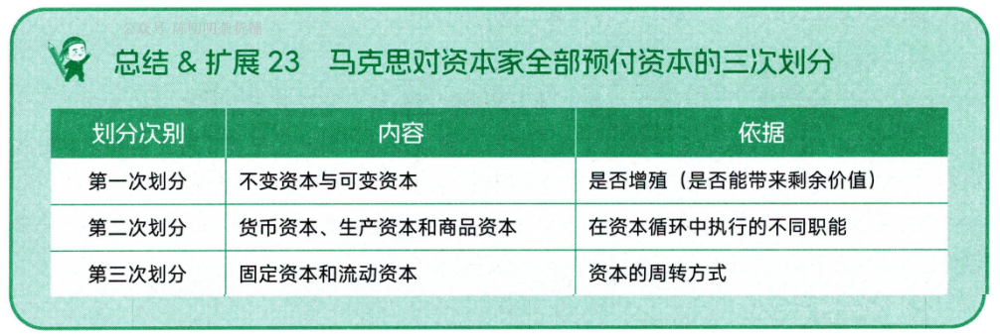
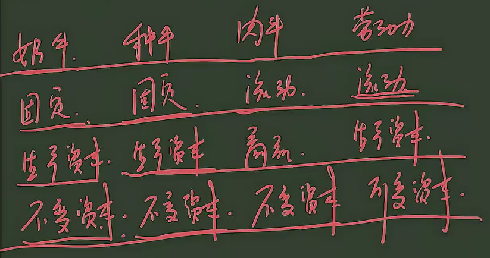
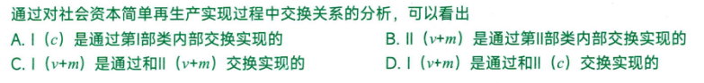

# 导论
## 第一节 马克思主义的创立与发展

### 考点 1 马克思主义的内涵及构成

马克思主义的构成：马克思主义哲学，马克思主义政治经济学，科学社会主义

1. 关系：

马哲-基础/方法

政经-主体理论

科社-目的/归宿

2. 出处：

恩格斯于《反杜林论》首次将马克思的理论分为三个部分进行阐述

### 考点 2 马克思主义的基本立场、基本观点和基本方法

马克思主义的基本方法：辩证唯物主义和历史唯物主义。主要包括实事求是、辩证分析、社会基本矛盾和主要矛盾分析的方法、历史分析的方法、阶级分析的方法、群众路线的方法等

### 考点 3 马克思主义的创立（重点）

正义者同盟（工人组织）-> 共产主义者同盟（世界上第一个无产阶级政党），其党纲为共产党宣言

马克思主义的产生的社会根源、阶级基础和思想渊源：

**社会根源**（经济、社会背景）：资本主义生产方式在西欧有了相当的发展

**阶级基础**（实践基础）：无产阶级在反抗资产阶级剥削和压迫的斗争中，逐步走向自觉，并渴望科学理论指导。

现代无产阶级作为独立的政治力量登上历史舞台的标志：法国、英国、德国工人运动

中国无产阶级作为独立的政治力量登上历史舞台的标志：五四运动

**思想渊源**：

马哲-德国古典哲学

政经-英国古典政治经济学

科社-英法空想社会主义

### 考点 4 马克思主义的发展（非重点）

马恩列经典著作总结：

|重要程度|分类|著作|内容/标志|补充说明|作者
:--|:--|:--|:--|:--|:--
**一级重点**|3+1|《德意志意识形态》|首次系统阐述(或创立)了唯物史观标志着马克思主义哲学的诞生|唯物史观/马哲的创立|马恩合著
**一级重点**|3+1|《资本论》|系统阐述了剩余价值理论，标志这马克思主义政治经济学的诞生|工人阶级的圣经|马克思
**一级重点**|3+1|《共产党宣言》|标志着科学社会主义的诞生、马克思主义的诞生、世界上第一个无产阶级政党的党纲|注意三个标志|马恩合著
**一级重点**|3+1|《反杜林论》|全面阐述了马克思主义理论体系|首次分三部分阐述|恩格斯
**一级重点**|大事件|《关于费尔巴哈的提纲》|首次确立了科学的实践观|历史唯物主义的起源|马克思
二级重点|大事件|《德法年鉴》|标志着马恩二人的两个转变|从唯心主义转向唯物主义、从革命民主主义转向共产主义，为马恩创立自己的理论奠定了思想前提|马恩
二级重点|大事件|《法兰西内战》|科学总结了巴黎公社的经验教训|巴黎公社是世界上第一个无产阶级政权|马克思
二级重点|其他事件|《家庭、私有制和国家的起源》|马恩的国家学说|与列宁的国家学说作区分|恩格斯
二级重点|革命|《帝国主义是资本主义的最高阶段》|指出帝国主义是无产阶级革命的前夜|帝国主义即垄断资本主义|列宁
二级重点|革命|《论欧洲联邦口号》《无产阶级革命的军事纲领》|首次提出一国胜利论/进一步发挥一国胜利论|同时胜利论的革新|列宁
二级重点|革命|《国家与革命》《无产阶级革命的军事纲领》|列宁的国家学说|与马恩的国家学说作区分|列宁

## 第二节 马克思主义的基本特征和当代价值

### 考点 5 马克思主义的基本特征（重点）

科学性、人民性、实践性、发展性

科学性：独有特征。正确性

人民性：本质属性。人民至上的立场

实践性：独有特征。

发展性：与时俱进。

革命性=人民性+实践性+发展性，所以，马克思主义的基本特征，用一句话来概括就是科学性与革命性的统一

# 马克思主义哲学

## 第一章 辩证唯物论

### 考点 7 哲学基本问题及不同哲学流派

哲学的基本问题是思维和存在（意识和物质）的关系问题

第一性问题区分唯物主义与唯心主义。

同一性问题区分可知论与不可知论。

（马克思在哲学史上的两大历史贡献：1.创立唯物史观；2.形成了辩证唯物主义。）

### 考点 8 物质范畴及其理论意义（理论意义非重点）

马哲认为：

① 物质是不依赖于人类的意识而存在 （反唯心）
② 物质是能为人类的意识所反映的客观实在（反不可知论）
③ 这种客观实在僧，是从自然存在和社会存在中抽象出的共同特性。（反旧唯物）

### 考点 9 物质和运动

在考研政治中，“运动” = “变化”，两名词通用。

运动是物质的**存在方式**和**根本属性**。

物质和运动的关系：不可分割

### 考点 10 运动和静止

运动和静止的关系：对立统一

静止是运动的一种特殊状态。

### 考点 11 物质运动和时空

物质运动与时空的关系：不可分割

注意：

**物质**的存在方式——运动

**运动的物质/物质运动**的存在方式——时空

时空的特点：

时空有客观性

具体物质形态的时空是有限的

整个物质世界的时空是无限的

物质运动时间和空间的客观实在性是绝对的

物质运动时间和空间的具体特性是相对的（如高速运动，时间变慢）

### 考点 12 物质世界的二重化

人类诞生后，从自然界中分化出人类社会，从客观世界中分化出主观世界。

一方面，世界分化为自然界与人类社会。人类社会是最高级的物质存在形态。自然界与人类社会不是截然分开的，而是交叉重叠和相互作用的。

另一方面，世界分化为客观世界和主观世界。主观世界从客观世界中分化出来，具有相对独立性。
但主观世界并非独立存在的实体，也不是一个超然于客观世界而孤立存在的世界，它不能完全脱离客观世界，而是**从属于**客观世界。

人的实践活动是自然界与人类社会、客观世界与主观世界相分化的关键（基础、前提），也是它们相统一的关键。

### 考点 13 物质与意识的辩证关系

1. 物质对意识的决定作用

意识是**人脑的机能和属性**，是**客观世界的主观映像**

**意识的起源**：一方面，意识是自然界长期发展的产物。另一方面，意识也是社会历史发展的产物。

注意：社会实践，特别是劳动，在意识的产生和发展中起着**决定**性的作用。语言对……有促进、重要影响。

**意识的本质**：意识是人脑的机能和属性。意识在内容上是客观的，在形式上是主观的。意识是物质的产物，但不是物质。

2. 意识对物质的反作用（意识的能动作用） ***论述考点**

意识的能动作用主要表现在：

第一，意识具有目的性和计划性。

第二，意识具有创造性。

第三，意识具有指导实践改造客观世界的作用。

第四，意识具有调控人的行为和生理活动的作用。

### 考点 14 主观能动性和客观规律性的辩证统一

一方面，尊重客观规律是正确发挥主观能动性的前提（先客观再能动）

另一方面，只有充分发挥主观能动性，才能正确认识和利用客观规律

实践是客观规律性与主观能动性统一的基础。人们要正确发挥主观能动性，应当注意以下三个方面的前提和条件：

第一，从实际出发是正确发挥人的主观能动性的前提。

第二，实践是正确发挥人的主观能动性的根本途径。

第三，正确发挥人的主观能动性，还要依赖于一定的物质条件和物质手段。

### 考点 15 意识与人工智能

人工智能实质上是对人脑组织结构与思维运行机制的模仿，是人类智能的物化。

人工智能不能真正具有人的意识，不能取代或超越人类智能。（总的不能超越，部分领域可以超越）

### 考点 16 世界的物质统一性原理

第一，自然界是物质的。

人类的实践活动能够改变自然事物的形态和面貌，在自然界打上人类的印记，使之成为人化的自然，但不能改变自然界的客观实在性。

实践不能改变：（物质的）物质性、客观实在性、客观存在

实践可以改变：（物质的）性质、结构、存在状态

第二，人类社会本质上是生产实践基础上形成的物质体系。

人类社会为什么是物质：自然界是物质的，生产方式是物质的，建立在两者之上的人类社会是物质的

第三，人的意识统一于物质。

意识来源于/派生于/统一于物质。

**方法论**：**世界的物质统一性原理是辩证唯物主义最基本、最核心的观点**，是马克思主义的基石，**一切从实际出发**，是世界的物质统一性原理在现实生活中和实际工作中的生动体现

## 第二章 唯物辩证法

### 考点 17 唯物辩证法两大总特征

**联系和发展是唯物辩证法的总观点和总特征。**

1. 事物的普遍联系

联系的特点：

第一，联系具有客观性。

第二，联系具有普遍性。

第三，联系具有多样性。

第四，联系具有条件性。

2. 事物的变化发展

运动变化的基本趋势是发展。（运动是绝对的，发展不是绝对的。可以说发展是永恒的。

### 考点 18 对立统一规律(唯物辩证法第一规律) ***论述考点**

**对立统一规律是唯物辩证法的实质和核心。**

1. 矛盾的同一性和斗争性及其辩证关系

对立统一规律又称矛盾规律，矛盾是辩证法的核心概念。矛盾是反映事物内部或事物之间对立统一关系的哲学范畴。简言之，矛盾即对立统一。

对立和统一分别体现了矛盾的两种基本属性。矛盾的对立属性又称斗争性，矛盾的统一属性又称同一性。

矛盾的同一性是指矛盾着的对立面相互依存、相互贯通的性质和趋势。它有两个方面的含义：一是矛盾着的对立面相互依存，互为存在的前提，并共处于一个统一体中；二是矛盾着的对立面相互贯通，在一定条件下可以相互转化。

矛盾的斗争性是指矛盾着的对立面相互排斥、相互分离的性质和趋势。

矛盾的同一性和斗争性是相互联结、相辅相成的。争性寓于同一性之中，在事物的矛盾中，矛盾的斗争性是无条件的、绝对的，矛盾的同一性是有条件的、相对的。

2. 矛盾的同一性和斗争性在事物发展中的作用

3. 矛盾的普遍性和特殊性及其辩证关系

4. 矛盾的不平衡发展原理

### 考点 19 量变质变规律(唯物辩证法第二规律) ***选择考点**

第一，量变是质变的必要准备。

第二，质变是量变的必然结果。

### 考点 20 否定之否定规律(唯物辩证法第三规律) ***选择考点**

辩证否定观的基本内容：

第一，否定是事物的**自我**否定、自我发展

第二，否定是事物发展的环节

第三，否定是新旧事物联系的环节，新事物孕育产生于旧事物，新旧事物是通过否定环节联系起来的。

第四，辩证否定的实质是“**扬弃**”

### 考点 21 内容和形式

内容指构成事物的一切要素的总和，是事物存在的基础；形式指把诸要素统一起来的结构或表现内容的方式。

### 考点 22 现象和本质 *重点

### 考点 23 原因和结果 *重点

### 考点 24 必然和偶然 *重点

### 考点 25 可能和现实

### 考点 26 非重点跳过
### 考点 27 客观辩证法与主观辩证法的统一

客观即物质 主观即意识

### 考点 28 非重点跳过

## 第三章 认识论
### 考点 29 实践的本质和基本特征

实践性是马克思主义理论区别于其他理论的根本特征。实践的观点是马克思主义的基本观点。

### 考点 30 实践的基本结构和形式

实践的主体、客体和中介是实践活动的三项基本要素，三者的有机统一构成实践的基本结构。

实践主体的能力包括自然能力和精神能力，精神能力又包括知识性因素和非知识性因素。其中，知识性因素是首要的能力

客观事物只有在被纳入主体实践活动的范围之内，为主体实践活动所指向并与主体相互作用时才成为现实的实践客体。

实践的中介系统可分为两个子系统：一是作为人的肢体延长、感官延伸、体能放大的物质性工具系统，二是语言符号工具系统

实践的主体和客体相互作用的关系，包括实践关系、认识关系和价值关系，其中**实践关系是最根本的关系。实践的主体和客体与认识的主体和客体在本质上是一致的。**

从内容上看，实践的形式可分为三种基本类型：一是物质生产实践；二是社会政治实践；三是科学文化实践。

物质生产实践是最基本的实践活动，它构成全部社会生活的基础。

虚拟实践是实践活动的派生形式，具有相对独立性。

### 考点 31 实践对认识的决定作用

实践是认识的基础，实践在认识活动中起着决定性的作用。“实践的观点是辩证唯物论的认识论之第一的和基本的观点。

第一，实践是认识的来源。

第二，实践是认识发展的动力。

第三，实践是认识的目的。

第四，实践是检验认识真理性的唯一标准。】

### 考点 32 认识的本质

辩证唯物主义认识论认为，认识的本质是主体在实践基础上对客体的能动反映。

这种能动反映不但具有反映客体内容的反映性特征，而且具有实践所要求的主体能动的、创造性的特征。一方面，认识的反映特性是人类认识的基本规定性。认识的反映特性是指人的认识必然要以客观事物为原型和摹本，在思维中再现或摹写客观事物的状态、属性和本质。另一方面，认识作为能动反映具有创造特性。认识是一种在思维中的能动的、创造性的活动，而不是主观对客观对象简单、直接的描摹或照镜子式的原物映现。

认识的反映特性和创造特性之间的关系：不可分割。

### 考点 33 认识的过程(两次飞跃)

1. 从实践到认识(感性认识到理性认识的飞跃)

感性认识是人们在实践基础上，由感觉器官直接感受到的关于事物的现象、事物的外部联系、事物的各个方面的认识，包括感觉、知觉和表象三种形式。感性认识是认识的初级阶段，直接性是感性认识的突出特点。

理性认识的对象：事物的本质、全体、内部联系和事物自身规律性。

理性认识包括概念、判断、推理三种形式。理性认识的特点是它的间接性和抽象性。

关系：辩证统一

第一，理性认识依赖于感性认识。感性认识是认识过程的起点，是达到理性认识的必经阶段，理性认识对感性认识的这种依赖关系，是认识对实践依赖关系的重要表现。

第二，感性认识有待于发展和深化为理性认识。

第三，感性认识和理性认识相互渗透、相互包含。

2. 从认识到实践(理性认识到实践的飞跃)

这是认识过程的第二次能动的飞跃，是认识过程中更为重要的一次飞跃

### 考点 34 认识过程中的影响因素(理性因素和非理性因素)

理性因素：指人的理性直观、理性思维等能力，它在认识活动中的作用主要有指导作用、解释作用和预见作用等。

非理性因素：主要指认识主体的情感和意志。从广义上看，人们还常把认识能力中具有不自觉、非逻辑性等特点的认识形式，如联想、想象、猜测、顿悟、灵感等，也包括在人的非理性因素中。非理性因素对于人的认识能力和认识活动具有激活、驱动和控制作用。

### 考点 35 认识的两大规律(反复性和无限性)

认识过程的反复性是指，人们对于一个复杂事物的认识往往要经过由感性认识到理性认识、再由理性认识到实践的多次反复才能完成。这是因为在认识过程中始终存在着主观和客观的矛盾。

从客观方面看，事物的各个侧面及其本质的暴露有一个过程；从主观方面看，人的认识能力有一个提高的过程。

认识发展的无限性是指，对于事物发展过程的推移来说，人类的认识是永无止境、无限发展的，它表现为“实践一认识一再实践一再认识”的无限循环。这种认识的无限发展过程，在形式上是循环往复的，在实质上是前进上升的。

### 考点 36 非重点跳过
### 考点 37 真理及其特性

真理具有客观性：真理的内容是客观的（真理的内容是客观物质世界），真理的标准是客观的（真理的标准是实践）

真理的形式是主观的。

真理的客观性决定了真理的一元性。

****

真理有绝对性与相对性。真理的绝对性和相对性是相互依存、相互包含的。

### 考点 38 真理和谬误 论述考点
真理和谬误的辩证关系：
一方面，真理和谬误是相伴而生的，由于真理
和谬误决定于认识的内容是否如实地反映了客观事物，因此真理和谬误是性质不同的两种认识，
它们是对立的。
另一方面，真理和谬误又是统一的，它们相互依存、相互转化。真理和谬误相比较而存在，
没有真理也无所谓谬误，没有谬误也无所谓真理；真理中包含着某种以后会暴露出来的错误的
方面或因素，谬误中也隐藏着以后会显露出来的真理的成分或萌芽；在一定条件下，真理和谬
误可以相互转化。真理和谬误在一定范围内的对立是绝对的，但超出一定范围，它们就会相互
转化，真理变成谬误，谬误变成真理。

### 考点 39 真理的检验标准

1. 真理的检验标准：实践

实践是检验真理的唯一标准

真理的本性是主观和客观的一致、符合。

实践是主观见之于客观的物质活动，

实践是检验真理的唯一标准，并不排斥逻辑证明的作用

2. 实践标准的确定性与不确定性

实践作为检验认识真理性的标准，既是确定的，又是不确定的。

实践标准的确定性即绝对性：实践是检验真理的唯一标准，此外再无别的标准；凡经过实践证明了的一切认识都是客观真理，都具有不可推翻的性质；实践能够检验一切认识，即使当前的实践还不能加以判定，最终也会被以后的实践作出裁决。

实践标准的不确定性：一定历史阶段上的具体实践具有局限性，它往往不能充分证明或驳倒某一认识的真理性；实践检验真理是一个过程，不是一次完成的；已被实践检验过的真理还要继续经受实践的检验。

实践不断发展，真理也不断发展，在发展的实践中不断验证认识的真理性。这就是实践检验真理的辩证发展过程。

### 考点 40 真理与价值的辩证统一

价值有主体性、客观性、多维性、社会历史性

### 考点 41 非重点
### 考点 42 非重点
### 考点 43 从必然走向自由

认识必然和争取自由，是人类认识世界和改造世界的根本目标

自由不是摆脱必然（规律）的束缚和制约，自由是对必然（规律）的认识和利用（来改造世界）

自由是历史发展的产物，自由是有条件的：一是认识条件；二是实践条件。

## 第四章 唯物史观

### 考点 44 唯物史观和唯心史观的对立

社会历史观的基本问题：社会存在和社会意识的关系问题。

### 考点 45 社会存在和社会意识及其辩证关系

社会存在是社会生活的**物质**方面，主要包括物质生产方式、自然地理环境和人口因素。

自然地理环境和人口因素是人类社会生存和发展的必要条件。

物质生产方式就是劳动者和劳动资料结合的特殊方式，是生产力和生产关系的统一体，它集中体现了人类社会的物质性。

生产方式 = 生产力+生产关系。起决定性作用。

另两个因素只起重要影响作用。

****

社会意识是社会生活的精神方面。

根据不同的层次：社会意识可分为社会心理和社会意识形式。

社会心理——低层次、自发

社会意识形式——高层次、自觉。与阶级有关：社会意识形态。与阶级无关：非社会意识形态。 

****

社会意识具有相对独立性

首先，社会意识与社会存在发展具有不完全同步性和不平衡性。

其次，社会意识内部各种形式之间存在相互影响且各自具有历史继承性。

最后，社会意识对社会存在具有能动的反作用，这是社会意识相对独立性的**突出**表现。

### 考点 46 生产力和生产关系矛盾运动的规律(第一对社会基本矛盾)

生产力是标志人类改造自然的实际程度和实际能力的范畴，它表示人与自然的关系。

生产力的基本要素：

一是劳动资料，即劳动手段。其中，最重要的是生产工具，它是生产力发展水平的客观尺度，是区分社会经济时代的客观依据。

二是劳动对象。劳动资料和劳动对象合称为生产资料。

三是劳动者。

****

生产关系**是不以人的意志为转移**的经济关系。生产关系是社会关系中最基本的关系。包括生产资料所有制关系、生产中人与人的关系和产品分配关系。在生产关系中，生产资料所有制关系是最基本的、决定性的，它构成全部生产关系的基础，是区分不同生产方式、判定社会经济结构性质的客观依据。

生产关系是一种人与人的关系

****

在社会生产中，生产力是生产的物质内容，生产关系是生产的社会形式，二者的有机统一构成社会的生产方式。生产力决定生产关系，生产关系反作用于生产力。

生产关系一定要适合生产力状况的规律

### 考点 47 经济基础和上层建筑矛盾运动的规律(第二对社会基本矛盾)

经济基础是指由社会一定发展阶段的生产力所决定的**生产关系**的总和。

上层建筑是指建立在一定经济基础之上的意识形态以及与之相适应的制度、组织和设施。意识形态又称观念上层建筑，政治法律制度及设施和政治组织又称政治上层建筑。

观念上层建筑的核心——政治法律思想

政治上层建筑的核心——国家政权

在整个上层建筑中，政治上层建筑居主导地位。

****

上层建筑对经济基础具有反作用。这种反作用集中表现在为自己的经济基础服务。上层建筑反作用的性质，取决于它所服务的经济基础的性质，归根到底取决于它是否有利于生产力的发展。

### 考点 48 人类普遍交往与世界历史的形成发展

交往是与生产力的发展相伴随的。

生产方式的发展变革是世界历史形成和发展的基础。**普遍交往是世界历史的基本特征**。（资本主义之前没有世界史）

### 考点 49 社会进步与社会形态更替

社会进步作为对社会前进发展的总概括，主要表现在两个方面：一是社会形态从低级到高级的发展。二是同一社会形态内部的发展。

人的发展最根本的是人的自由程度的提高。人人的发展从低级到高级依次概括为三个阶段，即人的依赖关系占统治地位的阶段、以物的依赖关系为基础的人的独立性的阶段、自由个性的阶段。

****

社会形态是关于社会运动的具体形式、发展阶段和不同质态的范畴，是同生产力发展一定阶段相适应的经济基础与上层建筑的统一体。社会形态包括社会的经济形态、政治形态和意识形态，是三者具体的、历史的统一。

社会形态更替的特点：

第一，社会形态更替的统一性和多样性

第二，社会形态更替中的必然性与人们的历史选择性。生产力的发展具有最终的决定意义。生产力与生产关系矛盾运动的规律性，从根本上规定了社会形态更替的必然性。

第三，社会形态更替的前进性与曲折性。

### 考点 50 社会基本矛盾是历史发展的根本动力

生产力和生产关系、经济基础和上层建筑的矛盾是社会基本矛盾。

社会基本矛盾作为历史发展的**根本动力**。社会基本矛盾特别是生产力和生产关系的矛盾，是“一切历史冲突的根源”,决定着社会中其他矛盾的存在和发展。

### 考点 51 阶级斗争、社会革命在社会发展中的作用

阶级斗争是社会基本矛盾在阶级社会中的直接表现，是阶级社会发展的**直接动力**。
### 考点 52 改革是推动社会发展的又一重要动力。
### 考点 53 科学技术革命是社会动力体系中的一种重要动力。
### 考点 54 文化是推动社会发展的重要力量。
### 考点 55 关于历史创造者问题

谁是历史的创造者，这是唯物史观与唯心史观的分水岭。

唯物史观考察历史创造者的原则：首先，唯物史观立足于**现实的人**及其本质来把握历史的创造者。人是一切社会关系的总和。人的本质属性是社会属性，而不是自然属性。

其次，唯物史观立足于整体的社会历史过程来探究谁是历史的创造者。

再其次，唯物史观从社会历史发展的**必然性/规律性**入手来考察和说明谁是历史的创造者。

最后，唯物史观从人与历史关系的不同层次上考察谁是历史的创造者。

### 考点 56 人民群众创造历史

从质上说，人民群众是指一切对社会历史发展起推动作用的人；从量上说，人民群众是指社会人口中的绝大多数。在不同的历史时期，人民群众有着不同的内容，包含着不同的阶级、阶层和集团。人民群众中最稳定的主体部分始终是从事物质资料生产的劳动群众。

在社会历史发展过程中，人民群众起着决定性的作用。

历史是人民群众创造的，但人民群众创造历史的活动又受到一定社会历史条件的制约。包括经济条件、政治条件和精神文化条件。

### 考点 57 个人在社会历史中的作用

不管什么样的历史人物，在历史上发挥什么样的作用，都要受到社会发展客观规律的制约，而不能决定和改变历史发展的总进程和总方向。任何历史人物的出现都体现了必然性与偶然性的统一。

首先，群众是划分为阶级的。其次，阶级通常是由政党领导的。最后，政党是由领袖来主持的。

# 第五章 资本主义的本质及规律

## 第一节 商品经济和价值规律

### 考点 58 价值是什么

商品经济是以交换为目的而进行生产的经济形式。商品经济产生的社会历史条件有两个：一是社会分工的存在；二是生产资料和劳动产品属于不同的所有者。

商品的概念及其二因素：商品是用来交换的、能满足人们某种需要的劳动产品，具有使用价值和价值两个因素或两种属性，是使用价值和价值的矛盾统一体。

使用价值是商品的自然属性，是一切劳动产品所共有的属性。（注意：社会财富 = 使用价值）

交换价值是如何被决定的：决定商品交换比例的，不是商品的使用价值，而是价值。

价值的概念及其特点：价值是凝结在商品中的无差别的一般人类劳动。（不经劳动天然存在的事物没有价值，可能有使用价值和价格）

使用价值和价值之间的关系：对立统一的关系。

其对立性表现在：商品的使用价值和价值是相互排斥的，二者不可兼得。

其统一性表现在：作为商品，使用价值和价值二者缺一不可。

****

生产商品的劳动二重性：商品是劳动产品，生产商品的劳动可区分为具体劳动和抽象劳动。

具体劳动的概念：具体劳动是指生产一定使用价值的**具体形式**的劳动，即有用劳动。

抽象劳动的概念：抽象劳动是指撇开一切具体形式的、**无差别的一般人类劳动**，即人的体力和脑力的消耗。

**劳动二重性决定了商品的二因素**：具体劳动形成商品的使用价值，抽象劳动形成商品的价值。

具体劳动和抽象劳动的关系：具体劳动和抽象劳动是同一劳动的两种规定。任何一种劳动，一方面是特殊的具体劳动，另一方面又是一般的抽象劳动。

### 考点 59 价值如何衡量

决定商品价值量的，不是生产商品的个别劳动时间，而是社会必要劳动时间。

商品的价值量与生产商品所耗费的社会必要劳动时间成正比，与劳动生产率成反比。

影响劳动生产率的因素主要包括：劳动者的平均熟练程度，科学技术的发展水平及其在生产中的应用程度，生产过程的社会结合，生产资料的规模和效能以及自然条件。

商品的价值量是以简单劳动为尺度计量的，复杂劳动等于**自乘（在商品交换过程中自发改变交换比率）的或多倍**的简单劳动。复杂劳动转化为简单劳动，是在商品交换过程中自发实现的。

### 考点 60 价值如何表现

价值被**交换**所表现

商品的价值形式的发展经历了四个阶段：简单的或偶然的价值形式（初级形式）、总和的或扩大的价值形式、一般的价值形式以及货币形式（终极形式，完备形式）。

货币是充当一般等价物的商品。

货币的五种基本职能：

价值尺度（原因：货币本身是商品，也有价值；货币可以是观念的（意识的）；纸币因为没有价值不能担任价值尺度的功能）

流通手段（现实的货币才能担任流通手段；可以不足值，只要充当足值即可）

贮藏手段

支付手段（没有现货交易；纸币也可以支付）

世界货币。

其中，价值尺度和流通手段是货币的两个最基本的职能。

****

货币产生后，商品内在的**使用价值和价值的矛盾**就发展成为**外在的商品和货币的矛盾**。

货币的出现并没有也不可能消除商品经济的矛盾，反而有可能使矛盾扩大和加深。

### 考点 61 价值有何规律

价值规律是商品经济的基本经济规律，其基本**内容**和客观要求：商品的价值量由生产商品的社会必要劳动时间决定，商品交换以价值量为基础，按照等价交换的原则进行。

价值规律的**表现形式**：商品的价格围绕价值自发波动。

### 考点 62 以私有制为基础的商品经济的基本矛盾

私人劳动和社会劳动的矛盾构成私有制基础上商品经济的基本矛盾。

### 考点 63 马克思在继承英国古典政治经济学劳动创造价值理论的同时，创立了劳动二重性理论
### 考点 64 资本主义经济制度的产生

资本主义生产关系产生的途径有两个：一是从小商品经济中分化出来；二是从商人和高利贷者转化而来。

资本原始积累的概念：以暴力手段使生产者与生产资料相分离，资本迅速集中于少数人手中，资本主义得以迅速发展的历史过程。

资本原始积累的途径：一是用暴力手段剥夺农民的土地；二是用暴力手段掠夺货币财富。

### 考点 65 劳动力成为商品与货币转化为资本

劳动力是指人的劳动能力，是人的脑力和体力的总和。

劳动力成为商品，要具备两个基本条件：第一，劳动者在法律上是自由人。第二，劳动者没有任何生产资料。

劳动力商品的价值：由生产、发展、维持和延续劳动力所必需的生活必需品的价值决定。包括三个部分：第一，维持劳动者本人生存所必需的生活资料的价值；第二，维持劳动者家属的生存所必需的生活资料的价值；第三，劳动者接受教育和训练所支出的费用。

劳动力商品的使用价值是价值的源泉，它在消费过程中能够创造新价值，而且这个新的价值比劳动力本身的价值更大

### 考点 66 非重点
### 考点 67 剩余价值的生产

资本主义生产过程具有二重性：一方面是生产物质资料的劳动过程；另一方面是生产剩余价值的过程，即价值增殖过程。资本主义生产过程是劳动过程和价值增殖过程的统一。

资本主义劳动过程是生产使用价值的过程。资本主义劳动过程的两个特点：其一，工人在资本家的监督下劳动，他们的劳动隶属于资本家；其二，劳动成果或劳动产品全部归资本家所有。

价值增殖过程是剩余价值的生产过程，这是资本主义生产过程的主要方面。

****

在价值增殖过程中，雇佣工人的劳动分为两部分：一部分是必要劳动，用于再生产劳动力的价值；另一部分是剩余劳动，用于无偿地为资本家生产剩余价值

资本的本质不是物，而是一定的历史社会形态下的生产关系。

****

不变资本是以生产资料形态存在的资本，它通过工人的具体劳动被转移到新产品中去，其转移的价值量不会大于它原有的价值量。

可变资本是用来购买劳动力的那部分资本，在生产过程中不是被转移到新产品中去，而是由工人的劳动再生产出来。

把资本区分为不变资本和可变资本，进一步揭示了剩余价值产生的源泉。它表明，雇佣劳动者的剩余劳动是剩余价值的唯一源泉。

资本家对工人的剥削程度，可以用剩余价值率表示：m'=m/v。

****
资本家提高对工人的剥削程度最基本的方法有两种，即绝对剩余价值的生产和相对剩余价值的生产（两种方式都延长了剩余劳动时间）。

绝对剩余价值是指在必要劳动时间不变的条件下，由于延长工作日的长度或提高劳动强度而生产的剩余价值。

相对剩余价值是指在工作日长度不变的条件下，通过缩短必要劳动时间而相对延长剩余劳动时间所生产的剩余价值。

超额剩余价值是指企业由于提高劳动生产率而使商品的个别价值低于社会价值的差额。

本主义生产的根本目的是追求剩余价值，但客观上也会促进生产力的发展和社会进步。

### 考点 68 资本积累

资本积累不但是社会财富占有两极分化的重要原因，而且是资本主义社会失业现象产生的根源。

由资本的技术构成决定并反映技术构成变化的资本价值构成，叫作资本的有机构成，通常用c:v来表示。（技术变，价值变，有机变；技术不变，价值变，有机不变）

在资本主义生产过程中，资本有机构成呈现不断提高的趋势，

资本积累的历史趋势是资本主义制度的必然灭亡和社会主义制度的必然胜利。
### 考点 69 资本的循环周转与再生
资本循环是资本从一种形式出发，经过一系列形式的变化，又回到原来出发点的运动。

产业资本运动的两个基本前提条件：一是产业资本的三种职能形式必须在空间上并存。二是产业资本的三种职能形式必须在时间上继起。

资本是在运动中增殖的，资本周而复始、不断反复的循环，就叫资本的周转。

影响资本周转快慢的因素有很多，其中，关键的因素有两个：一是资本周转的时间；二是生产资本中固定资本和流动资本的构成。

社会再生产的核心问题是社会总产品的实现问题，即社会总产品的价值补偿（商品卖出去收回来的钱）和实物补偿问题（重新购买原材料）。

****

第一，社会总产品在价值形态上又叫社会总价值，包括在产品中的生产资料的转移价值(c)、凝结在产品中的由工人必要劳动时间创造的价值(v)和凝结在产品中的由工人在剩余劳动时间里创造的价值(m)。

第二，社会总产品在物质形态上划分为两大部类，即第I部类和第II部类。第I部类由生产生产资料的部门构成，第II部类由生产消费资料的部门构成。

经济危机实际上是资本主义条件下以强制的方式解决社会再生产的实现问题的途径。

### 考点 70 工资与剩余价值的分配

工人的工资是**劳动力的价值或价格**，这是资本主义工资的本质。资本家购买工人的劳动力是以货币工资形式支付的，**工资表现为“劳动的价格”或工人全部劳动的报酬，这就模糊了工人必要劳动和剩余劳动的界限，掩盖了资本主义的剥削关系**。

剩余价值是利润的本质，利润是剩余价值的转化形式。当剩余价值转化为利润时，剩余价值和可变资本的关系便被掩盖了。

随着利润转化为平均利润，商品价值就转化为生产价格，即商品的成本价格加平均利润。

生产价格形成以后，价值规律表现形式的变化：在价值转化为生产价格的条件下，价值规律作用的形式发生了变化。商品不再以价值而是以生产价格为基础进行交换，市场价格的变动不再以价值为中心，而是以生产价格为中心。

### 考点 71 马克思剩余价值理论的意义

剩余价值理论深刻揭露了资本主义生产关系的剥削本质，阐明了资产阶级与无产阶级之间阶级斗争的经济根源，指出了无产阶级革命的历史必然性。剩余价值理论是马克思经济学说的核心内容和基石

### 考点 72 资本主义的基本矛盾与经济危机

生产资料资本主义私人占有和生产社会化之间的矛盾，是资本主义的基本矛盾。这是生产力和生产关系之间的矛盾在资本主义社会的具体体现。

生产相对过剩是资本主义经济危机的本质特征。

经济危机的抽象的一般的可能性是由货币作为支付手段和流通手段引起的。但是这仅仅是危机在形式上的可能性。资本主义经济危机爆发的根本原因是资本主义的基本矛盾。这种基本矛盾具体表现为两个方面：第一，生产无限扩大的趋势与劳动人民有支付能力的需求相对缩小的矛盾；第二，单个企业内部生产的有组织性和整个社会生产的无政府状态之间的矛盾。

资本主义经济危机周期性爆发的特点，使社会资本再生产也呈现周期性的特点，一般包括四个阶段：危机（本质阶段）、萧条、复苏和高涨。

## 第三节 资本主义上层建筑

### 考点 73 资本主义的国家、民主制度及其本质

资本主义国家的职能是以服务于资本主义制度和资产阶级利益为根本内容的，是资产阶级
进行政治统治的工具。资本主义国家的职能包括对内和对外两个基本方面，即对内实行政治统
治和社会管理，对外进行国际交往和维护国家安全及利益。

资本主义民主制度：权在民”“天赋人权”“分权制衡”“社会契约”“自由、平等、博爱”等政治思想，

资本主义法律制度：法是资本主义国家法律制度的核心，它所依据的基本原则有：私有制原则、主权在民原则、分权制衡原则和人权原则。

资本主义国家政权：即国家的立法权、行政权、司法权分别由三个权力主体独立行使，

资本主义国家的选举制度：从实际政治作用上看，**选举制**是协调统治阶级内部利益关系和矛盾的重要措施。

政党：从政党制度的类型看，大致有两党制和多党制等形式。

### 考点 74 资本主义意识形态及其本质

资本主义国家意识形态的本质，可以概括为两个方面：第一，资本主义意识形态是资本主义社会的观念上层建筑，是为资本主义的经济基础服务的；第二，资本主义意识形态是资产阶级的阶级意识的集中体现。

# 第六章 资本主义的发展及其趋势

## 第一节 垄断资本主义的形成与发展

### 考点 75 资本主义从自由竞争到垄断

资本主义的发展经历了自由竞争资本主义和垄断资本主义两个阶段。垄断资本主义的发展包括私人垄断资本主义和国家垄断资本主义两种形式。

最简单的、初级的垄断组织形式是短期价格协定。尽管垄断组织的形式多样，但它们在本质上是一样的，即通过联合实现独占和瓜分商品生产和销售市场，操纵垄断价格，以攫取高额垄断利润。

垄断并不能消除竞争，反而使竞争变得更加复杂和激烈。

垄断资本主义阶段存在竟争的主要原因：一是垄断没有消除产生竞争的经济条件（私有制）。二是垄断必须通过竞争来维持。三是社会生产是复杂多样的，任何垄断组织都不可能把包罗万象的社会生产都包下来。

****

金融资本是由工业垄断资本和银行垄断资本融合在一起而形成的一种垄断资本。金融资本形成的主要途径包括金融联系（借款）、资本参与（投资）和人事参与等。

金融寡头在经济、政治及其他（政策咨询机构、新闻出版、科学教育、文化体育等上层建筑的各个领域）三方面控制社会。

****

垄断利润的来源：垄断资本所获得的高额利润，归根到底来自无产阶级和其他劳动人民创造的剩余价值。

垄断利润的实现：垄断利润主要是通过垄断组织制定的垄断价格来实现的。

垄断价格的计算方法：垄断价格 =成本价格 +平均利润 +垄断利润。

垄断价格的产生并没有否定价值规律，它是价值规律在垄断资本主义阶段作用的具体表现。

### 考点 76 垄断资本主义的发展

国家垄断资本主义的概念：国家垄断资本主义是国家政权和私人垄断资本融合在一起的垄断资本主义。

国家垄断资本主义形成的原因：首先，社会生产力的发展；其次，经济波动和经济危机的深化，推动国家垄断资本主义的产生；最后，缓和社会矛盾、协调利益关系的需求。

国家垄断资本主义的主要形式有五种：一是国家所有并直接经营的企业；二是国家与私人共有、合营企业；三是国家通过多种形式参与私人垄断资本的再生产过程；四是宏观调节；五是微观规制。

对国家垄断资本主义的评价：国家垄断资本主义的出现是资本主义经济制度内的经济关系调整，并没有从根本上消除资本主义的基本矛盾。

****

金融自由化与金融创新是金融垄断资本得以形成和壮大的重要制度条件。

金融在经济中的占比上升——金融利润上升，实体利润下降——金融就业人数变多，实体就业人数变少——虚拟经济脱离实体经济

****

早期的国际垄断同盟主要是国际卡特尔。

当代国际垄断同盟的形式以国家垄断资本主义的国际联盟为主。

国际性协调组织主要有三个；国际货币基金组织、世界银行和世界贸易组织。

### 考点 77 经济全球化及其影响

经济全球化：生产全球化、贸易全球化、金融全球化、（最重要的）企业经营全球化

导致经济全球化迅猛发展的因素主要有：（根本原因）科学技术的进步和生产力的发展、跨国公司的发展、各国经济体制的变革和国际经济组织的发展。

经济全球化对发展中国家的积极作用主要表现在：第一，经济全球化为发展中国家提供先进技术和管理经验。第二，经济全球化为发展中国家提供更多的就业机会。第三，经济全球化推动发展中国家国际贸易的发展。第四，经济全球化促进发展中国家跨国公司的发展。

经济全球化的负面影响：一是发达国家与发展中国家在经济全球化进程中的地位和收益不平等、不平衡。二是加剧了发展中国家资源短缺和环境污染。三是一定程度上增加了经济风险。

## 第二节 正确认识当代资本主义的新变化

### 考点 78 第二次世界大战后资本主义的变化及其实质

1. 生产资料所有制的变化

在资本主义发展的初期，私人资本所有制占主导地位，后衍变为私人股份资本所有制

二战后国家资本所有制形成。法人资本所有制占主导地位（今天仍然主导）

2. 劳资关系和分配关系的变化

缓和劳资关系的激励制度主要有：职工参与决策、终身雇佣、职工持股。

3. 社会阶层和阶级结构的变化

一是资本家的地位和作用发生了很大的变化。资本所有权和经营权发生分离，拥有所有权的资本家一般不再直接经营和管理企业，而是靠拥有和掌握的企业股票等有价证券的利息收入为生。二是高级职业经理成为大公司经营活动的实际控制者。三是知识型和服务型劳动者的数量不断增加，劳动方式发生了新变化。

4. 经济调节机制和经济危机形态的变化

经济危机呈现新的特点：去工业化和产业空心化日趋严重，产业竞争力下降；经济高度金融化，虚拟经济与实体经济严重脱节；财政严重债务化，债务危机频繁爆发；两极分化和社会对立加剧；经济增长乏力，发展活力不足，周期性危机与结构性危机（部分危机）交织在一起；金融危机频发，全球经济屡受打击。

5. 政治制度的变化

首先，政治制度出现多元化的趋势，公民权利有所扩大。其次，法治建设得到重视和加强，以协调社会各阶级、阶层之间的利益。最后，改良主义政党在政治舞台上的影响日益扩大。

### 考点 79 第二次世界大战后资本主义新变化的原因和实质

第二次世界大战后资本主义发生新变化的原因主要有：首先，科学技术革命和生产力的发展，是资本主义发生变化的**根本推动力量**。其次，工人阶级争取自身权利和利益的斗争再其次，社会主义制度初步显示的优越性对资本主义产生了重要影响。最后，主张改良主义的政党对资本主义制度的改革。

实质：

第一，第二次世界大战后资本主义发生的变化从根本上说是人类社会发展一般规律和资本主义经济规律作用的结果。

第二，第二次世界大战后资本主义发生的变化是在资本主义制度基本框架内的变化，并不意味着资本主义生产关系的根本性质发生了变化。

### 考点 80 当代资本主义变化的新特征

第一，科技创新加速资本主义生产方式变化。

第二，国际金融垄断资本主义影响日益显现。国际金融资本的垄断成为当代资本主义最突出、最鲜明、最主要的特征。国际金融资本的垄断主要表现在：一是金融垄断寡头化；二是金融垄断国际化；三是经济虚拟化、产业空心化。

第三，社会阶级层级结构呈现复杂性、多样化。由于新一轮信息技术体系在世界范围内掀起了新一轮的制造业退潮与服务业涨潮，传统技能逐渐被智能化、自动化所取代，从事信息、金融等中介服务业的“知识工人”数量和增长速度均超过“非知识工人”,工人阶级内部因技能、收入等方面的差异逐渐分化。

第四，发达资本主义国家凭借经济、科技、文化传播等超级优势，在世界范围内推行霸权主义和强权政治。第一：对发展中国家进行最大限度的经济盘剥和压榨，获得金融资本对于社会生产甚至社会生活的绝对统治地位；第二：直接严重威胁民族国家的文化认同和文化主权，撕裂价值观的共同基础；第三：构建“信息帝国主义”和“数字帝国主义”;第四：对他国进行政治、经济、科技等全方位制裁，逆历史潮流而动，破坏全球和平与稳定。

### 考点 81 非重点
### 考点 82 非重点
### 考点 83 非重点
### 考点 84 非重点

### 考点 85
### 考点 86
### 考点 87
### 考点 88
### 考点 89
### 考点 90
### 考点 91
### 考点 92
### 考点 93
### 考点 94
### 考点 95
### 考点 96
### 考点 97
### 考点 98
### 考点 99
### 考点 100
### 考点 101
### 考点 102
### 考点 103
### 考点 104
### 考点 105
### 考点 106
### 考点 107
### 考点 108
### 考点 109
### 考点 110
### 考点 111
### 考点 112
### 考点 113
### 考点 114
### 考点 115
### 考点 116
### 考点 117
### 考点 118
### 考点 119
### 考点 120
### 考点 121
### 考点 122
### 考点 123
### 考点 124
### 考点 125
### 考点 126
### 考点 127
### 考点 128
### 考点 129
### 考点 130
### 考点 131
### 考点 132
### 考点 133
### 考点 134
### 考点 135
### 考点 136
### 考点 137
### 考点 138
### 考点 139
### 考点 140
