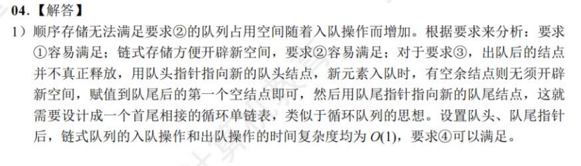

# 记忆性知识点

## 矩阵压缩存储 

## 考场手算kmp的next数组

详见王道冲刺课该考点讲解，神乎其技。

改进的nextval求法：

# 1.2.3 16

解：内循环总次数 $ 2^{t+1}-1 $(t为i的值)。外循环总次数 $ log_2n $。代入得$ 2^{log_2n} $，即时间复杂度为$ O(n) $。

# 2.2.3 12

解：对于总计占数组至少1/2的元素 a，最佳期望是截取数组任意一段，该段中 a 的占比都大于等于1/2（占据所有奇数位或者所有偶数位）

① 易推得截取数组任意一段 A，只要该段中 a 的占比小于1/2，必存在另一段 B 中 a 的占比大于1/2。

② 基于①，截取 B 中以 a 开头的后一段（即去掉开头所有非 a 元素），得到的新数组中 a 的占比 > B 中 a 的占比 > 1/2（分子不变分母变小）。

③ 综上，如满足题设条件，数组中必存在以 a 开头的子数组，该子数组中 a 的占比 > 1/2。而检测一个数组中任何元素是否占比超过 1/n 的算法为：遍历数组，记录当前已经遍历的元素数目和选中元素出现的次数，一旦选中元素出现次数/已遍历元素数目 < 1/n，立刻切换当前遍历元素为选中元素。时间复杂度为 O(n)。

但是！

# 2.2.3 14

注意数组有序！因此三指针滑动窗口依次逼近ac最短距离是可行的！

# 2.3.7 15

快慢指针。快指针走2步，慢指针走1步。如果有环，快指针会追上慢指针。最差情况下（全环），快指针转两圈，慢指针转一圈，时间复杂度为O(n)。

又有 $ 2(F+a) = F+n*r+a $，得 $ F = n*r-a $ ，即设置两个指针，当F走完时，从相遇点出发的指针走了n圈-a步，加上已经走的a步，即为环的起点。

# 3.2.2

# 3.2.5

# 5.5.3 二 2

你能一眼丁真哈夫曼树吗？

# 6.4.1 最小生成树

1. prim算法：时间复杂度为O(|V|^2)的来历：

使用邻接矩阵存储图，每次遍历一行（无向图则平均遍历半行，不影响计算结果），找到最小权值并记录。每新加入一个节点，遍历一行，并比较本行最小权值和已记录最小权值，因此粗略估计时间复杂度为O(n^2)。

1. kruskal算法：时间复杂度为O(|E|log|E|)。即遍历E条边，使用堆来存放边的集合，每次取出最小权值的边的时间复杂度为O(log|E|)。

# 6.4.6 

本题选A。

本题建立在出题人对DFS的刻板印象上：只要进函数我立刻就要访问！

然而……把结点输出顺序调整为递归退出顺序也是种常见做法，只能说劝出题人多写两道力扣。

# 7.2.4 

注意8个元素中有一个已经比较过了。

注意1：字符串的大小比较是按照字典序进行的，即从左到右逐个比较字符的大小。

注意2：第二问构造二叉排序树能得到最短查找长度。

# 7.3.4

二叉平衡树的结点数目递推公式为：$ n_0 = 0, n_1 = 1, n_{h} = 1 + n_{h-1} + n_{h-2} $

# 8.3.3

# 8.4.3

请注意：堆排序O(nlogn)的时间复杂度是建堆的时间复杂度，而在建完堆进行比较的过程中，每一个元素在堆中只进行常数次比较！