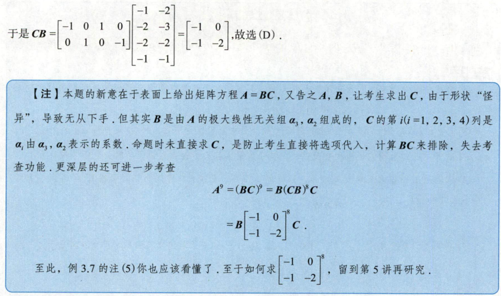
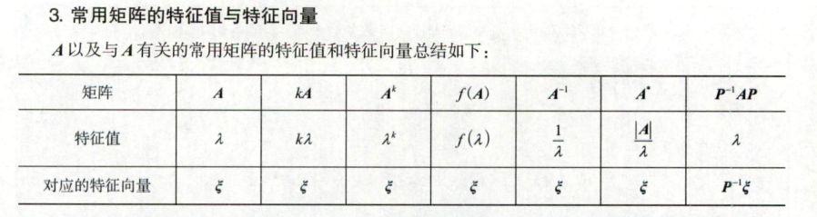
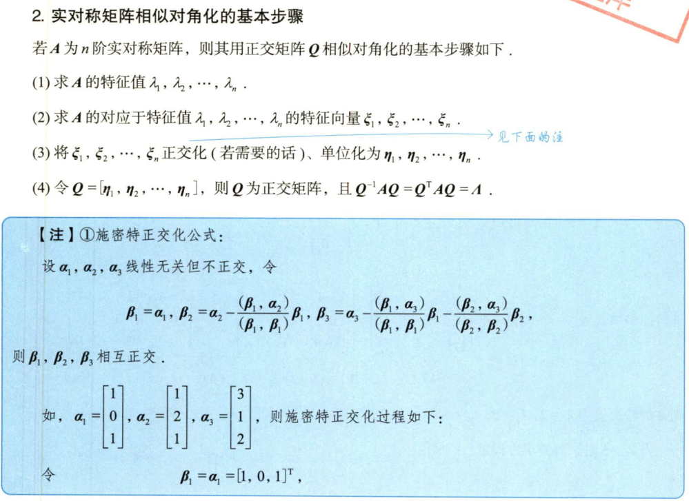
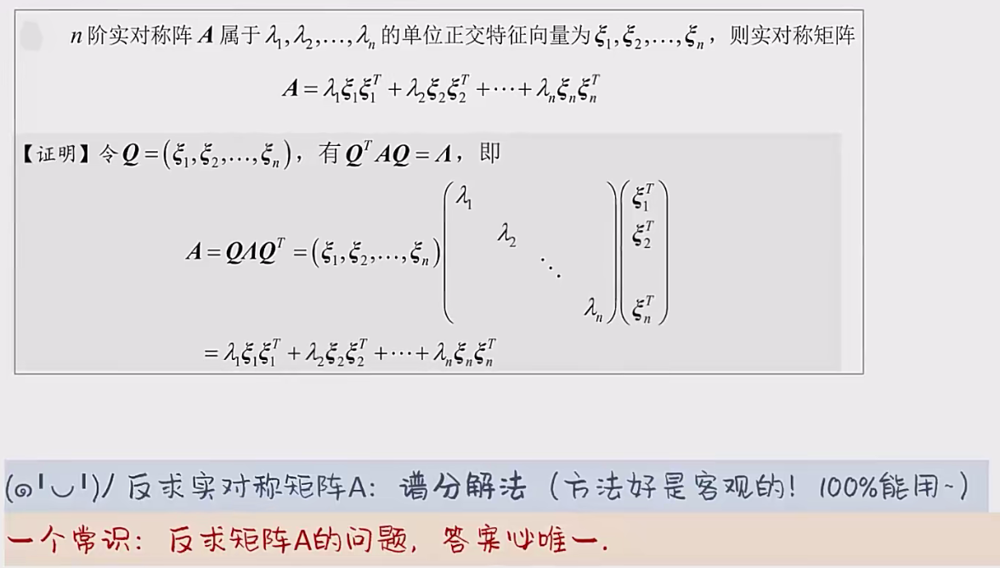
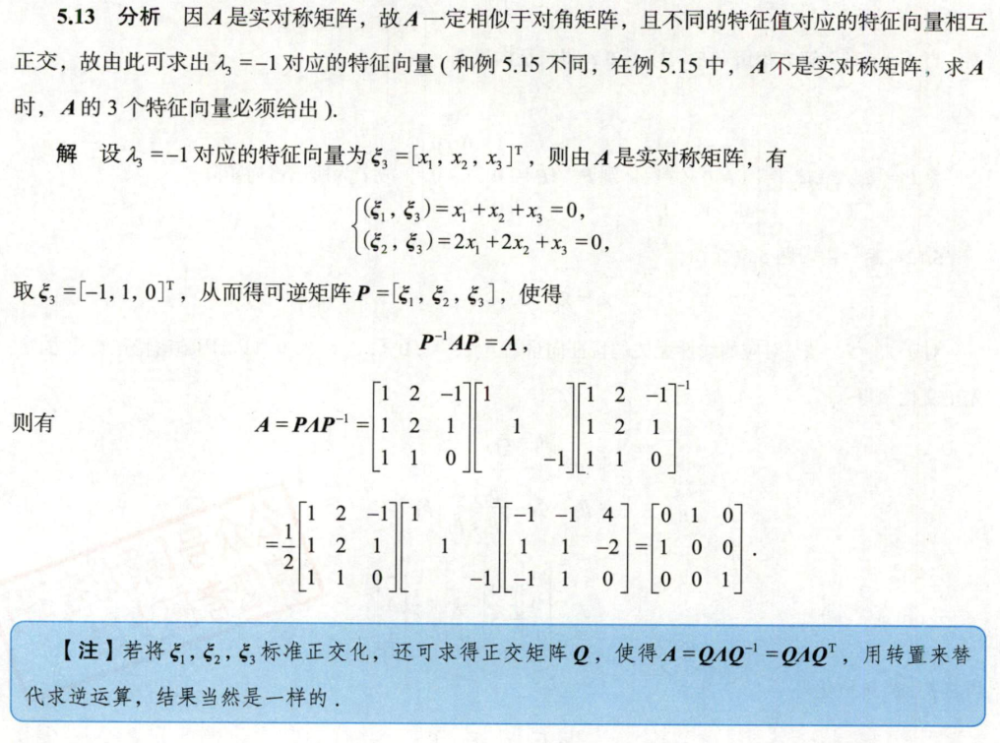

# 逆矩阵与转置矩阵的公式

$ r(A) = r(A^T) = r(AA^T) = r(^TA) $

# 第二章例题

# 第三章例题

# 第四章例题

****

重点：最佳近似解：

看课。本质上是空间外向量在空间内的投影，投影必存在，必有解。

****

****

# 常用矩阵的特征值与特征向量

# 相似对角化

# 第五章例题

## 谱分解

## 善用变换

# 第六章例题

## 矩阵合同条件

## 又遇谱分解

