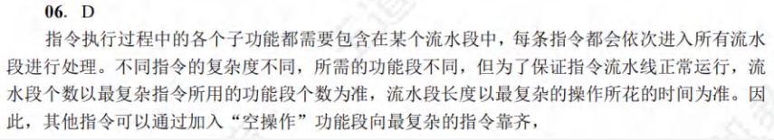

# 3.2例题答案

>1.   选D。注意只要相邻4个的模块有重复就**有可能**冲突，不要认为就是8005、8006、8007、8008|8001、8002、8003、8004这样读，也有可能是8006、8007、8008、8001|8002、8003、8004、8000这样读。
>2.   选C。由主存地址 803 001AH 可知最后两位为 10，即2号芯片。第一次读取 只能读出2、3号芯片的前2B，第二次读出0-4号芯片的中间4B，第三次读出0、1号芯片的后2B。共读三次。

# 3.3例题答案

> 
> 
>
> 
>
> 

# 3.5例题答案

> 
>
> 
>
> 
>
> 
>
> 
>
> 
>
> 
> 
> 
>
> 

# 4.1例题答案

> 答：
> 
> 地址码占6位，指令字长16位，二地址指令指令码占16-6×2=4位，最多可以表示 $2^4=16$ 条二地址指令，二地址指令有12条，剩余16-12=4种情况，此时对于一地址指令，二地址指令的高位地址码融入二地址指令指令码作为一地址指令的指令码，最多可以表示$4 \times 2^6=256$条一地址指令，一地址指令有254条，剩余256-254=2种情况，此时对于零地址指令，低位地址码融入一地址指令指令码作为零地址指令的指令码，最多可以表示 $2 \times 2^6=128$ 条零地址指令。本题答案为D。
>
> 

# 4.2例题答案

> 
> 
> 
> 
> 
> 
> 
> 
> 
> 
> 
> 
> 
> 
> 
>
> 
>
> 
>
> 

# 4.3例题答案

> 43.
>
> 
>
> 44.
>
> (1) M为CISC。观察题44图，指令1的内容为55H，指令长8位，指令20的内容为394DF4H，指令长24位，显然M的指令长短不一，不符合RISC指令系统特点。
> 
> (2) f1的机器代码占96B。因为f1的指令1所在的虚拟地址为00401020H，最后一条指令即指令35所在的虚拟地址为0040107FH，指令35的内容为C3H，指令长8位，计算机M按字节编址，指令35占一个地址单元。f1的机器指令代码占0040107FH+1H-00401020H=60H=96个地址单元，又因为计算机M按字节编址，所以f1的机器指令代码共占96字节。
> 
> (3) CF=1。cmp指令实现i与n-1的比较功能，i<=n-1，即i-(n-1)<0或i==(n-1)，i-(n-1)进行的是减法运算。在执行f1(0)过程中，n=0，当i=0时，i=00000000H，n-1=FFFFFFFFH。因此，当执行指令20时，在补码加/减运算器中执行00000000H-FFFFFFFFH，被减数和减数都视为无符号数，显然00000000H不够减FFFFFFFFH，要向最高位的更高一位借1，出现借位，所以CF=1。
> 
> (4) f2中不能用shl指令实现 $power*2$。因为shl指令用来将一个整数的所有有效数位作为一个整体左移，但f2中的变量power是float型，按照IEEE754标准，其机器数中不包含最高有效数位，但包含了阶码部分，将其作为一个整体左移时并不能实现乘以2的功能，所以f2中不能用shl指令实现 $power*2$。
> 
> 浮点数运算比整型运算要复杂，耗时也较长。

# 5.1例题答案

> 

# 5.2例题答案

> 
>
> 

# 5.3例题答案

> 
>
> 
>
> 05. A
> 
> 单周期处理器是指所有指令的指令周期为一个时钟周期的处理器，选项D正确。因为每条指令的CPI为l.要考虑比较慢的指令，所以处理器的时钟频率较低，选项B正确。单总线数据通路将所有寄存器的输入输出端都连接在一条公共通路上，一个时钟内只允许一次操作，无法完成指令的所有操作，选项A错误。控制信号是CU根据指令操作码发出的信号，对于单周期处理器来说，每条指令的执行只有一个时钟周期，而在一个时钟周期内控制信号并不会变化：若是多周期处理器，则指令的执行需要多个时钟周期，在每个时钟周期控制器会发出不同信号，选项C正确。

# 7.2例题答案

>

# 7.3例题答案

>    答：
> 
>   1）一个完整的指令周期包括取指周期、间址周期、执行周期和中断周期。
>      其中取指周期和执行周期是每条指令均有的。
>
>   2）中断周期前是执行周期，中断周期后是下一条指令的取指周期。
>
>   3）DMA周期前可以是取指周期、间址周期、执行周期或中断周期，
>      DMA周期后也可以是取指周期、间址周期、执行周期或中断周期。
>      总之，DMA周期前后都是机器周期。
>
> 
>
> 
>
> 
>
> 

> 35 本题答案为D，中断I/O方式不适用于高速外部设备

> 
>
> 
>
> 
>
> 
>
> 
>
> 
>
> 
>
> 
