# 计算机组成原理笔记
[TOC]
## 1. 计算机系统概述

……这章有重点吗？

大概就这一张图罢

## 2. 数据的表示和运算

**……我超这章重点可太多了，建议考研书全背**

## 3. 存储系统

……总感觉玩两天装机模拟器，这章啥都会了

### 3.1 储存器概述

按作用，分为主存，辅存，Cache

按存取方式，分为随机储存器（RAM），只读存储器（ROM），串行访问存储区（分为顺序存取存储器（SAM，如磁带）和直接存取存储器（DAM，如磁盘，光盘））

注意：
Cache主存系统的效率 e = 访问Cache的时间 / 平均访存时间

### 3.2 主储存器

主储存器使用DRAM实现，Cache使用SRAM实现。DRAM价格低速度慢。

#### 3.2.1 SRAM和DRAM芯片

SRAM使用双稳态触发器实现，可实现非破坏性读出。SRAM的存取速度快，但集成度低，功耗较大，价格昂贵，一般用于高速缓冲存储器。

DRAM使用电容实现，需要定时刷新，存取速度慢，但集成度高，功耗小，价格低廉，一般用于主存储器。

DRAM电容上的电荷一般只能维持1～2ms，因此即使电源不断电，信息也会自动消失。为此，每隔一定时间必须刷新，通常取2ms，称为刷新周期。常用的刷新方式有3种：

1. 集中刷新：指在一个刷新周期内，利用一段固定的时间，依次对存储器的所有行进行逐一再生，在此期间停止对存储器的读写操作，称为“死时间”，又称访存“死区”。优点是读写操作时不受刷新工作的影响；缺点是在集中刷新期间（死区）不能访问存储器。
2. 分散刷新：把对每行的刷新分散到各个工作周期中。这样，一个存储器的系统工作周期分为两部分：前半部分用于正常读、写或保持；后半部分用于刷新。这种刷新方式增加了系统的存取周期，如存储芯片的存取周期为0.5μs，则系统的存取周期为1us。优点是没有死区；缺点是加长了系统的存取周期，降低了整机的速度。
3. 异步刷新：异步刷新是前两种方法的结合，它既可缩短“死时间”，又能充分利用最大刷新间隔为2ms的特点。具体做法是将刷新周期除以行数，得到两次刷新操作之间的时间间隔t，利用逻辑电路每隔时间t产生一次刷新请求。这样可以避免使CPU连续等待过长的时间，而且减少了刷新次数，从根本上提高了整机的工作效率。

#### 3.2.2 只读存储器

ROM结构简单，具有非易失性，根据制造工艺的不同，可分为：

1. MROM：掩模式ROM，制造芯片时直接将内容写入。
2. PROM：一次可编程ROM
3. EPROM：可擦除可编程ROM。编程次数有限，写入时间长
4. Flash：在EPROM与$E^2PROM$基础上发展来闪存，一般做U盘之类的移动设备
5. SSD：固态硬盘，由控制单元和存储单元（Flash）组成。

#### 3.2.3 主储存器的组成

注意：

一般来讲，主储存器芯片的引脚数 = 地址引脚数 + 数据引脚数 + 片选线（一般为1） + 读写控制线（一般为2）

如果使用地址引脚复用技术，片选线1根换成行通选和列通选2根，地址引脚数减半。

#### 3.2.4 多模块储存器

注意：

低位交叉编址：设模块字长等于数据总线宽度，模块存取一个字的存取周期为T，总线传送周期为r，为实现流水线方式存取，存储器交叉模块数应大于等于

$$m = \frac{T}{r}$$

式中，m 称为交叉存取度。每经过 r 时间延迟后启动下一个模块，交叉存储器要求其模块数必须
大于等于 m，以保证启动某模块后经过$m \times r$的时间后再次启动该模块时，其上次的存取操作已经完成（即流水线不间断）。这样，连续存取m个字所需的时间为

$$t=T+(m-1)r$$

#### 3.2 例题
****
>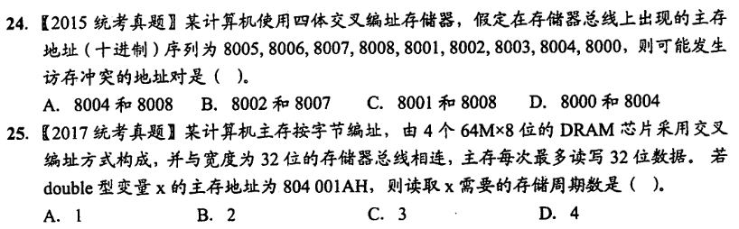
>
>1.   选D。注意只要相邻4个的模块有重复就**有可能**冲突，不要认为就是8005、8006、8007、8008|8001、8002、8003、8004这样读，也有可能是8006、8007、8008、8001|8002、8003、8004、8000这样读。
>2.   选C。由主存地址 803 001AH 可知最后两位为 10，即2号芯片。第一次读取 只能读出2、3号芯片的前2B，第二次读出0-4号芯片的中间4B，第三次读出0、1号芯片的后2B。共读三次。
****
### 3.3 主储存器与CPU的连接

#### 3.3.1 连接原理

略

#### 3.3.2 主存容量的扩展

1. 位扩展（将多片芯片当一片用）
2. 字扩展（多装几片芯片）
3. 字位同时扩展

#### 3.3.3 存储芯片的地址分配和片选

分为线选和译码片选两种方式。

#### 3.3.4 存储器与CPU的连接

略

#### 3.3 例题
****
>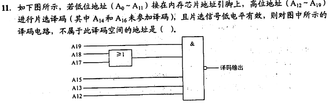
>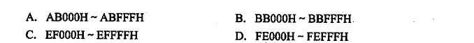
>
>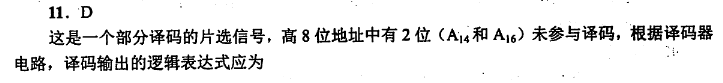
>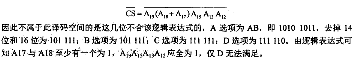
****
>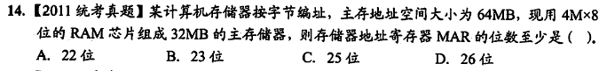
>
>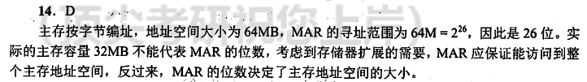
****
>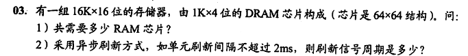
>
>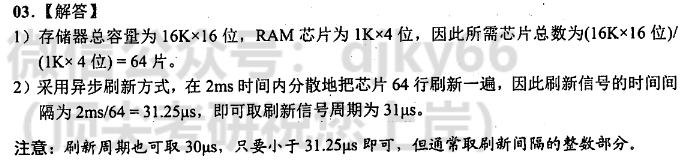
****

### 3.4 外部存储器

#### 3.4.1 磁盘存储器

磁盘存储器的优点：①存储容量大，位价格低；②记录介质可重复使用；③记录信息可长期保存而不丢失，甚至可脱机存档；④非破坏性读出，读出时不需要再生。缺点：存取速度慢，机械结构复杂，对工作环境要求较高。

磁盘设备组成：磁盘驱动器，磁盘控制器，盘片。

存储区域：硬盘分若干记录面，每个面分若干磁道，每个磁道分若干扇区。扇区（块）是磁盘存储器的最小存储单位。

性能指标：记录密度，磁盘容量，平均存取时间，数据传输率。

磁盘地址：主机向磁盘控制器发送寻址信息，磁盘的地址一般如下所示。

|驱动器号|磁道号|磁头号|扇区号|
|------|------|------|-----|

若系统中有4个驱动器，每个驱动器带一个磁盘，每个磁盘256个磁道、16个盘面，每个盘面划分为16个扇区，则每个扇区地址要18位二进制代码，其格式如下所示。

|驱动器号（2位）|磁道号（8位）|磁头号（4位）|扇区号（4位）|
|------|------|------|-----|

注意：平均存取时间=寻道时间+延迟时间+传输时间。平均延迟时间为**旋转半周的时间**。

磁盘阵列(RAID):RAID0没有冗余和校验，RAID1到RAID5加入了冗余（镜像）或校验（奇偶校验）

#### 3.4.2 固态硬盘（SSD）

详见王道课程。

### 3.5 高速缓冲存储器

#### 3.5.1 Cache 和主存的映射方式

映射方式：直接映射，全相联映射，组相联映射。根据不同的映射方式，**主存地址**被分成不同的字段：

直接映射的地址结构：

|标记|Cache行号|块内地址|
|----|--------|-------|

其中，标记 + Cache行号 = **主存块号**，Cache行号 + 块内地址 = **Cache地址**。

CPU访存时，根据访存地址中间的 Cache 行号，从 Cache 中读出该行的标记，与访存地址的高 t 位进行比较，若相等且有效位为 1，则表示命中，否则表示不命中。

全相联映射的地址结构：

|标记|块内地址|
|----|-------|

其中，标记 = **主存块号**，**Cache地址**的计算则需要先得知Cache块号，Cache块号 + 块内地址 = **Cache地址**。

组相联映射的地址结构：

|标记|组号|块内地址|
|----|----|-------|

访存过程与直接映射相仿，只是在 Cache 中先查找组号，再在该组中依次匹配标记。（由于依次匹配就不保存相应编号）

地址映射表：即 Cache 中的标记构成的表。例如一个 Cache 分为64个块，主存 128KB（17位） ，Cache 1KB（10位），说明标记为7位，则地址映射表有64行，每行7位标记+1位有效位共计8位。

Chche中存储的信息：标记+数据+1位有效位，由于写策略的不同，可能还有1位脏位（修改位）。

#### 3.5.2 Cache 中主存块的替换算法

替换算法：随机算法（RAND），先进先出算法（FIFO），最近最少使用算法（LRU），最不常用算法（LFU）。

#### 3.5.3 Cache 写策略

Cache写策略：全写法（写直通法），回写法（写回法）。

Cache写不命中：写分配法，非写分配法。

非写分配法通常与全写法合用，写分配法通常和回写法合用。

#### 3.5 例题
****
>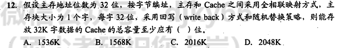
>
>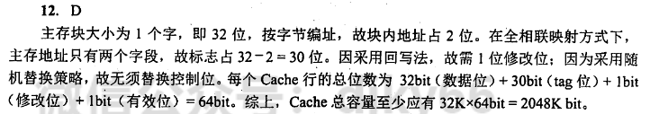
****
>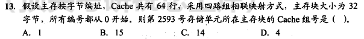
>
>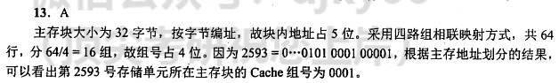
****
>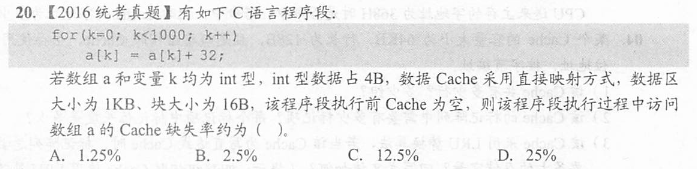
>
>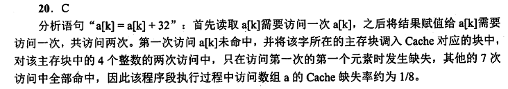
****
>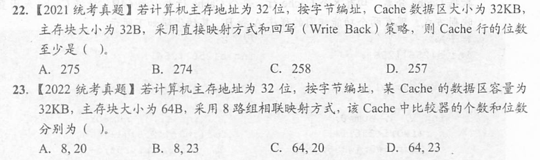
>
>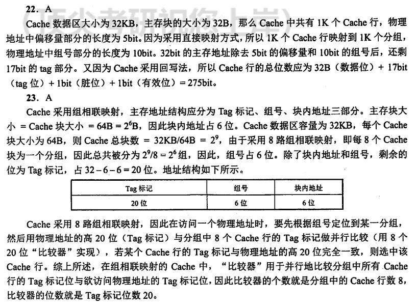
****
>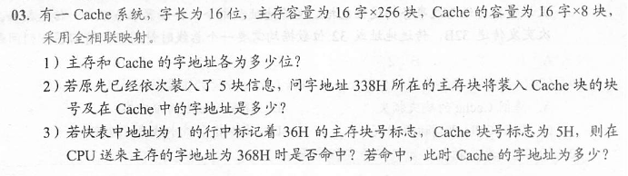
>
>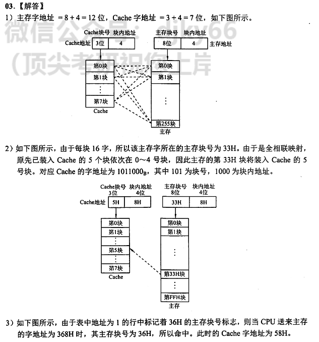
****
>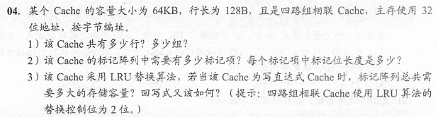
>
>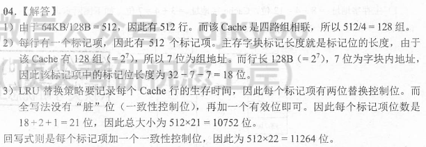
****
>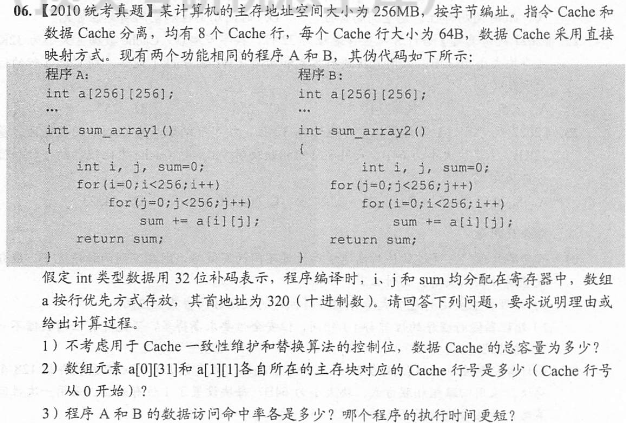
>
>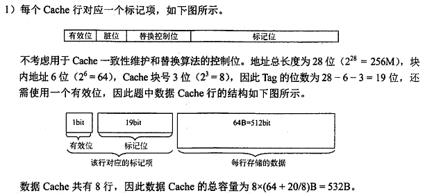
>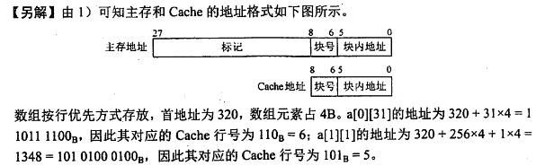
>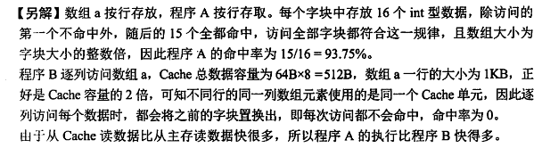
****
>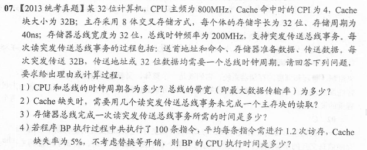
>****
>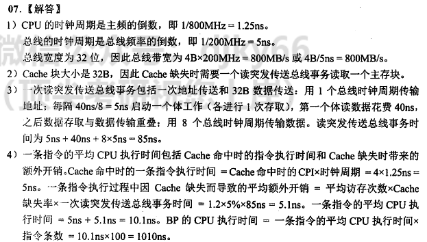
****

## 6. 总线

……没啥内容啊

## 7. 输入/输出系统

### 7.1 I/O系统基本概念(大纲已删除)
### 7.2 I/O接口

#### 7.2.1 I/O接口的功能

1. 进行地址译码和设备选择
2. 实现主机和外设的通信联络控制。
3. 实现数据缓冲。
4. 信号格式的转换。
5. 传送控制命令和状态信息。

#### 7.2.2 I/O接口的基本结构
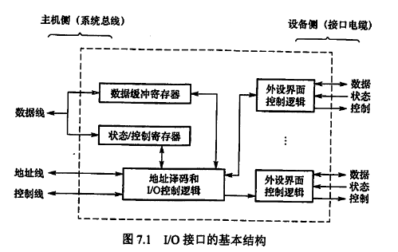

#### 7.2.3 I/O接口的类型

从不同的角度看，I/O接口可以分为不同的类型。

1. 按数据传送方式可分为并行接口（一字节或一个字的所有位同时传送）和串行接口(一位一位地传送)，接口要完成数据格式的转换。

    注意：这里所说的数据传送方式指的是外设和接口一侧的传送方式。
2. 按主机访问I/O设备的控制方式可分为程序查询接口、中断接口和DMA接口等。
3. 按功能选择的灵活性可分为可编程接口和不可编程接口。

#### 7.2.4 I/O端口及其编址

1. 统一编址，又称存储器映射方式
2. 独立编址，又称端口映射方式

#### 7.2 例题
****
>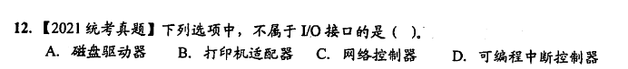
>
>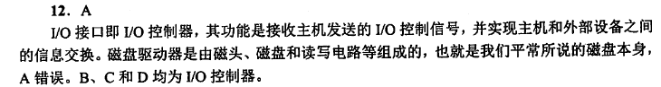
****

### 7.3 I/O方式

#### 7.3.1 程序查询方式
略
#### 7.3.2 程序中断方式
##### 1. 程序中断的基本概念
略
##### 2. 程序中断的工作流程

**（1）中断请求**

中断源是请求CPU中断的设备或事件，一台计算机允许有多个中断源。每个中断源向CPU发出中断请求的时间是随机的。
    
为记录中断事件并区分不同的中断源，中断系统需对每个中断源设置中断请求标记触发器，当其状态为“1”时，表示中断源有请求。这些触发器可组成中断请求标记寄存器，该寄存器可集中在CPU中，也可分散在各个中断源中。

通过INTR线发出的是可屏蔽中断，通过NMI线发出的是不可屏蔽中断。

不可屏蔽中断用于处理紧急和重要的事件，如时钟中断、电源掉电等，其优先级最高，

其次是内部异常，即使在关中断模式下也会被响应。

可屏蔽中断的优先级最低，在关中断模式下不会被响应。
    
**（2） 中断响应判优**

中断响应优先级是指CPU响应中断请求的先后顺序。由于许多中断源提出中断请求的时间都是随机的，因此当多个中断源同时提出请求时，需通过中断判优逻辑来确定响应哪个中断源的请求，中断响应的判优通常是通过硬件排队器实现的。

一般来说：

①不可屏蔽中断 > 内部异常 > 可屏蔽中断；

②内部异常中，硬件故障 > 软件中断：DMA中断请求优先于I/O设备传送的中断请求；

④在I/O传送类中断请求中，高速设备优先于低速设备，输入设备优先于输出设备，实时设备优先于普通设备。

注意：中断优先级包括响应优先级和处理优先级，响应优先级在硬件线路上是固定的，不便改动。处理优先级可利用中断屏蔽技术动态调整，以实现多重中断。

**（3）CPU响应中断的条件**

CPU在满足一定的条件下响应中断源发出的中断请求，并经过一些特定的操作，转去执行中断服务程序。CPU响应中断必须满足以下3个条件：

①中断源有中断请求。

②CPU允许中断及开中断（异常和不可屏蔽中断不受此限制）。

③**一条指令执行完毕**(异常不受此限制)，且没有更紧迫的任务。

注意：I/O设备的就绪时间是随机的，而CPU在统一的时刻即每条指令执行阶段结束前向接口发出中断查询信号，以获取I/O的中断请求，也就是说，**CPU响应中断的时间是在每条指令执行阶段的结束时刻**。这里说的中断仅指I/O中断，内部异常不属于此类情况。

**（4）中断响应过程**

CPU响应中断后，经过某些操作，转去执行中断服务程序。这些操作是由硬件直接实现的，称为中断隐指令。

中断隐指令并不是指令系统中的一条真正的指令，只是一种虚拟的说法，本质上是硬件的一系列自动操作。

它所完成的操作如下:

①关中断。

②保存断点。

    注意异常和中断的差异：异常指令通常并没有执行成功，异常处理后要重新执行，
    所以其断点是当前指令的地址。中断的断点则是下一条指令的地址。

③引出中断服务程序。识别中断源，将对应的服务程序入口地址送入程序计数器PC。有两
种方法识别中断源：硬件向量法和软件查询法。

**（5）中断向量**

中断识别分为向量中断和非向量中断两种。非向量中断即软件查询法。

**（6）中断处理过程**

不同计算机的中断处理过程各具特色，就其多数而
论，中断处理流程如图7.4所示。

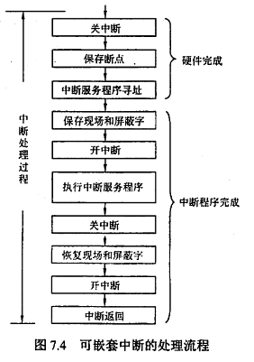

##### 3. 多重中断和中断屏蔽技术

注意中断屏蔽字设置这一知识点

#### 7.3.3 DMA方式
// 等大佬

#### 7.3 例题

****
>    回答下列问题：
>
>   1）一个完整的指令周期包括哪些CPU工作周期?
> 
>   2）中断周期前和中断周期后各是CPU的什么工作周期?
> 
>   3）DMA周期前和DMA周期后各是CPU的什么工作周期?

>    答：
> 
>   1）一个完整的指令周期包括取指周期、间址周期、执行周期和中断周期。
>      其中取指周期和执行周期是每条指令均有的。
>
>   2）中断周期前是执行周期，中断周期后是下一条指令的取指周期。
>
>   3）DMA周期前可以是取指周期、间址周期、执行周期或中断周期，
>      DMA周期后也可以是取指周期、间址周期、执行周期或中断周期。
>      总之，DMA周期前后都是机器周期。
****
>
>
>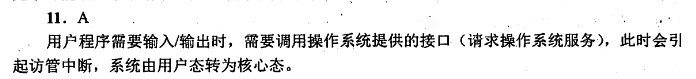
****
>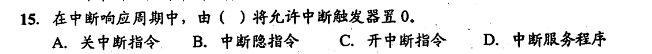
>
>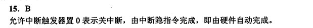
****
>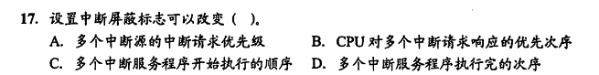
>
>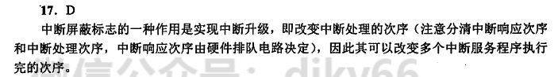
****
>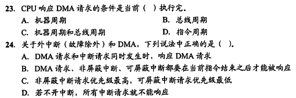
>
>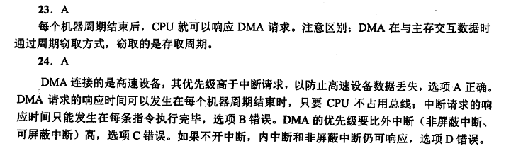
****
>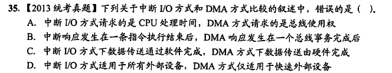
>
>本题答案为D，中断I/O方式不适用于高速外部设备
****
>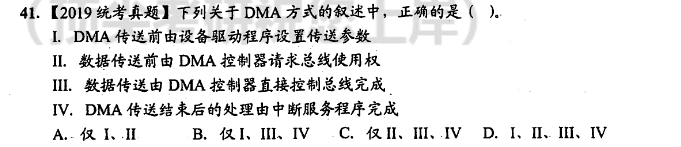
>
>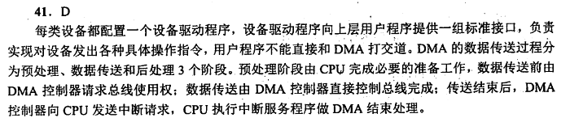
****
>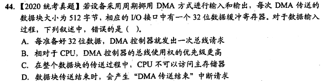
>
>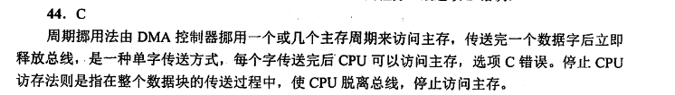
****
>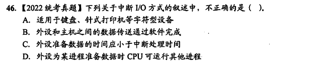
>
>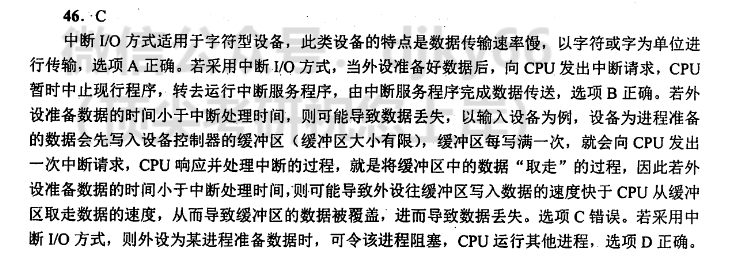
****
> 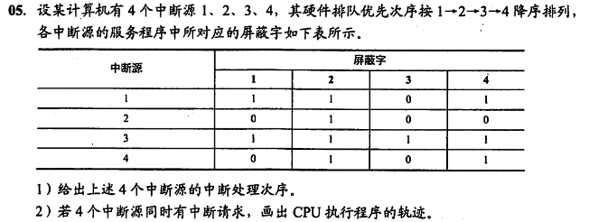
>
> 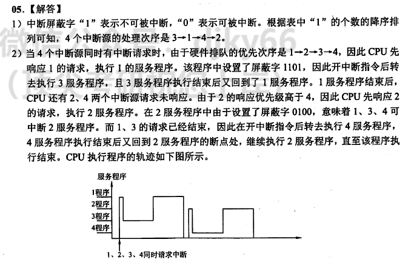
****
>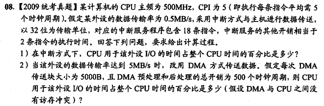
>
>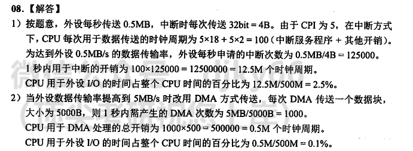
****
>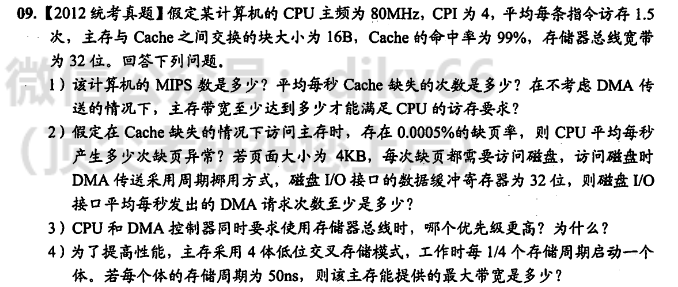
>
>
****
>
>
>
****
>
>
>

## 后记

虽然但是，同志仍需努力。