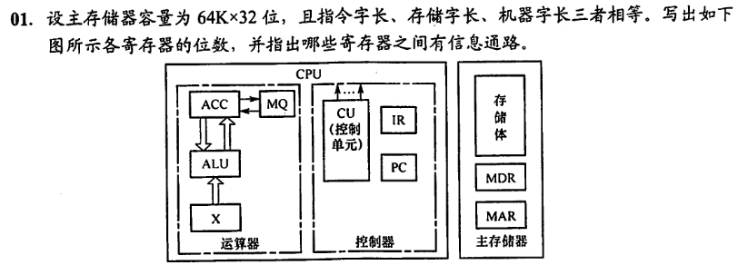
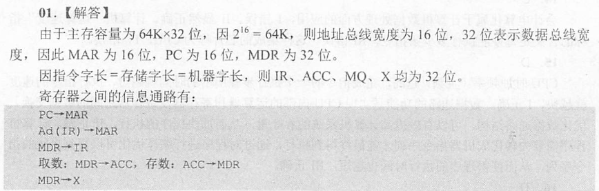

# 计算机组成原理笔记

## 1. 计算机系统概述

……这章有重点吗？

大概就这一张图罢

## 2. 数据的表示和运算

**……我超这章重点可太多了，建议考研书全背**

## 3. 存储系统

……总感觉玩两天装机模拟器，这章啥都会了

### 3.1 储存器概述

TODO……真的有东西要写吗？

注意：
Cache主存系统的效率 e = 访问Cache的时间 / 平均访存时间

### 3.2 主储存器

主储存器使用DRAM实现，Cache使用SRAM实现。DRAM价格低速度慢。

#### 3.2.1 SRAM和DRAM芯片

SRAM使用双稳态触发器实现，可实现非破坏性读出。SRAM的存取速度快，但集成度低，功耗较大，价格昂贵，一般用于高速缓冲存储器。

DRAM使用电容实现，需要定时刷新，存取速度慢，但集成度高，功耗小，价格低廉，一般用于主存储器。

DRAM电容上的电荷一般只能维持1～2ms，因此即使电源不断电，信息也会自动消失。为此，每隔一定时间必须刷新，通常取2ms，称为刷新周期。常用的刷新方式有3种：

1. 集中刷新：指在一个刷新周期内，利用一段固定的时间，依次对存储器的所有行进行逐一再生，在此期间停止对存储器的读写操作，称为“死时间”，又称访存“死区”。优点是读写操作时不受刷新工作的影响；缺点是在集中刷新期间（死区）不能访问存储器。
2. 分散刷新：把对每行的刷新分散到各个工作周期中。这样，一个存储器的系统工作周期分为两部分：前半部分用于正常读、写或保持；后半部分用于刷新。这种刷新方式增加了系统的存取周期，如存储芯片的存取周期为0.5μs，则系统的存取周期为1us。优点是没有死区；缺点是加长了系统的存取周期，降低了整机的速度。
3. 异步刷新：异步刷新是前两种方法的结合，它既可缩短“死时间”，又能充分利用最大刷新间隔为2ms的特点。具体做法是将刷新周期除以行数，得到两次刷新操作之间的时间间隔t，利用逻辑电路每隔时间t产生一次刷新请求。这样可以避免使CPU连续等待过长的时间，而且减少了刷新次数，从根本上提高了整机的工作效率。

## 6. 总线

按学校进度这个先讲……但没啥内容啊