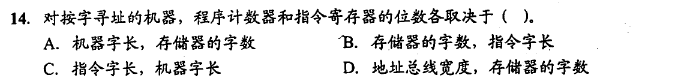
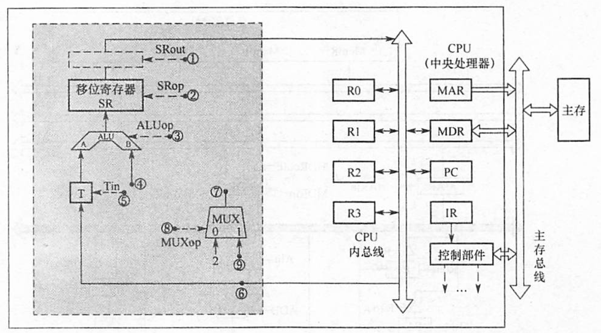

# 计算机组成原理笔记
[TOC]
## 1. 计算机系统概述

……这章有重点吗？

大概就这一张图罢


## 2. 数据的表示和运算

**……我超这章重点可太多了，建议考研书全背**

## 3. 存储系统

……总感觉玩两天装机模拟器，这章啥都会了

### 3.1 储存器概述

按作用，分为主存，辅存，Cache

按存取方式，分为随机储存器（RAM），只读存储器（ROM），串行访问存储区（分为顺序存取存储器（SAM，如磁带）和直接存取存储器（DAM，如磁盘，光盘））

注意：
Cache主存系统的效率 e = 访问Cache的时间 / 平均访存时间

### 3.2 主储存器

主储存器使用DRAM实现，Cache使用SRAM实现。DRAM价格低速度慢。

#### 3.2.1 SRAM和DRAM芯片

SRAM使用双稳态触发器实现，可实现非破坏性读出。SRAM的存取速度快，但集成度低，功耗较大，价格昂贵，一般用于高速缓冲存储器。

DRAM使用电容实现，需要定时刷新，存取速度慢，但集成度高，功耗小，价格低廉，一般用于主存储器。

DRAM电容上的电荷一般只能维持1～2ms，因此即使电源不断电，信息也会自动消失。为此，每隔一定时间必须刷新，通常取2ms，称为刷新周期。常用的刷新方式有3种：

1. 集中刷新：指在一个刷新周期内，利用一段固定的时间，依次对存储器的所有行进行逐一再生，在此期间停止对存储器的读写操作，称为“死时间”，又称访存“死区”。优点是读写操作时不受刷新工作的影响；缺点是在集中刷新期间（死区）不能访问存储器。
2. 分散刷新：把对每行的刷新分散到各个工作周期中。这样，一个存储器的系统工作周期分为两部分：前半部分用于正常读、写或保持；后半部分用于刷新。这种刷新方式增加了系统的存取周期，如存储芯片的存取周期为0.5μs，则系统的存取周期为1us。优点是没有死区；缺点是加长了系统的存取周期，降低了整机的速度。
3. 异步刷新：异步刷新是前两种方法的结合，它既可缩短“死时间”，又能充分利用最大刷新间隔为2ms的特点。具体做法是将刷新周期除以行数，得到两次刷新操作之间的时间间隔t，利用逻辑电路每隔时间t产生一次刷新请求。这样可以避免使CPU连续等待过长的时间，而且减少了刷新次数，从根本上提高了整机的工作效率。

#### 3.2.2 只读存储器

ROM结构简单，具有非易失性，根据制造工艺的不同，可分为：

1. MROM：掩模式ROM，制造芯片时直接将内容写入。
2. PROM：一次可编程ROM
3. EPROM：可擦除可编程ROM。编程次数有限，写入时间长
4. Flash：在EPROM与$E^2PROM$基础上发展来的闪存，一般做U盘之类的移动设备
5. SSD：固态硬盘，由控制单元和存储单元（Flash）组成。

#### 3.2.3 主储存器的组成

注意：

一般来讲，主储存器芯片的引脚数 = 地址引脚数 + 数据引脚数 + 片选线（一般为1） + 读写控制线（一般为2）

如果使用地址引脚复用技术，片选线1根换成行通选和列通选2根，地址引脚数减半。

#### 3.2.4 多模块储存器

注意：

低位交叉编址：设模块字长等于数据总线宽度，模块存取一个字的存取周期为T，总线传送周期为r，为实现流水线方式存取，存储器交叉模块数应大于等于

$$m = \frac{T}{r}$$

式中，m 称为交叉存取度。每经过 r 时间延迟后启动下一个模块，交叉存储器要求其模块数必须
大于等于 m，以保证启动某模块后经过$m \times r$的时间后再次启动该模块时，其上次的存取操作已经完成（即流水线不间断）。这样，连续存取m个字所需的时间为

$$t=T+(m-1)r$$


#### 3.2 例题
****
> 
> 

> [答案](例题答案.md/#3.2例题答案)
****
### 3.3 主储存器与CPU的连接

#### 3.3.1 连接原理

略

#### 3.3.2 主存容量的扩展

1. 位扩展（将多片芯片当一片用）
2. 字扩展（多装几片芯片）
3. 字位同时扩展

#### 3.3.3 存储芯片的地址分配和片选

分为线选和译码片选两种方式。

#### 3.3.4 存储器与CPU的连接

用一个题说明：

> 计算机组成原理（第三版）唐朔飞-课后习题 4.13 
>
> **4.15 设CPU共有16根地址线，8根数据线，并用 $\overline{MREQ}$ (低电平有效)作访存控制信号，$ R/ \overline W$ 作读/写命令信号(高电平为读,低电平为写)。现有这些存储芯片:ROM(2K×8位,4K×4位,8K×8位)，RAM(1K×4位，2K×8位，4K×8位)及74138译码器和其他门电路(门电路自定)。**
>
> **试从上述规格中选用合适的芯片,画出CPU和存储芯片的连接图。要求如下:**
>
> (1)最小4K地址为系统程序区.4096~16383地址范围为用户程序区。
>
> (2)指出选用的存储芯片类型及数量。
>
> (3)详细画出片选逻辑。

> 答：
>
> (1)地址空间分配：
>
> 系统程序区(ROM共4KB):0000H-0FFFH
>
> 用户程序区(RAM共12KB):1000H-3FFFH
>
> (2)选片:
> 
> ROM:选择4K×4位芯片2片,位并联
> 
> RAM:选择4K×8位芯片3片,字串联
> 
> (RAM1地址范围为:1000H-1FFFH,RAM2地址范围为2000H-2FFFH, RAM3地址范围为:3000H-3FFFH)
> 
> (3)各芯片二进制地址分配如下:
> 
>
> CPU和存储器连接逻辅图及片选逻辑如下图所示:(尤其注意本图的画法)
> 


当你看完这个题之后我要问一个灵魂问题：比如有4根不用的地址线拿来做片选线，最多支持16片芯片，那是RAM+ROM一共16片随意分配，还是要有一根地址线用来区分RAM和ROM，各自最多8片？

以下内容不保证专业性：

有理由认为，是否要加入门电路控制RAM与ROM的选择，关键在于所给芯片的规格。如唐书例题：


在该例题中，由于ROM所给规格为$2K × 8$位，需要11根地址线，而RAM为$1K × 4$位，只用到10根地址线，这就意味着：当读取RAM时，11位地址最多给到 011 1111 1111，一旦片选线选中RAM而地址又超过了 011 1111 1111（比如100 0000 1111），此时如果不使用门电路不启用RAM，就导致读出RAM00 0000 1111地址处的数据（实际上应该不读出数据）

因此，我给出这个问题的答案是：见机行事！

#### 3.3 例题
****
> 
> 
> 
> 

> [答案](例题答案.md/#3.3例题答案)
****

### 3.4 外部存储器

#### 3.4.1 磁盘存储器

磁盘存储器的优点：①存储容量大，位价格低；②记录介质可重复使用；③记录信息可长期保存而不丢失，甚至可脱机存档；④非破坏性读出，读出时不需要再生。缺点：存取速度慢，机械结构复杂，对工作环境要求较高。

磁盘设备组成：磁盘驱动器，磁盘控制器，盘片。

存储区域：硬盘分若干记录面，每个面分若干磁道，每个磁道分若干扇区。扇区（块）是磁盘存储器的最小存储单位。

性能指标：记录密度，磁盘容量，平均存取时间，数据传输率。

磁盘地址：主机向磁盘控制器发送寻址信息，磁盘的地址一般如下所示。

| 驱动器号 | 磁道号 | 磁头号 | 扇区号 |
| -------- | ------ | ------ | ------ |

若系统中有4个驱动器，每个驱动器带一个磁盘，每个磁盘256个磁道、16个盘面，每个盘面划分为16个扇区，则每个扇区地址要18位二进制代码，其格式如下所示。

| 驱动器号（2位） | 磁道号（8位） | 磁头号（4位） | 扇区号（4位） |
| --------------- | ------------- | ------------- | ------------- |

注意：平均存取时间=寻道时间+延迟时间+传输时间。平均延迟时间为**旋转半周的时间**。

磁盘阵列(RAID):RAID0没有冗余和校验，RAID1到RAID5加入了冗余（镜像）或校验（奇偶校验）

#### 3.4.2 固态硬盘（SSD）

详见王道课程。

### 3.5 高速缓冲存储器

#### 3.5.1 Cache 和主存的映射方式

***
注：王道计组强化课第一节将深刻的帮你理解本小节内容。

考虑军训点兵，总计有若干个班，每个班都有若干个人。Cache是操场，内存是宿舍。一个班在宿舍叫1班，到操场就叫A班。但不管叫1班还是A班，班里的学生序号不变，1号还是1号。因此块内地址对于Cache和内存而言是相同的。（什么？你说Cache和内存里面放的不是完全一样的东西吗？地址不也完全一样吗？说的没错，本段只是把操作系统里虚拟内存地址映射实际内存地址的操作类比过来罢了，不要弄混）

映射就是军训点名。

全相联映射是直接喊b班c号，教官一嗓子吼出去全操场同时听见，b班的同学就知道要把c同学推出去。计算机中则通过硬件电路，使得地址中的标记b直接与Cache中所有标记同时比较，最终只有标记完全相同且有效的一个Cache被导通，并用块内地址c从中取出需要的数据。

| 标记 | 块内地址 |
| ---- | -------- |
| b | c |

到直接映射这里人变多了，现在操场上有连级编制了。教官先喊一句各连b班出列，再喊一句a连的所有人向前一步。计算机中的Cache行数量相当于一个连有多少个班，行号就是各班序号，在映射时先根据行号b确定Cache行，再根据剩下的标记a确定是否命中,最后用块内地址c从Cache中取出数据。

| 标记 | Cache行号 | 块内地址 |
| ---- | --------- | -------- |
| a | b | c |

组相联映射是因为教官太懒，操场上一共16个连队，喊一次各连b班出列来了16个班，还得一个一个问谁是a连的。于是教官又新建一个战斗群编制，一个战斗群里两个连，以后教官只要想想a连是哪个战斗群的（比如x战斗群），就只用喊x战斗群出列，再问x战斗群的两个连队谁是a连b班的即可。此所谓二路组相连映射。

| 标记 | 组号 | 块内地址 |
| ---- | ---- | -------- |
| a+b | x | c |

值得注意的是，没有战斗群级编制之前，16个连队要四位二进制编号，有了一个战斗群两个连的编制之后，变成了8个战斗群要3位编号，每个战斗群的连队要1位编号。于是从直接映射到组相联映射，原本的b(4)变成了x(3)+b(1)。

好，现在你会军训了。
***


映射方式：直接映射，全相联映射，组相联映射。根据不同的映射方式，**主存地址**被分成不同的字段：

直接映射的地址结构：

| 标记 | Cache行号 | 块内地址 |
| ---- | --------- | -------- |

其中，标记 + Cache行号 = **主存块号**，Cache行号 + 块内地址 = **Cache地址**。

<table>
    <tr>
        <th colspan="3">主存地址</th>
    </tr>
    <tr>
        <th colspan="2">主存块号</th>
        <th>块内地址</th>
    </tr>
    <tr>
        <th>标记</th>
        <th colspan="2">Cache地址</th>
    </tr>
    <tr>
        <td>标记</td>
        <td>Cache行号</td>
        <td>块内地址</td>
    </tr>
</table>

CPU访存时，根据访存地址中间的 Cache 行号，从 Cache 中读出该行的标记，与访存地址的高 t 位进行比较，若相等且有效位为 1，则表示命中，否则表示不命中。

全相联映射的地址结构：

| 标记 | 块内地址 |
| ---- | -------- |

其中，标记 = **主存块号**，**Cache地址**的计算则需要先得知Cache行号，Cache行号 + 块内地址 = **Cache地址**。

<table>
    <tr>
        <th colspan="2">主存地址</th>
    </tr>
    <tr>
        <th>主存块号</th>
        <th>块内地址</th>
    </tr>
    <tr>
        <th>标记</th>
        <th>块内地址</th>
    </tr>
</table>

组相联映射的地址结构：

| 标记 | 组号 | 块内地址 |
| ---- | ---- | -------- |

(相当于行号换组号)

访存过程与直接映射相仿，只是在 Cache 中先查找组号，再在该组中依次匹配标记。（由于依次匹配就不保存相应编号）

地址映射表：即 Cache 中的标记构成的表。例如一个 Cache 分为64个块，主存 128KB（17位） ，Cache 1KB（10位），说明标记为7位，则地址映射表有64行，每行7位标记+1位有效位共计8位。

Chche中存储的信息：标记+数据+1位有效位，由于写策略的不同，可能还有1位脏位（修改位）。

#### 3.5.2 Cache 中主存块的替换算法

替换算法：随机算法（RAND），先进先出算法（FIFO），最近最少使用算法（LRU），最不常用算法（LFU）。

#### 3.5.3 Cache 写策略

Cache写策略：全写法（写直通法），回写法（写回法）。

Cache写不命中：写分配法，非写分配法。

非写分配法通常与全写法合用，写分配法通常和回写法合用。

#### 3.5 例题
****
> 
> 
> 
> 
> 
> 
> 
> 

> [答案](例题答案.md/#3.5例题答案)
****

## 4. 指令系统

### 4.1 指令系统

指令（机器指令）是指示计算机执行某种操作的命令。一台计算机的所有指令的集合构成该机的指令系统，也称指令集。

指令系统是指令集体系结构(ISA)中最核心的部分，ISA完整定义了软件和硬件之间的接口，是机器语言或汇编语言程序员所应熟悉的。

ISA规定的内容主要包括：指令格式，数据类型及格式，操作数的存放方式，程序可访问的寄存器个数、位数和编号，
存储空间的大小和编址方式，寻址方式，指令执行过程的控制方式等。

有两个可能的记忆点：


另还有一考点：扩展操作码指令格式，请自行上课。

### 4.1例题
****
> 【**2022 统考真题**】设计某指令系统时，假设采用16位定长指令字格式，操作码使用扩展编码方式，地址码为6位，包含零地址、一地址和二地址3种格式的指令。若二地址指令有12条，一地址指令有254条，则零地址指令的条数最多为（ ）。
> 
> A. 0  
> B. 2  
> C. 64  
> D. 128  

> 

> [答案](例题答案.md/#4.1例题答案)
****

### 4.2 指令的寻址方式

#### 4.2.1 指令寻址和数据寻址
略
#### 4.2.2 常见的数据寻址方式

<p>
<b>1. 隐含寻址</b>

这种类型的指令不明显地给出操作数的地址，而在指令中隐含操作数的地址。例如，单地址的指令格式就不明显地在地址字段中指出第二操作数的地址，而规定累加器（ACC）作为第二操作数地址，指令格式明显指出的仅是第一操作数的地址。因此，累加器（ACC）对单地址指令格式来说是隐含寻址。

隐含寻址的优点是有利于缩短指令字长；缺点是需增加存储操作数或隐含地址的硬件。
</p>

<p>
<b>2. 立即寻址</b>

直接给出立即数。
</P>

<p>
<b>3. 直接寻址</b>

直接给出操作数的地址。 EA = A
</p>

<p>
<b>4. 间接寻址</b>

给出操作数有效地址所在的存储单元的地址，即操作数地址的地址。 EA = （A）。可以一次间接寻址，也可以多次间接寻址。
</p>

<p>
<b>5. 寄存器寻址</b>

操作数在寄存器中，指令中给出寄存器的编号。 EA = R
</p>

<p>
<b>6. 寄存器间接寻址</b>

寄存器中存放操作数的有效地址，指令中给出寄存器的编号。 EA = （R）
</p>

<p>
<b>7. 相对寻址</b>

相对寻址是把PC的内容加上指令格式中的形式地址A而形成操作数的有效地址，即EA=（PC）+A，其中A是相对于当前PC值的位移量，可正可负，补码表示。

相对寻址的优点是操作数的地址不是固定的，它随PC值的变化而变化，且与指令地址之间总是相差一个固定值，因此便于程序浮动。相对寻址广泛应用于转移指令。
</p>

<p>
<b>8. 基址寻址</b>

基址寻址是指将CPU中基址寄存器（BR）的内容加上指令格式中的形式地址A而形成操作数的有效地址，即EA=（BR）+A。其中基址寄存器既可采用专用寄存器，又可采用通用寄存器。

基址寄存器是<b>面向操作系统</b>的，其内容由操作系统或管理程序确定，主要用于解决程序逻辑空间与存储器物理空间的无关性。

在程序执行过程中，基址寄存器的内容不变(作为基地址)，形式地址可变（作为偏移量）。采用通用寄存器作为基址寄存器时，可由用户决定哪个寄存器作为基址寄存器，但其内容仍由操作系统确定。
</p>

<p>
<b>9. 变址寻址</b>

变址寻址是指有效地址EA等于指令字中的形式地址A与变址寄存器IX的内容之和，即EA=（IX）+A，其中IX为变址寄存器（专用），也可用通用寄存器作为变址寄存器。

变址寄存器是面向用户的，在程序执行过程中，变址寄存器的内容可由用户改变(作为偏移量)，形式地址A不变（作
为基地址）。

变址寻址的优点是可扩大寻址范围（变址寄存器的位数大于形式地址A的位数〉；在数组处理过程中，可设定A为数
组的首地址，不断改变变址寄存器IX的内容，便可很容易形成数组中任意一个数据的地址，特别适合编制循环程序。偏移量（变址寄存器IX）的位数足以表示整个存储空间。

显然，变址寻址与基址寻址的有效地址形成过程极为相似。但从本质上讲，两者有较大区别。

基址寻址面向系统，主要用于为多道程序或数据分配存储空间，因此基址寄存器的内容通常由操作系统或管理程序确定，在程序的执行过程中其值不可变，而指令字中的A是可变的；变址寻址立足于用户，主要用于处理数组问题，在变址寻址中，变址寄存器的内容由用户设定，在程序执行过程中其值可变，而指令字中的A是不可变的。
</p>

<p>
<b>10. 堆栈寻址</b>

略
</p>

### 4.2 例题
****
> 
> 
> 
> 
> 
> 
> 
> 
> 
> 
> 
> 这里有一个超级大题放在5.3（2015年真题）

> [4.2例题答案](例题答案.md/#4.2例题答案)

### 4.3 程序的机器级代码表示

请回头去学汇编语言

### 4.3 例题

> 来几个超级大题体验一下
> 
> 【2017年真题】
> 
> 43.
> 
> （13分）
> 
> 已知$f(n) = \sum_{i=0}^{n}2^i = 2^{n+1} - 1 = 11……1B(共n+1位)$，计算f(n)的C语言函数f1如下：
>
> ```
> int f1(unsigned n) { 
>    int sum=1, power=1;
>    for (unsigned i=0; i<=n-1; i++) { 
>        power*=2;
>        sum+=power;
>    }
>    return sum;
> }
> ```
> 将f1中的int都改为float，可得到计算f(n)的另一个函数f2。假设unsigned和int型数据都占32位，float采用IEEE754单精度标准。请回答下列问题。
> 
> (1) 当n=0时，f1会出现死循环，为什么？若将f1中的变量i和n都定义为int型，则f1是否还会出现死循环？为什么？
> 
> (2) f1(23)和f2(23)的返回值是否相等？机器数各是什么（用十六进制表示）？
> 
> (3) f1(24)和f2(24)的返回值分别为33554431和33554432.0，为什么不相等？
> 
> (4) $f(31) = 2^32 - 1$，而f1(31)的返回值却为-1，为什么？若使f1(n)的返回值与f(n)相等，则最大的n是多少？
> 
> (5) f2(127)的机器数为7F80 0000H，对应的值是什么？若使f2(n)的结果不溢出，则最大的n是多少？若使f2(n)的结果精确（无舍入），则最大的n是多少？

> 44.
> 
> （10分）
>
> 在按字节编址的计算机M上，题43中f1的部分源程序（阴影部分）与对应的机器级代码（包括指令的虚拟地址）如下图所示。
>

        int f1(unsigned n)
    1   00401020 55         push ebp
        ...      ...        ...
            for (unsigned i = 0; i <= n-1; i++)
        ...      ...        ...
    20  0040105E 39 4D F4   cmp dword ptr [ebp-0Ch],ecx
        ...      ...        ...
            |  power *= 2;
        ...      ...        ...
    23  00401066 D1 E2      shl edx,1
        ...      ...        ...
            return sum;
        ...      ...        ...
    35  0040107F C3         ret

> 其中，机器级代码行包括行号、虚拟地址、机器指令和汇编指令。
> 
> 请回答下列问题。
> 
> (1) 计算机M是RISC还是CISC？为什么？
> 
> (2) f1的机器指令代码共占多少字节？要求给出计算过程。
> 
> (3) 第20条指令cmp通过i减n-1实现对i和n-1的比较。执行f1(0)过程中，当i=0时，cmp指令执行后，进/借位标志CF的内容是什么？要求给出计算过程。
> 
> (4) 第23条指令shl通过左移操作实现了$power*2$运算，在f2中能否也用shl指令实现$power*2$？为什么？

> [4.3例题答案](例题答案.md/#4.3例题答案)

### 4.4 CISC和RISC的基本概念

指令系统朝两个截然不同的方向的发展：

一是增强原有指令的功能，设置更为复杂的新指令实现软件功能的硬化，这类机器称为复杂指令系统计算机（CISC），典型的有采用x86架构的计算机：

二是减少指令种类和简化指令功能，提高指令的执行速度，这类机器称为精简指令系统计算机（RISC），典型的有ARM、MIPS架构的计算机。

其他内容一眼丁真即可。

## 5. 中央处理器

### 5.1 CPU的功能和基本结构

#### 5.1.1 CPU的功能

1）指令控制。完成取指令、分析指令和执行指令的操作，即程序的顺序控制。

2）操作控制。一条指令的功能往往由若干操作信号的组合来实现。CPU管理并产生由内存取出的每条指令的操作信号，把各种操作信号送往相应的部件，从而控制这些部件按指令的要求进行动作。

3）时间控制。对各种操作加以时间上的控制。时间控制要为每条指令按时间顺序提供应有的控制信号。

4）数据加工。对数据进行算术和逻辑运算。

5）中断处理。对计算机运行过程中出现的异常情况和特殊请求进行处理。

#### 5.1.2 CPU的基本结构

中央处理器主要由运算器和控制器两大部分组成。

1. **运算器**

运算器接收从控制器送来的命令并执行相应的动作，对数据进行加工和处理。运算器是计算机对数据进行加工处理的中心，它主要由
**算术逻辑单元(ALU)、暂存寄存器、累加寄存器(ACC)、通用寄存器组、程序状态字寄存器(PSW)、移位器、计数器(CT)** 等组成。

1）**算术逻辑单元**。主要功能是进行算术/逻辑运算。

2）**暂存寄存器**。用于暂存从主存读来的数据，该数据不能存放在通用寄存器中，否则会破坏其原有内容。暂存寄存器对应用程序员是透明的。

3）**累加寄存器**。它是一个通用寄存器，用于暂时存放ALU运算的结果信息，可以作为加法运算的一个输入端。

4）**通用寄存器组**。如AX、BX、CX、DX、SP等，用于存放操作数（包括源操作数、目的操作数及中间结果）和各种地址信息等。SP是堆栈指针，用于指示栈顶的地址。

5）**程序状态字寄存器**。保留由算术逻辑运算指令或测试指令的结果而建立的各种状态信息，如溢出标志（OF）、符号标志（SF）、零标志（ZF）、进位标志（CF）等。PSW中的这些位参与并决定微操作的形成。

6）**移位器**。对操作数或运算结果进行移位运算。

7）**计数器**。控制乘除运算的操作步数。

2. **控制器**

控制器有硬布线控制器和微程序控制器两种类型(见5.4节)。

控制器由 **程序计数器（PC）、指令寄存器（IR）、指令译码器、存储器地址寄存器（MAR）、存储器数据寄存器（MDR）、时序系统和微操作信号发生器** 等组成。

1）**程序计数器**。用于指出欲执行指令在主存中的存放地址。CPU根据PC的内容去主存中取指令。因程序中指令（通常）是顺序执行的，所以PC有自增功能。

2）**指令寄存器**。用于保存当前正在执行的那条指令。

3）**指令译码器**。仅对操作码字段进行译码，向控制器提供特定的操作信号。

4）**存储器地址寄存器**。用于存放要访问的主存单元的地址。

5）**存储器数据寄存器**。用于存放向主存写入的信息或从主存读出的信息。

6）**时序系统**。用于产生各种时序信号，它们都由统一时钟（CLOCK）分频得到。

7）**微操作信号发生器**。根据IR的内容（指令）、PSW的内容（状态信息）及时序信号，产生控制整个计算机系统所需的各种控制信号，其结构有组合逻辑型和存储逻辑型两种。

控制器的工作原理是，根据指令操作码、指令的执行步骤（微命令序列）和条件信号来形成当前计算机各部件要用到的控制信号。计算机整机各硬件系统在这些控制信号的控制下协同运行，产生预期的执行结果。

### 5.1 例题

> 

> [5.1例题答案](例题答案.md/#5.1例题答案)

### 5.2 指令执行过程

#### 5.2.1 指令周期

CPU从**主存中取出并执行一条指令**的时间称为指令周期，不同指令的指令周期可能不同。

指令周期常用若干机器周期来表示，一个机器周期又包含若干时钟周期（也称节拍或T周期，它是CPU操作的最基本单位）。

每个指令周期内的机器周期数可以不等，每个机器周期内的节拍数也可以不等。

对于无条件转移指令JMPX，在执行时不需要访问主存，只包含取指阶段（包括取指和分析）和执行阶段，所以其指令周期仅包含取指周期和执行周期。

对于间接寻址的指令，为了取操作数，需要先访问一次主存，取出有效地址，然后访问主存，取出操作数，所以还需包括间址周期。间址周期介于取指周期和执行周期之间。

当CPU采用中断方式实现主机和L/O设备的信息交换时，CPU在每条指令执行结束前，都要发中断查询信号，若有中断请求，则CPU进入中断响应阶段，又称中断周期。这样，一个完整的指令周期应包括取指、间址、执行和中断4个周期，如图5.3所示。


上述4个工作周期都有CPU访存操作，只是访存的目的不同。取指周期是为了取指令，间址周期是为了取有效地址，执行周期是为了取操作数，中断周期是为了保存程序断点。

为了区别不同的工作周期，在CPU内设置4个标志触发器FE、IND、EX和INT，它们分别对应取指、间址、执行和中断周期，并以“1”状态表示有效，分别由1→FE、1→IND、1→EX和1→INT这4个信号控制。

_注意：中断周期中的进栈操作是将SP减1，这和传统意义上的进栈操作相反，原因是计算机的堆栈中都是向低地址增加，所以进栈操作是减1而不是加1._

#### 5.2.2 指令周期的数据流

1. **取指周期**


2. **间址周期**


3. **执行周期**

执行周期的任务是取操作数，并根据IR中的指令字的操作码通过ALU操作产生执行结果。不同指令的执行周期操作不同，因此没有统一的数据流向。

4. **中断周期**


#### 5.2.3 指令执行方案

1. 单指令周期

2. 多指令周期

3. 流水线

### 5.2 例题

> 
>
> 

> [5.2例题答案](例题答案.md/#5.2例题答案)

### 5.3 数据通路的功能和基本结构

数据通路的基本结构主要有以下几种：

1）CPU内部单总线方式。将所有寄存器的输入端和输出端都连接到一条公共通路上，这种结构比较简单，但数据传输存在较多的冲突现象，性能较低。连接各部件的总线只有一条时，称为单总线结构；CPU中有两条或更多的总线时，构成双总线结构或多总线结构。

2）CPU内部多总线方式。将所有寄存器的输入端和输出端都连接到多条公共通路上，相比之下单总线中一个时钟内只允许传一个数据，因而指令执行效率很低，因此采用多总线方式，同时在多个总线上传送不同的数据，提高效率。

3）专用数据通路方式。根据指令执行过程中的数据和地址的流动方向安排连接线路，避免使用共享的总线，性能较高，但硬件量大。

### 5.3 例题

> 
>
> 
>
> 
>
> 
>
> 
> 
> 
> 

> [5.3例题答案](例题答案.md/#5.3例题答案)

行了先到这里吧，以后再往这里补充。

### 5.4 控制器的功能和工作原理

#### 5.4.1 控制器的结构和功能

控制器是计算机系统的指挥中心，控制器的主要功能有：

1）从主存中取出一条指令，并指出下一条指令在主存中的位置。

2）对指令进行译码或测试，产生相应的操作控制信号，以便启动规定的动作。

3）指挥并控制CPU、主存、输入和输出设备之间的数据流动方向。

根据控制器产生微操作控制信号的方式的不同，控制器可分为硬布线控制器和微程序控制器，两类控制器中的PC和IR是相同的，但确定和表示指令执行步骤的办法以及给出控制各部件运行所需要的控制信号的方案是不同的。

#### 5.4.2 硬布线控制器

硬布线控制器的基本原理是根据指令的要求、当前的时序及外部和内部的状态，按时间的顺序发送一系列微操作控制信号。它由复杂的组合逻辑门电路和一些触发器构成，因此又称组合逻辑控制器。


#### 5.4.3 微程序控制器

1. 微程序控制的基本概念

微程序设计思想就是将每条机器指令编写成一个微程序，每个微程序包含若干微指令，每条微指令对应一个或几个微操作命令。这些微程序可以存到一个控制存储器中，用寻址用户程序机器指令的办法来寻址每个微程序中的微指令。目前，大多数计算机都采用微程序设计技术。

微程序设计技术涉及的基本术语如下：

1）微命令与微操作。一条机器指令可以分解成一个微操作序列，这些微操作是计算机中最基本的、不可再分解的操作。在微程序控制的计算机中，将控制部件向执行部件发出的各种控制命令称为微命令，它是构成控制序列的最小单位。例如，打开或关闭某个控制门的电位信号、某个寄存器的打入脉冲等。微命令和微操作是一一对应的。微命令是微操作的控制信号，微操作是微命令的执行过程。

微命令有相容性和互斥性之分。相容性微命令是指那些可以同时产生、共同完成某一些微操作的微命令；而互斥性微命令是指在机器中不允许同时出现的微命令。相容和互斥都是相对的，一个微命令可以和一些微命令相容，和另一些微命令互斥。

注意：在组合逻辑控制器中也存在微命令与微操作这两个概念，它们并非只是微程序控制器的专有概念。

2）微指令与微周期。微指令是若干微命令的集合。存放微指令的控制存储器的单元地址称为微地址。一条微指令通常至少包含两大部分信息：

①操作控制字段，又称微操作码字段，用于产生某一步操作所需的各种操作控制信号。

②顺序控制字段，又称微地址码字段，用于控制产生下一条要执行的微指令地址。

微周期是指执行一条微指令所需的时间，通常为一个时钟周期。

3）主存储器与控制存储器。主存储器用于存放程序和数据，在CPU外部，用RAM实现：控制存储器（CM）用于存放微程序，在CPU内部，用ROM实现。

4）程序与微程序。程序是指令的有序集合，用于完成特定的功能；微程序是微指令的有序集合，一条指令的功能由一段微程序来实现。


### 5.4 例题

> 
>
> 

> [5.4例题答案](例题答案.md/#5.4例题答案)

### 5.5 异常和中断机制

……我真的不想再写一遍了，看操作系统笔记罢。

### 5.5 例题

> 

> [5.5例题答案](例题答案.md/#5.5例题答案)

### 5.6 指令流水线

#### 5.6.1 指令流水线的基本概念

可从两方面提高处理机的并行性：

①**时间**上的并行技术，将一个任务分解为几个不同的子阶段，每个阶段在不同的功能部件上并行执行，以便在同一时刻能够同时执行多个任务，进而提升系统性能，这种方法被称为**流水线技术**。

②**空间**上的并行技术，在一个处理机内设置多个执行相同任务的功能部件，并让这些功能部件并行工作，这样的处理机被称为**超标量处理机**。

为了利于实现指令流水线，指令集应具有如下特征：

1）指令长度应尽量一致，有利于简化取指令和指令译码操作。否则，取指令所花时间长短不一，使取指部件极其复杂，且也不利于指令译码。

2）指令格式应尽量规整，尽量保证源寄存器的位置相同，有利于在指令未知时就可取寄存器操作数，否则须译码后才能确定指令中各寄存器编号的位置。

3）采用Load/Store指令，其他指令都不能访问存储器，这样可把Load/Store指令的地址计算和运算指令的执行步骤规整在同一个周期中，有利于减少操作步骤。

4）数据和指令在存储器中“对齐”存放。这样，有利于减少访存次数，使所需数据在一个流水段内就能从存储器中得到。

#### 5.6.2 流水线的基本实现

别看了，有看这节的时间不如去把实验看看

#### 5.6.3 流水线的冒险与处理

在指令流水线中，可能会遇到一些情况使得流水线无法正确执行后续指令而引起流水线阻塞或停顿，这种现象称为流水线冒险。根据导致冒险的原因不同主要有3种：结构冒险(资源冲突)、数据冒险（数据冲突）和控制冒险（控制冲突）。

1. 结构冒险

由于多条指令在同一时刻争用同一资源而形成的冲突，也称为资源冲突，即由硬件资源竞争
造成的冲突，有以下两种解决办法：

1）前一指令访存时，使后一条相关指令（以及其后续指令）暂停一个时钟周期。

2）单独设置数据存储器和指令存储器，使取数和取指令操作各自在不同的存储器中进行。

事实上,现代计算机都引入了Cache机制，而L1 Cache 通常采用数据Cache和指令Cache分离的方式，因而也就避免了资源冲突的发生。

2. 数据冒险

在一个程序中，下一条指令会用到当前指令计算出的结果，此时这两条指令发生数据冲突。解决的办法有以下几种：

1）把遇到数据相关的指令及其后续指令都暂停一至几个时钟周期，直到数据相关问题消失后再继续执行，可分为**硬件阻塞**（stall）和**软件插入“NOP”指令**两种方法。

2）设置相关专用通路，即不等前一条指令把计算结果写回寄存器组，下一条指令也不再读寄存器组，而直接把前一条指令的ALU的计算结果作为自己的输入数据开始计算过程，使本来需要暂停的操作变得可以继续执行，这称为**数据旁路技术**。

3）通过编译器对数据相关的指令编译优化的方法，调整指令顺序来解决数据相关。

3. 控制冒险

指令通常是顺序执行的，但是在遇到改变指令执行顺序的情况，例如执行转移、调用或返回等指令时，会改变PC值，会造成断流，从而引起控制冒险。解决的办法有以下几种：

1）对转移指令进行分支预测，尽早生成转移目标地址。分支预测分为简单（静态）预测和动态预测。静态预测总是预测条件不满足，即继续执行分支指令的后续指令。动态预测根据程序执行的历史情况，进行动态预测调整，有较高的预测准确率。

2）预取转移成功和不成功两个控制流方向上的目标指令。

3）加决和提前形成条件码。

4）提高转移方向的猜准率。

#### 5.6.4 流水线的性能指标

1. 流水线的吞吐率

流水线的吞吐率是指单位时间内流水线所完成的任务数，或输出结果的数量。

流水线吞吐率（TP）的计算公式为：

$$TP = \frac{N}{T_k}$$

式中，n是任务数，T是处理完n个任务所用的总时间。设k为流水段的段数，At为时钟周期。在输入流水线中的任务连续的理想情况下，一条k段流水线能在k+n-1个时钟周期内完成n个
任务。得出流水线的吞吐率为

$$TP = \frac{n}{(k+n-1)\Delta t}$$

连续输入的任务数n → ∞时，流水线的吞吐率趋于$TP_{max} = \frac{1}{\Delta t}$，即流水线的最大吞吐率与时钟周期成反比。

2. 流水线的加速比


#### 5.6.5 高级流水线技术

有两种增加指令级并行的策略：

一种是**多发射技术**，它通过采用多个内部功能部件，使流水线功能段能同时处理多条指令，处理机一次可以发射多条指令进入流水线执行；

另一种是**超流水线技术**，它通过增加流水线级数来使更多的指令同时在流水线中重叠执行。

1. 超标量流水线技术

超标量流水线技术也称**动态多发射技术**，每个时钟周期内可并发多条独立指令，以并行操作方式将两条或多条指令编译并执行，为此需配置多个功能部件，如图5.20所示。在简单的超标量CPU中，指令是按顺序发射执行的。为了更好地提高并行性能，多数超标量CPU都结合动态流水线调度技术，通过动态分支预测等手段，指令不按顺序执行，这种执行方式称为乱序执行。


2. 超长指今字技术

超长指令字技术也称**静态多发射技术**，由编译程序挖掘出指令间潜在的并行性，将多条能并行操作的指令组合成一条具有多个操作码字段的超长指令字(可达几百位)，为此需要采用多个处理部件。

3. 超流水线技术

流水线功能段划分得越多，时钟周期就越短，指令吞吐率也就越高，因此超流水线技术是通过提高流水线主频的方式来提升流水线性能的。但是，流水线级数越多，用于流水寄存器的开销就越大，因而流水线级数是有限制的，并不是越多越好。

超流水线CPU在流水线充满后，每个时钟周期还是执行一条指令，CPI=1，但其主频更高；多发射流水线CPU每个时钟周期可以处理多条指令，CPI<1，相对而言，多发射流水线成本更高，控制更复杂。


## 6. 总线

……没啥内容啊

## 7. 输入/输出系统

### 7.1 I/O系统基本概念(大纲已删除)
### 7.2 I/O接口

#### 7.2.1 I/O接口的功能

1. 进行地址译码和设备选择
2. 实现主机和外设的通信联络控制。
3. 实现数据缓冲。
4. 信号格式的转换。
5. 传送控制命令和状态信息。

#### 7.2.2 I/O接口的基本结构


#### 7.2.3 I/O接口的类型

从不同的角度看，I/O接口可以分为不同的类型。

1. 按数据传送方式可分为并行接口（一字节或一个字的所有位同时传送）和串行接口(一位一位地传送)，接口要完成数据格式的转换。

    注意：这里所说的数据传送方式指的是外设和接口一侧的传送方式。
2. 按主机访问I/O设备的控制方式可分为程序查询接口、中断接口和DMA接口等。
3. 按功能选择的灵活性可分为可编程接口和不可编程接口。

#### 7.2.4 I/O端口及其编址

1. 统一编址，又称存储器映射方式
2. 独立编址，又称端口映射方式

#### 7.2 例题
****
> 

> [答案](例题答案.md/#7.2例题答案)
****

### 7.3 I/O方式

#### 7.3.1 程序查询方式
略
#### 7.3.2 程序中断方式
##### 1. 程序中断的基本概念
略
##### 2. 程序中断的工作流程

**（1）中断请求**

中断源是请求CPU中断的设备或事件，一台计算机允许有多个中断源。每个中断源向CPU发出中断请求的时间是随机的。
    
为记录中断事件并区分不同的中断源，中断系统需对每个中断源设置中断请求标记触发器，当其状态为“1”时，表示中断源有请求。这些触发器可组成中断请求标记寄存器，该寄存器可集中在CPU中，也可分散在各个中断源中。

通过INTR线发出的是可屏蔽中断，通过NMI线发出的是不可屏蔽中断。

不可屏蔽中断用于处理紧急和重要的事件，如时钟中断、电源掉电等，其优先级最高，

其次是内部异常，即使在关中断模式下也会被响应。

可屏蔽中断的优先级最低，在关中断模式下不会被响应。
    
**（2） 中断响应判优**

中断响应优先级是指CPU响应中断请求的先后顺序。由于许多中断源提出中断请求的时间都是随机的，因此当多个中断源同时提出请求时，需通过中断判优逻辑来确定响应哪个中断源的请求，中断响应的判优通常是通过硬件排队器实现的。

一般来说：

①不可屏蔽中断 > 内部异常 > 可屏蔽中断；

②内部异常中，硬件故障 > 软件中断：DMA中断请求优先于I/O设备传送的中断请求；

④在I/O传送类中断请求中，高速设备优先于低速设备，输入设备优先于输出设备，实时设备优先于普通设备。

注意：中断优先级包括响应优先级和处理优先级，响应优先级在硬件线路上是固定的，不便改动。处理优先级可利用中断屏蔽技术动态调整，以实现多重中断。

**（3）CPU响应中断的条件**

CPU在满足一定的条件下响应中断源发出的中断请求，并经过一些特定的操作，转去执行中断服务程序。CPU响应中断必须满足以下3个条件：

①中断源有中断请求。

②CPU允许中断及开中断（异常和不可屏蔽中断不受此限制）。

③**一条指令执行完毕**(异常不受此限制)，且没有更紧迫的任务。

注意：I/O设备的就绪时间是随机的，而CPU在统一的时刻即每条指令执行阶段结束前向接口发出中断查询信号，以获取I/O的中断请求，也就是说，**CPU响应中断的时间是在每条指令执行阶段的结束时刻**。这里说的中断仅指I/O中断，内部异常不属于此类情况。

**（4）中断响应过程**

CPU响应中断后，经过某些操作，转去执行中断服务程序。这些操作是由硬件直接实现的，称为中断隐指令。

中断隐指令并不是指令系统中的一条真正的指令，只是一种虚拟的说法，本质上是硬件的一系列自动操作。

它所完成的操作如下:

①关中断。

②保存断点。

    注意异常和中断的差异：异常指令通常并没有执行成功，异常处理后要重新执行，
    所以其断点是当前指令的地址。中断的断点则是下一条指令的地址。

③引出中断服务程序。识别中断源，将对应的服务程序入口地址送入程序计数器PC。有两
种方法识别中断源：硬件向量法和软件查询法。

**（5）中断向量**

中断识别分为向量中断和非向量中断两种。非向量中断即软件查询法。

**（6）中断处理过程**

不同计算机的中断处理过程各具特色，就其多数而论，中断处理流程如图7.4所示。


##### 3. 多重中断和中断屏蔽技术

注意中断屏蔽字设置这一知识点

#### 7.3.3 DMA方式
// 等大佬

#### 7.3 例题

****
>    回答下列问题：
>
>   1）一个完整的指令周期包括哪些CPU工作周期?
> 
>   2）中断周期前和中断周期后各0是CPU的什么工作周期?
> 
>   3）DMA周期前和DMA周期后各是CPU的什么工作周期?

>
>
>
>
>
>
>
>
>
>
>
>
>

> [答案](例题答案.md/#7.3例题答案)


## 后记

从某种意义上说，这份笔记除3.6虚拟存储器外，已然接近完成。

虽然它并不详尽，但背后确实是尽心竭力，毕功于此，足可慰藉。