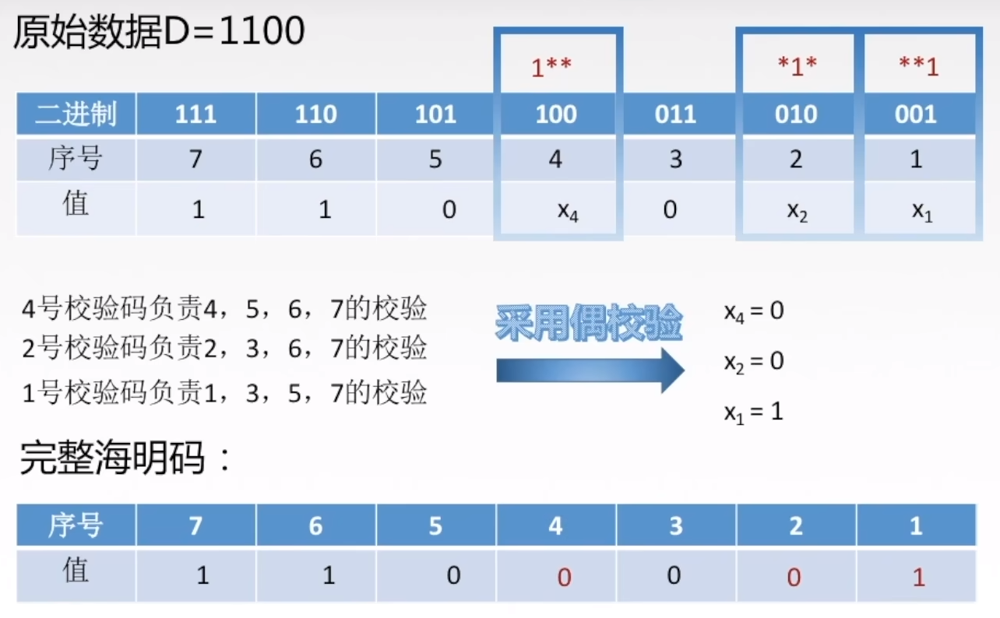
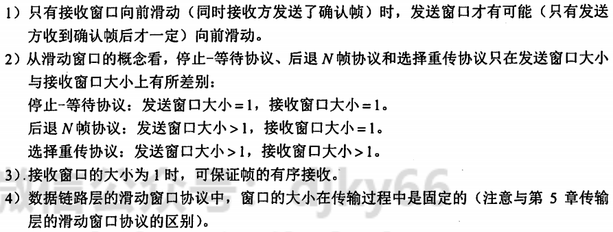
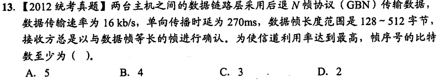
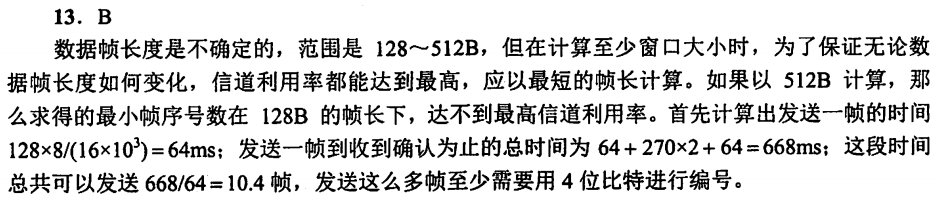
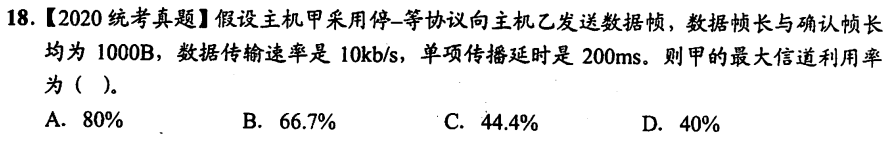
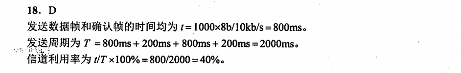
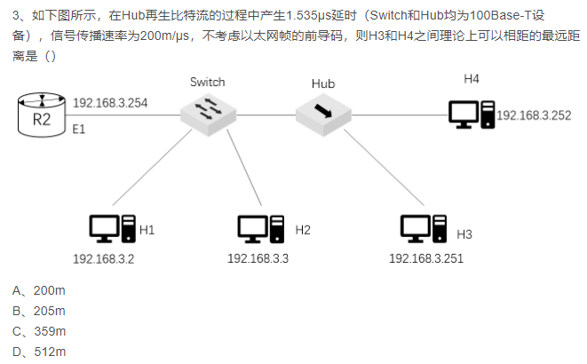
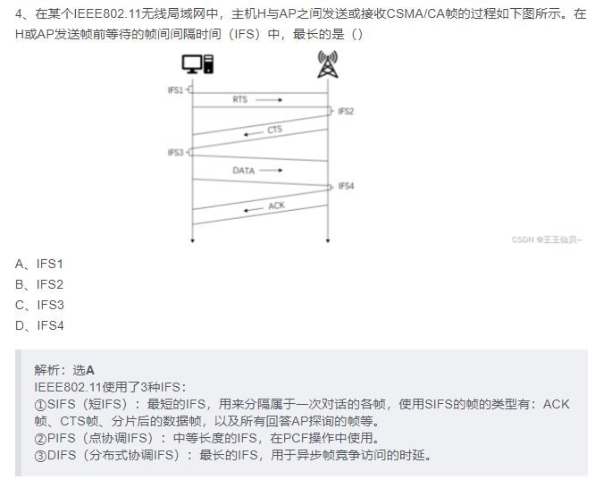

# 计算机网络笔记

## 第一章 概述 （主要内容为osi参考模型与tcp/ip参考模型）

### OSI参考模型

#### 物理层

要点：机械特性，电气特性，功能特性，过程特性

注意：传输所用到的物理媒体（双绞线，光纤，无线信道）在物理层下面，不属于物理层的范畴。

#### 数据链路层

要点：传输单位是帧；任务是将网络层传来的IP数据报组装成帧；功能是成帧、差错控制，流量控制和传输管理。

广播式网络在数据链路层上要处理新的问题：如何控制对共享信道的访问。因此数据链路层有一个特殊的子层：介质访问子层，用于处理该问题。

典型的数据链路层协议有：SDLC，HDLC，PPP，STP和帧中继等。

#### 网络层

要点：传输单位是数据报；关心通信子网的运行控制；主要任务是将网络层的分组传送到接收端。关键问题是对分组进行路由选择。功能是实现流量控制，拥塞控制，差错控制，网际互联等功能。

#### 传输层（运输层）

要点：传输单位是报文段（TCP）或用户数据报（UDP）；任务是主机间两个进程的通信；功能是为端到端连接提供可靠的传输服务，为端到端连接提供流量控制，差错控制，服务质量，数据传输管理等。

注意：数据链路层提供点到点通信，传输层提供端到端通信。（一个进程由一个端口来标识）；由于一台主机可同时运行多个进程，因此传输层具有复用和分用的功能。复用指多个应用层进程可同时使用下面的传输层服务，分用指传输层把收到的信息分别交付给上面的进程。

传输层的两个主要协议是TCP和UDP。

#### 会话层

要点：允许不同主机上的各进程进行会话。功能是建立、管理和终止会话。会话层可以使用校验点使通信会话在通信失效时能够从中断处重新开始，实现数据同步。

#### 表示层

要点：处理用户信息的表示问题，如数据格式转换，数据加密和数据压缩等。功能是将应用层数据转换为机器可以处理的格式，或将机器格式转换为用户可以理解的格式。

#### 应用层

要点：用户与网络的界面，使用的协议最多，比如HTTP，FTP，SMTP等。

****
****
****

## 第二章 物理层

### 1. 奈氏准则

要点：奈氏准则是指理想情况下，极限**码元**传输速率为2W波特，其中W为信道带宽，单位为Hz。（例如有16个不同的码元，就代表一个码元4个比特，传输速率为8W比特/秒）

### 2. 香农定理

要点：香农定理是指在理想情况下，极限**比特**传输速率为$$C = Wlog_2(1+\frac{S}{N})$$，其中W为信道带宽，单位为Hz，S为信号平均功率，N为信道噪声平均功率。S/N称为信噪比。

信噪比=$10log_{10}(\frac{S}{N})$,单位为dB。例如信噪比为30dB，代表信噪比为1000。

### 3. 编码

#### 3.1 数字信号

1）归零编码。在归零编码（RZ）中用高电平代表1、低电平代表0（或者相反），每个时钟周期的中间均跳变到低电平(归零)，接收方根据该跳变调整本方的时钟基准，这就为传输双方提供了自同步机制。由于归零需要占用一部分带宽，因此传输效率受到了一定的影响。

2）非归零编码。非归零编码（NRZ）与RZ编码的区别是不用归零，一个周期可以全部用来传输数据。但NRZ编码无法传递时钟信号，双方难以同步，因此若想传输高速同步数据，则需要都带有时钟线。

3）反向非归零编码。反向非归零编码（NRZI）与NRZ编码的区别是用信号的翻转代表0、信号保持不变代表1。翻转的信号本身可以作为一种通知机制。这种编码方式集成了前两种编码的优点，既能传输时钟信号，又能尽量不损失系统带宽。

USB2.0通信的编码方式就是NRZI编码。

4）曼彻斯特编码。曼彻斯特编码（Manchester Encoding）位周期中心向上跳变代表0，向下跳变代表1，也可采用相反的规定。

该编码的特点是，在每个码元的中间出现电平跳变，位中间的跳变既作为时钟信号(可用于同步)，又作为数据信号，但它所占的频带宽度是原始基带宽度的两倍。

注意：以太网使用的编码方式就是曼彻斯特编码。

5）差分曼彻斯特编码。每一位的中心都有跳变，位开始边界有跳变代表0，没有跳变代表1。该编码可以实现自同步且抗干扰性好。

#### 3.2 模拟信号

主要为调频，调幅，调相。还有一种正交振幅调制（QAM）。

#### 3.3 数字信号与模拟信号的转换

主要内容就是模拟数据编码为数字信号分三个步骤：采样，量化，编码。其中采样定理是指采样频率要大于信号最高频率的两倍。

****
****
****

## 第三章 数据链路层(考察重点)

### 1. 数据链路层的功能

1）为网络层提供服务：无确认无连接，有确认无连接，有确认有连接。

2）链路管理

3）帧定界（成帧）（定义数据格式），帧同步，透明传输（解决在数据中出现与帧定界符相同的比特组合时的问题）

4）流量控制，控制相邻两结点之间数据链路上的流量。（传输层也有流量控制，但是是端到端的）

5）差错控制。错误一般分为位错和帧错。

位错指帧中某些位出错，通常采用循环冗余检验（CRC）来检测。，通过自动重传请求（ARQ）来纠正。

帧错指帧的丢失、重复、失序。引入定时器和编号机制来解决。

****

### 2. 组帧

1）字符计数法。在帧的开头加上一个字符计数字段，表示该帧中字符的个数。

2）字符填充法。首先使用特定字符界定帧的开始和结束，然后在帧中出现特定字符时，在前面填充一个转义字符。

3）零比特填充法。以 01111110 作为帧的开始和结束标志，当数据中出现连续的5个1时，在其后面插入一个0。接收方在接收到连续的5个1时，自动删除后面的0。该方法容易由硬件实现，性能优于字符填充法。

4）违规编码法

在物理层进行比特编码时，通常采用违规编码法。例如，曼彻斯特编码方法将数据比特“1”编码成“高-低”电平对，将数据比特“0”编码成“低-高”电平对，而“高-高”电平对和“低一低”电平对在数据比特中是违规的(即没有采用）。可以借用这些违规编码序列来定界帧的起始和终止。局域网IEEE802标准就采用了这种方法。

违规编码法不需要采用任何填充技术，便能实现数据传输的透明性，但它只适用于采用冗余编码的特殊编码环境。

由于字符计数法中计数字段的脆弱性和字符填充法实现上的复杂性与不兼容性，目前较常用的组帧方法是零比特填充法和违规编码法。

    例题：

    在一个数据链路协议中使用下列字符编码：
    ESC 11100000;   FLAG 01111110；   A 01000111;     B 11100011;
    
    在使用下列成帧方法的情况下，说明为传送4个字符A、B、ESC、FLAG所组织的帧而实际发送的二进制位序列
    （使用FLAG作为首尾标志，ESC作为转义字符)。
    1）字符计数法。
    2）使用字符填充的首尾定界法。
    3）使用比特填充的首尾标志法。

    1）第一字节为所传输的字符计数5，转换为二进制为00000101
    后面依次为A、B、ESC、FLAG的二进制编码：

    00000101 01000111 11100011 11100000 01111110

    2）首尾标志位 FLAG（01111110）
    在所传输的数据中，若出现控制字符，则在该字符前插入转义字符ESC（11100000）：
    
    0111111001000111 11100011 11100000 11100000 11100000 01111110 01111110

    3）首尾标志位FLAG（01111110），在所传输的数据中，若连续出现5个“1”，则在其后插
    入“0”:
    01111110 01000111 110100011 111000000 011111010 01111110

****

### 3. 差错控制

通常使用编码技术进行差错控制：主要有两类：自动重传请求（ARQ）和前向纠错编码（FEC）。

ARQ方式中，检测到差错就重传，FEC方式中，不仅能发现差错，还能确定比特串的错误位置，从而加以纠正。因此，差错控制可分为检错编码和纠错编码。

#### 3.1 检错编码

检错编码都采用冗余编码技术，常见的有奇偶校验码和循环冗余检验码（CRC）。

##### 3.1.1 奇偶校验码

奇偶校验码是奇校验码和偶校验码的统称，是一种最基本的检错码。它由n-1位信息元和1位校验元组成。

如果是奇校验码，那么在附加一个校验元后，码长为n的码字中“1”的个数为奇数；如果是偶校验码，那么在附加一个校验元以后，码长为n的码字中“1”的个数为偶数。

它只能检测奇数位的出错情况，但并不知道哪些位错了，也不能发现偶数位的出错情况。

##### 3.1.2 循环冗余检验码

发送方与接收方事先约定一个多项式G(x)（最高位和最低位必须为1），称为生成多项式。

发送方将生成多项式的系数作为除数，将待发送的比特串作为除数，进行除法运算，得到的余数作为校验码，附加在待发送的比特串后面，发送出去。

接收方将接收到的比特串作为除数，用生成多项式的系数作为除数，进行除法运算，如果余数为0，则认为接收正确，否则认为接收错误。

**除法过程为：在待发送的比特串后面补上r个0（r为生成多项式的阶），进行模2除法（即异或运算）。位数相同即够除商1，位数不够则商0。**

通过循环冗余码的检错技术，数据链路层做到了对帧的无差错接收。

#### 3.2 纠错编码

最常见的纠错编码：海明码。

其工作流程分四步：

1. 确定校验码位数r
2. 确定校验码和数据的位置
3. 求出校验码的值
4. 检错并纠错

海明距离：两个码字对应位不同的个数。一个有效编码集中，任意两个码字的海明距离的最小值称为该编码集的海明距离。要**检测**d位错误，海明距离至少为 d+1；要**纠正**d位错误，海明距离至少为 2d+1。

##### 3.2.1 确定校验码位数r

对于 m 位信息码，需要增加 r 位校验码，使得 m+r 位的码字满足
$$2^r \geq m+r+1 （对应 m+r 位各发生错误和全对）$$
根据m的值，确定r的值。

##### 3.2.2 确定校验码和数据的位置

##### 3.2.3 检错并纠错

Venn图或者校验矩阵。

****

### 4. 流量控制与可靠传输机制

#### 4.1 流量控制、可靠传输与滑动窗口机制

流量控制的基本方法是由接收方控制发送方发送数据的速率，常见方式有两种：停止-等待协议和滑动窗口协议。

1. 停止-等待协议。发送方每发送一帧，都要等待接收方的应答信号。传输效率很低
2. 滑动窗口协议。具有四个重要特性：

#### 4.2 后退N帧协议（GBN）

注意：

1. 累积确认：发送方只要收到确认帧，就认为该确认帧之前的所有帧都已经正确接收。
2. 按序接收：接收方只接收按序到达的帧，不按序到达的帧一律丢弃。
3. 采用n比特对帧编号，则发送窗口的尺寸满足 $1 < W \leq 2^n-1$，否则接收方无法区分新帧和旧帧。
4. 信道传输质量很差时，后退N帧协议不一定优于停止-等待协议。

#### 4.3 选择重传协议（SR）

注意：

1. 对数据帧逐一确认，收一个确认一个
2. 只重传出错帧
3. 接收方有缓存
4. 采用n比特对帧编号，则发送窗口的尺寸满足 $1 < W \leq 2^{n-1}$（注意与GBN区分），否则接收方无法区分新帧和旧帧。

#### 4.4 信道利用率（补充）

信道利用率是对发送方而言的，指发送方在一个发送周期内，发送数据的用时占整个发送周期的比例。

设发送周期 T ,期间发送 L 比特的数据，数据传输速率为 C ，则信道利用率为：
$$\eta = \frac{\frac{L}{C}}{T}$$
一般来讲，如单向传播时延为 R（往返时延为2R），发送周期为 T ，如果不考虑确认帧的发送时延，则有 $T = \frac{L}{C} + 2R$; 如果考虑确认帧的发送时延，切记将其加上。

！RTT是往返时延（2R）

****

**放几个例题**

****

### 5. 介质访问控制

用来决定广播信道中信道分配的协议属于数据链路层的一个子层，称为介质访问控制（Medium Access Control，MAC）子层。

常见的介质访问控制方法有：信道划分，随机访问，轮询访问。其中前者是**静态**的，后两者是**动态**的。

#### 5.1 信道划分

分四种：频分多路复用（FDM），时分多路复用（TDM），波分多路复用（WDM），码分多路复用（CDM）。

码分多路复用更常用的名词是码分多址（Code Division Multiple Access，CDMA）。每个站点有一个码片各站点码片序列相互正交。接收站通过将受到的信号与各站点的码片进行规格化内积，得到1/-1以确定数据来源。

#### 5.2 随机访问

常用协议有：ALOHA，CSMA，CSMA/CD，CSMA/CA。随机访问介质访问控制协议又称争用型协议。

##### 5.2.1 ALOHA

ALOHA协议是最早的随机访问协议，分为纯ALOHA和时隙ALOHA。

纯ALOHA：当一个站点有数据要发送时，就立即发送，发送完毕后，等待确认帧。如果在发送过程中发生冲突，则等待一个随机时间后再次发送。

时隙ALOHA：将时间划分为固定长度的时隙，每个时隙的开始都是一个时钟脉冲，每个站点在一个时隙内只能发送一帧，如果在发送过程中发生冲突，则等待一个随机时间后再次发送。

##### 5.2.2 CSMA

CSMA协议是载波监听多路访问协议（Carrier Sense Multiple Access，CSMA）的简称。比ALOHA协议多了一个载波监听装置。

根据监听方式和监听到信道忙后的处理方式不同，CSMA协议分为1-坚持CSMA，非坚持CSMA，p-坚持CSMA。

> (1) 1-坚持CSMA。当一个站点有数据要发送时，先监听信道，如果信道空闲，则立即发送；如果信道忙，则等待一个随机时间后再次监听，直到信道空闲，然后立即发送。
> 
>   ”1-坚持“是指，监听到信道忙后，继续坚持监听信道；监听到信道空闲后，发送帧的概率为1，即立刻发送数据。

> (2) 非坚持CSMA。一个结点要发送数据时，首先监听信道：如果信道空闲，那么立即发送数据；如果信道忙，那么放弃监听，等待一个随机的时间后再重复上述过程。
>
> 非坚持CSMA协议在监听到信道忙后就放弃监听，因此降低了多个结点等待信道空闲后同时发送数据导致冲突的概率，但也会增加数据在网络中的平均延迟。可见，信道利用率的提高是以增加数据在网络中的延迟时间为代价的。

> (3) p-坚持CSMA。一个结点要发送数据时，首先监听信道：如果信道空闲，那么以概率p发送数据，以概率1-p推迟到下一个时隙，该过程一直持续到数据发送成功或信道忙为止。
>
> 采用坚持“监听”的目的是，试图克服非坚持CSMA协议中由于随机等待而造成的延迟时间较长的缺点。因此，P-坚持CSMA协议是非坚持CSMA协议和1-坚持CSMA协议的折中方案。

##### 5.2.3 CSMA/CD

CSMA/CD协议是载波监听多路访问协议/碰撞（CSMA/CD）检测协议的简称。适用于总线型网络或半双工网络环境。（全双工没有冲突）

**载波监听**是指每个站点在**发送前和发送中**都必须不停地检测信道。在**发送前**检测信道是为了获得发送权，在**发送中**检测信道是为了及时发现发送的数据是否发生了碰撞。站点要发送数据前先监听信道，只有信道空闲才能发送。

**碰撞检测**(Collision Detection)就是边发送边监听，如果监听到了碰撞，则立即停止数据发送，等待一段随机时间后，重新开始尝试发送数据。

由于对于单程传播时延 $\tau$ ,一个站在发送帧后，最多经过 $2\tau$ 的时间，就能检测到碰撞，因此，把以太网端到端往返时间 $2\tau$ 称为**争用期**（又称冲突窗口或碰撞窗口）。

为避免发送过短帧导致发送时没有检测到碰撞，以太网规定了最小帧长：
$$最小帧长=总线传播时延 \times 数据传输速率 \times 2$$

**（实际中以太网最小帧长规定为64B）**

如果要发送的帧长小于最小帧长，则在帧尾部填充一些比特，使得帧长达到最小帧长。

**冲突恢复**：CSMA/CD协议采用截断二进制指数退避算法解决碰撞问题。

（1）确定基本退避时间，一般取两倍的总线端到端传播时延2$\tau$(即争用期)。

（2）定义参数k，它等于重传次数，但k不超过10,即k=min[重传次数，10]。当重传次数不超过10时，k等于重传次数：**当重传次数大于10时，k就不再增大而一直等于10**（易忽略）。

（3）从离散的整数集合[0，1，…，2*-1]中随机取出一个数r，重传所需退避的时间就是r倍的
smg基本退避时间，即$2r\tau$。

（4）当重传达**16次**仍不能成功时，说明网络太拥挤，认为此帧永远无法正确发出，抛弃此帧
并向高层报告出错(易忽略)。

##### 5.2.4 CSMA/CA

CSMA/CD适用与有线局域网，但无限局域网存在信号检测难，有“隐蔽站”问题。因此，802.11标准定义了CSMA/CA协议。

CA（Collision Avoidance），即碰撞避免。碰撞避免并不是指协议可以完全避免碰撞，而是指协议的设计要尽量降低碰撞概率。

无线信道通信质量差，802.11使用确认/重传（ARQ）机制

为避免碰撞，802.11规定所有的站完成发送后，必须再等待一段很短的时间（继续监听）才能发送下一帧。这段时间称为帧间间隔(InterFrame Space,IFS)。帧间间隔的长短取决于该站要发送的帧的类型。802.11使用了下列三种IFS：

（1）SIFS（短IFS）：最短的IFS，用来分隔属于一次对话的各帧，使用SIFS的帧类型有ACK帧、CTS帧、分片后的数据帧，以及所有回答AP探询的帧等。

（2）PIFS（点协调IFS）：中等长度的IFS，在PCF操作中使用。

（3）DIFS（分布式协调IFS）：最长的IFS，用于异步帧竞争访问的时延

CSMA/CA与CSMA/CD的退避算法稍有区别，具体见教材。

为了处理隐蔽站问题，可以采取信道预约RTS/CTS机制。即发送RTS帧，接收方回复CTS帧，然后发送数据帧。信道预约不强制，各站可自行决定是否使用。只有数据帧长度超过某一数值，使用RTS/CTS机制才有意义。

CSMA/CD与CSMA/CA的区别：

1. CSMA/CD可以检测冲突，但无法避兔：CSMA/CA发送数据的同时不能检测信道上有无冲突，本结点处没有冲突并不意味着在接收结点处就没有冲突，只能尽量避免。
2. 传输介质不同。CSMA/CD用于总线形以太网，CSMA/CA用于无线局域网802.11a/b/g/n等。
3. 检测方式不同。CSMA/CD通过电缆中的电压变化来检测：而CSMA/CA采用能量检测、载波检测和能量载波混合检测三种检测信道空闲的方式。

#### 5.3 轮询访问:令牌传递协议

注意：

1. 在令牌传递网络中，传输介质的物理拓扑不必是一个环，但是为了把对介质访问的许可从一个设备传递到另一个设备，令牌在设备间的传递通路逻辑上必须是一个环。
2. 轮询介质访问控制非常适合负载很高的广播信道。所谓负载很高的信道，是指多个结点在同一时刻发送数据概率很大的信道。

****
**放几个例题**

****