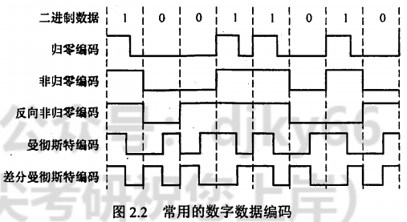

# 计算机网络笔记

## 第一章 概述 （主要内容为osi参考模型与tcp/ip参考模型）

### OSI参考模型

#### 物理层

要点：机械特性，电气特性，功能特性，过程特性

注意：传输所用到的物理媒体（双绞线，光纤，无线信道）在物理层下面，不属于物理层的范畴。

#### 数据链路层

要点：传输单位是帧；任务是将网络层传来的IP数据报组装成帧；功能是成帧、差错控制，流量控制和传输管理。

广播式网络在数据链路层上要处理新的问题：如何控制对共享信道的访问。因此数据链路层有一个特殊的子层：介质访问子层，用于处理该问题。

典型的数据链路层协议有：SDLC，HDLC，PPP，STP和帧中继等。

#### 网络层

要点：传输单位是数据报；关心通信子网的运行控制；主要任务是将网络层的分组传送到接收端。关键问题是对分组进行路由选择。功能是实现流量控制，拥塞控制，差错控制，网际互联等功能。

#### 传输层（运输层）

要点：传输单位是报文段（TCP）或用户数据报（UDP）；任务是主机间两个进程的通信；功能是为端到端连接提供可靠的传输服务，为端到端连接提供流量控制，差错控制，服务质量，数据传输管理等。

注意：数据链路层提供点到点通信，传输层提供端到端通信。（一个进程由一个端口来标识）；由于一台主机可同时运行多个进程，因此传输层具有复用和分用的功能。复用指多个应用层进程可同时使用下面的传输层服务，分用指传输层把收到的信息分别交付给上面的进程。

传输层的两个主要协议是TCP和UDP。

#### 会话层

要点：允许不同主机上的各进程进行会话。功能是建立、管理和终止会话。会话层可以使用校验点使通信会话在通信失效时能够从中断处重新开始，实现数据同步。

#### 表示层

要点：处理用户信息的表示问题，如数据格式转换，数据加密和数据压缩等。功能是将应用层数据转换为机器可以处理的格式，或将机器格式转换为用户可以理解的格式。

#### 应用层

要点：用户与网络的界面，使用的协议最多，比如HTTP，FTP，SMTP等。

****
****
****

## 第二章 物理层

### 1. 奈氏准则

要点：奈氏准则是指理想情况下，极限**码元**传输速率为2W波特，其中W为信道带宽，单位为Hz。（例如有16个不同的码元，就代表一个码元4个比特，传输速率为8W比特/秒）

### 2. 香农定理

要点：香农定理是指在理想情况下，极限**比特**传输速率为$$C = Wlog_2(1+\frac{S}{N})$$，其中W为信道带宽，单位为Hz，S为信号平均功率，N为信道噪声平均功率。S/N称为信噪比。

信噪比=$10log_{10}(\frac{S}{N})$,单位为dB。例如信噪比为30dB，代表信噪比为1000。

### 3. 编码

#### 3.1 数字信号

1）归零编码。在归零编码（RZ）中用高电平代表1、低电平代表0（或者相反），每个时钟周期的中间均跳变到低电平(归零)，接收方根据该跳变调整本方的时钟基准，这就为传输双方提供了自同步机制。由于归零需要占用一部分带宽，因此传输效率受到了一定的影响。

2）非归零编码。非归零编码（NRZ）与RZ编码的区别是不用归零，一个周期可以全部用来传输数据。但NRZ编码无法传递时钟信号，双方难以同步，因此若想传输高速同步数据，则需要都带有时钟线。

3）反向非归零编码。反向非归零编码（NRZI）与NRZ编码的区别是用信号的翻转代表0、信号保持不变代表1。翻转的信号本身可以作为一种通知机制。这种编码方式集成了前两种编码的优点，既能传输时钟信号，又能尽量不损失系统带宽。

USB2.0通信的编码方式就是NRZI编码。

4）曼彻斯特编码。曼彻斯特编码（Manchester Encoding）位周期中心向上跳变代表0，向下跳变代表1，也可采用相反的规定。

该编码的特点是，在每个码元的中间出现电平跳变，位中间的跳变既作为时钟信号(可用于同步)，又作为数据信号，但它所占的频带宽度是原始基带宽度的两倍。

注意：以太网使用的编码方式就是曼彻斯特编码。

5）差分曼彻斯特编码。每一位的中心都有跳变，位开始边界有跳变代表0，没有跳变代表1。该编码可以实现自同步且抗干扰性好。

#### 3.2 模拟信号

主要为调频，调幅，调相。还有一种正交振幅调制（QAM）。

#### 3.3 数字信号与模拟信号的转换

主要内容就是模拟数据编码为数字信号分三个步骤：采样，量化，编码。其中采样定理是指采样频率要大于信号最高频率的两倍。

****
****
****

## 第三章 数据链路层(考察重点)

### 1. 数据链路层的功能

1）为网络层提供服务：无确认无连接，有确认无连接，有确认有连接。

2）链路管理

3）帧定界（成帧）（定义数据格式），帧同步，透明传输（解决在数据中出现与帧定界符相同的比特组合时的问题）

4）流量控制，控制相邻两结点之间数据链路上的流量。（传输层也有流量控制，但是是端到端的）

5）差错控制。错误一般分为位错和帧错。

位错指帧中某些位出错，通常采用循环冗余检验（CRC）来检测。，通过自动重传请求（ARQ）来纠正。

帧错指帧的丢失、重复、失序。引入定时器和编号机制来解决。

### 2. 组帧

1）字符计数法。在帧的开头加上一个字符计数字段，表示该帧中字符的个数。

2）字符填充法。首先使用特定字符界定帧的开始和结束，然后在帧中出现特定字符时，在前面填充一个转义字符。

3）零比特填充法。以 01111110 作为帧的开始和结束标志，当数据中出现连续的5个1时，在其后面插入一个0。接收方在接收到连续的5个1时，自动删除后面的0。该方法容易由硬件实现，性能优于字符填充法。

4）违规编码法

在物理层进行比特编码时，通常采用违规编码法。例如，曼彻斯特编码方法将数据比特“1”编码成“高-低”电平对，将数据比特“0”编码成“低-高”电平对，而“高-高”电平对和“低一低”电平对在数据比特中是违规的(即没有采用）。可以借用这些违规编码序列来定界帧的起始和终止。局域网IEEE802标准就采用了这种方法。

违规编码法不需要采用任何填充技术，便能实现数据传输的透明性，但它只适用于采用冗余编码的特殊编码环境。

由于字符计数法中计数字段的脆弱性和字符填充法实现上的复杂性与不兼容性，目前较常用的组帧方法是零比特填充法和违规编码法。

    例题：

    在一个数据链路协议中使用下列字符编码：
    ESC 11100000;   FLAG 01111110；   A 01000111;     B 11100011;
    
    在使用下列成帧方法的情况下，说明为传送4个字符A、B、ESC、FLAG所组织的帧而实际发送的二进制位序列
    （使用FLAG作为首尾标志，ESC作为转义字符)。
    1）字符计数法。
    2）使用字符填充的首尾定界法。
    3）使用比特填充的首尾标志法。

    1）第一字节为所传输的字符计数5，转换为二进制为00000101
    后面依次为A、B、ESC、FLAG的二进制编码：

    00000101 01000111 11100011 11100000 01111110

    2）首尾标志位 FLAG（01111110）
    在所传输的数据中，若出现控制字符，则在该字符前插入转义字符ESC（11100000）：
    
    0111111001000111 11100011 11100000 11100000 11100000 01111110 01111110

    3）首尾标志位FLAG（01111110），在所传输的数据中，若连续出现5个“1”，则在其后插
    入“0”:
    01111110 01000111 110100011 111000000 011111010 01111110

### 3. 差错控制

通常使用编码技术进行差错控制：主要有两类：自动重传请求（ARQ）和前向纠错编码（FEC）。

ARQ方式中，检测到差错就重传，FEC方式中，不仅能发现差错，还能确定比特串的错误位置，从而加以纠正。因此，差错控制可分为检错编码和纠错编码。

#### 3.1 检错编码

检错编码都采用冗余编码技术，常见的有奇偶校验码和循环冗余检验码（CRC）。

##### 3.1.1 奇偶校验码

奇偶校验码是奇校验码和偶校验码的统称，是一种最基本的检错码。它由n-1位信息元和1位校验元组成。

如果是奇校验码，那么在附加一个校验元后，码长为n的码字中“1”的个数为奇数；如果是偶校验码，那么在附加一个校验元以后，码长为n的码字中“1”的个数为偶数。

它只能检测奇数位的出错情况，但并不知道哪些位错了，也不能发现偶数位的出错情况。

##### 3.1.2 循环冗余检验码

发送方与接收方事先约定一个多项式G(x)（最高位和最低位必须为1），称为生成多项式。

发送方将生成多项式的系数作为除数，将待发送的比特串作为除数，进行除法运算，得到的余数作为校验码，附加在待发送的比特串后面，发送出去。

接收方将接收到的比特串作为除数，用生成多项式的系数作为除数，进行除法运算，如果余数为0，则认为接收正确，否则认为接收错误。

**除法过程为：在待发送的比特串后面补上r个0（r为生成多项式的阶），进行模2除法（即异或运算）。位数相同即够除商1，位数不够则商0。**

通过循环冗余码的检错技术，数据链路层做到了对帧的无差错接收。