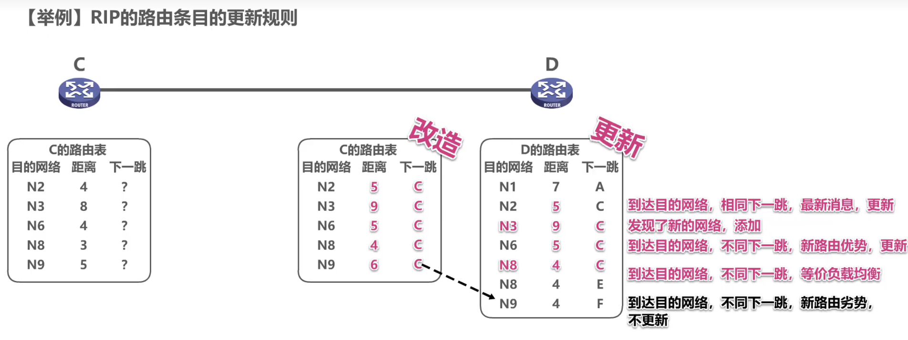

# 前言

哥我真不敢了，我再也不敢了我知道你为我们复试操碎了心，那考研大纲里有的你出小题，没有的你出大题你别说我拿王道考研了，我tm在谢希仁的教材里都找不到那些知识点楼楼、咸鱼加教书匠若敢来犯都能在你这大败而归

致后人：本资料已110%覆盖计组网考试所有内容，过于基础的内容默认你会。实在不行图书馆有谢希仁的计网第八版，加上这个就是绝对满分。

什么？md导出为pdf并打印还要我教？你自裁吧（无慈悲）

# 计算机组网技术考试用参考资料

计组网考试索引：

osi参考模型与tcp/ip参考模型: 第一章

ip地址，子网划分，VLSM，CIDR，路由汇总，ipv6: 4.3与4.4

双绞线，光纤等：3.6.2

交换机，二层与三层，堆叠与级联：3.8.2

路由器，路由器交换机比较：4.8.2

路由协议，静态路由，动态路由：4.1.2，4.2.1

距离-向量路由算法：4.2.2

路由环路：4.5.3

链路状态路由算法：4.2.3

RIP协议：4.5.3

OSPF协议：4.5.4

局域网：3.6

CSMA/CD ：3.5.2的3.

冲突域和广播域：4.8.1

以太网：3.6.2

stp生成树协议：3.8.3

VLAN：3.6.4

CSMA/CA：3.5.2的4.

广域网：3.7

PPP协议：3.7.2

ACL：4.3.2的3.

NAT：4.3.2的2.
## 第一章 概述 （主要内容为osi参考模型与tcp/ip参考模型）

**计算机网络定义：**

以能够相互共享资源的方式互联起来的自治计算机系统的集合

即利用通信设备和通信线路，将地理位置分散的、具有独立功能的多个计算机系统互连起来，通过网络软件实现网络中资源共享和数据通信的系统。

### OSI参考模型

#### 物理层

要点：机械特性，电气特性，功能特性，过程特性

（1）机械特性   指明接口所用接线器的形状和尺寸、引脚数目和排列、固定和锁定装置等。平时常见的各种规格的接插件都有严格的标准化的规定。

（2）电气特性   指明在接口电缆的各条线上传输比特流时信号电压的范围、阻抗匹配情况、传输速率和距离限制等。

（3）功能特性   指明接口电缆的各条信号线的作用。

（4）过程特性   指明对于不同功能的各种可能事件的出现顺序。

注意：传输所用到的物理媒体（双绞线，光纤，无线信道）在物理层下面，不属于物理层的范畴。

#### 数据链路层

要点：传输单位是帧；任务是将网络层传来的IP数据报组装成帧；功能是成帧、差错控制，流量控制和传输管理。

广播式网络在数据链路层上要处理新的问题：如何控制对共享信道的访问。因此数据链路层有一个特殊的子层：介质访问子层，用于处理该问题。

典型的数据链路层协议有：SDLC，HDLC，PPP，STP和帧中继等。

#### 网络层

要点：传输单位是数据报；关心通信子网的运行控制；主要任务是将网络层的分组传送到接收端。关键问题是对分组进行路由选择。功能是实现流量控制，拥塞控制，差错控制，网际互联等功能。

#### 传输层（运输层）

要点：传输单位是报文段（传输控制协议TCP）或用户数据报（用户数据报协议UDP）；任务是主机间两个进程的通信；功能是为端到端连接提供可靠的传输服务，为端到端连接提供流量控制，差错控制，服务质量，数据传输管理等。

注意：数据链路层提供点到点通信，传输层提供端到端通信。（一个进程由一个端口来标识）；由于一台主机可同时运行多个进程，因此传输层具有复用和分用的功能。复用指多个应用层进程可同时使用下面的传输层服务，分用指传输层把收到的信息分别交付给上面的进程。

传输层的两个主要协议是TCP和UDP。

#### 会话层

要点：允许不同主机上的各进程进行会话。功能是建立、管理和终止会话。会话层可以使用校验点使通信会话在通信失效时能够从中断处重新开始，实现数据同步。

#### 表示层

要点：处理用户信息的表示问题，如数据格式转换，数据加密和数据压缩等。功能是将应用层数据转换为机器可以处理的格式，或将机器格式转换为用户可以理解的格式。

#### 应用层

要点：用户与网络的界面，为应用程序提供接口。使用的协议最多，比如HTTP，FTP，SMTP，Telnet等。

#### OSI参考模型中的数据传输

****
****
****
### TCP/IP参考模型

#### 网络接口层

网络接口层又称为主机到网络层。

该层定义了计算机和网络设备是如何访问物理介质，向另一台网络设备发送0、1比特流。

网络接口层与OSI参考模型中的物理层和数据链路层相对应，包括局域网和广域网技术。

#### 网际层

网际互联层负责数据的传输。

该层使用网络层地址，即IP地址来选择数据传输的路径。

网际互联层对应OSI参考模型的网络层。

该层的主要协议是IP协议。其使用到地址转换ARP和RARP。

    IP地址 → (ARP) → MAC地址
    MAC地址 → (RARP) → IP地址

IP协议是基于尽量交付思想，仅能提供不可靠的、无连接的服务。

#### 传输层

主要使用的协议是TCP和UDP。

1. TCP协议

    TCP协议是面向连接的、可靠的、基于字节流的传输层协议。

    TCP通过三次握手机制、序列号、确认号和滑动窗口来实现可靠传输。

2. UDP协议

    UDP协议是无连接的、不可靠的传输层协议。

    UDP协议不提供重传和流量控制机制，开销小，延迟少，常用于实时性要求高的应用。

传输层会使用到端口号。端口是每个数据段内用于跟踪特定会话和所需目标服务的数字标识符。

TCP和UDP报头中的端口号字段占16位，端口编号的取值范围是从0～65535。0～1023为公认端口，用于特定的应用程序。

#### 应用层

应用层包括以下协议：

    1. HTTP协议
    超文本传输协议，用于传输WWW网页文件。

    2. FTP协议
    是一种可靠的、面向连接的服务，用于客户端和服务器之间的文件传输。

    3. TELNET协议
    远程登录协议，也称为远程终端访问协议,用于远程访问服务器和网络设备。

    4. SMTP/POP协议
    SMTP是简单邮件传送协议，用于传输邮件及其附件信息。

    电子邮件客户端使用POP协议从电子邮件服务器接收电子邮件消息。
    常用的POP3指的是第三版邮局协议。

    IMAP协议是Internet邮件访问协议。

    5. DNS协议
    域名服务器，负责将主机名连同域名转换为IP地址。

    6. DHCP协议
    动态主机配置协议，为客户机分配动态的IP地址、子网掩码、网关
    以及其它IP网络参数，从而提供安全、可靠的TCP/IP网络配置

#### TCP/IP参考模型中的数据传输

### TCP/IP参考模型与OSI参考模型的对比

#### 相同点

* 都采用分层的结构
* 具有相似的传输层和网络层功能

#### 不同点

* OSI模型上三层的功能与TCP/IP模型的应用层功能对应。
* OSI模型的底下两层论述处理物理网络访问以及本地网络主机之间的比特传输。
* TCP/IP模型基于实际制定的协议和标准，而OSI模型并没有实际的协议

## 第二章 物理层

你应该高兴组网不考物理层。

## 第三章 数据链路层(考察重点)

### 3.1 数据链路层的功能

1）为网络层提供服务：无确认无连接，有确认无连接，有确认有连接。

2）链路管理

3）帧定界（成帧）（定义数据格式），帧同步，透明传输（解决在数据中出现与帧定界符相同的比特组合时的问题）

4）流量控制，控制相邻两结点之间数据链路上的流量。（传输层也有流量控制，但是是端到端的）

5）差错控制。错误一般分为位错和帧错。

位错指帧中某些位出错，通常采用循环冗余检验（CRC）来检测。，通过自动重传请求（ARQ）来纠正。

帧错指帧的丢失、重复、失序。引入定时器和编号机制来解决。

什么？你问3.234你哪去了？你觉得呢？

#### 3.5.2 随机访问

常用协议有：ALOHA，CSMA，CSMA/CD，CSMA/CA。随机访问介质访问控制协议又称争用型协议。

##### 1. ALOHA

ALOHA协议是最早的随机访问协议，分为纯ALOHA和时隙ALOHA。

纯ALOHA：当一个站点有数据要发送时，就立即发送，发送完毕后，等待确认帧。如果在发送过程中发生冲突，则等待一个随机时间后再次发送。

时隙ALOHA：将时间划分为固定长度的时隙，每个时隙的开始都是一个时钟脉冲，每个站点在一个时隙内只能发送一帧，如果在发送过程中发生冲突，则等待一个随机时间后再次发送。

##### 2. CSMA

CSMA协议是载波监听多路访问协议（Carrier Sense Multiple Access，CSMA）的简称。比ALOHA协议多了一个载波监听装置。

根据监听方式和监听到信道忙后的处理方式不同，CSMA协议分为1-坚持CSMA，非坚持CSMA，p-坚持CSMA。

> (1) 1-坚持CSMA。当一个站点有数据要发送时，先监听信道，如果信道空闲，则立即发送；如果信道忙，则等待一个随机时间后再次监听，直到信道空闲，然后立即发送。
> 
>   ”1-坚持“是指，监听到信道忙后，继续坚持监听信道；监听到信道空闲后，发送帧的概率为1，即立刻发送数据。

> (2) 非坚持CSMA。一个结点要发送数据时，首先监听信道：如果信道空闲，那么立即发送数据；如果信道忙，那么放弃监听，等待一个随机的时间后再重复上述过程。
>
> 非坚持CSMA协议在监听到信道忙后就放弃监听，因此降低了多个结点等待信道空闲后同时发送数据导致冲突的概率，但也会增加数据在网络中的平均延迟。可见，信道利用率的提高是以增加数据在网络中的延迟时间为代价的。

> (3) p-坚持CSMA。一个结点要发送数据时，首先监听信道：如果信道空闲，那么以概率p发送数据，以概率1-p推迟到下一个时隙，该过程一直持续到数据发送成功或信道忙为止。
>
> 采用坚持“监听”的目的是，试图克服非坚持CSMA协议中由于随机等待而造成的延迟时间较长的缺点。因此，P-坚持CSMA协议是非坚持CSMA协议和1-坚持CSMA协议的折中方案。

##### 3. CSMA/CD

CSMA/CD协议是载波监听多路访问协议/碰撞检测协议的简称。适用于总线型网络或半双工网络环境。（全双工没有冲突）

****

**载波监听**是指每个站点在**发送前和发送中**都必须不停地检测信道。在**发送前**检测信道是为了获得发送权，在**发送中**检测信道是为了及时发现发送的数据是否发生了碰撞。站点要发送数据前先监听信道，只有信道空闲才能发送。

****

**碰撞检测**(Collision Detection)就是边发送边监听，如果监听到了碰撞，则立即停止数据发送，等待一段随机时间后，重新开始尝试发送数据。

由于对于单程传播时延 $\tau$ ,一个站在发送帧后，最多经过 $2\tau$ 的时间，就能检测到碰撞，因此，把以太网端到端往返时间 $2\tau$ 称为**争用期**（又称冲突窗口或碰撞窗口）。

为避免发送过短帧导致发送时没有检测到碰撞，以太网规定了最小帧长：
$$最小帧长=总线传播时延 \times 数据传输速率 \times 2$$

**（实际中以太网最小帧长规定为64B，其中数据部分（有效载荷）最小长度46B，不足时需要填充）**

如果要发送的帧长小于最小帧长，则在帧尾部填充一些比特，使得帧长达到最小帧长。

****

**冲突恢复**：CSMA/CD协议采用截断二进制指数退避算法解决碰撞问题。

（1）确定基本退避时间，一般取两倍的总线端到端传播时延2$\tau$(即争用期)。

（2）定义参数k，它等于重传次数，但k不超过10,即k=min[重传次数，10]。当重传次数不超过10时，k等于重传次数：**当重传次数大于10时，k就不再增大而一直等于10**（易忽略）。

（3）从离散的整数集合[0，1，…，2*-1]中随机取出一个数r，重传所需退避的时间就是r倍的
smg基本退避时间，即$2r\tau$。

（4）当重传达**16次**仍不能成功时，说明网络太拥挤，认为此帧永远无法正确发出，抛弃此帧
并向高层报告出错(易忽略)。

****
****

##### 4. CSMA/CA

CSMA/CD适用与有线局域网，但无限局域网存在信号检测难，有“隐蔽站”问题。因此，802.11标准定义了**CSMA/CA协议**。

**CA**（Collision Avoidance），即碰撞避免。碰撞避免并不是指协议可以完全避免碰撞，而是指协议的设计要尽量降低碰撞概率。

****

无线信道通信质量差，802.11使用确认/重传（ARQ）机制

****

为避免碰撞，802.11规定所有的站完成发送后，必须再等待一段很短的时间（继续监听）才能发送下一帧。这段时间称为帧间间隔(InterFrame Space,IFS)。帧间间隔的长短取决于该站要发送的帧的类型。802.11使用了下列三种IFS：

（1）SIFS（短IFS）：最短的IFS，用来分隔属于一次对话的各帧，使用SIFS的帧类型有ACK帧、CTS帧、分片后的数据帧，以及所有回答AP探询的帧等。

（2）PIFS（点协调IFS）：中等长度的IFS，在PCF操作中使用。

（3）DIFS（分布式协调IFS）：最长的IFS，用于异步帧竞争访问的时延

****

CSMA/CA与CSMA/CD的退避算法稍有区别，具体见教材。

CSMA/CA算法的归纳如下:

1) 若站点最初有数据要发送(而不是发送不成功再进行重传)，且检测到信道空闲，在等待
时间 DIFS后，就发送整个数据帧。

2) 否则，站点执行CSMAJCA退避算法，选取一个随机回退值。一旦检测到信道忙，退避
计时器就保持不变。只要信道空闲，退避计时器就进行倒计时。

3) 当退避计时器减到0时(这时信道只可能是空闲的)，站点就发送整个帧并等待确认。

4) 发送站若收到确认，就知道已发送的帧被目的站正确接收。这时如果要发送第二帧，就
要从步骤 2 开始，执行CSMA/CA 退避算法，随机选定一段退避时间。

    若发送站在规定时间(由重传计时器控制)内没有收到确认帧ACK，就必须重传该帧，再次使用 CSMA/CA 协议争用该信道，直到收到确认，或经过若干次重传失败后放弃发送。

****

为了处理隐蔽站问题，可以采取信道预约RTS/CTS机制。即发送RTS帧，接收方回复CTS帧，然后发送数据帧。信道预约不强制，各站可自行决定是否使用。只有数据帧长度超过某一数值，使用RTS/CTS机制才有意义。

****

CSMA/CD与CSMA/CA的区别：

1. CSMA/CD可以检测冲突，但无法避免：CSMA/CA发送数据的同时不能检测信道上有无冲突，本结点处没有冲突并不意味着在接收结点处就没有冲突，只能尽量避免。
2. 传输介质不同。CSMA/CD用于总线形以太网，CSMA/CA用于无线局域网802.11a/b/g/n等。
3. 检测方式不同。CSMA/CD通过电缆中的电压变化来检测：而CSMA/CA采用能量检测、载波检测和能量载波混合检测三种检测信道空闲的方式。

****

#### 3.5.3 轮询访问:令牌传递协议

注意：

1. 在令牌传递网络中，传输介质的物理拓扑不必是一个环，但是为了把对介质访问的许可从一个设备传递到另一个设备，令牌在设备间的传递通路逻辑上必须是一个环。
2. 轮询介质访问控制非常适合负载很高的广播信道。所谓负载很高的信道，是指多个结点在同一时刻发送数据概率很大的信道。

****

### 3.6 局域网

#### 3.6.1 局域网的基本概念和体系结构

局域网的特性主要由三个要素决定：拓扑结构、传输介质、介质访问控制方式，其中最重要的是介质访问控制方式，它决定着局域网的技术特性。

常见的局域网拓扑结构主要有以下4大类：①星形结构；②环形结构：③总线形结构：④星形和总线形结合的复合型结构。

局域网可以使用双绞线、铜缆和光纤等多种传输介质，其中双绞线为主流传输介质。

局域网的介质访问控制方法主要有CSMA/CD、令牌总线和令牌环，其中前两种方法主要用
于总线形局域网，令牌环主要用于环形局域网。

三种特殊的局域网拓扑实现如下：

* **以太网**（目前使用范围最广的局域网）。逻辑拓扑是总线形结构，物理拓扑是星形或拓展星形结构。
* 令牌环（Token Ring，IEEE 802.5）。逻辑拓扑是环形结构，物理拓扑是星形结构。
* FDDI（光纤分布数字接口，IEEE802.8）。逻辑拓扑是环形结构，物理拓扑是双环结构。

IEEE802标准定义的局域网参考模型只对应于OSI参考模型的数据链路层和物理层，并将数据链路层拆分为两个子层：逻辑链路控制（LLC）子层和媒体接入控制（MAC）子层。与接入传输媒体有关的内容都放在MAC子层，它向上层屏蔽对物理层访问的各种差异，提供对物理层的统一访问接口，主要功能包括：组帧和拆卸帧、比特传输差错检测、透明传输。LLC子层与传输媒体无关，它向网络层提供无确认无连接、面向连接、带确认无连接、高速传送4种不同的连接服务类型。

由于以太网占据市场，LLC子层作用已经不大，现在许多网卡只装有MAC协议，没有LLC协议。

#### 3.6.2 以太网与IEEE802.3

IEEE802.3标准是一种基带总线形的局域网标准，它描述物理层和数据链路层的MAC子层的实现方法。

以太网逻辑上采用总线形拓扑结构，以太网中的所有计算机共享同一条总线，信息以广播方
式发送。使用CSMA/CD方式对总线进行访问控制。

严格来说，以太网应当是指符合 DIX Ethernet V2标准的局域网，但DIX Ethernet V2标准与IEEE802.3标准只有很小的差别，因此通常将802.3局域网简称为以太网。

**以太网采用两项措施以简化通信：**

①采用无连接的工作方式，不对发送的数据帧编号，也不要求接收方发送确认，即以太网尽最大努力交付数据，提供的是不可靠服务，对于差错的纠正则由高层完成：

②发送的数据都使用曼彻斯特编码的信号，每个码元的中间出现一次电压转换，接收端利用这种电压转换方便地把位同步信号提取出来。

##### 1. 以太网的传输介质与网卡
   
以太网常用的传输介质有4种：粗缆、细缆、双绞线和光纤。各种传输介质的适用情况见下表。

| 参数         | 10BASE5              | 10BASE2              | 10BASE-T     | 10BASE-FL       |
| ------------ | -------------------- | -------------------- | ------------ | --------------- |
| 传输媒体     | 基带同轴电缆（粗缆） | 基带间轴电缆（细缆） | 非屏蔽双绞线 | 光纤对（850nm） |
| 编码         | 曼彻斯特编码         | 曼彻斯特编码         | 曼彻斯特编码 | 曼彻斯特编码    |
| 拓扑结构     | 总线形               | 总线形               | 星形         | 点对点          |
| 最大段长     | 500m                 | 185m                 | 100m         | 2000m           |
| 最多结点数目 | 100                  | 30                   | 2            | 2               |

注意：10BASE-T 非屏蔽双绞线以太网拓扑结构为星形网，星形网中心为集线器，但使用集线器的以太网在逻辑上仍然是一个总线形网，属于一个冲突域。上表的内容是常识，例如题目中出现10BASE5时，是不会显式地告诉你它的传输媒体、编码方式、拓扑结构等信息的。

##### 2. 以太网的帧格式

每块网卡中的MAC地址也称物理地址；**MAC地址长6字节**，一般用由连字符（或冒号）分隔的12个十六进制数表示，如02-60-8c-e4-b1-21。高24位为厂商代码，低24位为厂商自行分配的网卡序列号。

以太网MAC帧格式有两种标准：DIX Ethernet V2标准（即以太网V2标准）和IEEE 802.3标准。

以下是最常用的以太网V2的MAC帧格式，如图所示。

（1）前导码：使接收端与发送端时钟同步。在帧前面插入的8字节可再分为两个字段：第一个字段共7字节，是前同步码，用来快速实现MAC帧的比特同步，由0、1间隔代码组成，可以通知目标站作好接收准备；第二个字段是帧开始定界符，以两个连续的代码1结尾，表示一帧实际开始。

（2）地址：通常使用6字节（48bit）地址（MAC地址）。目标地址可以是单址，也可以是多点传送或广播地址，目标地址字段最高位为“0”表示单个地址，最高位为“1”、其余位不为全“1”表示组地址；全1表示广播地址

（3）类型：2字节，指出数据域中携带的数据应交给哪个协议实体处理。

（4）数据：46 ~ 1500字节，包含高层的协议消息。由于CSMA/CD算法的限制，以太网帧必须满足最小长度要求64字节，数据较少时必须加以填充（0 ~ 46字节）。

> 注意：46是怎么来的？由CSMA/CD可知以太网帧的最短帧长为64B，而MAC帧的首部和尾部的长度为18字节，所以数据字段最短为64-18=46字节。最大的1500字节是规定的。加上其他字段，以太网帧最大帧长为1518字节。

（5）填充：0～46字节，当帧长太短时填充帧，使之达到64字节的最小长度。

（6）校验码(FCS)：4字节，校验范围从目的地址段到数据段的末尾，算法采用32位循环冗余码（CRC），不但需要检验MAC帧的数据部分，还要检验目的地址、源地址和类型字段，但不校验前导码。

802.3帧格式与DIX以太帧格式的不同之处在于用长度域替代了DIX帧中的类型域，指出数据域的长度。在实践中，前述长度/类型两种机制可以并存，由于IEEE802.3数据段的最大字节数是1500，所以长度段的最大值是1500，因此从1501到65535的值可用于类型段标识符。

##### 3. 高速以太网

速率达到或超过100Mb/s的以太网称为高速以太网。

（1）100BASE-T以太网

> 介质：双绞线
>
> 速度：100Mb/s
>
> 拓扑结构：星形
> 
> 协议：CSMA/CD
> 
> 既支持全双工方式，又支持半双工方式，可在全双工方式下工作而无冲突发生，因此在全双工方式下不使用CSMA/CD协议。
> 
> MAC帧格式仍然是802.3标准规定的。保持最短帧长不变，但将一个网段的最大电缆长度减到100m。帧间时间间隔从原来的9.6μs改为现在的0.96μs。

（2）吉比特以太网（千兆以太网）

> 介质：双绞线
> 
> 允许在1Gb/s速率下用全双工和半双工两种方式工作。
> 
> 使用802.3协议规定的帧格式。
> 
> 在半双工方式下使用CSMA/CD协议（全双工方式不需要使用CSMA/CD协议）。
> 
> 与10BASE-T和100BASE-T技术向后兼容。

（3）10吉比特以太网

> 介质：光纤
> 
> 只工作在全双工方式，因此没有争用问题，也不使用CSMA/CD协议。
> 
> 与10Mb/s、100Mb/s和1Gb/s以太网的帧格式完全相同。
> 
> 保留了802.3标准规定的以太网最小和最大帧长，便于升级。

****

#### 3.6.3 IEEE 802.11 无线局域网

##### 1. 无线局域网的组成

无线局域网可分为两大类：有固定基础设施的无线局域网和无固定基础设施的移动自组织网络。所谓“固定基础设施”，是指预先建立的、能覆盖一定地理范围的固定基站。

（1）有固定基础设施无线局域网

对于有固定基础设施的无线局域网，IEEE制定了无线局域网的802.11系列协议标准，包括802.11a/b/g/n等。

802.11使用星形拓扑，其中心称为接入点（Access Point,AP）,在MAC层使用CSMA/CA协议。使用802.11系列协议的局域网又称Wi-Fi。

（2）无固定基础设施移动自组织网络

另一种无线局域网是无固定基础设施的无线局域网，又称自组网络(ad hoc network)。自组网络没有上述基本服务集中的AP，而是由一些平等状态的移动站相互通信组成的临时网络。各结点之间地位平等，中间结点都为转发结点，因此都具有路由器的功能。

##### 2. 802.11 局域网的MAC帧

802.11帧共有三种类型，即数据帧、控制帧和管理帧。

802.11数据帧由以下三大部分组成：

1）MAC首部，共30字节。帧的复杂性都在MAC首部。

2）帧主体，即帧的数据部分，不超过2312字节。它比以太网的最大长度长很多。

3）帧检验序列FCS是尾部，共4字节。

802.11帧的MAC首部中最重要的是4个地址字段（都是MAC地址）。这里仅讨论前三种地址(地址4用于自组网络)。这三个地址的内容取决于帧控制字段中的“去往AP”和“来自AP”这两个字段的数值。下表中给出了802.11帧的地址字段最常用的两种情况。

| 去往AP | 来自AP | 地址1               | 地址2             | 地址3    | 地址4  |
| ------ | ------ | ------------------- | ----------------- | -------- | ------ |
| 0      | 1      | 接收地址 = 目的地址 | 发送地址 = AP地址 | 源地址   | 不使用 |
| 1      | 0      | 接收地址 = AP地址   | 发送地址 = 源地址 | 目的地址 | 不使用 |

802.11帧的MAC首部的其他字段不是考试重点。

#### 3.6.4 VLAN基本概念与基本原理

通过虚拟局域网(Virtual LAN)，可以把一个较大的局域网分割成一些较小的与地理位置无关的逻辑上的VLAN，而每个VLAN是一个较小的广播域。

插入 VLAN 标签的帧称为802.1Q帧，如图所示。由于VLAN帧的首部增加了4字节，因此以太网的最大帧长从原来的1518字节变为1522字节。

交换机的端口类型有三种：access（访问连接）端口、trunk（汇聚连接）端口和hybrid端口。access端口只能属于一个VLAN；trunk端口口属于所有VLAN共有，承载所有VLAN在交换
机间的通讯流量。

hybrid端口思科没有，华为独有。

**以下内容不在考研大纲内，做了解即可**

##### 1. VLAN的类型

1. 基于端口的VLAN
   * 是一种静态的VLAN
   * 当一台设备连接到网络时，它自动属于这个端口的VLAN
   * 简单、静态、固化
2. 基于MAC地址的VLAN
   * 是动态的VLAN
   * 根据每个主机的MAC地址来划分VLAN
   * 管理难度大、无法限制广播包
3. 基于协议的VLAN
   * 是动态的VLAN
   * 根据每个主机的网络层地址或协议类型来划分
   * 3层拆包

### 3.7 广域网

#### 3.7.1 广域网的基本概念

WAN标准对应OSI参考模型的第1层和第2层。

常见的广域网数据链路层协议是PPP协议和HDLC协议。HDLC现已很少使用，并从大纲中删除。但历年真题考过。

#### 3.7.2 PPP协议

点对点协议（Point-to-Point Protocol，PPP）是使用串行线路通信的面向字节的协议。

PPP协议有三个组成部分：
1. 链路控制协议（LCP）。用于建立、配置、测试和管理数据链路。
2. 网络控制协议（NCP）。PPP协议允许同时采用多种网络层协议，每个不同的网络层协议要用一个相应的NCP来配置，为网络层协议建立和配置逻辑连接。
3. 一个将IP数据报封装到串行链路的方法（成帧）。IP数据报在PPP帧中就是其信息部分，这个信息部分的长度受最大传送单元（MTU）的限制。

PPP协议的特点：
1. PPP提供差错检测但不提供纠错功能，只保证无差错接收（通过硬件进行CRC校验）。它是不可靠的传输协议，因此也不使用序号和确认机制。
2. 它仅支持点对点的链路通信，不支持多点线路。
3. PPP只支持全双工链路。
4. PPP的两端可以运行不同的网络层协议，但仍然可使用同一个PPP进行通信。
5. PPP是面向字节的，当信息字段出现和标志字段一致的比特组合时，PPP有两种不同的处理方法：若PPP用在异步线路（默认），则采用字符填充法；若PPP用在SONET/SDH等同步线路，则协议规定采用硬件来完成比特填充（和HDLC的做法一样）。

****

### 3.8 数据链路层设备

#### 3.8.1 网桥

大纲已经删去，理解为单个端口的交换机即可。

#### 3.8.2 交换机

交换机是一种多端口的网桥，通常工作在全双工方式下。可以方便的实现虚拟局域网VLAN。

对于传统 10Mb/s 以太网，若有N个用户，则每个用户的平均带宽只有 10/N Mb/s。但采用交换机（默认全双工）后，每个用户的平均带宽为 10 Mb/s。，交换机总容量为 N*10 Mb/s。这是交换机最大优点。

****

**交换机主要有两种工作方式：存储转发方式和直通方式。**
1. 存储转发方式。交换机接收到一个帧后，先把整个帧存储在缓存区，检查数据是否正确，然后再从缓存区取出整个帧进行处理。这种方式可靠性高，能支持不同速率端口间的转换，但延迟较大。
2. 直通方式。交换机接收到一个帧后，先检查**目的地址**（以太网帧的目的地址占6B，位于第二字段，要接收到目的地址一共需要接收14B），然后立即转发该帧。这种方式延迟小，但可靠性低。不能在不同速率端口间转发。

还有一种无碎片转发方式，即交换机收到64B的数据后再转发，保证不会转发碎片帧（错误帧）

****

##### 二层交换与三层交换（以下3.8.2内容均不在考研大纲内）

* 二层交换技术
    * 主要应用在小型局域网中
    * 二层交换机不能隔离广播包 
    * 基于硬件，极大减少了由软件处理带来的延迟 
    * 二层交换机的快速交换功能、多个接入端口和低谦价格为小型网络用户提供了很完善的解决方案 

* 三层交换技术
    * 也称为多层交换机，是一个带有第三层路由功能的交换机 
    * 有机的硬件结合使得数据交换加速 
    * 通过路由选择协议创建和维护路由表 
    * 处于安全考虑，第三层交换机一般提供防火墙、分组过滤等服务功能 
  
* 三层交换机与路由器的区别（主要功能不同）：
    * 三层交换机也具有“路由”功能，与传统路由器的路由功能总体上是一致的；
    * 三层交换机并不等于路由器，同时也不可能取代路由器；
    * 三层交换机仍是交换机产品，只不过它是具备了一些基本的路由功能的交换机，它的主要功能仍是数据交换；
  
* 三层交换机与路由器的区别（ 使用的场所不同）
  * 三层交换机主要是用于简单的局域网连接。路由功能通常比较简单，路由路径远没有路由器那么复杂。主要是实现快速的数据交换；
  * 路由器主要是为了满足不同类型的网络连接。路由功能更多地体现在不同类型网络之间的互联上，主要的功能就是路由转发（选择最佳路径），解决好各种复杂路由路径网络的连接就是它的最终目的；
  * 交换机对安全性的支持不够但是可快速交换数据；

* 三层交换机与路由器的区别（数据处理能力）
  * 路由器的包转发率一般为几百Kbps，总线带宽2Gbps；
  * 交换机的包转发率可达150Mbps 以上，背板带宽更可高达32Gbps。

* （协议支持）
  * 路由器与三层交换机一样，支持IP、IPX等网络协议，也支持RIP、OSPF 等开放的动态路由协议
  * 三层交换机现在还不能提供完整的路由选择协议，而路由器则具备同时处理多个协议的能力并具有第四层网络管理能力

* （ 端口密度和扩展能力）
  * 路由器存在接入数量的限制，扩展只能增加设备；
  * 交换机不存在接入数量的限制，扩展可通过级联交换机做扩充，这个数量是无限的；

* （性能价格）
  * 低VS高

##### 交换机堆叠和级联

级联是最常见的连接方式（网线将两个交换机进行连接）。级联的交换机仍然各自工作，仍然是两个独立的交换机。不能无限制级联（广播风暴）。

交换机堆叠在大型网络中对端口需求比较大的情况下使用；交换机的堆叠是扩展端口最快捷、最便利的方式；同时堆叠后的总带宽是单一交换机端口速率的几十倍；通过厂家提供的一条专用连接电缆，从一台交换机的“UP”堆叠端口→“DOWN”堆叠端口；堆叠中的所有交换机可视为一个整体的交换机来进行管理；

* 级联和堆叠的对比
  * 级联的优点是可以延长网络的距离（理论上无限远）；
  * 级联在网络管理过程中仍然是多个不同的网络设备；
  * 级联基本上不受设备的限制
  * 堆叠的优点是不会产生性能瓶颈，可以增加交换机的背板带宽；
  * 通过堆叠可以在网络中提供高密度的集中网络端口；
  * 堆叠后的设备在网络管理中变成了一个网络设备；

#### 3.8.3 生成树协议

有时为了增加网络的可靠性，在使用以太网交換机组网时，往往会增加一些冗余的链路。在这种情况下，基于交换机的冗余会引起环路。这将导致：
* 产生广播风暴
* 重复帧传送
* MAC地址表的不稳定

为解决这些问题，IEEE 802.1D标准定义了生成树协议（Spanning Tree Protocol，STP）。它为网络提供路径冗余的同时防止产生环路。

* 互连在一起的网桥在进行彼此通信后，就能找出原来的网络拓扑的一个子集。在这个子集里，整个连通的网络中不存在回路，即在任何两个站之间只有一条路径。
* 为了避免产生转发的帧在网络中不断地兜圈子。
* 为了得出能够反映网络拓扑发生变化，每隔一段时间还要对生成树的拓扑进行更新。

**生成树协议做了什么**

生成树协议通过互相交换**BPDU**(网桥协议数据单元， Bridge Protocol
Data Unit)信息，选出网络中根桥，并为每个网段选出根节点端口和指定端口。

**具体工作流程**

1. 选举一个根桥（Root Bridge）。
* 根桥的所有端口都是指定端口（Designatedport），指定端口都处于转发状态
2. 在非根桥上选举根端口（Root Port）。
* 每个非根桥上有一个根端口
3. 在每个网段中选举指定端口（Designated port）
4. 非指定端口（Non-Designated port）阻塞

##### 选择根网桥

选择根网桥的依据是网桥ID。网桥ID是唯一的（8字节，前2字节十进制是网桥优先级，后6字节是网桥MAC地址）。其取值范围为0 ~ 65535，默认值32768。

| 网桥优先级 | 网桥MAC地址 |
| ---------- | ----------- |
| 2字节      | 6字节       |

网桥ID最小，优先级小的被选择为根网桥，优先级相同的，MAC地址小的为根网桥。

例如在下图中，SW2优先级最小，被选为根网桥。其端口为指定端口。

##### 选择根端口

选择根端口的依据为：

（1）到根网桥的路径成本最小：

根成本路径是某个网桥到达根网桥的中间所有线路的路径成本之和。

（2）直连的网桥ID最小

（3）端口ID最小（16位，前8位是端口优先级，后8位是端口号）。取值范围0 ~ 255，默认值128。

| 端口优先级 | 端口号 |
| ---------- | ------ |
| 8位        | 8位    |

例如在下图中，SW1与SW3到SW2的路径成本最小的两个端口为根端口。

##### 在每个网段中选举指定端口

选择指定端口的依据为：

（1）该端口所在交换机到根网桥的路径成本较小

（2）该端口所在的交换机的网桥ID的值较小

（3）端口ID的值较小

例如在下图中，SW1与SW2之间,SW2与SW3之间的网段都已经有指定端口。SW1与SW3之间的网段中，首先比较路径成本，发现两者相同，再比较网桥ID，两者优先级相同，比较mac地址，SW3的mac地址小，因此SW3的端口为指定端口。

## 第四章 网络层（考察重点MAX PRO PLUS）

### 4.1 网络层的功能

#### 4.1.2 路由与转发

路由器完成两个功能：路由选择和分组转发。

### 4.2 路由算法

#### 4.2.1 静态路由和动态路由

**静态路由**：

* 由网络管理员手工配置
* 静态路无法根据网络实际状况自动调整
* 当拓扑发生变化时，网络管理员必须手动更新静态路由表
* 静态路由适合简单的小型网络
* 只有一条路径到达远程网络（存根网络）（Stub网络）

**默认路由**：默认路由可以看作是静态路由的一种特殊情况，是指当路由表不包含到达目的网络路由信息时所使用的路由，默认路由一般在Stub网络中(也称为末端或存根网络)

**浮动静态路由**：浮动静态路由为主路由提供了一条备用路由，当主路由失效后，该路由被激活并替代主路由。当主路由重新起效后，备用路由重新进入休眠状态。管理距离应大于主路由的管理距离。

**动态路由**：

动态路由能够及时根据网络拓扑的变化，通过学习来自动完成路由表的更新。

目前常用的动态路由协议有：

* RIP（Routing Information Protocol，路由信息协议）
* EIGRP（Enhanced Interior Gateway Routing Protocol，增强内部网关路由选择协议）
* OSPF（Open Shortest Path First，开放最短路径优先）
* BGP（Border Gateway Protocol，边界网关协议）

常见的动态路由算法有距离-向量路由算法和链路状态路由算法。

**静态路由VS动态路由**
* 静态路由需手动配置、内容必须手动更改
* 静态路由优点：简单、高效、可靠，易于配置；缺点：不能对网络拓扑变化实时自动响应，管理成本较大，因此用于小规模拓扑稳定的网络；
* 动态路由通过路由器间通信来更新路由表。优点：具有实时性，管理容易；缺点：需占用更多网络带宽和CPU，适用于大型网络。

#### 4.2.2 距离-向量路由算法

* 距离向量（或距离矢量）（Distance Vector）路由使用距离和矢量两种基本标准
* 采用距离（Distance）来选择最佳路由。**注意:这里的距离是一个抽象的概念，如RIP就将距离定义为“跳数”。跳数指从源端口到达目的端口所经过的路由器个数，每经过一个路由器，跳数加1。**
* 路由器之间通过周期性的更新来适应拓扑的变化

显然，更新报文的大小与通佗子网的结点个数成正比，大的通信子网将导致很大的更新报文。由于更新报文发给直接邻接的结点，所以所有结点都将参加路由选择信息交换。基于这些原因，在通信子网上传送的路由选择信息的数量很容易变得非常大。

最常见的距离-向量路由算法是RIP协议。

#### 4.2.3 链路状态路由算法

**链路状态路由工作原理:**

* 通过Hello数据包发现邻居
* 与邻居路由器相互交换LSA（link-stateadvertisements，链路状态通告），LSA是路由器之间发送路由信息的最小数据包
* 路由器使用收到的所有 LSA 建立邻居表（NeighborTable）
* 每台路由器将LSP（link-state Packets，链路状态数据包）泛洪到所有邻居
* 路由器构建一个拥有完整拓扑图的拓扑数据库
* 通过SPF（Shortest Path First，最短路径优先）算法计算到达每个目的网络的最佳路径
* 最后将最佳的路径和接口存放在路由表中

**链路状态路由的特点：**
* 通过链路状态包、拓扑数据库、SPF算法、SPF树和路由表来维护路由信息,能保证路由无环
* 初始化是由于需要泛洪因而会消耗带宽降低网络性能
* 路由器性能要求较高

最常见的链路状态路由算法是OSPF协议。

**距离矢量路由和链路状态路由的对比**

* 对网络拓扑的了解程度
    * 前者只和邻居交换路由信息
    * 后者了解整个网络（拓扑表、邻居表、路由表）
* 度量值的计算
    * 前者根据累计度量值来决定最佳路由
    * 后者通过SPF算法，独立计算最佳路径
* 收敛速度
    * 慢VS

#### 4.2.4 层次路由

因特网将整个互联网划分为许多较小的自治系统（注意一个自治系统中包含很多局域网），每个自治系统有权自主地决定本系统内应采用何种路由选择协议。如果两个自治系统需要通信，那么就需要一种在两个自治系统之间的协议来屏蔽这些差异。据此，因特网把路由选择协议划分为两大类：

1. 一个自治系统内部所使用的路由选择协议称为内部网关协议(IGP)，也称域内路由选择，
具体的协议有RIP和OSPF等。

2. 自治系统之间所使用的路由选择协议称为外部网关协议(EGP)，也称域间路由选择，用
在不同自治系统的路由器之间交换路由信息，并负责为分组在不同自治系统之间选择最
优的路径。具体的协议有BGP。

使用层次路由时，OSPF将一个自治系统再划分为若干区域（Area），每个路由器都知道在本区域内如何把分组路由到目的地的细节，但不用知道其他区域的内部结构。

采用分层次划分区域的方法虽然会使交换信息的种类增多，也会使OSPF协议更加复杂。但这样做却能使每个区域内部交换路由信息的通信量大大减小，因而使OSPF协议能够用于规模很大的自治系统中。

### 4.3 IPv4

#### 4.3.1 IPv4分组

##### 1. IPv4分组格式

1. 版本号：4位，通信双方使用的IP协议版本必须一致。目前广泛使用的版本号为4
2. 首部长度：4位，单位为4字节。
   
   最小十进制取值为5，表示IP数据报首部只有 5*4=20 字节固定部分；
   
   最大十进制取值为15，表示IP数据报首部包含20字节固定部分和最大40字节可变部分，总计 15*4=60 字节。

3. 区分服务：8位，利用该字段的不同数值可提供不同等级的服务质量。只有在使用区分服务时，该字段才起作用。一般情况下都不使用该字段。
4. 总长度：16位，指首部和数据部分的总长度，单位为字节。最大长度为65535B。以太网帧的最大传送单元（MTU）为1500B，因此当一个IP数据报封装成帧时，数据报的总长度（首部加数据）一定不能超过下面的数据链路层的MTU值。
5. 标识: 占16位。它是一个计数器，每产生一个数据报就加1，并赋值给标识字段。但它并不是“序号”(因为IP是无连接服务)。当一个数据报的长度超过网络的MTU时，必须分片，此时每个数据报片都复制一次标识号，以便能正确重装成原来的数据报。
6. 标志。3位。
   
    最低位：DF（Don’t Fragment）位：1表示不允许分片；0表示允许分片

    中间位：MF（More Fragment）位：1表示“后面还有分片”；0表示“这是最后一个分片“

    最高位：保留位：必须为0

7. 片偏移: 13位。它指出较长的分组在分片后，某片在原分组中的相对位置。片偏移以8个字节为偏移单位。除最后一个分片外，每个分片的长度一定是8B的整数倍。
8. 生存时间（TTL）：8位。数据报在网络中可通过的路由器数的最大值，标识分组在网络中的寿命，以确保分组不会永远在网络中循环。路由器在转发分组前，先把TTL减l。若TTL被减为0，则该分组必须丢弃。
9. 协议: 8位。指出此分组携带的数据使用何种协议，即分组的数据部分应上交给哪个协议进行处理，如TCP、UDP等。其中值6表示TCP，值为17表示UDP。
10. 首部校验和: 16位。首部校验和只校验分组的首部，而不校验数据部分。
11. 源地址字段: 4B，标识发送方的IP地址。
12. 目的地址字段: 4B，标识接收方的IP地址。

**注意：在IP数据报首部中有三个关于长度的标记，首部长度、总长度、片偏移，基本单位分别为4B、1B、8B（需要记住）。题目中经常会出现这几个长度之间的加减运算。另外，要熟悉IP数据报首部的各个字段的意义和功能，但不需要记忆IP数据报的首部，正常情况下如果需要参考首部，题目都会直接给出。第5章学到的TCP、UDP的首部也是一样的。**

#### 4.3.2 IPv4地址与NAT

##### 1. IPv4地址

互联网早期使用分类的IP地址：

在各类IP地址中，有些IP地址具有特殊用途，不用做主机的IP地址：
* 主机号全为0表示本网络本身
* 主机号全为1表示本网络的广播地址，又称直接广播地址
* 127.×.×.×保留为环回自检（Loopback Test）地址，此地址表示任意主机本身，目的地址为环回地址的IP数据报永远不会出现在任何网络上。
* 32位全为0，即0.0.0.0表示本网络上的本主机。
* 32位全为1，即255.255.255.255表示整个TCP/IP网络的广播地址，又称受限广播地址。实际使用时，由于路由器对广播域的隔离，255.255.255.255等效为本网络的广播地址。

##### 2. 网络地址转换NAT

NAT（Network Address Translation，网络地址转换）是指通过将专用网络地址转换为公用地址，从而对外隐藏内部管理的IP地址。它使得整个专用网只需要一个全球IP地址就可以与因特网连通，由于专用网本地IP地址是可重用的，所以NAT大大节省了IP地址的消耗。同时，它隐藏了内部网络结构，从而降低了内部网络受到攻击的风险。

此外，为了网络安全，划出了部分IP地址为私有IP地址。私有IP地址只用于LAN，不用于WAN连接（因此私有IP地址不能直接用于Internet,必须通过网关利用NAT把私有IP地址转换为lnternet中合法的全球IP地址后才能用于Internet），并且允许私有IP地址被LAN重复使用。这有效地解决了IP地址不足的问题。

**私有IP地址的范围如下：**
* A类：1个，即10.0.0.0 - 10.255.255.255
* B类：16个，即172.16.0.0 - 172.31.255.255
* C类：256个，即192.168.0.0 -1 192.168.255.255

NAT表项需要管理员添加。

> 为了更加有效地利用NAT路由器上的全球IP地址，现在常用的NAT转换表把运输层的端口号也利用上。这样，就可以使多个拥有本地地址的主机，共用NAT 路由器上的一个全球IP地址，因而可以同时和互联网上的不同主机进行通信。
> 
> 使用端口号的NAT 也叫作网络地址与端口号转换NAPT (Network Address and Port Translation)，而不使用端口号的NAT 就叫作传统的NAT (traditional NAT)。但在许多文献中并没有这样区分，而是不加区分地都使用NAT这个更加简洁的缩写词。

> 应当指出，从层次的角度看，NAPT的机制有些特殊。普通路由器在转发IP数据报时，对于源IP地址或目的IP地址都是不改变的。但NAT路由器在转发IP数据报时，一定要更换其IP地址(转换源IP地址或目的IP地址)。
> 
> 其次，普通路由器在转发分组时是工作在网络层的。但NAPT路由器还要查看和转换运输层的端口号，而这本来应当属于运输层的范畴。也正因为这样，NAPT 曾遭受了一些人的批评，认为NAPT的操作没有严格按照层次的关系。但不管怎样，NAT (包括NAPT)已成为互联网的一个重要构件[RFC 3022]。

##### 3. ACL（Access Control List，访问控制列表）(根本没人讲这个，逆天组网)

* 使用数据包过滤技术
* 根据预先定义好的规则对数据包进行过滤从而达到访问控制的目的
* ACL的个数=协议个数*方向数*接口数

ACL的作用：
* 可以限制网络流量、提高网络性能
* 可以控制进出某个网络的流量
* 可以决定哪种类型的数据流量被转发或被阻塞

如何放置ACL：
* 为减少不必要流量，ACL应尽可能靠近被拒绝通信流量的来源处。
* 标准ACL
    * 只能检查源IP地址
    * 要尽量使标准ACL靠近目的端
* 扩展ACL
    * 能检查源地址和目的地址
    * 应尽量靠近源端

例题1：

答案：(1)在路由器RC配置标准ACL，并绑定在FA0/0 口。在RC的FA0/0口配置ACL的原因是基于标准ACL靠近目的端的原则。

例题2：（仍为上图）

答案：(2)在路由器RC的S0/1口绑定扩展ACL。原因是基于扩展ACL靠近源端的原则。（源端为三个主机，因此最近的能约束的地方是S0/1口）

#### 4.3.3 子网划分与子网掩码、CIDR

##### 1. 子网划分

从1985年起，在IP地址中又增加了一个“子网号字段”，使两级IP地址变成了三级IP地址。这种做法称为子网划分。子网划分已成为因特网的正式标准协议。

例：将一个C类网络地址192.168.1.0划分为6个子网，并确定各子网的子网地址及IP地址范围。

| 序号 | 网络地址  | 子网号 | 可用主机地址范围 | 对应的十进制主机号 |
| ---- | --------- | ------ | ---------------- | ------------------ |
| 0    | 192.168.1 | 000    | 00001-11110      | 1-30               |
| 1    | 192.168.1 | 001    | 00001-11110      | 33-62              |
| 2    | 192.168.1 | 010    | 00001-11110      | 65-94              |
| 3    | 192.168.1 | 011    | 00001-11110      | 97-126             |
| 4    | 192.168.1 | 100    | 00001-11110      | 129-158            |
| 5    | 192.168.1 | 101    | 00001-11110      | 161-190            |
| 6    | 192.168.1 | 110    | 00001-11110      | 193-222            |
| 7    | 192.168.1 | 111    | 00001-11110      | 225-254            |

##### 2. 子网掩码

A、B和C类网络地址默认的子网掩码为：

* A类地址的子网掩码为：255.0.0.0
* B类地址的子网掩码为：255.255.0.0
* C类地址的子网掩码为：255.255.255.0

> VLSM（Variable Length Subnet Mask，可变长子网掩码）是指在同一个网络中可以使用不同的子网掩码。
>
> 只有支持VLSM的路由协议，如OSPF、EIGRP才能应用这种策略
> 
> 优点：
> 1. 使IP地址得到更有效地利用
> 2. 可以提高路由汇总能力，隔离与其他路由器的拓扑变化
>
> niefire注：连tm谢希仁的计网教材都没讲这个，计组网真tm神秘。

例题：

##### 3. 无分类编址CIDR

CIDR是一种归并网络的技术，作用是把小的网络汇聚成大的超网，减少路由表信息
增长。

注意：CIDR地址块中的地址数一定是2的整数次幂。

##### 4. 网络层转发分组的过程

略

#### 4.3.4 ARP、DHCP与ICMP

##### 1. IP地址与硬件地址

略

##### 2. ARP协议

ARP(Address Resolution Protocol，地址解析协议)用于将IP地址解析为MAC地址。每台主机都设有一个ARP高速缓存，用来存放本局域网上各主机和路由器的IP地址到MAC地址的映射表，称ARP表。使用ARP来动态维护此ARP表。

由于ARP“看到了”IP地址，说明其工作在网络层。当主机发送IP数据报时先在ARP表中查找目的IP地址对应的MAC地址，若找到则直接发送，若找不到则发送MAC地址为FF-FF-FF-FF-FF-FF（广播）的RP请求分组，收到请求的主机发送ARP相应分组（单播）。

##### 3. DHCP协议（动态主机配置协议）

动态主机配置协议DHCP（Dynamic Host Configuration Protocol）是**应用层**协议，使用**客户/服务器**方式，客户端和服务端通过**广播**方式进行交互，基于**UDP**。

DHCP服务器和DHCP客户端的交换过程如下：

1. DHCP客户机广播“**DHCP发现**”消息，试图找到网络中的DHCP服务器，以便从DHCP服务器获得一个IP地址。源地址为0.0.0.0，目的地址为255.255.255.255。
2. DHCP服务器收到“**DHCP发现**”消息后，广播“DHCP提供”消息，其中包括提供给DHCP客户机的IP地址。源地址为DHCP服务器地址，目的地址为255.255.255.255。
3. DHCP客户机收到“**DHCP提供**”消息，如果接受该IP地址，那么就广播“DHCP请求”消息向DHCw服务器请求提供IP地址。源地址为0.0.0.0，目的地址为255.255.255.255。
4. DHCP服务器广播“**DHCP确认**”消息，将IP地址分配给DHCP客户机。源地址为DHCP服务器地址，目的地址为255.255.255.255。

##### 4. ICMP协议（网际控制报文协议）

网际控制报文协议（Internet Control Message Protocol，ICMP）是网络层协议。ICMP报文种类有两种：差错报告报文和询问报文。

ICMP差错报告报文的差错类型有以下5种常用类型：
1. 终点不可达：路由器或主机不能交付数据报
2. 源点抑制：当路由器或主机因为拥塞而丢弃数据报时，就向源主机发送源点抑制报文，要求源主机降低发送速率。
    注：最新的ICMP标准[RFC6633]已不再使用源点抑制报文。
3. 时间超过：当路由器收到生存时间（TTL）为零的数据报时，除丢弃该数据报外，还要向源点发送时间超过报文。当终点在预先规定的时间内不能收到一个数据报的全部数据报片时，就把己收到的数据报片都丢弃，并向源点发送时间超过报文。
4. 参数问题。当路由器或目的主机收到的数据报的首部中有的字段的值不正确时，就丢弃该数据报，并向源点发送参数问题报文。
5. 改变路由（重定向）。路由器把改变路由报文发送给主机，让主机知道下次应将数据报发送给另外的路由器（可通过更好的路由）。

不应发送ICMP差错报告报文的几种情况如下：
1. 对ICMP差错报告报文不再发送ICMP差错报告报文。
2. 对第一个分片的数据报片的所有后续数据报片都不发送ICMP差错报告报文。
3. 对具有组播地址的数据报都不发送ICMP差错报告报文。
4. 对具有特殊地址（如127.0.0.0或0.0.0.0）的数据报不发送ICMP差错报告报文。

### 4.4 IPv6

#### 4.4.1 IPv6的主要特点

IPv6的主要特点如下：
1. 更大的地址空间。IPv6将地址从IPv4的32位增大到了128位（16B）
2. 扩展的地址层次结构。
3. 灵活的首部格式。
4. 改进的选项。这一改变对新的分组首部很重要，因为一些从前必要的段现在变成了可选段。此外，表示选项的方式的改变还能加快分组的处理速度。
5. 允许协议继续扩充。
6. 支持即插即用（即自动配置）。
7. 支持资源的预分配。
8. IPv6只有在包的源结点才能分片，是端到端的，传输路径中的路由器不能分片，所以从一般意义上说，IPv6不允许分片（不允许类似IPv4的路由分片）。
9. IPv6首部长度必须是8B的整数倍，而IPv4首部是4B的整数倍。
10.  增大了安全性。身份验证和保密功能是IPv6的关键特征。

注意：IPv6简化了IP分组头、只包含8个域（IPv4有12个域），这使得路由器可更快处理分组，改善吞吐率

#### 4.4.2 IPv6地址

IPv6数据报可以单播、多播和任播。

#### * 4,4,3 从IPv4到IPv6的过渡

由于现在整个互联网的规模太大，向IPv6过渡只能采用逐步演进的办法，同时，还必须使新安装的IPv6系统能够向后兼容。

这就是说，IPv6系统必须能够接收和转发IPv4分组，并且能够为IPv4分组选择路由。

下面介绍两种向IPv6过渡的策略，即使用双协议栈和使用隧道技术[RFC2473，2529，3056, 4038, 4213]

**1. 双协议栈**

双协议栈（dual stack）是指在完全过渡到IPv6之前，使一部分主机（或路由器）同时装有IPv4和IPv6这两种协议栈。

双协议栈的主机（或路由器）记为IPv6/Pv4，表明它同时具有IPv6地址和IPv4地址

双协议栈的主机在和IPv6主机通信时采用IPv6地址，而和IPv4主机通信时则采用IPv4地址。但双协议栈主机怎样知道目的主机是采用哪一种地址呢?它是使用域名系统DNS来查询的。若DNS返回的是IPv4地址，则双协议栈的源主机就使用IPv4地址。但当DNS返回的是IPv6地址，源主机就使用IPv6地址。

双协议栈需要付出的代价太大，因为要安装上两套协议。因此在过渡时期，最好采用下面的隧道技术。

**2. 隧道技术**

向IPv6过渡的另一种方法是隧道技术(tunneling)。

这种方法的要点就是在IPv6数据报要进入IPv4网络时，把IPv6数据报封装成为IPv4数据报。现在整个的IPv6数据报变成了IPv4数据报的数据部分。这样的IPv4数据报从路由器B经过路由器C和D，传送到E，而原来的IPv6数据报就好像在IPv4网络的隧道中传输，

当IPv4数据报离开IPv4网络中的隧道时，再把数据部分（即原来的IPv6数据报）交给主机的IPv6协议栈。图中的一条粗线表示在IPv4网络中好像有一个从B到E的“IPv6隧道”，路由器B是隧道的入口而E是出口。请注意，在隧道中传送的数据报的源地址是B而目的地址是E。

要使双协议栈的主机知道IPv4数据报里面封装的数据是一个IPv6数据报，就必须把IPv4首部的协议字段的值设置为41(41表示数据报的数据部分是IPv6数据报)。

### 4.5 路由协议

#### 4.5.1 自治系统

* 自治系统（AS，Autonomous System），指使用相同路由策略的网络集合

* AS以唯一的AS编号(ASN，AutonomousSystem Number)标识

* 由16位二进制数组成，范围从0~65535

自治系统内部的路由选择协议称为内部网关协议（IGP，Interior Gateway Protocol），自治系统之间的路由选择协议称为外部网关协议（EGP，Exterior Gateway Protocol）
  
#### 4.5.2 域内路由与域间路由

1. 内部网关协议（Interior Gateway Protocol，IGP）：用于自治系统内部的路由选择协议，与互联网中其他自治系统的路由选择协议无关。目前使用最多，如RIP和OSPF。

2. 外部网关协议（Exterior Gateway Protocol，EGP）：用于自治系统之间的路由选择协议，目前使用最多的是BGP-4。

#### 4.5.3 RIP协议

路由信息协议（Routing Information Protocol，RIP）是一种IGP协议，其为 **分布式的** **距离-向量** 路由选择协议，最大优点是简单。RIP是应用层协议，使用UDP传输数据（端口520）。

##### 1. RIP规定：

1. 网络中的每个路由器都要维护从它自身到其他每个目的网络的距离记录（称距离向量）
2. 距离也称跳数(Hop Count)，规定从一个路由器到直接连接网络的距离(跳数）为1。每经过一个路由器，距离（跳数）加1。
3. RIP优先选择跳数少的路径。
4. RIP允许一条路径最多只能包含15个路由器（即最多允许15跳）。因此距离等于16时，它表示网络不可达。可见RIP只适用于小型互联网。**原因：距离向量路由可能会出现环路的情况，规定路径上的最高跳数的目的是为了防止数据报不断循环在环路上，减少网络拥塞的可能性。**

    其他解决路由环路的方法有：
    * **水平分割**(Split horizon)：由一个接口接收的信息不再从该接口发送
    * **路由中毒**(Route poisoning)：路由信息在路由表中失效时，先将度量值变为无穷大，而不是马上从路由表中删掉这条路由信息，再将其信息发布出去，这样相邻的路由器就得知这条路由己无效了。
    * **毒性反转**(Poison reverse)：到路由中毒消息的路由器，不遵守水平分割原则将中毒消息转发给所有的相邻路由器，也包括发送中毒信息的源路由器，也就是通告相邻路由器这条路由信息己失效了。主要目的是达到快速收敛。
    * **触发更新**(Triggered update)：当路由表发生变化时，立即向相邻路由器发送更新信息，而不是等待下一次更新周期。这使得一旦出现不可达路由，网络中的所有路由器都能迅速知道这个信息，从而快速收敛。
    * **抑制计时器**(Hold down Timer)：一条路由失效后，规定时间内处于抑制状态（忽略相同状态或更差的更新）
5. RIP默认在任意两个使用RIP的路由器之间每30秒广播一次RIP路由更新信息，以便自动建立并维护路由表（动态维护）。
6. 在RIP中不支持子网掩码的RIP广播，所以RIP中每个网络的子网掩码必须相同。但在新的RIP2中，支持变长子网掩码和CIDR。

##### 2. RIP特点

1. 仅和相邻路由器交换信息。
2. 路由器交换的信息是当前路由器所知道的全部信息，即自己的路由表。
3. 按固定的时间间隔交换路由信息，如每隔30秒。

##### 3. 距离向量算法：

##### 4. RIP缺点

1. 由于15跳上限，网络规模受限
2. 由于交换完整路由表，网络规模越大开销越大
3. 网络故障时收敛慢

#### 4.5.4 OSPF协议

##### 1. OSPF基本特点

开放最短路径优先（Open Shortest Path First，OSPF）是一种IGP协议，其为 **分布式的** **链路状态** 路由选择协议，。

OSPF与RIP有以下4点主要区别：

    (1) OSPF向本自治系统中的所有路由器发送信息，使用的方法是洪泛法。
    
        而RIP仅向相邻的路由器发送信息。

    (2) 发送的信息是与本路由器相邻的所有路由器的链路状态，但这只是路由器所知道的部分信息。
        “链路状态”说明本路由器和哪些路由器相邻及该链路的“度量”（或代价）。
    
        而在RIP中，发送的信息是本路由器所知道的全部信息，即整个路由表。

    (3) 只有当链路状态发生变化时，路由器才用洪泛法向所有路由器发送此信息。
        并且更新过程收敛得快，不会出现RIP“坏消息传得慢”的问题。
    
        而在RIP中，不管网络拓扑是否发生变化，路由器之间都会定期交换路由表的信息。

    (4) OSPF是网络层协议，它不使用UDP或TCP，而直接用IP数据报传送
        （其IP数据报首部的协议字段为89）。
    
        而RIP是应用层协议，它在传输层使用UDP。

除以上区别外，OSPF还有以下特点：

    （1）OSPF对不同的链路可根据IP分组的不同服务类型（TOS）而设置成不同的代价。
        因此OSPF对于不同类型的业务可计算出不同的路由，十分灵活。

    （2）如果到同一个目的网络有多条相同代价的路径，那么可以将通信量
        分配给这几条路径。这称为多路径间的负载平衡。

    （3）所有在OSPF-路由器之间交换的分组都具有鉴别功能，因而保证了
        仅在可信赖的路由器之间交换链路状态信息。

    （4) 支持可变长度的子网划分和无分类编址CIDR。

    （5）每个链路状态都带上一个32位的序号，序号越大，状态就越新。

##### 2. OSPF的基本工作原理

首先各路由器交换信息，建立链路状态数据库（全网拓扑结构图），每个路由器使用Dijkstra算法计算出到各个目的网络的最短路径，构造自己的路由表。此后，当链路状态发生变化时，每个路由器重新计算到各目的网络的最优路径，构造新的路由表。

**注意**:虽然使用Dijkstra算法能计算出完整的最优路径，但路由表中不会存储完整路径，而只存储“下一跳”(只有到了下一跳路由器，才能知道再下一跳应当怎祥走)。

为使OSPF能用于大规模网络，OSPF将一个自治系统划分为若干更小范围，称为区域。

* 在大型网络中，可以在多个区域中使用OSPF
* 多个区域连接到主分配区（Main DistributionArea），即Area 0，也称为主干区域（Backbone Area）
* 主干区域内的路由器称为主干路由器（Backbone Router）
* 连接各个区域的路由器称为区域边界路由器（Area Border Router）
* 在主干区域内通过自治系统边界路由器（AS Border Router）和其他自治系统交换路由信息。

##### 3. OSPF的五种分组类型
OSPF共有以下五种分组类型：

    1）问候分组，用来发现和维持邻站的可达性。

    2）数据库描述分组，向邻站给出自己的链路状态数据库中的所有链路状态项目的摘要信息。

    3）链路状态请求分组，向对方请求发送某些链路状态项目的详细信息。

    4）链路状态更新分组，用洪泛法对全网更新链路状态。

    5）链路状态确认分组，对链路更新分组的确认。

### 4.8 网络层设备

#### 4.8.1 冲突域和广播域

当有两个或更多的设备同时发送数据时，会造成数据在信道上叠加而出现差错，这种现象称为冲突。

**冲突域**是指连接到同一物理介质上的所有结点的集合，这些结点之间存在介质争用的现象。

在OSI参考模型中，冲突域被视为第1层概念，像集线器、中继器等简单无脑复制转发信号的第1层设备所连接的结点都属于同一个冲突域，也就是说它们不能划分冲突域。而第2层(网桥、交换机)、第3层(路由器)设备都可以划分冲突域。

一个冲突域中的带宽是被共享的。

**广播域**是指接收同样广播消息的结点集合。也就是说，在该集合中的任何一个结点发送一个广播帧，其他能收到这个帧的结点都被认为是该广播域的一部分。在OSI参考模型中，广播域被视为第2层概念，像第1层(集线器等)、第2层(交换机等)设备所连接的结点都属于同一个广播域。而路由器，作为第3层设备，则可以划分广播域，即可以连接不同的广播域。

通常所说的局域网(LAN)特指使用路由器分割的网络，也就是广播域。

广播和组播会明显消耗CPU。

#### 4.8.2 路由器的组成和功能

路由器是一种具有多个输入/输出端口的专用计算机，其任务是连接不同的网络(连接异构网络)并完成路由转发。在多个逻辑网络(即多个广播城)互连时必须使用路由器。

源主机要向目标主机发送数据报时，路由器先检查源主机与目标主机是否连接在同一个网络上。如果在同一个网络上，那么直接交付而无须通过路由器。如果源主机和
目标主机不在同一个网络上，那么路由器按照转发表(路由表)指出的路由将数据报转发给下一个路由器，这称为间接交付。

在同一个网络中传递数据无须路由器的参与，而跨网络通信必须通过路由器进行转发。例如，路由器可以连接不同的LAN，连接不同的VLAN，连接不同的WAN，或者把 LAN 和 WAN 互连起来。路由器隔离了广播域，

从结构上看,路由器由路由选择和分组转发两部分构成，而从模型的角度看，路由器是网络层设备，它实现了网络模型的下三层，即物理层、数据链路层和网络层。

**路由器与交换机的区别**：

* 路由器工作在L3，连接异型网络；交换机工作在L2，连接不同网段
* IP地址转发 VS MAC地址转发
* 路由器可以隔离广播风暴

**交换机和路由器的发展**：

* 交换机可以通过VLAN对广播风暴进行隔离
* VLAN之间的通讯需通过路由器
* L3交换机（具有路由功能）

### 4.9 多协议标签交换MPLS

在 20 世纪 80 年代，出现了一种思路：用面向连接的方式取代 IP 的无连接分组交换方式，这样就可以利用更快捷的查找算法，而不必使用最长前缀匹配的方法来查找路由表。

这种基本概念就叫做交换(switching)。

人们经常把这种交换概念与异步传递方式 ATM (Asynchronous Transfer Mode)联系起来，

在传统的路由器上也可以实现这种交换。

MPLS并没有取代IP，而是作为一种IP增强技术，被广泛地应用在互联网中。

MPLS具有以下三个方面的特点：

（1）支持面向连接的服务质量。

（2）支持流量工程，均衡网络负载。

（3）有效地支持虚拟专用网VPN。

## 第5章 传输层

### 5.1 传输层提供的服务
略
### 5.2 UDP协议
略
### 5.3 TCP协议

#### 5.3.1 TCP协议的特点

TCP是在不可靠的IP层之上实现的可靠的数据传输协议，它主要解决传输的可靠、有序、无丢失和不重复问题。TCP是TCP/IP体系中非常复杂的一个协议，主要特点如下：

    1）TCP是面向连接的传输层协议，TCP连接是一条逻辑连接。

    2）每一条TCP连接只能有两个端点，每一条TCP连接只能是点到点的（一对一）。

    3）TCP提供可靠交付的服务，保证传送的数据无差错、不丢失、不重复且有序。

    4）TCP提供全双工通信，允许通信双方的应用进程在任何时候都能发送数据.
    为此TCP连接的两端都设有发送缓存和接收缓存，用来临时存放双向通信的数据。

    5）TCP是面向字节流的，虽然应用程序和TCP的交互是一次一个数据块(大小不等)，
    但TCP把应用程序交下来的数据仅视为一连串的无结构的字节流。

TCP和UDP在发送报文时所采用的方式完全不同。UDP报文的长度由发送应用进程决定，而TCP报文的长度则根据接收方给出的窗口值和当前网络拥塞程度来决定。

#### 5.3.2 TCP报文段

各字段意义如下：

1）**源端口和目的端口**。各占2B。端口是传输层与应用层的服务接口，传输层的复用和分用功能都要通过端口实现。

2）**序号**。占4B，范围为0~222-1，共22个序号。TCP是面向字节流的（即TCP传送时是逐个字节传送的），所以TCP连接传送的字节流中的每个字节都按顺序编号。序号字段的值指的是本报文段所发送的数据的第一个字节的序号。

例如，一报文段的序号字段值是301，而携带的数据共有100B，表明本报文段的数据的最后一个字节的序号是400，因此下一个报文段的数据序号应从401开始。

3）**确认号**。占4B，是期望收到对方下一个报文段的第一个数据字节的序号。若确认号为N，则表明到序号N-1为止的所有数据都已正确收到。

例如，B正确收到了A发送过来的一个报文段，其序号字段是501，而数据长度是200B（序号501~700），这表明B正确收到了A发送的到序号700为止的数据。因此B期望收到A的下一个数据序号是701，于是B在发送给A的确认报文段中把确认号置为701。

4）**数据偏移(即首部长度)**。占4位，这里不是IP数据报分片的那个数据偏移，而是表示首部长度(首部中还有长度不确定的选项字段)，它指出TCP报文段的数据起始处距离TCP报文段的起始处有多远。“数据偏移”的单位是32位（以4B为计算单位）。由于4位二进制数能表示的最大值为15，因此TCP首部的最大长度为60B。

5）**保留**。占6位，保留为今后使用，但目前应置为0。

6）**紧急位URG**。当URG=1时，表明紧急指针字段有效。它告诉系统此报文段中有紧急数据，应尽快传送(相当于高优先级的数据)。但URG需要和首部中紧急指针字段配合使
用，即数据从第一个字节到紧急指针所指字节就是紧急数据。

7）**确认位ACK**。仅当ACK=1时确认号字段才有效。当ACK=0时，确认号无效。

TCP规定，在连接建立后所有传送的报文段都必须把ACK置1。

8）**推送位PSH（Push）**。接收方TCP收到PSH=1的报文段，就尽快地交付给接收应用进程，而不再等到整个缓存都填满了后再向上交付。

9）**复位位RST（Reset）**。当RST=1时，表明TCP连接中出现严重差错（如主机崩溃或其他原因），必须释放连接，然后再重新建立运输连接。

10）**同步位SYN**。当SYN=1时表示这是一个连接请求或连接接受报文。当SYN=1，ACK=0时，表明这是一个连接请求报文，对方若同意建立连接，则应在响应报文中使用SYN=1，ACK=1。

11）**终止位FIN(Finish)**。用来释放一个连接。当FIN=1时，表明此报文段的发送方的数据已发送完毕，并要求释放运输连接。

12）**窗口**。占2B，范围为$0\sim2^{16}-1$，它指出现在允许对方发送的数据量，接收方的数据缓存空间是有限的，因此用窗口值作为接收方让发送方设置其发送窗口的依据。

例如，设确认号是701，窗口字段是1000。这表明，从701号算起，发送此报文段的一方还有接收1000字节数据（字节序号为701～1700）的接收缓存空间。

13）**校验和**。占2B。校验和字段检验的范围包括首部和数据两部分。在计算校验和时，和UDP一样，要在TCP报文段的前面加上12B的伪首部（只需将UDP伪首部的协议字段的17改成6，UDP长度字段改成TCP长度，其他的和UDP一样）。

14）**紧急指针**。占2B。紧急指针仅在URG=1时才有意义，它指出在本报文段中紧急数据共有多少字节（紧急数据在报文段数据的最前面）。

15）**选项**。长度可变。TCP最初只规定了一种选项，即最大报文段长度（Maximum Segment Size，MSS）。MSS是TCP报文段中的数据字段的最大长度（注意仅仅是数据字段）。

16）**填充**。这是为了使整个首部长度是4B的整数倍。