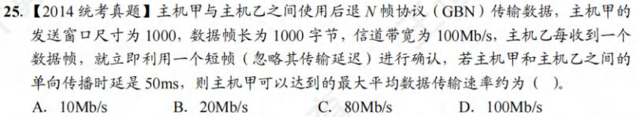
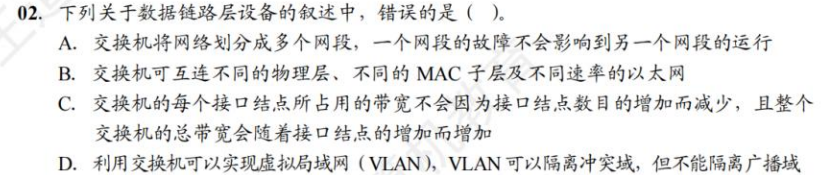
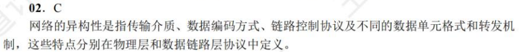

# 计算机网络笔记
[TOC]
## 第一章 概述 （主要内容为osi参考模型与tcp/ip参考模型）

### OSI参考模型

#### 物理层

要点：机械特性，电气特性，功能特性，过程特性

注意：传输所用到的物理媒体（双绞线，光纤，无线信道）在物理层下面，不属于物理层的范畴。

#### 数据链路层

要点：传输单位是帧；任务是将网络层传来的IP数据报组装成帧；功能是成帧、差错控制，流量控制和传输管理。

广播式网络在数据链路层上要处理新的问题：如何控制对共享信道的访问。因此数据链路层有一个特殊的子层：介质访问子层，用于处理该问题。

典型的数据链路层协议有：SDLC，HDLC，PPP，STP和帧中继等。

#### 网络层

要点：传输单位是数据报；关心通信子网的运行控制；主要任务是将网络层的分组传送到接收端。关键问题是对分组进行路由选择。功能是实现流量控制，拥塞控制，差错控制，网际互联等功能。

#### 传输层（运输层）

要点：传输单位是报文段（TCP）或用户数据报（UDP）；任务是主机间两个进程的通信；功能是为端到端连接提供可靠的传输服务，为端到端连接提供流量控制，差错控制，服务质量，数据传输管理等。

注意：数据链路层提供点到点通信，传输层提供端到端通信。（一个进程由一个端口来标识）；由于一台主机可同时运行多个进程，因此传输层具有复用和分用的功能。复用指多个应用层进程可同时使用下面的传输层服务，分用指传输层把收到的信息分别交付给上面的进程。

传输层的两个主要协议是TCP和UDP。

#### 会话层

要点：允许不同主机上的各进程进行会话。功能是建立、管理和终止会话。会话层可以使用校验点使通信会话在通信失效时能够从中断处重新开始，实现数据同步。

#### 表示层

要点：处理用户信息的表示问题，如数据格式转换，数据加密和数据压缩等。功能是将应用层数据转换为机器可以处理的格式，或将机器格式转换为用户可以理解的格式。

#### 应用层

要点：用户与网络的界面，使用的协议最多，比如HTTP，FTP，SMTP等。

****
****
****

## 第二章 物理层

### 1. 奈氏准则

要点：奈氏准则是指理想情况下，极限**码元**传输速率为2W波特，其中W为信道带宽，单位为Hz。（例如有16个不同的码元，就代表一个码元4个比特，传输速率为8W比特/秒）

### 2. 香农定理

要点：香农定理是指在理想情况下，极限**比特**传输速率为$$C = Wlog_2(1+\frac{S}{N})$$，其中W为信道带宽，单位为Hz，S为信号平均功率，N为信道噪声平均功率。S/N称为信噪比。

信噪比=$10log_{10}(\frac{S}{N})$,单位为dB。例如信噪比为30dB，代表信噪比为1000。

### 3. 编码

#### 3.1 数字信号

1）归零编码。在归零编码（RZ）中用高电平代表1、低电平代表0（或者相反），每个时钟周期的中间均跳变到低电平(归零)，接收方根据该跳变调整本方的时钟基准，这就为传输双方提供了自同步机制。由于归零需要占用一部分带宽，因此传输效率受到了一定的影响。

2）非归零编码。非归零编码（NRZ）与RZ编码的区别是不用归零，一个周期可以全部用来传输数据。但NRZ编码无法传递时钟信号，双方难以同步，因此若想传输高速同步数据，则需要都带有时钟线。

3）反向非归零编码。反向非归零编码（NRZI）与NRZ编码的区别是用信号的翻转代表0、信号保持不变代表1。翻转的信号本身可以作为一种通知机制。这种编码方式集成了前两种编码的优点，既能传输时钟信号，又能尽量不损失系统带宽。

    USB2.0通信的编码方式就是NRZI编码。

4）曼彻斯特编码。曼彻斯特编码（Manchester Encoding）位周期中心向上跳变代表0，向下跳变代表1，也可采用相反的规定。

该编码的特点是，在每个码元的中间出现电平跳变，位中间的跳变既作为时钟信号(可用于同步)，又作为数据信号，但它所占的频带宽度是原始基带宽度的两倍。

    注意：以太网使用的编码方式就是曼彻斯特编码。

5）差分曼彻斯特编码。每一位的中心都有跳变，位开始边界有跳变代表0，没有跳变代表1。该编码可以实现自同步且抗干扰性好。

#### 3.2 模拟信号

主要为调频，调幅，调相。还有一种正交振幅调制（QAM）。

#### 3.3 数字信号与模拟信号的转换

主要内容就是模拟数据编码为数字信号分三个步骤：采样，量化，编码。其中采样定理是指采样频率要大于信号最高频率的两倍。

****
****
****

## 第三章 数据链路层(考察重点)

### 3.1 数据链路层的功能

1）为网络层提供服务：无确认无连接，有确认无连接，有确认有连接。

2）链路管理

3）帧定界（成帧）（定义数据格式），帧同步，透明传输（解决在数据中出现与帧定界符相同的比特组合时的问题）

4）流量控制，控制相邻两结点之间数据链路上的流量。（传输层也有流量控制，但是是端到端的）

5）差错控制。错误一般分为位错和帧错。

位错指帧中某些位出错，通常采用循环冗余检验（CRC）来检测。，通过自动重传请求（ARQ）来纠正。

帧错指帧的丢失、重复、失序。引入定时器和编号机制来解决。

****

### 3.2 组帧

1）字符计数法。在帧的开头加上一个字符计数字段，表示该帧中字符的个数。

2）字符填充法。首先使用特定字符界定帧的开始和结束，然后在帧中出现特定字符时，在前面填充一个转义字符。

3）零比特填充法。以 01111110 作为帧的开始和结束标志，当数据中出现连续的5个1时，在其后面插入一个0。接收方在接收到连续的5个1时，自动删除后面的0。该方法容易由硬件实现，性能优于字符填充法。

4）违规编码法

在物理层进行比特编码时，通常采用违规编码法。例如，曼彻斯特编码方法将数据比特“1”编码成“高-低”电平对，将数据比特“0”编码成“低-高”电平对，而“高-高”电平对和“低一低”电平对在数据比特中是违规的(即没有采用）。可以借用这些违规编码序列来定界帧的起始和终止。局域网IEEE802标准就采用了这种方法。

违规编码法不需要采用任何填充技术，便能实现数据传输的透明性，但它只适用于采用冗余编码的特殊编码环境。

由于字符计数法中计数字段的脆弱性和字符填充法实现上的复杂性与不兼容性，目前较常用的组帧方法是零比特填充法和违规编码法。

    例题：

    在一个数据链路协议中使用下列字符编码：
    ESC 11100000;   FLAG 01111110；   A 01000111;     B 11100011;
    
    在使用下列成帧方法的情况下，说明为传送4个字符A、B、ESC、FLAG所组织的帧而实际发送的二进制位序列
    （使用FLAG作为首尾标志，ESC作为转义字符)。
    1）字符计数法。
    2）使用字符填充的首尾定界法。
    3）使用比特填充的首尾标志法。

    1）第一字节为所传输的字符计数5，转换为二进制为00000101
    后面依次为A、B、ESC、FLAG的二进制编码：

    00000101 01000111 11100011 11100000 01111110

    2）首尾标志位 FLAG（01111110）
    在所传输的数据中，若出现控制字符，则在该字符前插入转义字符ESC（11100000）：
    
    0111111001000111 11100011 11100000 11100000 11100000 01111110 01111110

    3）首尾标志位FLAG（01111110），在所传输的数据中，若连续出现5个“1”，则在其后插
    入“0”:
    01111110 01000111 110100011 111000000 011111010 01111110

****

### 3.3 差错控制

通常使用编码技术进行差错控制：主要有两类：自动重传请求（ARQ）和前向纠错编码（FEC）。

ARQ方式中，检测到差错就重传，FEC方式中，不仅能发现差错，还能确定比特串的错误位置，从而加以纠正。因此，差错控制可分为检错编码和纠错编码。

#### 3.3.1 检错编码

检错编码都采用冗余编码技术，常见的有奇偶校验码和循环冗余检验码（CRC）。

##### 1. 奇偶校验码

奇偶校验码是奇校验码和偶校验码的统称，是一种最基本的检错码。它由n-1位信息元和1位校验元组成。

如果是奇校验码，那么在附加一个校验元后，码长为n的码字中“1”的个数为奇数；如果是偶校验码，那么在附加一个校验元以后，码长为n的码字中“1”的个数为偶数。

它只能检测奇数位的出错情况，但并不知道哪些位错了，也不能发现偶数位的出错情况。

##### 2. 循环冗余检验码

发送方与接收方事先约定一个多项式G(x)（最高位和最低位必须为1），称为生成多项式。

发送方将生成多项式的系数作为除数，将待发送的比特串作为除数，进行除法运算，得到的余数作为校验码，附加在待发送的比特串后面，发送出去。

接收方将接收到的比特串作为除数，用生成多项式的系数作为除数，进行除法运算，如果余数为0，则认为接收正确，否则认为接收错误。

**除法过程为：在待发送的比特串后面补上r个0（r为生成多项式的阶），进行模2除法（即异或运算）。位数相同即够除商1，位数不够则商0。**

通过循环冗余码的检错技术，数据链路层做到了对帧的无差错接收。

#### 3.3.2 纠错编码

最常见的纠错编码：海明码。

其工作流程分四步：

1. 确定校验码位数r
2. 确定校验码和数据的位置
3. 求出校验码的值
4. 检错并纠错

海明距离：两个码字对应位不同的个数。一个有效编码集中，任意两个码字的海明距离的最小值称为该编码集的海明距离。要**检测**d位错误，海明距离至少为 d+1；要**纠正**d位错误，海明距离至少为 2d+1。

##### 3.2.1 确定校验码位数r

对于 m 位信息码，需要增加 r 位校验码，使得 m+r 位的码字满足
$$2^r \geq m+r+1 （对应 m+r 位各发生错误和全对）$$
根据m的值，确定r的值。

##### 3.2.2 确定校验码和数据的位置

首先将r位校验码从小到大放在$2^n$的位置上

##### 3.2.3 检错并纠错

Venn图（较短的数据可以使用）或者校验矩阵。

****

### 3.4 流量控制与可靠传输机制

#### 3.4.1 流量控制、可靠传输与滑动窗口机制

流量控制的基本方法是由接收方控制发送方发送数据的速率，常见方式有两种：停止-等待协议和滑动窗口协议。

1. 停止-等待协议。发送方每发送一帧，都要等待接收方的应答信号。传输效率很低
2. 滑动窗口协议。具有四个重要特性：

#### 3.4.2 后退N帧协议（GBN）

注意：

1. 累积确认：发送方只要收到确认帧，就认为该确认帧之前的所有帧都已经正确接收。
2. 按序接收：接收方只接收按序到达的帧，不按序到达的帧一律丢弃。
3. 采用n比特对帧编号，则发送窗口的尺寸满足 $1 < W \leq 2^n-1$，否则接收方无法区分新帧和旧帧。
4. 信道传输质量很差时，后退N帧协议不一定优于停止-等待协议。

#### 3.4.3 选择重传协议（SR）

注意：

1. 对数据帧逐一确认，收一个确认一个
2. 只重传出错帧
3. 接收方有缓存
4. 采用n比特对帧编号，则发送窗口的尺寸满足 $1 < W \leq 2^{n-1}$（注意与GBN区分），否则接收方无法区分新帧和旧帧。

#### 3.4.4 信道利用率（补充）

信道利用率是对发送方而言的，指发送方在一个发送周期内，发送数据的用时占整个发送周期的比例。

设发送周期 T ,期间发送 L 比特的数据，数据传输速率为 C ，则信道利用率为：
$$\eta = \frac{\frac{L}{C}}{T}$$
一般来讲，如单向传播时延为 R（往返时延为2R），发送周期为 T ，如果不考虑确认帧的发送时延，则有 $T = \frac{L}{C} + 2R$; 如果考虑确认帧的发送时延，切记将其加上。

！RTT是往返时延（2R）

**放几个例题**
****
****

****

****
****

****

****
****

### 3.5 介质访问控制

用来决定广播信道中信道分配的协议属于数据链路层的一个子层，称为介质访问控制（Medium Access Control，MAC）子层。

常见的介质访问控制方法有：信道划分，随机访问，轮询访问。其中前者是**静态**的，后两者是**动态**的。

#### 3.5.1 信道划分

分四种：频分多路复用（FDM），时分多路复用（TDM），波分多路复用（WDM），码分多路复用（CDM）。

码分多路复用更常用的名词是码分多址（Code Division Multiple Access，CDMA）。每个站点有一个码片各站点码片序列相互正交。接收站通过将受到的信号与各站点的码片进行规格化内积，得到1/-1以确定数据来源。

#### 3.5.2 随机访问

常用协议有：ALOHA，CSMA，CSMA/CD，CSMA/CA。随机访问介质访问控制协议又称争用型协议。

##### 1. ALOHA

ALOHA协议是最早的随机访问协议，分为纯ALOHA和时隙ALOHA。

纯ALOHA：当一个站点有数据要发送时，就立即发送，发送完毕后，等待确认帧。如果在发送过程中发生冲突，则等待一个随机时间后再次发送。

时隙ALOHA：将时间划分为固定长度的时隙，每个时隙的开始都是一个时钟脉冲，每个站点在一个时隙内只能发送一帧，如果在发送过程中发生冲突，则等待一个随机时间后再次发送。

##### 2. CSMA

CSMA协议是载波监听多路访问协议（Carrier Sense Multiple Access，CSMA）的简称。比ALOHA协议多了一个载波监听装置。

根据监听方式和监听到信道忙后的处理方式不同，CSMA协议分为1-坚持CSMA，非坚持CSMA，p-坚持CSMA。

> (1) 1-坚持CSMA。当一个站点有数据要发送时，先监听信道，如果信道空闲，则立即发送；如果信道忙，则等待一个随机时间后再次监听，直到信道空闲，然后立即发送。
> 
>   ”1-坚持“是指，监听到信道忙后，继续坚持监听信道；监听到信道空闲后，发送帧的概率为1，即立刻发送数据。

> (2) 非坚持CSMA。一个结点要发送数据时，首先监听信道：如果信道空闲，那么立即发送数据；如果信道忙，那么放弃监听，等待一个随机的时间后再重复上述过程。
>
> 非坚持CSMA协议在监听到信道忙后就放弃监听，因此降低了多个结点等待信道空闲后同时发送数据导致冲突的概率，但也会增加数据在网络中的平均延迟。可见，信道利用率的提高是以增加数据在网络中的延迟时间为代价的。

> (3) p-坚持CSMA。一个结点要发送数据时，首先监听信道：如果信道空闲，那么以概率p发送数据，以概率1-p推迟到下一个时隙，该过程一直持续到数据发送成功或信道忙为止。
>
> 采用坚持“监听”的目的是，试图克服非坚持CSMA协议中由于随机等待而造成的延迟时间较长的缺点。因此，P-坚持CSMA协议是非坚持CSMA协议和1-坚持CSMA协议的折中方案。

##### 3. CSMA/CD

CSMA/CD协议是载波监听多路访问协议/碰撞（CSMA/CD）检测协议的简称。适用于总线型网络或半双工网络环境。（全双工没有冲突）

****

**载波监听**是指每个站点在**发送前和发送中**都必须不停地检测信道。在**发送前**检测信道是为了获得发送权，在**发送中**检测信道是为了及时发现发送的数据是否发生了碰撞。站点要发送数据前先监听信道，只有信道空闲才能发送。

****

**碰撞检测**(Collision Detection)就是边发送边监听，如果监听到了碰撞，则立即停止数据发送，等待一段随机时间后，重新开始尝试发送数据。

由于对于单程传播时延 $\tau$ ,一个站在发送帧后，最多经过 $2\tau$ 的时间，就能检测到碰撞，因此，把以太网端到端往返时间 $2\tau$ 称为**争用期**（又称冲突窗口或碰撞窗口）。

为避免发送过短帧导致发送时没有检测到碰撞，以太网规定了最小帧长：
$$最小帧长=总线传播时延 \times 数据传输速率 \times 2$$

**（实际中以太网最小帧长规定为64B）**

如果要发送的帧长小于最小帧长，则在帧尾部填充一些比特，使得帧长达到最小帧长。

****

**冲突恢复**：CSMA/CD协议采用截断二进制指数退避算法解决碰撞问题。

（1）确定基本退避时间，一般取两倍的总线端到端传播时延2$\tau$(即争用期)。

（2）定义参数k，它等于重传次数，但k不超过10,即k=min[重传次数，10]。当重传次数不超过10时，k等于重传次数：**当重传次数大于10时，k就不再增大而一直等于10**（易忽略）。

（3）从离散的整数集合[0，1，…，2*-1]中随机取出一个数r，重传所需退避的时间就是r倍的
smg基本退避时间，即$2r\tau$。

（4）当重传达**16次**仍不能成功时，说明网络太拥挤，认为此帧永远无法正确发出，抛弃此帧
并向高层报告出错(易忽略)。

****
****

##### 4. CSMA/CA

CSMA/CD适用与有线局域网，但无限局域网存在信号检测难，有“隐蔽站”问题。因此，802.11标准定义了**CSMA/CA协议**。

**CA**（Collision Avoidance），即碰撞避免。碰撞避免并不是指协议可以完全避免碰撞，而是指协议的设计要尽量降低碰撞概率。

****

无线信道通信质量差，802.11使用确认/重传（ARQ）机制

****

为避免碰撞，802.11规定所有的站完成发送后，必须再等待一段很短的时间（继续监听）才能发送下一帧。这段时间称为帧间间隔(InterFrame Space,IFS)。帧间间隔的长短取决于该站要发送的帧的类型。802.11使用了下列三种IFS：

（1）SIFS（短IFS）：最短的IFS，用来分隔属于一次对话的各帧，使用SIFS的帧类型有ACK帧、CTS帧、分片后的数据帧，以及所有回答AP探询的帧等。

（2）PIFS（点协调IFS）：中等长度的IFS，在PCF操作中使用。

（3）DIFS（分布式协调IFS）：最长的IFS，用于异步帧竞争访问的时延

****

CSMA/CA与CSMA/CD的退避算法稍有区别，具体见教材。

****

为了处理隐蔽站问题，可以采取信道预约RTS/CTS机制。即发送RTS帧，接收方回复CTS帧，然后发送数据帧。信道预约不强制，各站可自行决定是否使用。只有数据帧长度超过某一数值，使用RTS/CTS机制才有意义。

****

CSMA/CD与CSMA/CA的区别：

1. CSMA/CD可以检测冲突，但无法避兔：CSMA/CA发送数据的同时不能检测信道上有无冲突，本结点处没有冲突并不意味着在接收结点处就没有冲突，只能尽量避免。
2. 传输介质不同。CSMA/CD用于总线形以太网，CSMA/CA用于无线局域网802.11a/b/g/n等。
3. 检测方式不同。CSMA/CD通过电缆中的电压变化来检测：而CSMA/CA采用能量检测、载波检测和能量载波混合检测三种检测信道空闲的方式。

****

#### 3.5.3 轮询访问:令牌传递协议

注意：

1. 在令牌传递网络中，传输介质的物理拓扑不必是一个环，但是为了把对介质访问的许可从一个设备传递到另一个设备，令牌在设备间的传递通路逻辑上必须是一个环。
2. 轮询介质访问控制非常适合负载很高的广播信道。所谓负载很高的信道，是指多个结点在同一时刻发送数据概率很大的信道。

****

### 3.6 局域网

#### 3.6.1 局域网的基本概念和体系结构

局域网的特性主要由三个要素决定：拓扑结构、传输介质、介质访问控制方式，其中最重要的是介质访问控制方式，它决定着局域网的技术特性。

常见的局域网拓扑结构主要有以下4大类：①星形结构；②环形结构：③总线形结构：④星形和总线形结合的复合型结构。

局域网可以使用双绞线、铜缆和光纤等多种传输介质，其中双绞线为主流传输介质。

局域网的介质访问控制方法主要有CSMA/CD、令牌总线和令牌环，其中前两种方法主要用
于总线形局域网，令牌环主要用于环形局域网。

三种特殊的局域网拓扑实现如下：

* **以太网**（目前使用范围最广的局域网）。逻辑拓扑是总线形结构，物理拓扑是星形或拓展星形结构。
* 令牌环（Token Ring，IEEE 802.5）。逻辑拓扑是环形结构，物理拓扑是星形结构。
* FDDI（光纤分布数字接口，IEEE802.8）。逻辑拓扑是环形结构，物理拓扑是双环结构。IEEE802标准定义的局域网参考模型只对应于OSI参考模型的数据链路层和物理层，并将数据链路层拆分为两个子层：逻辑链路控制（LLC）子层和媒体接入控制（MAC）子层。与接入传输媒体有关的内容都放在MAC子层，它向上层屏蔽对物理层访问的各种差异，提供对物理层的统一访问接口，主要功能包括：组帧和拆卸帧、比特传输差错检测、透明传输。LLC子层与传输媒体无关，它向网络层提供无确认无连接、面向连接、带确认无连接、高速传送4种不同的连接服务类型。

由于以太网占据市场，LLC子层作用已经不大，现在许多网卡只装有MAC协议，没有LLC协议。

#### 3.6.2 以太网与IEEE802.3

IEEE802.3标准是一种基带总线形的局域网标准，它描述物理层和数据链路层的MAC子层的实现方法。

以太网逻辑上采用总线形拓扑结构，以太网中的所有计算机共享同一条总线，信息以广播方
式发送。使用CSMA/CD方式对总线进行访问控制。

严格来说，以太网应当是指符合 DIX Ethernet V2标准的局域网，但DIX Ethernet V2标准与
IEEE802.3标准只有很小的差别，因此通常将802.3局域网简称为以太网。

以太网采用两项措施以简化通信：①采用无连接的工作方式，不对发送的数据帧编号，也不
要求接收方发送确认，即以太网尽最大努力交付数据，提供的是不可靠服务，对于差错的纠正则
由高层完成：②发送的数据都使用曼彻斯特编码的信号，每个码元的中间出现一次电压转换，接
收端利用这种电压转换方便地把位同步信号提取出来。

##### 1. 以太网的传输介质与网卡
   
以太网常用的传输介质有4种：粗缆、细缆、双绞线和光纤。各种传输介质的适用情况见下表。

| 参数                   | 10BASE5              | 10BASE2              | 10BASE-T             | 10BASE-FL            |
|-----------------------|----------------------|----------------------|----------------------|----------------------|
| 传输媒体             | 基带同轴电缆（粗缆） | 基带间轴电缆（细缆） | 非屏蔽双绞线        | 光纤对（850nm）     |
| 编码                   | 曼彻斯特编码        | 曼彻斯特编码        | 曼彻斯特编码        | 曼彻斯特编码        |
| 拓扑结构             | 总线形               | 总线形               | 星形                  | 点对点               |
| 最大段长             | 500m                | 185m                | 100m                | 2000m               |
| 最多结点数目       | 100                 | 30                   | 2                    | 2                    |

注意：10BASE-T 非屏蔽双绞线以太网拓扑结构为星形网，星形网中心为集线器，但使用集线器的以太网在逻辑上仍然是一个总线形网，属于一个冲突域。上表的内容是常识，例如题目中出现10BASE5时，是不会显式地告诉你它的传输媒体、编码方式、拓扑结构等信息的。

##### 2. 以太网的帧格式

每块网卡中的MAC地址也称物理地址；**MAC地址长6字节**，一般用由连字符（或冒号）分隔的12个十六进制数表示，如02-60-8c-e4-b1-21。高24位为厂商代码，低24位为厂商自行分配的网卡序列号。

##### 3. 高速以太网

速率达到或超过100Mb/s的以太网称为高速以太网。

（1）100BASE-T以太网

    介质：双绞线
    速度：100Mb/s
    拓扑结构：星形
    协议：CSMA/CD
    既支持全双工方式，又支持半双工方式，可在全双工方式下工作而无冲突发生，因此在全双工方式下不使用CSMA/CD协议。
    MAC帧格式仍然是802.3标准规定的。保持最短帧长不变，但将一个网段的最大电缆长度减到100m。帧间时间间隔从原来的9.6μs改为现在的0.96μs。

（2）吉比特以太网（千兆以太网）

    介质：双绞线
    允许在1Gb/s速率下用全双工和半双工两种方式工作。
    使用802.3协议规定的帧格式。
    在半双工方式下使用CSMA/CD协议（全双工方式不需要使用CSMA/CD协议）。
    与10BASE-T和100BASE-T技术向后兼容。

（3）10吉比特以太网

    介质：光纤
    只工作在全双工方式，因此没有争用问题，也不使用CSMA/CD协议。
    与10Mb/s、100Mb/s和1Gb/s以太网的帧格式完全相同。
    保留了802.3标准规定的以太网最小和最大帧长，便于升级。

****

### 3.7 广域网

#### 3.7.1 广域网的基本概念

常见的广域网数据链路层协议是PPP协议和HDLC协议。HDLC现已很少使用。

#### 3.7.2 PPP协议

点对点协议（Point-to-Point Protocol，PPP）是使用串行线路通信的面向字节的协议。

PPP协议有三个组成部分：
1. 链路控制协议（LCP）。用于建立、配置、测试和管理数据链路。
2. 网络控制协议（NCP）。PPP协议允许同时采用多种网络层协议，每个不同的网络层协议要用一个相应的NCP来配置，为网络层协议建立和配置逻辑连接。
3. 一个将IP数据报封装到串行链路的方法（成帧）。IP数据报在PPP帧中就是其信息部分，这个信息部分的长度受最大传送单元（MTU）的限制。

PPP协议的特点：
1. PPP提供差错检测但不提供纠错功能，只保证无差错接收（通过硬件进行CRC校验）。它是不可靠的传输协议，因此也不使用序号和确认机制。
2. 它仅支持点对点的链路通信，不支持多点线路。
3. PPP只支持全双工链路。
4. PPP的两端可以运行不同的网络层协议，但仍然可使用同一个PPP进行通信。
5. PPP是面向字节的，当信息字段出现和标志字段一致的比特组合时，PPP有两种不同的处理方法：若PPP用在异步线路（默认），则采用字符填充法；若PPP用在SONET/SDH等同步线路，则协议规定采用硬件来完成比特填充（和HDLC的做法一样）。

****

### 3.8 数据链路层设备

#### 3.8.1 网桥

大纲已经删去，理解为单个端口的交换机即可。

#### 3.8.2 交换机

交换机是一种多端口的网桥，通常工作在全双工方式下。可以方便的实现虚拟局域网VLAN。

对于传统 10Mb/s 以太网，若有N个用户，则每个用户的平均带宽只有 10/N Mb/s。但采用交换机（默认全双工）后，每个用户的平均带宽为 10 Mb/s。，交换机总容量为 N*10 Mb/s。这是交换机最大优点

交换机主要有两种工作方式：存储转发方式和直通方式。
1. 存储转发方式。交换机接收到一个帧后，先把整个帧存储在缓存区，检查数据是否正确，然后再从缓存区取出整个帧进行处理。这种方式可靠性高，能支持不同速率端口间的转换，但延迟较大。
2. 直通方式。交换机接收到一个帧后，先检查**目的地址**（以太网帧的目的地址占6B），然后立即转发该帧。这种方式延迟小，但可靠性低。

### 第三章例题
****
****

****

****
****

****
****

****

****
****

****

****
****

****

****
****

## 第四章 网络层（考察重点MAX PRO PLUS）

### 4.1 网络层的功能

#### 4.1.1 异构网络互联

略

#### 4.1.2 路由与转发

路由器完成两个功能：路由选择和分组转发。

#### 4.1.3 SDN的基本概念

网络层的主要任务是转发和路由选择。可以将网络层抽象地划分为数据平面（也称转发层面）和控制平面，转发是数据平面实现的功能，而路由选择是控制平面实现的功能。

软件定义网络（SDN）是近年流行的一种创新网络架构，它采用**集中式的控制平面**和**分布式的数据平面**，两个平面相互分离，控制平面利用控制-数据接口对数据平面上的路由器进行集中式控制，方便软件来控制网络。

在传统互联网中，每个路由器既有转发表又有路由选择软件，也就是说，既有数据平面又有控制平面。但是在SDN结构中，路由器不再需要路由选择软件，路由器之间不再相互交换路由信息。

在网络的控制平面有一个逻辑上的远程控制器（可以由多个服务器组成）。远程控制器掌握各主机和整个网络的状态，为每个分组计算出最佳路由，通过Openflow协议（也可以通过其他途径）将转发表(在SDN中称为流表)下发给路由器。路由器的工作很单纯，即收到分组、查找转发表、转发分组。

这样，网络又变成集中控制的，本来互联网是分布式的。SDN并非要把整个互联网都改造成集中控制模式，这是不现实的。然而，在某些具体条件下，特别是像一些大型的数据中心之间的广域网，使用SDN模式来建造，就可以使网络的运行效率更高。

****

SDN的可编程性通过为开发者们提供强大的编程接口，使得网络具有很好的编程性。

对上层应用的开发者，SDN提供的编程接口称为北向接口，北向接口提供了一系列丰富的API，开发者可以在此基础上设计自己的应用，而不必关心底层的硬件细节。

SDN控制器和转发设备建立双向会话的接口称为南向接口，通过不同的南向接口协议（如Openflow），SDN控制器就可兼容不同的硬件设备，同时可以在设备中实现上层应用的逻辑。

SDN控制器集群内部控制器之间的通信接口称为东西向接口，用于增强整个控制平面的可靠性和可拓展性。

****

SDN的优点：①全局集中式控制和分布式高速转发，既利于控制平面的全局优化，又利于高性能的网络转发。②灵活可编程与性能的平衡，控制和转发功能分离后，使得网络可以由专有的自动化工具以编程方式配置。③降低成本，控制和数据平面分离后，尤其是在使用开放的接口协议后，就实现了网络设备的制造与功能软件的开发相分离，从而有效降低了成本。

SDN的问题：①安全风险，集中管理容易受攻击，如果崩溃，整个网络会受到影响。②瓶颈问题，原本分布式的控制平面集中化后，随着网络规模扩大，控制器可能成为网络性能的瓶颈。

### 4.2 路由算法

#### 4.2.1 静态路由和动态路由

常见的动态路由算法有距离-向量路由算法和链路状态路由算法。

#### 4.2.2 距离-向量路由算法

最常见的距离-向量路由算法是RIP协议。

#### 4.2.3 链路状态路由算法

最常见的链路状态路由算法是OSPF协议。

#### 4.2.4 层次路由

因特网将整个互联网划分为许多较小的自治系统（注意一个自治系统中包含很多局域网），每个自治系统有权自主地决定本系统内应采用何种路由选择协议。如果两个自治系统需要通信，那么就需要一种在两个自治系统之间的协议来屏蔽这些差异。据此，因特网把路由选择协议划分为两大类：

1. 一个自治系统内部所使用的路由选择协议称为内部网关协议(IGP)，也称域内路由选择，
具体的协议有RIP和OSPF等。

2. 自治系统之间所使用的路由选择协议称为外部网关协议(EGP)，也称域间路由选择，用
在不同自治系统的路由器之间交换路由信息，并负责为分组在不同自治系统之间选择最
优的路径。具体的协议有BGP。

使用层次路由时，OSPF将一个自治系统再划分为若干区域（Area），每个路由器都知道在本区域内如何把分组路由到目的地的细节，但不用知道其他区域的内部结构。

采用分层次划分区域的方法虽然会使交换信息的种类增多，也会使OSPF协议更加复杂。但这样做却能使每个区域内部交换路由信息的通信量大大减小，因而使OSPF协议能够用于规模很大的自治系统中。

### 4.3 IPv4

#### 4.3.1 IPv4分组

##### 1. IPv4分组格式

1. 版本号：4位，通信双方使用的IP协议版本必须一致。目前广泛使用的版本号为4
2. 首部长度：4位，单位为4字节。
   
   最小十进制取值为5，表示IP数据报首部只有 5*4=20 字节固定部分；
   
   最大十进制取值为15，表示IP数据报首部包含20字节固定部分和最大40字节可变部分，总计 15*4=60 字节。

3. 区分服务：8位，利用该字段的不同数值可提供不同等级的服务质量。只有在使用区分服务时，该字段才起作用。一般情况下都不使用该字段。
4. 总长度：16位，指首部和数据部分的总长度，单位为字节。最大长度为65535B。以太网帧的最大传送单元（MTU）为1500B，因此当一个IP数据报封装成帧时，数据报的总长度（首部加数据）一定不能超过下面的数据链路层的MTU值。
5. 标识: 占16位。它是一个计数器，每产生一个数据报就加1，并赋值给标识字段。但它并不是“序号”(因为IP是无连接服务)。当一个数据报的长度超过网络的MTU时，必须分片，此时每个数据报片都复制一次标识号，以便能正确重装成原来的数据报。
6. 标志。3位。
   
    最低位：DF（Don’t Fragment）位：1表示不允许分片；0表示允许分片

    中间位：MF（More Fragment）位：1表示“后面还有分片”；0表示“这是最后一个分片“

    最高位：保留位：必须为0

7. 片偏移: 13位。它指出较长的分组在分片后，某片在原分组中的相对位置。片偏移以8个字节为偏移单位。除最后一个分片外，每个分片的长度一定是8B的整数倍。
8. 生存时间（TTL）：8位。数据报在网络中可通过的路由器数的最大值，标识分组在网络中的寿命，以确保分组不会永远在网络中循环。路由器在转发分组前，先把TTL减l。若TTL被减为0，则该分组必须丢弃。
9. 协议: 8位。指出此分组携带的数据使用何种协议，即分组的数据部分应上交给哪个协议进行处理，如TCP、UDP等。其中值6表示TCP，值为17表示UDP。
10. 首部校验和: 16位。首部校验和只校验分组的首部，而不校验数据部分。
11. 源地址字段: 4B，标识发送方的IP地址。
12. 目的地址字段: 4B，标识接收方的IP地址。

**注意：在IP数据报首部中有三个关于长度的标记，首部长度、总长度、片偏移，基本单位分别为4B、1B、8B（需要记住）。题目中经常会出现这几个长度之间的加减运算。另外，要熟悉IP数据报首部的各个字段的意义和功能，但不需要记忆IP数据报的首部，正常情况下如果需要参考首部，题目都会直接给出。第5章学到的TCP、UDP的首部也是一样的。**

##### 2. IPv4分组分片

举例如下：

#### 4.3.2 IPv4地址与NAT

##### 1. IPv4地址

互联网早期使用分类的IP地址：

在各类IP地址中，有些IP地址具有特殊用途，不用做主机的IP地址：
* 主机号全为0表示本网络本身
* 主机号全为1表示本网络的广播地址，又称直接广播地址
* 127.×.×.×保留为环回自检（Loopback Test）地址，此地址表示任意主机本身，目的地址为环回地址的IP数据报永远不会出现在任何网络上。
* 32位全为0，即0.0.0.0表示本网络上的本主机。
* 32位全为1，即255.255.255.255表示整个TCP/IP网络的广播地址，又称受限广播地址。实际使用时，由于路由器对广播域的隔离，255.255.255.255等效为本网络的广播地址。

##### 2. 网络地址转换NAT

NAT（Network Address Translation，网络地址转换）是指通过将专用网络地址转换为公用地址，从而对外隐藏内部管理的IP地址。它使得整个专用网只需要一个全球IP地址就可以与因特网连通，由于专用网本地IP地址是可重用的，所以NAT大大节省了IP地址的消耗。同时，它隐藏了内部网络结构，从而降低了内部网络受到攻击的风险。

此外，为了网络安全，划出了部分IP地址为私有IP地址。私有IP地址只用于LAN，不用于WAN连接（因此私有IP地址不能直接用于Internet,必须通过网关利用NAT把私有IP地址转换为lnternet中合法的全球IP地址后才能用于Internet），并且允许私有IP地址被LAN重复使用。这有效地解决了IP地址不足的问题。

私有IP地址的范围如下：
* A类：1个，即10.0.0.0 - 10.255.255.255
* B类：16个，即172.16.0.0 - 172.31.255.255
* C类：256个，即192.168.0.0 -1 192.168.255.255

NAT表项需要管理员添加。

#### 4.3.3 子网划分与子网掩码、CIDR

##### 1. 子网划分

从1985年起，在IP地址中又增加了一个“子网号字段”，使两级IP地址变成了三级IP地址。这种做法称为子网划分。子网划分已成为因特网的正式标准协议。

##### 2. 子网掩码

略

##### 3. 无分类编址CIDR

CIDR是一种归并网络的技术，作用是把小的网络汇聚成大的超网。

注意：CIDR地址块中的地址数一定是2的整数次幂。

##### 4. 网络层转发分组的过程

略

#### 4.3.4 ARP、DHCP与ICMP

##### 1. IP地址与硬件地址

略

##### 2. ARP协议

ARP(Address Resolution Protocol，地址解析协议)用于将IP地址解析为MAC地址。每台主机都设有一个ARP高速缓存，用来存放本局域网上各主机和路由器的IP地址到MAC地址的映射表，称ARP表。使用ARP来动态维护此ARP表。

由于ARP“看到了”IP地址，说明其工作在网络层。当主机发送IP数据报时先在ARP表中查找目的IP地址对应的MAC地址，若找到则直接发送，若找不到则发送MAC地址为FF-FF-FF-FF-FF-FF（广播）的RP请求分组，收到请求的主机发送ARP相应分组（单播）。

##### 3. DHCP协议（动态主机配置协议）

动态主机配置协议DHCP（Dynamic Host Configuration Protocol）是**应用层**协议，使用**客户/服务器**方式，客户端和服务端通过**广播**方式进行交互，基于**UDP**。

DHCP服务器和DHCP客户端的交换过程如下：

1. DHCP客户机广播“**DHCP发现**”消息，试图找到网络中的DHCP服务器，以便从DHCP服务器获得一个IP地址。源地址为0.0.0.0，目的地址为255.255.255.255。
2. DHCP服务器收到“**DHCP发现**”消息后，广播“DHCP提供”消息，其中包括提供给DHCP客户机的IP地址。源地址为DHCP服务器地址，目的地址为255.255.255.255。
3. DHCP客户机收到“**DHCP提供**”消息，如果接受该IP地址，那么就广播“DHCP请求”消息向DHCw服务器请求提供IP地址。源地址为0.0.0.0，目的地址为255.255.255.255。
4. DHCP服务器广播“**DHCP确认**”消息，将IP地址分配给DHCP客户机。源地址为DHCP服务器地址，目的地址为255.255.255.255。

##### 4. ICMP协议（网际控制报文协议）

网际控制报文协议（Internet Control Message Protocol，ICMP）是网络层协议。ICMP报文种类有两种：差错报告报文和询问报文。

ICMP差错报告报文的差错类型有以下5种常用类型：
1. 终点不可达：路由器或主机不能交付数据报
2. 源点抑制：当路由器或主机因为拥塞而丢弃数据报时，就向源主机发送源点抑制报文，要求源主机降低发送速率。
    注：最新的ICMP标准[RFC6633]已不再使用源点抑制报文。
3. 时间超过：当路由器收到生存时间（TTL）为零的数据报时，除丢弃该数据报外，还要向源点发送时间超过报文。当终点在预先规定的时间内不能收到一个数据报的全部数据报片时，就把己收到的数据报片都丢弃，并向源点发送时间超过报文。
4. 参数问题。当路由器或目的主机收到的数据报的首部中有的字段的值不正确时，就丢弃该数据报，并向源点发送参数问题报文。
5. 改变路由（重定向）。路由器把改变路由报文发送给主机，让主机知道下次应将数据报发送给另外的路由器（可通过更好的路由）。

不应发送ICMP差错报告报文的几种情况如下：
1. 对ICMP差错报告报文不再发送ICMP差错报告报文。
2. 对第一个分片的数据报片的所有后续数据报片都不发送ICMP差错报告报文。
3. 对具有组播地址的数据报都不发送ICMP差错报告报文。
4. 对具有特殊地址（如127.0.0.0或0.0.0.0）的数据报不发送ICMP差错报告报文。

### 4.4 IPv6

#### 4.4.1 IPv6的主要特点

IPv6的主要特点如下：
1. 更大的地址空间。IPv6将地址从IPv4的32位增大到了128位（16B）
2. 扩展的地址层次结构。
3. 灵活的首部格式。
4. 改进的选项。这一改变对新的分组首部很重要，因为一些从前必要的段现在变成了可选段。此外，表示选项的方式的改变还能加快分组的处理速度。
5. 允许协议继续扩充。
6. 支持即插即用（即自动配置）。
7. 支持资源的预分配。
8. IPv6只有在包的源结点才能分片，是端到端的，传输路径中的路由器不能分片，所以从一般意义上说，IPv6不允许分片（不允许类似IPv4的路由分片）。
9. IPv6首部长度必须是8B的整数倍，而IPv4首部是4B的整数倍。
10.  增大了安全性。身份验证和保密功能是IPv6的关键特征。

注意：IPv6简化了IP分组头、只包含8个域（IPv4有12个域），这使得路由器可更快处理分组，改善吞吐率

#### 4.4.2 IPv6地址

IPv6数据报可以单播、多播和任播。

### 4.3-4.4例题
****
****

****

****
****

****

****
****

****

****
****

参考答案：
1. 202.118.1.0/25 与 202.118.1.128/25 分别分给两个子网
2. R1专门为域名服务器设定了一个特定的路由表项，因此该路由表项中的子网掩码应为255.255.255.255（只有和全1的子网掩码相与时，才能完全保证和目的IP地址一样，从而选择该特定路由）。对应的下一跳转发地址是202.118.2.2，转发接口是L0。

    
**你会回来的**

   R1到互联网的路由实质上相当于一个默认路由（即当某一目的网络IP地址与路由表中其他任何一项都不匹配时，匹配该默认路表项），**默认路由一般写为0/0，即目的地址为0.0.0.0，子网掩码为0.0.0.0**。对应的下一跳转发地址是202.118.2.2，转发接口是L0。

|目的网络IP地址|子网掩码|下一跳IP地址|接口|
|--------------|--------|------------|----|
|202.118.1.0|255.255.255.128|——|E1|
|202.118.1.128|255.255.255.128|——|E2|
|202.118.3.2|255.255.255.255|202.118.2.2|L0|
|0.0.0.0|0.0.0.0|202.118.2.2|L0|

1. 局域网1和局域网2的地址可以聚合为202.118.1.0/24。

|目的网络IP地址|子网掩码|下一跳IP地址|接口|
|--------------|--------|------------|----|
|202.118.1.0|255.255.255.0|202.118.2.1|L0|

****
****

****

****
****

****

****
****

****

****
****

### 4.5 路由协议
#### 4.5.1 自治系统
略
#### 4.5.2 域内路由与域间路由

1. 内部网关协议（Interior Gateway Protocol，IGP）：用于自治系统内部的路由选择协议，与互联网中其他自治系统的路由选择协议无关。目前使用最多，如RIP和OSPF。

2. 外部网关协议（Exterior Gateway Protocol，EGP）：用于自治系统之间的路由选择协议，目前使用最多的是BGP-4。

#### 4.5.3 RIP协议

路由信息协议（Routing Information Protocol，RIP）是一种IGP协议，其为 **分布式的** **距离-向量** 路由选择协议，最大优点是简单。RIP是应用层协议，使用UDP传输数据（端口520）。

##### 1. RIP规定：

1. 网络中的每个路由器都要维护从它自身到其他每个目的网络的距离记录（称距离向量）
2. 距离也称跳数(Hop Count)，规定从一个路由器到直接连接网络的距离(跳数）为1。
每经过一个路由器，距离（跳数）加1。
3. RIP优先选择跳数少的路径。
4. RIP允许一条路径最多只能包含15个路由器（即最多允许15跳）。因此距离等于16时，
它表示网络不可达。可见RIP只适用于小型互联网。距离向量路由可能会出现环路的情
况，规定路径上的最高跳数的目的是为了防止数据报不断循环在环路上，减少网络拥塞
的可能性。
5. RIP默认在任意两个使用RIP的路由器之间每30秒广播一次RIP路由更新信息，以便自
动建立并维护路由表（动态维护）。
6. 在RIP中不支持子网掩码的RIP广播，所以RIP中每个网络的子网掩码必须相同。但在
新的RIP2中，支持变长子网掩码和CIDR。

##### 2. RIP特点

1. 仅和相邻路由器交换信息。
2. 路由器交换的信息是当前路由器所知道的全部信息，即自己的路由表。
3. 按固定的时间间隔交换路由信息，如每隔30秒。

##### 3. 距离向量算法：

##### 4. RIP缺点

1. 由于15跳上限，网络规模受限
2. 由于交换完整路由表，网络规模越大开销越大
3. 网络故障时收敛慢

#### 4.5.4 OSPF协议

##### 1. OSPF基本特点

开放最短路径优先（Open Shortest Path First，OSPF）是一种IGP协议，其为 **分布式的** **链路状态** 路由选择协议，。

OSPF与RIP有以下4点主要区别：

    (1) OSPF向本自治系统中的所有路由器发送信息，使用的方法是洪泛法。
    
        而RIP仅向相邻的路由器发送信息。

    (2) 发送的信息是与本路由器相邻的所有路由器的链路状态，但这只是路由器所知道的部分信息。
    “链路状态”说明本路由器和哪些路由器相邻及该链路的“度量”（或代价）。
    
        而在RIP中，发送的信息是本路由器所知道的全部信息，即整个路由表。

    (3) 只有当链路状态发生变化时，路由器才用洪泛法向所有路由器发送此信息，并且更新过
    程收敛得快，不会出现RIP“坏消息传得慢”的问题。
    
        而在RIP中，不管网络拓扑是否发生变化，路由器之间都会定期交换路由表的信息。

    (4) OSPF是网络层协议，它不使用UDP或TCP，而直接用IP数据报传送（其IP数据报首
    部的协议字段为89）。
    
        而RIP是应用层协议，它在传输层使用UDP。

除以上区别外，OSPF还有以下特点：

    （1）OSPF对不同的链路可根据IP分组的不同服务类型（TOS）而设置成不同的代价。
        因此OSPF对于不同类型的业务可计算出不同的路由，十分灵活。

    （2）如果到同一个目的网络有多条相同代价的路径，那么可以将通信量分配给这几条路径。
        这称为多路径间的负载平衡。

    （3）所有在OSPF-路由器之间交换的分组都具有鉴别功能，因而保证了仅在可信赖的路由器
        之间交换链路状态信息。

    （4) 支持可变长度的子网划分和无分类编址CIDR。

    （5）每个链路状态都带上一个32位的序号，序号越大，状态就越新。

##### 2. OSPF的基本工作原理

首先各路由器交换信息，建立链路状态数据库（全网拓扑结构图），每个路由器使用Dijkstra算法计算出到各个目的网络的最短路径，构造自己的路由表。

为使OSPF能用于大规模网络，OSPF将一个自治系统划分为若干更小范围，称为区域。

##### 3. OSPF的五种分组类型
OSPF共有以下五种分组类型：

    1）问候分组，用来发现和维持邻站的可达性。

    2）数据库描述分组，向邻站给出自己的链路状态数据库中的所有链路状态项目的摘要信息。

    3）链路状态请求分组，向对方请求发送某些链路状态项目的详细信息。

    4）链路状态更新分组，用洪泛法对全网更新链路状态。

    5）链路状态确认分组，对链路更新分组的确认。

#### 4.5.5 BGP协议

边界网关协议（Border Gateway Protocol，BGP）是不同自治系统的路由器之间交换路由信息的协议，是一种外部网关协议。

边界网关协议(BGP)只能力求寻找一条能够到达目的网络且比较好的路由(不能兜圈子)，而并非寻找一条最佳路由。

BGP采用的是路径向量路由选择协议，它与距离向量协议和链路状态协议有很大的区别。BGP是应用层协议，它则基于TCP。

BGP的工作原理如下：

每个自治系统的管理员要选择至少一个路由器（可以有多个）作为该自治系统的“BGP发言人”。一个BGP发言人与其他自治系统中的BGP发言人要交换路由信息，就要先建立TCP连接（可见BGP报文是通过TCP传送的，也就是说BGP报文是TCP报文的数据部分），然后在此连接上交换BGP报文以建立BGP会话，再利用BGP会话交换路由信息。当所有BGP发言人都相互交换网络可达性的信息后，各BGP发言人就可找出到达各个自治系统的较好路由。

每个BGP发言人除必须运行BGP外，还必须运行该AS所用的内部网关协议，如OSPF或RIP。

BGP所交换的网络可达性信息就是要到达某个网络(用网络前缀表示)所要经过的一系列AS。

BGP-4使用4种报文：
    1）打开（Open）报文。用来与相邻的另一个BGP发言人建立关系。
    2）更新（Update）报文。用来发送某一路由的信息，以及列出要撤销的多条路由。
    3）保活（Keepalive）报文。用来确认打开报文并周期性地证实邻站关系。
    4）通知（Notification）报文。用来发送检测到的差错。

### 4.5例题
****
****

****

****
****

****

****
****
01. RIP使用UDP，OSPF使用IP,而BGP使用TCP。这样做有何优点？为什么RIP周期
性地和邻站交换路由信息而BGP却不这样做?
****
答：

RIP处于UDP的上层，RIP所接收的路由信息都封装在UDP的数据报中；

OSPF的位置位于网络层，由于要交换的信息量较大，因此应使报文的长度尽量短，因此采用IP；

BGP要在不同的自治系统之间交换路由信息，由于网络环境复杂，需要保证可靠的传输，所以选择TCP。

内部网关协议主要设法使数据报在一个自治系统中尽可能有效地从源站传送到目的站，在一
个自治系统内部并不需要考虑其他方面的策略，然而BGP使用的环境却不同。主要有以下三个原因：

    第一，因特网规模太大，使得自治系统之间的路由选择非常困难；

    第二，对于自治系统之间的路由选择，要寻找最佳路由是不现实的；

    第三，自治系统之间的路由选择必须考虑有关策略。

由于上述情况，BGP只能力求寻找一条能够到达目的网络且较好的路由，而并非寻找一条最佳路由，所以BGP不需要像RIP那样周期性地和邻站交换路由信息。
****
****

****

****
****

****

什么？你问我第三题答案怎么来的？
[答案出处](#click_jump1)
****
****

### 4.6 IP组播
TODO
### 4.7 移动IP
TODO
### 4.8 网络层设备
TODO
### 4.8例题
****
****

****

## 第5章 传输层

### 5.1 传输层提供的服务
略
### 5.2 UDP协议
略
### 5.3 TCP协议

#### 5.3.1 TCP协议的特点

TCP是在不可靠的IP层之上实现的可靠的数据传输协议，它主要解决传输的可靠、有序、无丢失和不重复问题。TCP是TCP/IP体系中非常复杂的一个协议，主要特点如下：

    1）TCP是面向连接的传输层协议，TCP连接是一条逻辑连接。

    2）每一条TCP连接只能有两个端点，每一条TCP连接只能是点到点的（一对一）。

    3）TCP提供可靠交付的服务，保证传送的数据无差错、不丢失、不重复且有序。

    4）TCP提供全双工通信，允许通信双方的应用进程在任何时候都能发送数据.
    为此TCP连接的两端都设有发送缓存和接收缓存，用来临时存放双向通信的数据。

    5）TCP是面向字节流的，虽然应用程序和TCP的交互是一次一个数据块(大小不等)，
    但TCP把应用程序交下来的数据仅视为一连串的无结构的字节流。

TCP和UDP在发送报文时所采用的方式完全不同。UDP报文的长度由发送应用进程决定，而TCP报文的长度则根据接收方给出的窗口值和当前网络拥塞程度来决定。

#### 5.3.2 TCP报文段

各字段意义如下：

1）**源端口和目的端口**。各占2B。端口是传输层与应用层的服务接口，传输层的复用和分用功能都要通过端口实现。

2）**序号**。占4B，范围为0~222-1，共22个序号。TCP是面向字节流的（即TCP传送时是逐个字节传送的），所以TCP连接传送的字节流中的每个字节都按顺序编号。序号字段的值指的是本报文段所发送的数据的第一个字节的序号。

例如，一报文段的序号字段值是301，而携带的数据共有100B，表明本报文段的数据的最后一个字节的序号是400，因此下一个报文段的数据序号应从401开始。

3）**确认号**。占4B，是期望收到对方下一个报文段的第一个数据字节的序号。若确认号为N，则表明到序号N-1为止的所有数据都已正确收到。

例如，B正确收到了A发送过来的一个报文段，其序号字段是501，而数据长度是200B（序号501~700），这表明B正确收到了A发送的到序号700为止的数据。因此B期望收到A的下一个数据序号是701，于是B在发送给A的确认报文段中把确认号置为701。

4）**数据偏移(即首部长度)**。占4位，这里不是IP数据报分片的那个数据偏移，而是表示首部长度(首部中还有长度不确定的选项字段)，它指出TCP报文段的数据起始处距离TCP报文段的起始处有多远。“数据偏移”的单位是32位（以4B为计算单位）。由于4位二进制数能表示的最大值为15，因此TCP首部的最大长度为60B。

5）**保留**。占6位，保留为今后使用，但目前应置为0。

6）**紧急位URG**。当URG=1时，表明紧急指针字段有效。它告诉系统此报文段中有紧急数据，应尽快传送(相当于高优先级的数据)。但URG需要和首部中紧急指针字段配合使
用，即数据从第一个字节到紧急指针所指字节就是紧急数据。

7）**确认位ACK**。仅当ACK=1时确认号字段才有效。当ACK=0时，确认号无效。

TCP规定，在连接建立后所有传送的报文段都必须把ACK置1。

8）**推送位PSH（Push）**。接收方TCP收到PSH=1的报文段，就尽快地交付给接收应用进程，而不再等到整个缓存都填满了后再向上交付。

9）**复位位RST（Reset）**。当RST=1时，表明TCP连接中出现严重差错（如主机崩溃或其他原因），必须释放连接，然后再重新建立运输连接。

10）**同步位SYN**。当SYN=1时表示这是一个连接请求或连接接受报文。当SYN=1，ACK=0时，表明这是一个连接请求报文，对方若同意建立连接，则应在响应报文中使用SYN=1，ACK=1。

11）**终止位FIN(Finish)**。用来释放一个连接。当FIN=1时，表明此报文段的发送方的数据已发送完毕，并要求释放运输连接。

12）**窗口**。占2B，范围为$0\sim2^{16}-1$，它指出现在允许对方发送的数据量，接收方的数据缓存空间是有限的，因此用窗口值作为接收方让发送方设置其发送窗口的依据。

例如，设确认号是701，窗口字段是1000。这表明，从701号算起，发送此报文段的一方还有接收1000字节数据（字节序号为701～1700）的接收缓存空间。

13）**校验和**。占2B。校验和字段检验的范围包括首部和数据两部分。在计算校验和时，和UDP一样，要在TCP报文段的前面加上12B的伪首部（只需将UDP伪首部的协议字段的17改成6，UDP长度字段改成TCP长度，其他的和UDP一样）。

14）**紧急指针**。占2B。紧急指针仅在URG=1时才有意义，它指出在本报文段中紧急数据共有多少字节（紧急数据在报文段数据的最前面）。

15）**选项**。长度可变。TCP最初只规定了一种选项，即最大报文段长度（Maximum Segment Size，MSS）。MSS是TCP报文段中的数据字段的最大长度（注意仅仅是数据字段）。

16）**填充**。这是为了使整个首部长度是4B的整数倍。

#### 5.3.3 TCP连接管理

连接建立前，服务器进程处于LISTEN（收听）状态，等待客户的连接请求。

第一步：客户机的TCP首先向服务器的TCP发送连接请求报文段。

这个特殊报文段的首部中的同步位SYN置1，表示这是一个TCP连接请求报文段。

初始序号seq=x，作为TCP客户端进程所选择的初始序号。

TCP规定，SYN为1的报文段不能携带数据，但要消耗掉一个序号。

这时，TCP客户进程进入SYN-SENT（同步已发送）状态。

第二步：服务器的TCP收到连接请求报文段后，如同意建立连接，则向客户机发回确认，并为该TCP连接分配缓存和变量。

在确认报文段中，把同步位SYN位和确认位ACK位都置1，表示这是一个TCP连接请求接受报文段。

初始序号seq=y，作为TCP服务器进程所选择的初始序号。

确认号ack=x+1，这是对TCP客户进程所选择的初始序号的确认。

注意，SYN为1的报文段不能携带数据，但要消耗掉一个序号。这时，TCP服务器进程进入SYN-RCVD（同步已接收）状态。

第三步：当客户机收到确认报文段后，还要向服务器给出确认，并为该TCP连接分配缓存和变量。

该报文段的确认位ACK位置1，表明这是一个普通的TCP确认报文段。

序号seq=x+1，因为TCP客户进程发送的第一个TCP报文段的序号是x，第二个报文段的序号就是x+1。

注意：TCP客户进程发送的第一个TCP报文段虽然不携带数据，但按规定要消耗掉一个序号。TCP规定普通的TCP确认报文段可以携带数据，但如果不携带数据，则不消耗序号。

（也就是说，如果本确认报文段不携带数据，那下一个报文段的序号就是x+1，如果本确认报文段携带了数据，那下一个报文段的序号就是x+2。）

确认号ack=y+1，这是对TCP服务器进程所选择的初始序号的确认。

这时，TCP客户进程进入ESTABLISHED（连接已建立）状态。

成功进行以上三步后，就建立了TCP连接，接下来就可以传送应用层数据。

TCP提供的是全双工通信，因此通信双方的应用进程在任何时候都能发送数据。

另外，值得注意的是，服务器端的资源是在完成第二次握手时分配的，而客户端的资源是在完成第三次握手时分配的，这就使得服务器易于受到SYN洪泛攻击。

#### 5.3.4 TCP可靠传输

#### 5.3.5 TCP流量控制

#### 5.3.6 TCP拥塞控制

#### 5.3.7 本节习题

## 第6章 应用层

### 6.1 网络应用模型

#### 6.1.1 客户/服务器模型

#### 6.1.2 P2P模型

#### 6.1.3 本节习题

### 6.2 域名系统

#### 6.2.1 层次域名空间

#### 6.2.2 域名服务器

#### 6.2.3 域名解析过程

#### 6.2.4 本节习题

### 6.3 文件传送协议FTP

#### 6.3.1 FTP的工作原理

#### 6.3.2 控制连接和数据连接

c d a c 

