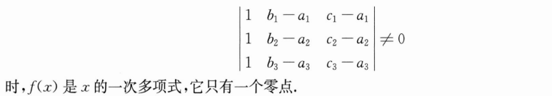
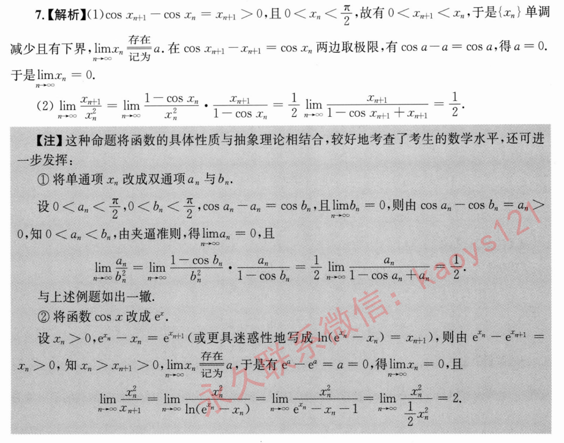

# 高数a

## 第一章

## 第二章

## 第三章

### 注意奇偶性

### 增量与微分

### 隐函数求导

## 第四章

### 分段函数导数是否存在

### 乘积塞入幂函数

## 第五章

### 曲率圆的一阶、二阶导数与曲线一致

## 第六章

### 拉格朗日中值定理的几何应用之一：以导数限定函数

## 第九章

### 连续即极限值等于函数值

### 定积分函数按x拆分积分限以去除绝对值

### 分部积分拆分后再还原（匪夷所思）

### 反三角函数在定积分中注意定义域

## 第十章

### 分部积分的预处理或变化为二重积分

### 弧长的换元求法

## 第十二章

### 神金物理题

### 超神金物理题

## 第十三章

### 函数加减拆卸

### 隐函数存在定理（看1000题讲解！）

### 注意定义域

### 保号性求极值

## 第十四章

### 倾斜椭圆的图像

### 极坐标不要怕直接代入

### 椭圆压缩成圆

$$ x = arcosθ，y = brsinθ,则∫∫dxdy = ∫dθ∫a·b·rdr $$

### $ ∫ \frac{dx}{\sqrt{a^2-x^2}} = arcsinx (a>0) $

## 第十五章

### 反推高阶微分方程

# 线代a

## 第一章

### 行列式变形1

## 第二章

### 神秘结论1

## 第三章

### 未知数挪到同一列

## 第四章

### 主子式

### 方程组求解

### 我 不 理 解

## 第五章

### 神秘变形1

## 第六章

### 神秘变形2

### 对称阵只能与对称阵合同，非对称阵只能与非对称阵合同

# 高数b

## 第一章

### 无穷小相加

## 又见 $ \Gamma $函数

## 带积分的间断点计算

## 第二章

### 极限中数列的处理

### 神秘放缩

### 逆天技巧

## 第三章

### 区分可导性和导函数连续性

### 导数与导数的极限

### ln|x|求导无视绝对值

