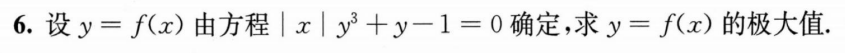
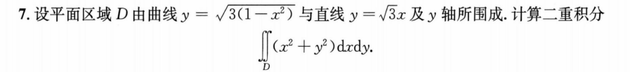

## 第一章

## 第二章

## 第三章

### 注意奇偶性

### 增量与微分

### 隐函数求导

## 第四章

### 分段函数导数是否存在

### 乘积塞入幂函数

## 第五章

### 曲率圆的一阶、二阶导数与曲线一致

## 第六章

### 拉格朗日中值定理的几何应用之一：以导数限定函数

## 第九章

### 连续即极限值等于函数值

### 定积分函数按x拆分积分限以去除绝对值

### 分部积分拆分后再还原（匪夷所思）

### 反三角函数在定积分中注意定义域

## 第十章

### 分部积分的预处理或变化为二重积分

### 弧长的换元求法

## 第十二章

### 神金物理题

### 超神金物理题

## 第十三章

### 函数加减拆卸

### 隐函数存在定理（看1000题讲解！）

### 注意定义域

### 保号性求极值

## 第十四章

### 倾斜椭圆的图像

### 极坐标不要怕直接代入

### 椭圆压缩成圆

$$ x = arcosθ，y = brsinθ,则∫∫dxdy = ∫dθ∫a·b·rdr $$

### $ ∫ \frac{dx}{\sqrt{a^2-x^2}} = arcsinx (a>0) $

## 第十五章

### 反推高阶微分方程

