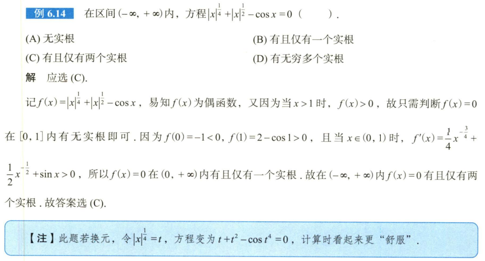

# 第一章例题

## 1.14

## 1.26

## 1.32

## 1.37

## 1.38

# 第一章习题

## 1.1

## 1.5

# 第二章例题

## 2.11

## 2.14

注意第二问少见的归纳法形式

# 第二章习题

## 2.2

## 2.4

以一眼丁真法，上99阶，如k=99，下面多项式相减只剩98阶，则k=100时下面多项式相减剩下99阶满足题意。抓大头的含金量！

## 2.6

这放缩够大的……

# 第三章例题

## 3.5

## 3.6

还得是看课。确实精妙。

# 第三章习题

## 3.4

# 3.5

# 3.8

# 第五章习题

## 5.1

## 5.5

注：为什么不能用结论，因为开方是会影响拐点的。

# 第六章例题

## 6.7

## 6.9

## 6.10

注意第二个函数

## 6.14

## 6.16

## 6.21

## 9.14

提示：大换元，把整个函数换成t。

## 9.15

提示：根号下多项式换成$a^2 \pm pb^2$，需要小换元，然后变成9 .14。可借助奇偶性简化最终计算。

## 9.29

提示：伽马函数

## 10.9

提示：周期函数的触类旁通，或者变限积分的还原。