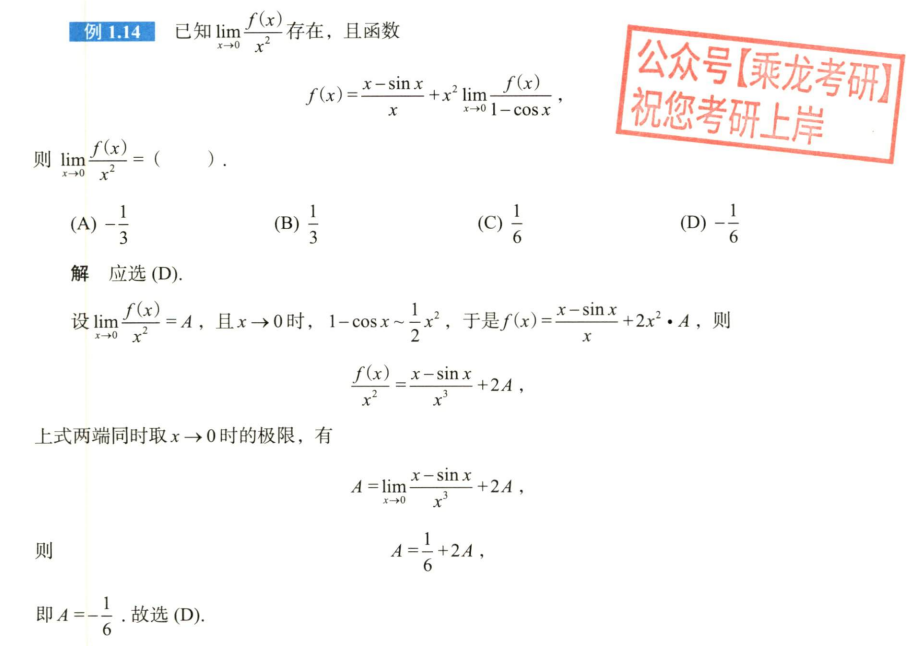

# 第一章例题

## 1.14

## 1.26

## 1.32

## 1.37

## 1.38

# 第一章习题

## 1.1

## 1.5

## 9.14

提示：大换元，把整个函数换成t。

## 9.15

提示：根号下多项式换成$a^2 \pm pb^2$，需要小换元，然后变成9 .14。可借助奇偶性简化最终计算。

## 9.29

提示：伽马函数

## 10.9

提示：周期函数的触类旁通，或者变限积分的还原。