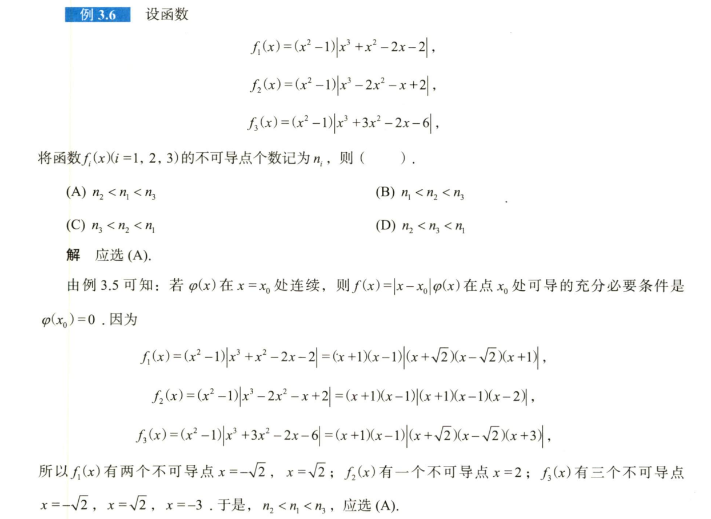
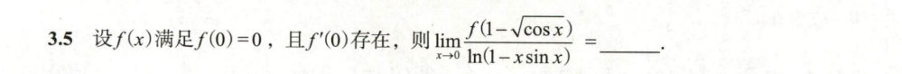
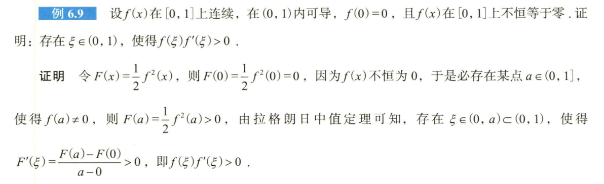
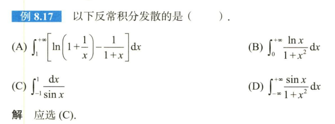
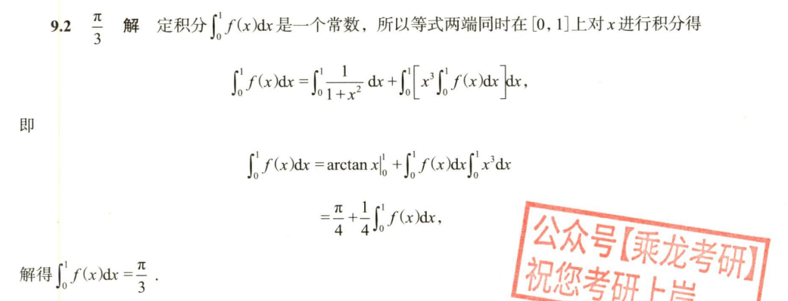

# 第一讲例题

## 1.14

## 1.26

## 1.32

## 1.37

## 1.38

# 第一讲习题

## 1.1

## 1.5

# 第二讲例题

## 2.11

## 2.14

注意第二问少见的归纳法形式

# 第二讲习题

## 2.2

## 2.4

以一眼丁真法，上99阶，如k=99，下面多项式相减只剩98阶，则k=100时下面多项式相减剩下99阶满足题意。抓大头的含金量！

## 2.6

这放缩够大的……

# 第三讲例题

## 3.5

## 3.6

还得是看课。确实精妙。

# 第三讲习题

## 3.4

# 3.5

# 3.8

# 第五讲习题

## 5.1

## 5.5

注：为什么不能用结论，因为开方是会影响拐点的。

# 第六讲例题

## 6.7

## 6.9

## 6.10

注意第二个函数

## 6.14

## 6.16

## 6.21

# 第八讲例题

## 8.2

## 8.3

## 8.9

## 8.10

## 8.15

## 8.16

## 8.17

建议看课，课比答案强无数倍。
# 第八讲习题

## 8.6

# 第九讲例题

## 9.7

## 9.14

提示：大换元，把整个函数换成t。

## 9.15

提示：根号下多项式换成$a^2 \pm pb^2$，需要小换元，然后变成9.14。可借助奇  偶性简化最终计算。

注意：

因此，当积分限跨越超过1（即三角换元后积分限跨越超过$ \frac{\pi}{2} $）时，必须利用奇偶性等压缩积分限，否则将出现需要分类讨论的糟糕状况

## 9.19

无法积分，要使用分部积分以变成求导

## 9.27

## 9.29

提示：伽马函数

# 第九讲习题

## 9.2

## 9.3

解：洛！

## 9.6

从本题中我们学到一个重要问题：三角换元在何时使用。

答：三角换元的最终目的是将根号换成三角函数，为此可以：1、将根号下换成三角函数的平方。2、如果反三角函数里套根号，令反三角函数等于t，反解即可得到根号等于三角函数。两种情况同时出现（如），以解决反三角函数为高优先级。

## 9.10

## 9.12

## 9.13

注意提取x。

## 9.15

# 第十讲例题

## 10.4

## 10.9

提示：周期函数的触类旁通，或者变限积分的还原。

# 第十讲习题

## 10.4

# 第十一讲例题

注意：对积分不等式的五个方法而言：

见“函数连续”，用单调性；

见一阶导数与函数值，用中值定理

见二阶导数与函数值，用泰勒公式

只见导数没见函数值，用积分法或牛莱公式。

## 11.1

## 11.7

## 11.8

## 11.10

## 11.11

# 第十一讲习题

## 11.3

# 第十三讲例题

## 13.3

## 13.20

# 第十三讲习题

## 13.1

选C。

## 13.14

注意与隔壁660精选最后一题做区分。我们只会求二元函数极值，隔壁进入三元必须用奇技淫巧。

# 第十四讲例题

## 14.2

## 14.9

## 14.13

## 14.15

# 第十四讲习题

