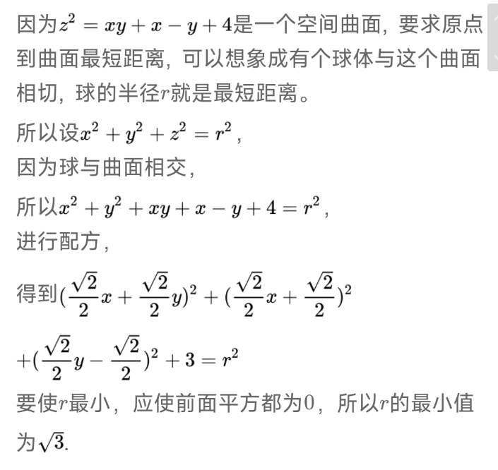

# 660.1 
求极限：$$ \lim\limits_{n \to \infty } {tan^n(\frac{\pi}{4}+\frac{2}{n})} $$

答案为：$ e^4 $

提示：tan（a+b）代换，n->∞切换为n->0

# 660.2

求极限：$$ \lim\limits_{n \to 0 } {\frac{e^{x^2}-e^{2-2cosx}}{x^4}} $$

答案为：$ \frac{1}{12} $

提示：提取$e^{2-2cosx}$,使分子出现cosx-1的形式。

# 660.3

# 660.4

注意方法二使用导数定义的操作

# 660.5

