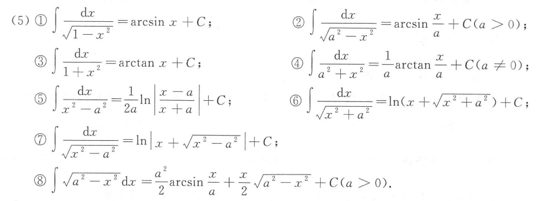
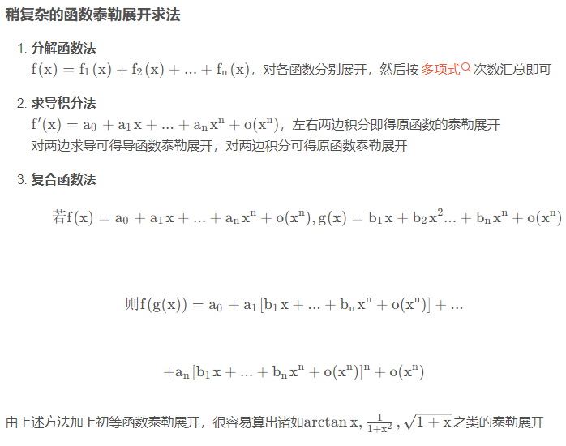
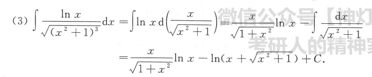

**提示：github网页端对md语法支持度不高，建议使用vscode等编辑器查看。**

请在阅读笔记前背诵如下内容：

**鸣大钟一次！赞美**……哦不好意思串台了，我们重来：

1. 两角和公式：

$ sin(A+B) = sinAcosB+cosAsinB $

$ sin(A-B) = sinAcosB-cosAsinB $

$ cos(A+B) = cosAcosB-sinAsinB $

$ cos(A-B) = cosAcosB+sinAsinB $

$ tan(A+B) = \frac{tanA+tanB}{1-tanAtanB} $

$ tan(x+\frac{\pi}{2}) = -cotx $

2. 倍角公式：

$ sin2A = 2sinAcosA $

$ cos2A = cos^2A-sin^2A = 2cos^2A-1 = 1-2sin^2A $

$ tan2A = \frac{2tanA}{1-tan^2A} $

$ tan\frac{A}{2} = \frac{sinA}{1+cosA} = \frac{1-cosA}{sinA} $

3. 降幂公式：

$ sin^2\frac{A}{2} = \frac{1-cosA}{2} $

$ cos^2\frac{A}{2} = \frac{1+cosA}{2} $

$ tan^2\frac{A}{2} = \frac{1-cosA}{1+cosA} $

4. 万能公式：

$ sinA = \frac{2tan\frac{A}{2}}{1+tan^2\frac{A}{2}} $

$ cosA = \frac{1-tan^2\frac{A}{2}}{1+tan^2\frac{A}{2}} $

$ tanA = \frac{2tan\frac{A}{2}}{1-tan^2\frac{A}{2}} $

5. 其他奇奇怪怪的公式

$ tan^2x = sec^2x-1 $

6. 三角函数的导数：

$ (sinx)\prime = cosx $

$ (cosx)\prime = -sinx $

$ (tanx)\prime = \frac{1}{cos^2x} $

$ (cotx)\prime = -\frac{1}{sin^2x} $

7. 反三角函数的导数：

$ (arcsin x)\prime = \frac{1}{\sqrt{1-x^2}} $

$ (arccos x)\prime = -\frac{1}{\sqrt{1-x^2}} $

$ (arctan x)\prime = \frac{1}{1+x^2} $

$ (arccot x)\prime = -\frac{1}{1+x^2} $

8. 反双曲函数的导数：

反双曲正弦函数：$ y = arcsinhx = ln(x+\sqrt{x^2+1}) $, 则 $ y\prime = \frac{1}{\sqrt{x^2+1}} $

反双曲余弦函数：$ y = arccoshx = ln(x+\sqrt{x^2-1}) $, 则 $ y\prime = \frac{1}{\sqrt{x^2-1}} $

反双曲正切函数：$ y = arctanhx = \frac{1}{2}ln\frac{1+x}{1-x} $, 则 $ y\prime = \frac{1}{1-x^2} $

反双曲余切函数：$ y = arccothx = \frac{1}{2}ln\frac{x+1}{x-1} $, 则 $ y\prime = \frac{1}{1-x^2} $

9. 绝对值不等式：

$ ||a|-|b|| \leq |a±b| \leq |a|+|b| $

10. 三角函数的不定积分：

$ \int sinxdx = -cosx+C $

$ \int cosxdx = sinx+C $

$ \int tanxdx = -ln|cosx|+C $

$ \int cotxdx = ln|sinx|+C $

$ \int secxdx = ln|secx+tanx|+C $

$ \int cscxdx = -ln|cscx-cotx|+C $

$ \int sec^2xdx = tanx+C $

$ \int csc^2xdx = -cotx+C $

$ \int secxtanxdx = secx+C $

$ \int cscxcotxdx = -cscx+C $

11. 平方和差的不定积分：

12. 立方差公式：

$ a^3-b^3 = (a-b)(a^2+ab+b^2) $

$ a^3+b^3 = (a+b)(a^2-ab+b^2) $

13. 非基本泰勒公式

14.  不定积分使我幼小的心灵受到大大的震撼：

