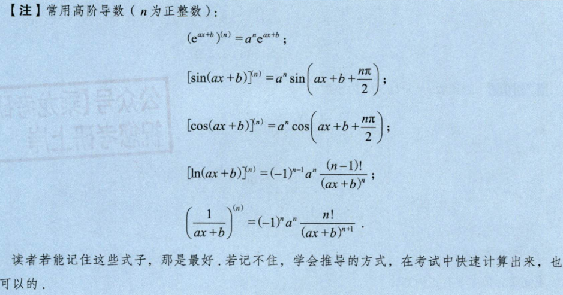
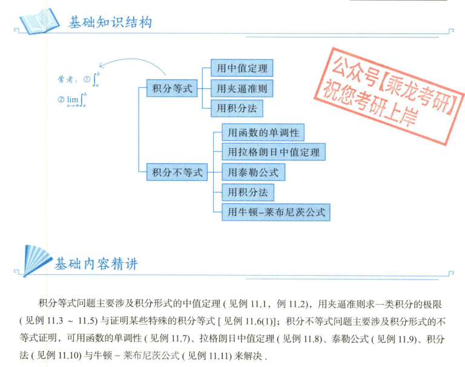

[TOC]
# 第一章 极限与连续

## part 1 极限

### 1.1 极限的概念

_暂无重要内容_

### 1.2 极限的一般性质

#### 1.2.1 唯一性

_暂无重要内容_

#### 1.2.2 保号性

如果 $\lim\limits_{x \to x_0} f(x) = A > 0$，则存在 $\delta > 0$，当 $0 < |x - x_0| < \delta$ 时，$f(x) > 0$ 。

**证明如下：**

① $A > 0 $，取 $\varepsilon = \frac{A}{2}$，则存在 $\delta > 0$，当 $0 < |x - x_0| < \delta$ 时

$|f(x) - A| < \frac{A}{2}$

即 $f(x) - A > - \frac{A}{2}$，即 $f(x) > \frac{A}{2} > 0$

② $A < 0 $，取 $\varepsilon = - \frac{A}{2}$，则存在 $\delta > 0$，当 $0 < |x - x_0| < \delta$ 时

$|f(x) - A| < \frac{A}{2}$

即 $f(x) - A < \frac{A}{2}$，即 $f(x) < - \frac{A}{2} < 0$

**应用：**

* 例题 1： $f\prime(x)=0$ ，$\lim\limits_{x \to 1}\frac{f\prime(x)}{sin\pi x}=2$，求 x = 1 是什么点？

### 1.3 极限的存在性质（重要考点）

#### 1.3.1 夹逼定理

* 例题1：设 $a>0,b>0,c>0 $，求 $ \lim\limits_{x \to \infty } (a^n + b^n + c^n)^{\frac{1}{n}} $

一般的，对于类似$\lim\limits_{x \to \infty } (a^n + b^n + c^n)^{\frac{1}{n}} $的极限，极限 = max{a,b,c}

* 例题2：$f(x) = \lim\limits_{n \to \infty} \sqrt[n]{1 + x + (\frac{x^2}{2})^n} (x > 0)$ ，求 $f\prime(x)$。

* 根据例题一，$\lim\limits_{n \to \infty} \sqrt[n]{1 + x + (\frac{x^2}{2})^n} = max\{1,x,\frac{x^2}{2}\} $

* 由图像可知，$f(x)$ 在 $ (0,1) $ 上为1，$ (1,2) $ 上为 $ x $，$ (2,+\infty) $ 上为 $ \frac{x^2}{2} $，所以 $f\prime(x)$ 在 $ (0,1) $ 上为0，$ (1,2) $ 上为1，$ (2,+\infty) $ 上为 $ x $。

****

 

**重大考点** 

$\lim\limits_{x \to \infty} (a_1 + a_2 + \cdots + a_n)^{\frac{1}{n}}$

 ① 分子分母次数至少一个不齐 —— 夹逼定理
 

② 分子分母次数都齐，且分母比分子多一次 —— 不能使用夹逼定理，应使用定积分的定义

有重要等式：$\lim\limits_{x \to \infty} \frac{1}{n} \sum\limits_{i=1}^{n} f(\frac{i}{n}) = \lim\limits_{x \to \infty} \frac{1}{n} \sum\limits_{i=1}^{n} f(\frac{i-1}{n})= \int_0^1 f(x)dx $

例如：

#### 1.3.1练习题

#### 1.3.2 单调有界数列必有极限

其核心应用为：在求数列极限时，去证明其单调有界。

此处，①常使用各重要不等式。

②常使用相邻两项相减。

### 1.4 无穷小的性质

#### 1.4.1 一般性质

1. 加减乘除，略过
2. $|\alpha| <= M , |\beta| \to 0 $，则 $ \alpha\beta \to 0 $ 例如 $ \lim\limits_{x \to 0} x^2arctan\frac{1}{n} = 0 $
3. $limf(x) = A 等价于 f(x) = A + \alpha, \alpha \to 0 $ 

#### 1.4.2 等价性质

当 $x \to 0$ 时，等价无穷小如下：

1. $x \sim \tan x \sim \sin x \sim \arcsin x \sim (e^x - 1) \sim \arctan x \sim \ln(1 + x) \sim \ln(x + \sqrt{1 + x^2})$
2. $(1 - \cos x) \sim \frac{1}{2}x^2$
3. $\log_a(1 + x) \sim \frac{x}{\ln a} $

**下面两个等价注意使用条件：**

4. $(1 + a(x))^{b(x)} - 1 \sim a(x)b(x) ~~~~ (a(x) → 0, a(x)b(x) → 0)$
5. $a^x - 1 \sim x \ln a$ （更常见的是 $e^x - 1 \sim x ~~~~ (x → 0)$）
6. $x - \ln(1 + x) \sim \frac{1}{2}x^2$ (**常用**)

**下面三个等价注意记忆方式：**

7. $(x - \sin x) \sim \frac{1}{6}x^3 \sim (\arcsin x - x)$
8. $(\tan x - x) \sim \frac{1}{3}x^3\sim (x - \arctan x)$
9.  $(\tan x - \sin x) \sim \frac{1}{2}x^3$

(你甚至可以用这个方法推出sinx - arctanx之类的等价无穷小)

$ x-arctanx = \frac{1}{3}x^3 , x-sinx = \frac{1}{6}x^3 , sinx - arctanx = \frac{1}{3}x^3 - \frac{1}{6}x^3 = \frac{1}{6}x^3 $

(如果遇到$ \frac{6x-sinx}{x^3} , \frac{x - 6sinx}{x^3} , \frac{x - sin6x}{x^3} $之类的题目，请使用洛必达，你会发现某些神奇的结论)

#### 不定型

**1. $\frac{0}{0}$ 型**

 知识点一：常使用方法：

 ① $u(x)^{v(x)} => e^{v(x)lnu(x)}$

 ② $ln(……) => ln(1+x) \sim △$

 ③ $(……) - 1 => e^△ - 1$或者$(1+△)^a - 1$

 知识点二：阶数问题

 ①$x,sin x,tanx,arcsinx,arctanx$五个中任意两个的差为3阶无穷小

 ②$x-ln(1+x) \sim \frac{1}{2}x^2$

 知识点三：精确度问题

 无穷小相乘无需考虑精确度问题，直接等价即可。但无穷小相加时进行等价需要考虑精确度问题。

 

 如图所示，第一个例子由于分子分母都是二阶无穷小，所以可以等价。第二个例子由于分子都是一阶无穷小，而分母为三阶无穷小，分母精确度高，分子的等价误差过大，不能分开等价。

 **例题**
 
 

**2. $ 1^\infty $ 型**

 方法只有一个：变形为 $(1+△)^{\frac{1}{△}}$,必须保证恒等变形。

 **例题**

 

**3. $\frac{\infty}{\infty}$ 型**

 
 
 
 **例题**

 

**4. $0 \times \infty$ 型**

 转化为 $\frac{0}{0}$ 型或者 $\frac{\infty}{\infty}$ 型

**5. $\infty - \infty$ 型**

 以下给出三道例题，分别使用转化为$0 \times \infty$ 型，分子有理化与拆分法。

 

**6. $0^0$ 型与 $\infty^0$ 型**

 只有一个方法：变形为 $e^{ln}$

 **例题**

 
 

## part 2 连续与间断

### 2.1 连续

_暂无重要内容_

### 2.2 间断

#### 2.2.1 第一类间断

左极限与右极限都存在。分两类：

① $f(a-0) = f(a+0) \neq f(a)$ , $x=a$ 为可去间断点

② $f(a-0) \neq f(a+0)$ , $x=a$ 为跳跃间断点

#### 2.2.2 第二类间断

左极限与右极限至少有一个不存在。

**重要考点：间断点及其分类**

使用介值定理的典型特征：闭区间，函数值相加。例题如下：

#### 2.2.2练习题

## 第一章练习题

# 第二章 导数与微分

## ZY
### 反函数的二阶导数

### 常用高阶导数

### 展开式唯一性（25）

注：也可使用莱布尼兹高阶求导公式

# 第三章 一元函数微分学的应用

## 2 中值定理

### 2.5 泰勒中值定理

## 3.??? 中值定理题型

### 题型一 $f^{(n)}(x)$

一阶：找两个相等点，使用罗尔定理

二阶：分两种情况：

1. 找三个点，使用两次拉格朗日中值定理，对两个相等的一阶导数使用罗尔定理

2. 找两个相等的一阶导数，使用拉格朗日中值定理

### 题型二 待证结论中只有一个中值$ \xi $,没有其他字母

第一种情况：形式为两项，导数相差一阶：还原法

使用辅助构造 $ \frac{f\prime(x)}{f(x)} = {[lnf(x)]}\prime $

第二种情况：形式两项以上，或导数相差一阶以上：分组构造

### 题型三 待证结论中既有中值$ \xi $,又有其他字母a,b

第一种情况：a，b 部分与 $ \xi $ 可分离

第二种情况：a，b 部分与 $ \xi $ 不可分离：凑微分

### 题型四 待证结论中含两个及以上的中值$ \xi $ $\eta $

观察这两个例题。

## ZY

### 多项式极值点/拐点(25)

注：考虑图像，奇数次多项式才有拐点，偶数次多项式才有极值点

### 罗尔定理辅助函数构造

# 第五章 定积分的应用

## 2. 基本理论

### 2.2 定积分特殊性质

#### 三角函数定积分的性质

**sin^n(x)与cos^n(x)的积分：**

$ \int_0^{\frac{\pi}{2}} sin^nxdx = \int_0^{\frac{\pi}{2}} cos^nxdx = I_n $

$ I_n = \frac{n-1}{n}I_{n-2} $

$ I_0 = \frac{\pi}{2} , I_1 = 1 $

**$ \int_0^\pi xf(sinx)dx$ 的处理：**

$ \int_0^\pi xf(sinx)dx = \frac{\pi}{2} \int_0^\pi f(sinx)dx $

## ZY

### 9.14

从以下几个方面考虑：一，有根号下1-x^2，可三角代换；二，复杂可以分部积分；三（推荐）：换元，可将复杂函数直接全部代换。如本题建议将整个函数代换为t。

### 区间再现公式

### 有间断点的定积分（25）

zy表示略微过深入，以前没考过，建议25关注。

### 变限积分（25）

考点1：找不到原函数，因此考虑分部积分以变成求导。

考点2：拆绝对值要考虑积分限。

考点3：积分变量里没有求导变量时才能用变限积分求导公式，否则必须换元使求导变量消失

### 奇偶函数的积分（必考）

### $ \Gamma $函数

### 通过参数方程考察换元法

### 平面曲线绕定直线旋转（25）

### 积分等式与积分不等式

### 三角函数定积分特殊处理

# 第六章 多元函数微分

## ZY

### 多元函数链式求导（25）

# 第七章 微分方程

## ZY

### 换元

### 将微分方程中的不定积分写成变限积分（在所有原函数中选择了一个原函数进行改写）（25）

### 由解反推原方程（25）

# 第八章 重积分

## 1. 二重积分

### 1.1 改变积分次序

### 1.2 含偏导数的二重积分

### 未分类

### 应用题

# 级数 数二人向你说拜拜

# 第十章 空间解析几何

首先恭喜你突破了级数的恐怖壁垒！

