# 计算机体系结构笔记
[TOC]

# 1 基础知识

## 1.4 计算机系统结构的发展

### 1.4.1 冯·诺依曼结构及其改进

### 1.4.2 软件对系统结构的影响

* 软件的可移植性

一个软件可以不经修改或者只需少量修改就可以由一台机器移植到另一台机器上正确地运行。差别只是执行时间的不同。我们称这两台机器是软件兼容的。

* 实现可移植性的常用方法
  
采用系列机，模拟与仿真，统一高级语言 。

1. 统一高级语言 

* 实现软件移植的一种理想的方法
* 较难实现

1. 系列机 

* 由同一厂家生产的具有相同的系统结构，但具有不同组成和实现的一系列不同型号的机器。
* 较好地解决软件开发要求系统结构相对稳定与器件、硬件技术迅速发展的矛盾。
* 软件兼容：向后兼容是系列机的根本特征。

3. 模拟和仿真

* 使软件能在具有不同系统结构的机器之间相互移植。
    * 在一种系统结构上实现另一种系统结构。
    * 从指令集的角度来看，就是要在一种机器上实现另一种机器的指令集。

* 模拟：用软件的方法在一台现有的机器（称为宿主机）上实现另一台机器（称为虚拟机）的指令集。
    * 通常用解释的方法来实现。
    * 运行速度较慢，性能较差。

* 仿真：用一台现有机器（宿主机）上的微程序去解释实现另一台机器（目标机）的指令集。
    * 运行速度比模拟方法的快
    * 仿真只能在系统结构差距不大的机器之间使用

## 1.5 并行性

### 1.5.1 并行性的概念

从执行程序的角度来看。并行性等级从低到高可分为以下5种：

1) 指令内部井行

指令内部并行是指单条指令中各微操作之间的并行。

2) 指令级并行
   
指令级并行(Instruction Level Parallelism.ILP)是指井行或井发地执行两条或两条以
上的指令。

流水线技术使得多条指令能重叠地执行,提高了CPU执行程序的春吐率。加上RISC方法,计算机达到了每个时钟周期完成一条指令的性能。超标量(Superscalar)的方法则更进一步,使得计算机能每个时钟周期启动多条指令,并能由多条流水线在单周期内产生多个运算站果。超标量主要是用来开发指令级井行的。

3) 线程级并行

线程级井行(Thread Level Parallelism.TLP)是指并行执行两个或两个以上的线程。

4) 任务级或过程级井行

任务级或过程级井行是指并行执行两个或两个以上的过程或任务(程序段),以子程序或进程为调度单元。

5) 作业或程序级井行

作业或程序级并行是指并行执行两个或两个以上的作业或程序。

### 1.5.2 提高并行性的技术途径

计算机系统中提高井行性的措施有很多，就其基本思想而言，可归纳成以下三条途径。

1) 时间重叠(Time Interleaving)。

在井行性概念中引入时间因素，让多个处理过程在时间上相互错开，轮流重叠地使用同一套硬件设备的各个部分，以加快硬件周转而赢得速度。这种途径原则上不要求重复设置硬件设备。流水线技术是时间重叠的典型实例。

2) 资源重复(Resource Replication)。

在井行性概念中引入空间因素，以数量取胜。通过重复设置硬件资源，大幅度地提高计算机系统的性能。随着硬件价格的降低，这种途径得到了越来越广泛的应用。可以在单处理机中重复设置多个运算部件或处理部件，也可以重复设置多台处理机，构成多处理机系統。在现在的计算机系统統中，经常是同时运用时间重叠和资源重复。

3) 资源共享(Resource Sharing)。

这是一种软件方法，它便多个任务按一定的时间顺序轮流使用同一套硬件设备。多道程序、分时系统就是遵循这一途径而产生的。盗源共享既降低了成本，又提高了计算机设备的利用率。

### 1.5.3 单机系统中井行性的发展

在发展高性能单处理机的过程中，起主导作用的是时间重叠原理。实现时间重叠的基础是“部件功能专用化”,即把一件工作按功能分割为若干相互联系的部分，把每一部分指定给专门的部件完成，然后按时间重叠原理把每部分的执行过程在时间上重叠起来，使所有部件依次分工完成一组同样的工作。例如，把一条指令的解释过程分为4个子过程:取指令、指令译码、指令执行、写回结果，为每个子过程分配一个专用部件，并将它们的工作按某种时间关系重叠起来，就构成了指令流水线。

在单处理机中，资源重复原理的运用也已经十分普遍。例如，多体存储器和多操作部件都是成功应用的结构形式。在多操作部件处理机中，通用部件被分解成若干个专用部件，如加法部件、乘法部件、除法部件、逻辑运算部件等，而且同一种部件也可以重复设置多个。只要指令所需的操作部件空闲，就可以开始执行这条指令（如果操作数已准备就绪），这就实现了指令级并行。如果更进一步，设置许多相同的处理单元，让它们在同一个控制器的指挥下，按照同一条指令的要求，对向量或数组的个元素同时进行同一操作，就形成了阵列处理机（有的书称为并行处理机）

# 2 指令系统的设计

## 2.1 指令系统结构的分类

### 2.1.1 分类

区别不同指令系统结构的主要因素是**CPU中用来存储操作数的存储单元的类型**

分三类：堆栈结构、累加器结构、通用寄存器结构

通用寄存器型结构进一步细分为3种类型
* 寄存器－寄存器型（RR型）
* 寄存器－存储器型（RM型）
* 存储器－存储器型（MM型）

**3种通用寄存器型结构的优缺点**：

表中(m，n)表示指令的n个操作数中有m个存储器操作数。

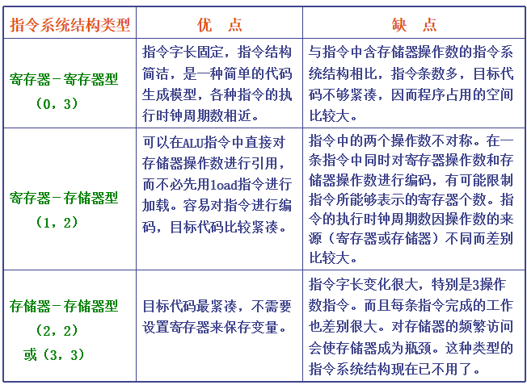

## 2.2 寻址方式

* 将寻址方式编码于操作码中，由操作码描述相应操作的寻址方式。

适合：处理机采用load-store结构，寻址方式只有很少几种。

* 在指令字中设置专门的寻址字段，用以直接指出寻址方式。

灵活，操作码短，但需要设置专门的寻址方式字段，而且操作码和寻址方式字段合起来所需要的总位数可能会比隐含方法的总位数多。
 
适合：处理机具有多种寻址方式，且指令有多个操作数。

## 2.3 指令系统的设计与优化

### 2.3.1 指令系统设计的基本原则

#### 1 指令系统的设计

1) 取舍软硬件：考虑实现的基本功能，确定哪些归硬件实现，哪些归软件实现。有RISC和CISC两种设计思想。
2) 寻址方式：对基准程序进行测试统计，根据寻址方式的使用频率确定合适的寻址方式。
3) 操作数表示和操作数类型：主要的选择有：浮点，整型，字符，十进制类型等
4) 寻址方式的表示：可以将寻址方式编码于操作码中，也可以将寻址方式作为一个单独的域表示
5) 指令格式：变长编码格式、固定长度编码格式、混合编码格式三种

#### 2 软硬件取舍

主要考虑三个因素：速度、成本、灵活性

|  | 速度 | 成本 | 灵活性 |
| --- | --- | --- | --- |
| 硬件 | 快 | 高 | 低 |
| 软件 | 慢 | 低 | 高 |

#### 3 指令系统基本要求

完整性、规整性、正交性、高效率、兼容性

**完整性**：在一个有限可用的存储空间内，对于任何可解的问题，编制计算程序时，指令系统所提供的指令足够使用。

**规整性**：主要包括对称性和均匀性。

* 对称性：指令系统中所有与指令系统有关的存储单元的使用、操作码的设置等都是对称的。

例如：在存储单元的使用上，所有通用寄存器都要同等对待。在操作码的设置上，如果设置了A－B的指令，就应该也设置B－A的指令。

* 均匀性：指对于各种不同的操作数类型、字长、操作种类和数据存储单元，指令的设置都要同等对待。

例如：如果某机器有5种数据表示，4种字长，两种存储单元，则要设置5×4×2=40种同一操作的指令

**正交性**：在指令中各个不同含义的字段，如操作类型、数据类型、寻址方式字段等，在编码时应互不相关、相互独立。 

**高效率**：指指令的执行速度快、使用频度高。

**兼容性**：主要是要实现向后兼容，指令系统可以增加新指令，但不能删除指令或更改指令的功能。

### 2.3.2 控制指令

#### 1 控制指令用于改变控制流

* 跳转：当指令是无条件改变控制流时，称之为跳转指令。

* 分支：当控制指令是有条件改变控制流时，则称之为分支指令。 
#### 2 能够改变控制流的指令

* 分支
* 跳转
* 过程调用
* 过程返回

改变控制流的大部分指令是分支指令（条件转移）

#### 3 分支条件的方法及其优缺点
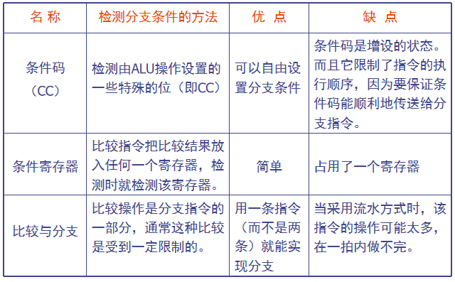

### 2.3.3 指令操作码的优化

* 指令由两部分组成：操作码、地址码
* 指令格式的设计：确定指令字的编码方式，包括操作码字段和地址码字段的编码和表示方式。
* 指令格式的优化：如何用最短的位数来表示指令的操作信息和地址信息。 

#### 1 哈夫曼编码

注意扩展操作码

#### 2 等长扩展码

#### 3 定长操作码

* 采用最多
* 保证操作码的译码速度、减少译码的复杂度。
* 以程序的存储空间为代价来换取硬件实现上的好处。

### 2.3.3 指令字格式的优化

指令系统的3种编码格式：
* 可变长度编码格式
* 固定长度编码格式
* 混合型编码格式

#### 1 可变长度编码格式

* 当指令系统的寻址方式和操作种类很多时，这种编码格式是最好的。
* 用最少的二进制位来表示目标代码。
* 可能会使各条指令的字长和执行时间相差很大。

#### 2 固定长度编码格式

* 将操作类型和寻址方式一起编码到操作码中。
* 当寻址方式和操作类型非常少时，这种编码格式非常好。
* 可以有效地降低译码的复杂度，提高译码的速度。
* 大部分RISC的指令系统均采用这种编码格式。

#### 3 混合型编码格式
提供若干种固定的指令字长。
以期达到既能够减少目标代码长度又能降低译码复杂度的目标。

## 2.4 指令系统的发展和改进

### 2.4.1 CISC方向

CISC指令系统指令数量多，功能多样，只要目标是增强指令功能，将更多功能交给硬件实现。

增强指令功能从以下3方面：

* 面向目标程序增强指令功能
* 面向高级语言的优化实现来改进指令系统
* 面向操作系统的优化实现改进指令系统

#### 1 面向目标程序增强指令功能

对大量的目标程序及其执行情况进行统计分析，找出那些使用频度高、执行时间长的指令或指令串。对于使用频度高的指令，用硬件加快其执行；对于使用频度高的指令串，用一条新的指令来替代。

既能减少目标程序的执行时间，也能有效地缩短程序的长度。

#### 2 面向高级语言的优化实现来改进指令系统

（缩小高级语言与机器语言的语义差距）

高级语言与一般的机器语言的语义差距非常大，为高级语言程序的编译带来了一些问题。

（1）编译器本身比较复杂；

（2）编译生成的目标代码比较难以达到很好的优化。

对高级语言中使用频度高、执行时间长的语句，增强有关指令的功能，加快这些指令的执行速度，或者增加专门的指令，可以达到减少目标程序的执行时间和减少目标程序长度的目的。 

增强系统结构的规整性，减少系统结构中的各种例外情况。

#### 3 面向操作系统的优化实现改进指令系统

操作系统和计算机系统结构是紧密联系的，操作系统的实现在很大程度上取决于系统结构的支持。

指令系统对操作系统的支持主要有：

* 处理机工作状态和访问方式的切换；
* 进程的管理和切换；
* 存储管理和信息保护；
* 进程的同步与互斥，信号灯的管理等。

### 2.4.2 RISC方向

#### 1 CISC的问题

* 各种指令的使用频度相差悬殊，许多指令很少用

* 指令系统大，指令条数多，许多指令的功能复杂，使得控制器硬件非常复杂，占用大量的芯片面积，给VLSI设计造成困难；增加了研制时间和成本，容易造成设计错误。

* 许多指令由于操作繁杂，其CPI值大，执行速度慢。采用这些复杂指令有可能使整个程序的执行时间反而增加。

* 由于指令功能复杂，规整性不好，不利于采用流水技术来提高性能。 

#### 2 设计RISC机器遵循的原则 

指令条数少、指令功能简单。只选取使用频度很高的指令，在此基础上补充一些最有用的指令；

采用简单而又统一的指令格式，并减少寻址方式；指令字长都为32位或64位；

指令的执行在单个机器周期内完成；(采用流水线机制)

只有load和store指令才能访问存储器，其它指令的操作都是在寄存器之间进行；（即采用load-store结构）

大多数指令都采用硬连逻辑来实现；

强调优化编译器的作用，为高级语言程序生成优化的代码；

充分利用流水技术来提高性能。

## 2.5 操作数的类型和大小

**数据表示**：计算机硬件能够直接识别、指令系统可以直接调用的数据类型。

* 所有数据类型中最常用、相对比较简单、用硬件实现比较容易的几种。
 
**数据结构**：由软件进行处理和实现的各种数据类型。

### 2.5.1 表示操作数类型的两种方法

1. 由指令中的操作码指定操作数的类型。

2. 给数据加上标识，由数据本身给出操作数类型。

优点：简化指令系统，可由硬件自动实现一致性检查和类型转换，缩小了机器语言与高级语言的语义差距，简化编译器等。

缺点：由于需要在执行过程中动态检测标志符，动态开销比较大，所以采用这种方案的机器很少见

# 3 流水线技术

## 3.1 流水线的基本概念

### 3.1.1 流水技术的特点

* 流水线把一个处理过程分解为若干个子过程（段），每个子过程由一个专门的功能部件来实现。
* 流水线中各段的时间应尽可能相等，否则将引起流水线堵塞、断流。
  * 时间最长的段将成为流水线的瓶颈。
* 流水线每一个段的后面都要有一个缓冲寄存器（锁存器），称为流水寄存器。
  * 作用：在相邻的两段之间传送数据，以保证提供后面要用到的信息，并把各段的处理工作相互隔离。
* 流水技术适合于大量重复的时序过程，只有在输入端不断地提供任务，才能充分发挥流水线的效率。
* 流水线需要有通过时间和排空时间。
  * 通过时间：第一个任务从进入流水线到流出结果所需的时间。
  * 排空时间：最后一个任务从进入流水线到流出结果所需的时间。

### 3.1.2 流水线的分类

#### 1. 按照流水技术用于计算机系统的等级不同分为：

* 部件级流水线（运算操作流水线）
* 处理机级流水线（指令流水线）
* 系统级流水线（宏流水线）

#### 2. 按照流水线所完成的功能不同分为：

* 单功能流水线：只能完成一种固定功能
* 多功能流水线：流水线的各段可以进行不同的连接，以实现不同的功能

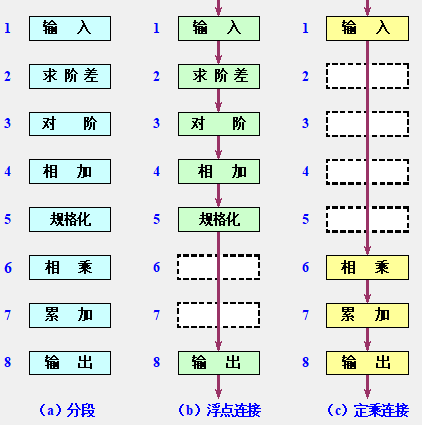

#### 3. 按照同一时间内各段之间的连接方式不同分为：

* 静态流水线：在同一时间内，多功能流水线中的各段只能按同一种功能的连接方式工作
* 动态流水线：在同一时间内，多功能流水线中各段可以按照不同的方式连接，同时执行多种功能。
  * 优点：灵活，能够提高流水线各段的使用率，从而提高处理速度。
  * 缺点：控制复杂。

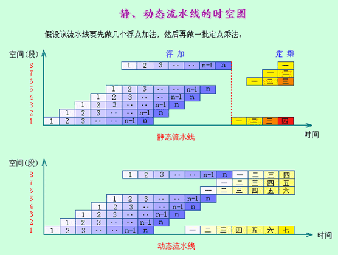

#### 4. 按照流水线中是否有反馈回路分为：

* 线性流水线：流水线的各段串行连接，没有反馈回路。数据通过流水线中的各段时，每一个段最多只流过一次。
* 非线性流水线：流水线中除了有串行的连接外，还有反馈回路。

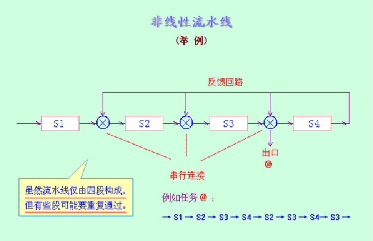

#### 5. 根据任务流入和流出的顺序是否相同分为：

* 顺序流水线：流水线输出端任务流出的顺序与输入端任务流入的顺序完全相同。每一个任务在流水线的各段中是一个跟着一个顺序流动的。
* 乱序流水线：流水线输出端任务流出的顺序与输入端任务流入的顺序可以不同，允许后进入流水线的任务先完成（从输出端流出）。也称为无序流水线、错序流水线、异步流水线

#### 6. 标量处理机与向量流水处理机

* 把指令执行部件中采用了流水线的处理机称为流水线处理机。
* 标量处理机：处理机不具有向量数据表示和向量指令，仅对标量数据进行流水处理。
* 向量流水处理机：具有向量数据表示和向量指令的处理机。向量数据表示和流水技术的结合。

## 3.2 流水线的性能指标

### 3.2.1 吞吐率

1. 吞吐率：在单位时间内流水线所完成的任务数量或输出结果的数量。

$$ TP = \frac{N}{T_{k}} $$

* n：任务数
* Tk：处理完成n个任务所用的时间

2. 解决瓶颈问题

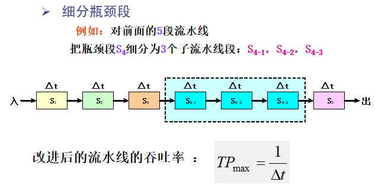
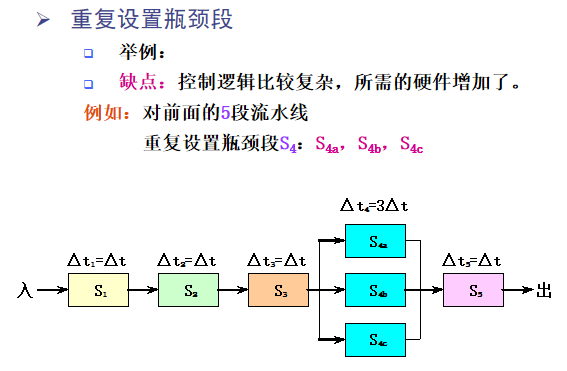

### 3.2.2 加速比

加速比：完成同样一批任务，不使用流水线所用的时间与使用流水线所用的时间之比。

假设：不使用流水线（即顺序执行）所用的时间为Ts，使用流水线后所用的时间为Tk，则该流水线的加速比为：

$$ S = \frac{T_{s}}{T_{k}} $$

### 3.2.3 效率

流水线的效率：流水线中的设备实际使用时间与整个运行时间的比值，即流水线设备的利用率。

也可以表示为流水线的实际加速比S与它的最大加速比k的比值。

$$ E = \frac{S}{k} $$

也可以表示为n个任务占用的时空面积和k个段总的时空面积之比。

### 3.2.4 流水线的性能分析

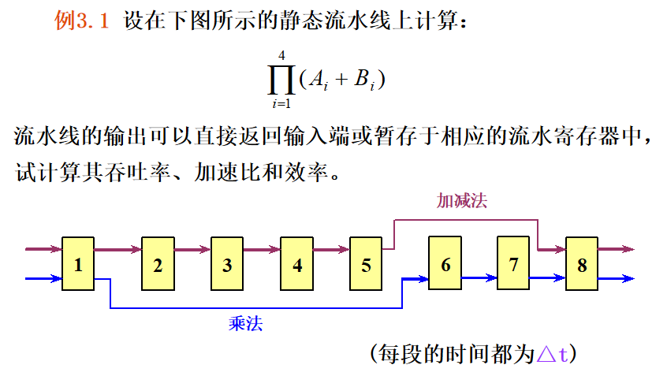
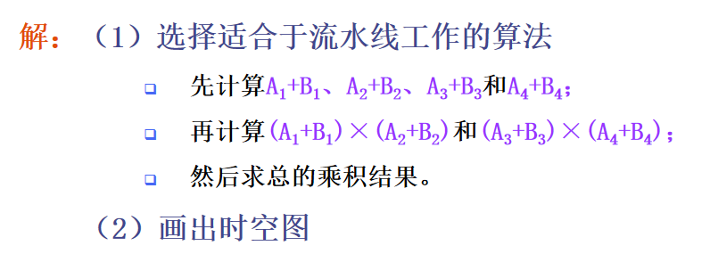
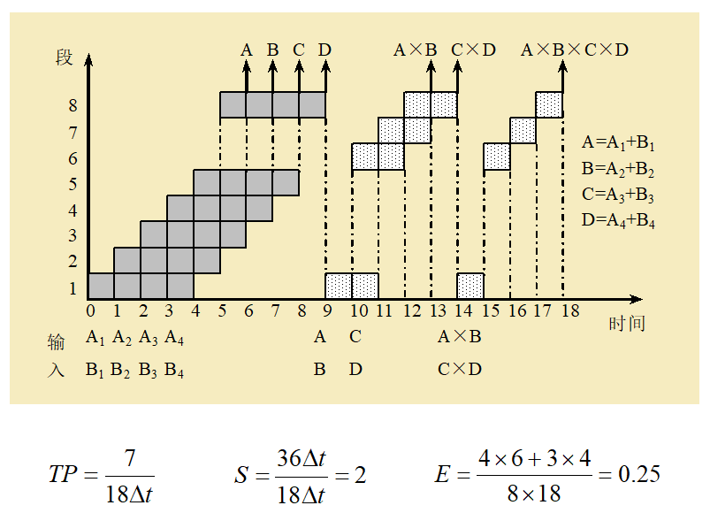

该静态流水线效率低的原因：

* 多功能流水线在做某一种运算时，总有一些段是空闲的；
* 静态流水线在进行功能切换时，要等前一种运算全部流出流水线后才能进行后面的运算；
* 运算之间存在关联，后面有些运算要用到前面运算的结果；
* 流水线的工作过程有建立与排空部分。 

## 3.3 非线性流水线调度

### 3.3.1 单功能非线性流水线的最优调度
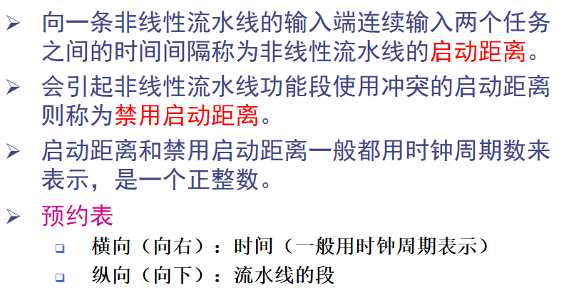
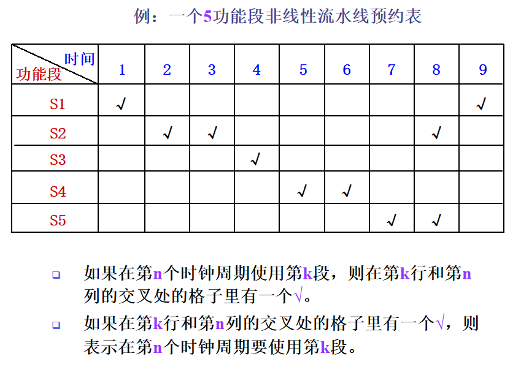
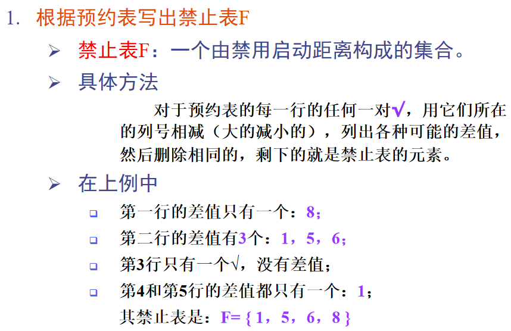
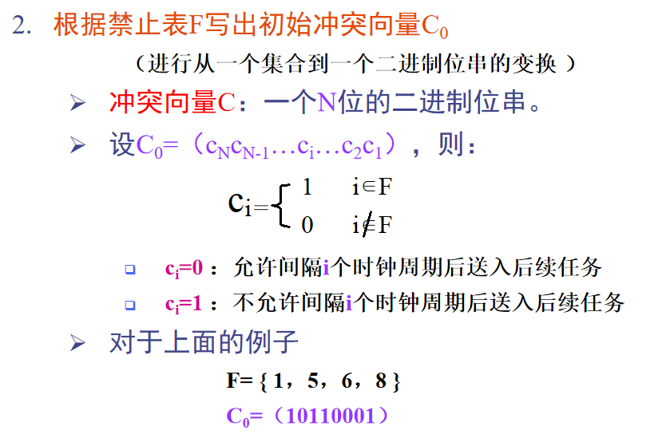
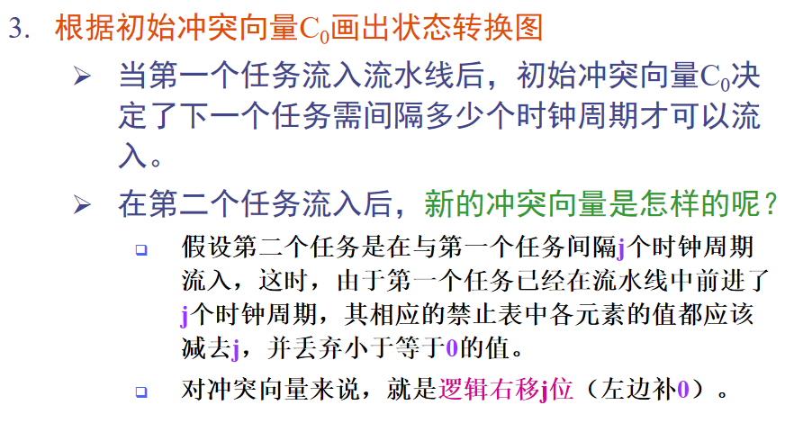
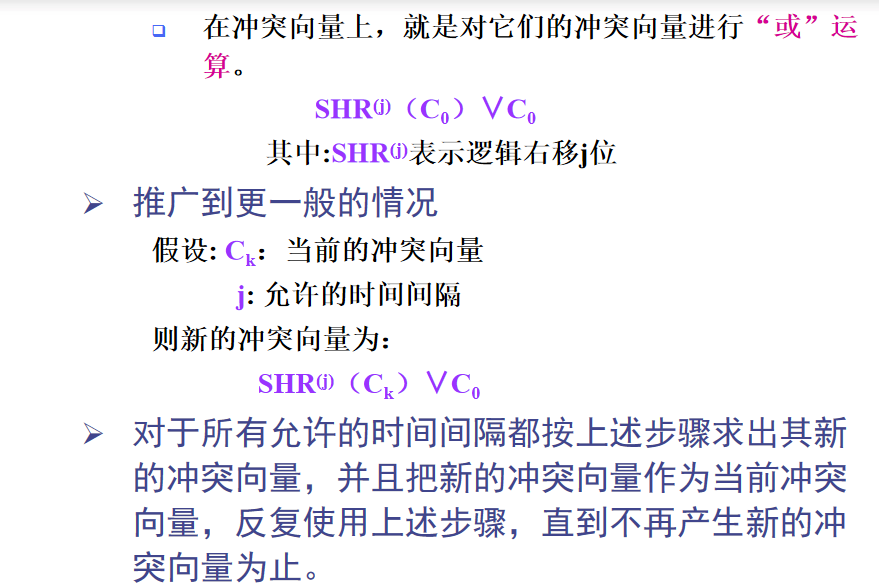
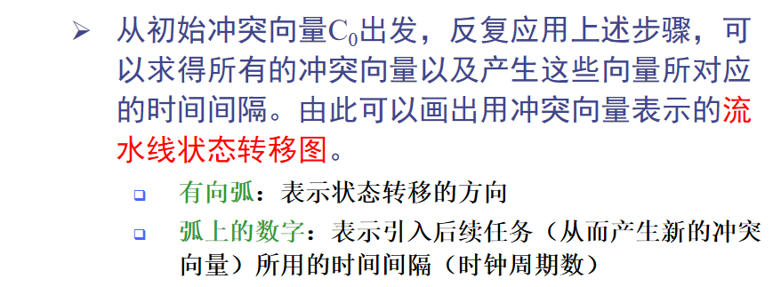
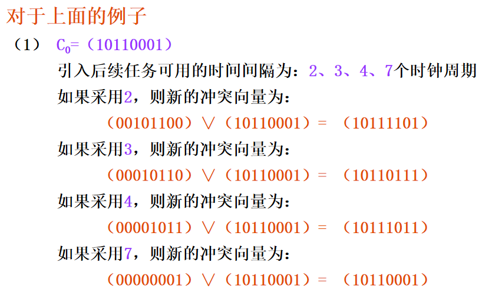
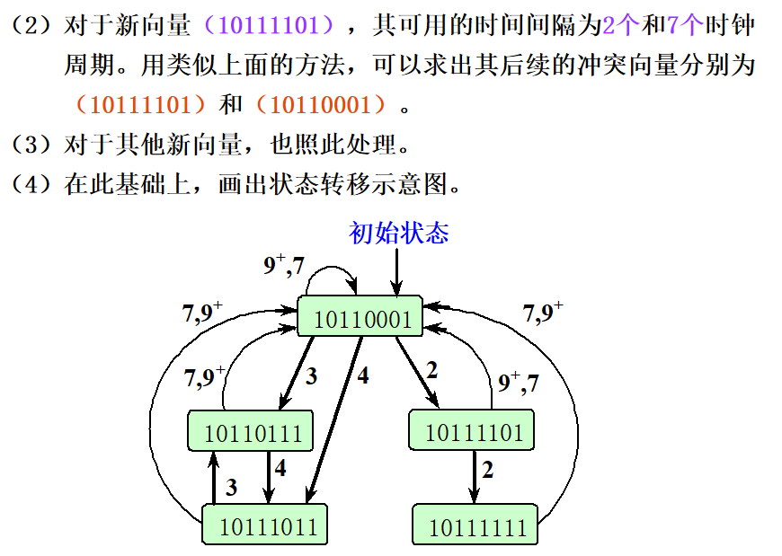
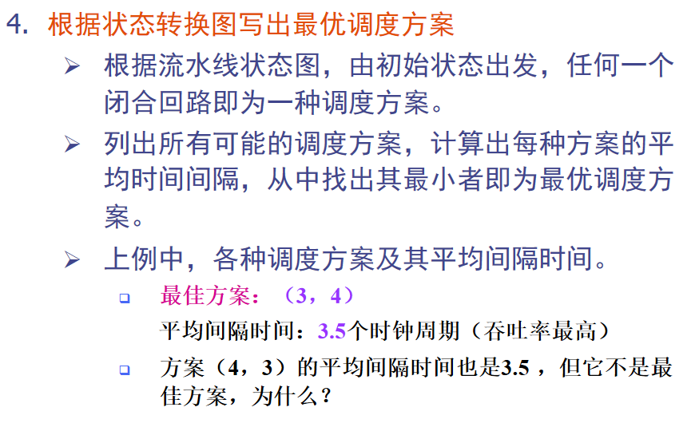

* 因为方案（4，3）在指令数量为奇数时，最后一个指令的执行时间为4，而方案（3，4）最后一个指令的执行时间为3，所以方案（3，4）比方案（4，3）好。
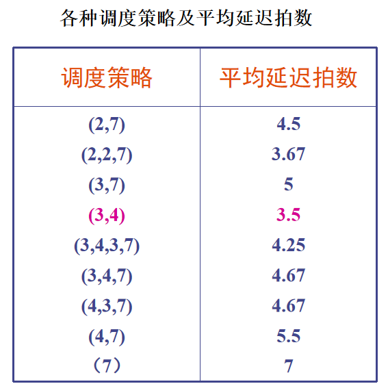

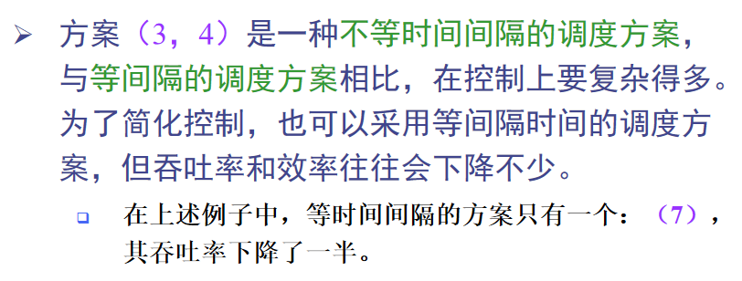