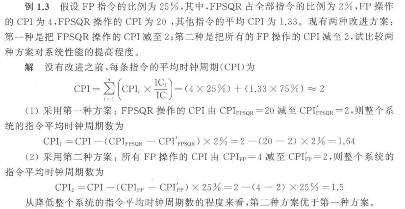

# 计算机体系结构笔记
[TOC]

# 1 基础知识

## 计算机系统结构的基本概念

### 1.1.1 计算机系统的层次结构

### 1.1.2 计算机系统结构的定义

经典定义：传统机器程序员所看到的计算机属性，即概念性结构和功能设计

广义定义：指令系统结构，组成，硬件

### 1.1.3 计算机组成和计算机实现

计算机组成(Computer Organization)指的是计算机系统结构的逻辑实现,包含物理机器级中的数据流和控制流的组成以及逻辑设计等。它着眼于物理机器级内各事件的排序方式与控制方式、各部件的功能以及各部件之间的联系。

计算机实现(Computer Implementation)指的是计算机组成的物理实现,包括处理机、主存等部件的物理结构,器件的集成度和速度,模块、插件、底板的划分与连接,信号传输,电源、冷却及整机装配技术等。它着眼于器件技术和微组装技术,其中器件技术在实现技术中起主导作用。

### 1.1.4 计算机系统结构的分类

1. Flynn分类法

Flynn分类法是按照指令流和数据流的多倍性进行分类的。Flynn分类法中的定义如下。

指令流(Instruction Stream):计算机执行的指令序列。

数据流(Data Stream):由指令流调用的数据序列。

多倍性(Multiplicity):在系统最受限的部件上,同时处于同一执行阶段的指令或数据
的最大数目。

Flynn分类法把计算机系统的结构分为以下4类。

1) 单指令流单数据流(Single Instruction stream Single Data stream,SISD);
2) 单指令流多数据流(Single Instruction stream Multiple Data stream,SIMD);
3) 多指令流单数据流(Multiple Instruction stream Single Data stream, MISD);
4) 多指令流多数据流(Multiple Instruction stream Multiple Data stream,MIMD)。

2. 冯氏分类法

用系统最大并行度分类，n为字宽，m为位片宽度。

1) 字串位串。nー1,m=1。这是第一代计算机发展初期的纯串行计算机。
2) 字串位并。n>1,m=1。这是传统的单处理机,同时处理单个字的多个位,如16位、32位等,IBM370机就属于这种结构
3) 字并位串。nー1,m>1。同时处理多个字的同一位(位片)。
4) 字并位并。n>1,m>1。同时处理多个字的多个位。

3. Handler 分类法

这种分类方法把计算机的硬件结构分成三个层次,并考虑它们的可并行-流水处理程度。这三个层
次是:

1) 程序控制部件(PCU)的个数k。
2) 算术逻辑部件(ALU)或处理部件(PE)的个数d。
3) 每个算术逻辑部件包含基本逻辑线路(ELC)的套数w。

## 1.2 计算机系统的设计

### 1.2.1 计算机系统设计的定量原理

Amdahl定律：

$$ 加速比 = \frac{系统性能_{改进前}}{系统性能_{改进后}} = \frac{总执行时间_{改进前}}{总执行时间_{改进后}} $$

这个加速比的大小与两个因素有关。一个是在改进前的系统中,可改进部分的执行时间在总的执行时间中所占的比例,简称可改进比例,记为Fe。Fe总是小于1。另一个是可改进部件改进以后性能提高的倍数。它是改进前所需的执行时间与改进后执行时间的比，简称部件加速比,记为Se。Se总是大于1。

例如，一个需运行60s的程序中有20s的运算可以加速,那么其Fe就是20/60。若该系统改进后,可改进部分的执行时间减少为5s,则其Se为 20/5。

部件改进后,程序中可改进部分的执行时间被缩短为原来的1/Se,但不可改进的那部分的执行时间没有变化,所以改进后程序的总执行时间为 

$$ T_{n} = T_{0} (1-Fe+\frac{Fe}{Se}) $$

其中 $ T_n $ 为改进前整个程序的执行时间,$ 1-Fe $ 为不可改进比例。

改进后,整个系统的加速比为

$$ S_{n} = \frac{T_{0}}{T_{n}} = \frac{1}{1-Fe+\frac{Fe}{Se}} $$

****

CPU性能公式：

$$ CPU时间 = IC \times CPI \times 时钟周期时间 $$

其中IC为指令数，CPI为每条指令的平均时钟周期数。

根据这个公式可知,CPU的性能取决于以下三个参数。

1) 时钟周期时间。取决于硬件实现技术和计算机组成。
2) CPI。取决于计算机组成和指令系统的结构。
3) IC。取决于指令系统的结构和编译技术。

****

程序的局部性原理：

程序执行时所访问的存储器地址不是随机分布的,而是相对地簇聚。

数据访问也具有局部性，不过其局部性弱于代码访问的局部性，

局部性包括时间局部性和空间局部性。

时间局部性是指:程序即将用到的信息很可能就是目前正在使用的信息。

空间局部性是指:程序即将用到的信息很可能与目前正在使用的信息在空间上相邻或者邻近。

利用程序的局部性原理,可以根据程序最近的访问情况来比较准确地预测将要访问的指令和数据。凡是涉及数据重用的地方都可能会用到它。

## 1.4 计算机系统结构的发展

### 1.4.1 冯·诺依曼结构及其改进

由运算器、控制器、存储器、输入设备和输出设备五大部分组成。

存储程序原理的基本点是指令驱动，即程序的执行是由存储器中的指令来驱动的。

1) 计算机以运算器为中心。输入输出设备与存储器之间的数据传送都经过运算器、存储器、输入输出设备的操作,并且它们之间的联系都由控制器集中控制。
2) 在存储器中,指令和数据同等对待。指令和数据一样可以进行运算,即由指令组成的程序是可以修改的。
3) 存储器是按地址访问、按顺序线性编址的一维结构,每个单元的位数是固定的。
4) 指令的执行是顺序的,即一般是按照指令在存储器中存放的顺序执行的。程序的分支由转移指令实现。由程序计数器(PC)指明当前正在执行的指令在存储器中的
地址。
5) 指令由操作码和地址码组成。操作码指明本指令的操作类型,地址码指明操作數地址和存放运算结果的地址。操作数的类型由操作码决定,操作数本身不能判定是何种数据类型。
6) 指令和数据均以二进制编码表示,采用二进制运算，

### 1.4.2 软件对系统结构的影响

* 软件的可移植性

一个软件可以不经修改或者只需少量修改就可以由一台机器移植到另一台机器上正确地运行。差别只是执行时间的不同。我们称这两台机器是软件兼容的。

* 实现可移植性的常用方法
  
采用系列机，模拟与仿真，统一高级语言 。

1. 统一高级语言 

* 实现软件移植的一种理想的方法
* 较难实现

1. 系列机 

* 由同一厂家生产的具有相同的系统结构，但具有不同组成和实现的一系列不同型号的机器。
* 较好地解决软件开发要求系统结构相对稳定与器件、硬件技术迅速发展的矛盾。
* 软件兼容：分四种：向上兼容、向下兼容、向前兼容、向后兼容。向上兼容是指程序可以在更高档的机器上运行，向下兼容是指程序可以在更低档的机器上运行，向前兼容是指某型号计算机编写的程序可以在之前投入市场的机器上运行，向后兼容是指某型号计算机编写的程序可以在之后投入市场的机器上运行。

2. 模拟和仿真

* 使软件能在具有不同系统结构的机器之间相互移植。
    * 在一种系统结构上实现另一种系统结构。
    * 从指令集的角度来看，就是要在一种机器上实现另一种机器的指令集。

* 模拟：用软件的方法在一台现有的机器（称为宿主机）上实现另一台机器（称为虚拟机）的指令集。
    * 通常用解释的方法来实现。
    * 运行速度较慢，性能较差。

* 仿真：用一台现有机器（宿主机）上的微程序去解释实现另一台机器（目标机）的指令集。
    * 运行速度比模拟方法的快
    * 仿真只能在系统结构差距不大的机器之间使用

## 1.5 并行性

### 1.5.1 并行性的概念

并行性(parallelism)是指计算机系统在同一时刻或者同一时间间隔内进行多种运算或操作。只要在时间上相互重叠,就存在并行性。它包括同时性与并发性两种含义。

同时性(simultaneity)——两个或两个以上的事件在同一时刻发生。

并发性(concurrency)——两个或两个以上的事件在同一时间间隔内发生。

从处理数据的角度来看,并行性等级从低到高可分为以下4种：

1) 字串位串
2) 字串位并
3) 字并位串
4) 全并行

****

从执行程序的角度来看。并行性等级从低到高可分为以下5种：

1) 指令内部井行

指令内部并行是指单条指令中各微操作之间的并行。

2) 指令级并行
   
指令级并行(Instruction Level Parallelism.ILP)是指井行或井发地执行两条或两条以
上的指令。

流水线技术使得多条指令能重叠地执行,提高了CPU执行程序的春吐率。加上RISC方法,计算机达到了每个时钟周期完成一条指令的性能。超标量(Superscalar)的方法则更进一步,使得计算机能每个时钟周期启动多条指令,并能由多条流水线在单周期内产生多个运算站果。超标量主要是用来开发指令级井行的。

3) 线程级并行

线程级井行(Thread Level Parallelism.TLP)是指并行执行两个或两个以上的线程。

4) 任务级或过程级井行

任务级或过程级井行是指并行执行两个或两个以上的过程或任务(程序段),以子程序或进程为调度单元。

5) 作业或程序级井行

作业或程序级并行是指并行执行两个或两个以上的作业或程序。

### 1.5.2 提高并行性的技术途径

计算机系统中提高井行性的措施有很多，就其基本思想而言，可归纳成以下三条途径。

1) 时间重叠(Time Interleaving)。

在井行性概念中引入时间因素，让多个处理过程在时间上相互错开，轮流重叠地使用同一套硬件设备的各个部分，以加快硬件周转而赢得速度。这种途径原则上不要求重复设置硬件设备。流水线技术是时间重叠的典型实例。

2) 资源重复(Resource Replication)。

在井行性概念中引入空间因素，以数量取胜。通过重复设置硬件资源，大幅度地提高计算机系统的性能。随着硬件价格的降低，这种途径得到了越来越广泛的应用。可以在单处理机中重复设置多个运算部件或处理部件，也可以重复设置多台处理机，构成多处理机系統。在现在的计算机系统統中，经常是同时运用时间重叠和资源重复。

3) 资源共享(Resource Sharing)。

这是一种软件方法，它便多个任务按一定的时间顺序轮流使用同一套硬件设备。多道程序、分时系统就是遵循这一途径而产生的。盗源共享既降低了成本，又提高了计算机设备的利用率。

# 2 指令系统的设计

## 2.1 指令系统结构的分类

### 2.1.1 分类

区别不同指令系统结构的主要因素是**CPU中用来存储操作数的存储单元的类型**

分三类：堆栈结构、累加器结构、通用寄存器结构

通用寄存器型结构进一步细分为3种类型
* 寄存器－寄存器型（RR型）
* 寄存器－存储器型（RM型）
* 存储器－存储器型（MM型）

**3种通用寄存器型结构的优缺点**：

表中(m，n)表示指令的n个操作数中有m个存储器操作数。

## 2.2 寻址方式

* 将寻址方式编码于操作码中，由操作码描述相应操作的寻址方式。

适合：处理机采用load-store结构，寻址方式只有很少几种。

* 在指令字中设置专门的寻址字段，用以直接指出寻址方式。

灵活，操作码短，但需要设置专门的寻址方式字段，而且操作码和寻址方式字段合起来所需要的总位数可能会比隐含方法的总位数多。
 
适合：处理机具有多种寻址方式，且指令有多个操作数。

****

物理地址空间的信息存放：

如允许各宽度信息任意存储，很可能会出现一个信息跨存储字边界而存储于两个存储单元中。

因此必须做到：信息在主存中存放的起始地址必须是该信息宽度（字节数）的整数倍。

例如：

* 字节信息的起始地址为：×…××××
* 半字信息的起始地址为：×…×××0
* 单字信息的起始地址为：×…××00
* 双字信息的起始地址为：×…×000
  
存在存储空间的浪费 ，但保证访问速度。

## 2.3 指令系统的设计与优化

### 2.3.1 指令系统设计的基本原则

#### 1 指令系统的设计

1) 取舍软硬件：考虑实现的基本功能，确定哪些归硬件实现，哪些归软件实现。有RISC和CISC两种设计思想。
2) 寻址方式：对基准程序进行测试统计，根据寻址方式的使用频率确定合适的寻址方式。
3) 操作数表示和操作数类型：主要的选择有：浮点，整型，字符，十进制类型等
4) 寻址方式的表示：可以将寻址方式编码于操作码中，也可以将寻址方式作为一个单独的域表示
5) 指令格式：变长编码格式、固定长度编码格式、混合编码格式三种

#### 2 软硬件取舍

主要考虑三个因素：速度、成本、灵活性

|  | 速度 | 成本 | 灵活性 |
| --- | --- | --- | --- |
| 硬件 | 快 | 高 | 低 |
| 软件 | 慢 | 低 | 高 |

#### 3 指令系统基本要求

完整性、规整性、正交性、高效率、兼容性

**完整性**：在一个有限可用的存储空间内，对于任何可解的问题，编制计算程序时，指令系统所提供的指令足够使用。

**规整性**：主要包括对称性和均匀性。

* 对称性：指令系统中所有与指令系统有关的存储单元的使用、操作码的设置等都是对称的。

例如：在存储单元的使用上，所有通用寄存器都要同等对待。在操作码的设置上，如果设置了A－B的指令，就应该也设置B－A的指令。

* 均匀性：指对于各种不同的操作数类型、字长、操作种类和数据存储单元，指令的设置都要同等对待。

例如：如果某机器有5种数据表示，4种字长，两种存储单元，则要设置5×4×2=40种同一操作的指令

**正交性**：在指令中各个不同含义的字段，如操作类型、数据类型、寻址方式字段等，在编码时应互不相关、相互独立。 

**高效率**：指指令的执行速度快、使用频度高。

**兼容性**：主要是要实现向后兼容，指令系统可以增加新指令，但不能删除指令或更改指令的功能。

### 2.3.2 控制指令

#### 1 控制指令用于改变控制流

* 跳转：当指令是无条件改变控制流时，称之为跳转指令。

* 分支：当控制指令是有条件改变控制流时，则称之为分支指令。 
#### 2 能够改变控制流的指令

* 分支
* 跳转
* 过程调用
* 过程返回

改变控制流的大部分指令是分支指令（条件转移）

#### 3 分支条件的方法及其优缺点

#### 4 转移目标地址的表示

最常用的方法是在指令中提供一个偏移量，由该偏移量和程序计数器（PC）的值相加而得出目标地址。（PC相对寻址）

优点：

* 有效地减少表示该目标地址所需要的位数
* 位置无关（代码可被装载到主存的任意位置执行）

关键：确定偏移量字段的长度

* 模拟结果表明：采用4～8位的偏移量字段（以指令字为单位）就能表示大多数控制指令的转移目标地址了
  
### 2.3.3 指令操作码的优化

* 指令由两部分组成：操作码、地址码
* 指令格式的设计：确定指令字的编码方式，包括操作码字段和地址码字段的编码和表示方式。
* 指令格式的优化：如何用最短的位数来表示指令的操作信息和地址信息。 

#### 1 哈夫曼编码

#### 2 等长扩展码

#### 3 定长操作码

* 采用最多
* 保证操作码的译码速度、减少译码的复杂度。
* 以程序的存储空间为代价来换取硬件实现上的好处。

### 2.3.3 指令字格式的优化

指令系统的3种编码格式：
* 可变长度编码格式
* 固定长度编码格式
* 混合型编码格式

#### 1 可变长度编码格式

* 当指令系统的寻址方式和操作种类很多时，这种编码格式是最好的。
* 用最少的二进制位来表示目标代码。
* 可能会使各条指令的字长和执行时间相差很大。

| 操作码 | 地址描述符1 | 地址码1 | ………… | 地址描述符n | 地址码n |
| --- | --- | --- | --- | --- | --- |

#### 2 固定长度编码格式

* 将操作类型和寻址方式一起编码到操作码中。
* 当寻址方式和操作类型非常少时，这种编码格式非常好。
* 可以有效地降低译码的复杂度，提高译码的速度。
* 大部分RISC的指令系统均采用这种编码格式。

| 操作码 | 地址码1 | 地址码2 | 地址码3 |
| --- | --- | --- | --- |

#### 3 混合型编码格式
* 提供若干种固定的指令字长。
* 以期达到既能够减少目标代码长度又能降低译码复杂度的目标。

| 操作码 | 地址描述符 | 地址码 |
| --- | --- | --- |

| 操作码 | 地址描述符1 | 地址描述符2 | 地址码 |
| --- | --- | --- | --- |

| 操作码 | 地址描述符 | 地址码1 | 地址码2 |
| --- | --- | --- | --- |

## 2.4 指令系统的发展和改进

### 2.4.1 CISC方向

CISC指令系统指令数量多，功能多样，只要目标是增强指令功能，将更多功能交给硬件实现。

增强指令功能从以下3方面：

* 面向目标程序增强指令功能
* 面向高级语言的优化实现来改进指令系统
* 面向操作系统的优化实现改进指令系统

#### 1 面向目标程序增强指令功能

对大量的目标程序及其执行情况进行统计分析，找出那些使用频度高、执行时间长的指令或指令串。对于使用频度高的指令，用硬件加快其执行；对于使用频度高的指令串，用一条新的指令来替代。

既能减少目标程序的执行时间，也能有效地缩短程序的长度。

#### 2 面向高级语言的优化实现来改进指令系统

（缩小高级语言与机器语言的语义差距）

高级语言与一般的机器语言的语义差距非常大，为高级语言程序的编译带来了一些问题。

（1）编译器本身比较复杂；

（2）编译生成的目标代码比较难以达到很好的优化。

对高级语言中使用频度高、执行时间长的语句，增强有关指令的功能，加快这些指令的执行速度，或者增加专门的指令，可以达到减少目标程序的执行时间和减少目标程序长度的目的。 

增强系统结构的规整性，减少系统结构中的各种例外情况。

#### 3 面向操作系统的优化实现改进指令系统

操作系统和计算机系统结构是紧密联系的，操作系统的实现在很大程度上取决于系统结构的支持。

指令系统对操作系统的支持主要有：

* 处理机工作状态和访问方式的切换；
* 进程的管理和切换；
* 存储管理和信息保护；
* 进程的同步与互斥，信号灯的管理等。

### 2.4.2 RISC方向

#### 1 CISC的问题

* 各种指令的使用频度相差悬殊，许多指令很少用

* 指令系统大，指令条数多，许多指令的功能复杂，使得控制器硬件非常复杂，占用大量的芯片面积，给VLSI设计造成困难；增加了研制时间和成本，容易造成设计错误。

* 许多指令由于操作繁杂，其CPI值大，执行速度慢。采用这些复杂指令有可能使整个程序的执行时间反而增加。

* 由于指令功能复杂，规整性不好，不利于采用流水技术来提高性能。 

#### 2 设计RISC机器遵循的原则 

指令条数少、指令功能简单。只选取使用频度很高的指令，在此基础上补充一些最有用的指令；

采用简单而又统一的指令格式，并减少寻址方式；指令字长都为32位或64位；

指令的执行在单个机器周期内完成；(采用流水线机制)

只有load和store指令才能访问存储器，其它指令的操作都是在寄存器之间进行；（即采用load-store结构）

大多数指令都采用硬连逻辑来实现；

强调优化编译器的作用，为高级语言程序生成优化的代码；

充分利用流水技术来提高性能。

## 2.6 MIPS指令系统结构

### 2.6.4 MIPS指令格式

# 3 流水线技术

## 3.1 流水线的基本概念

### 3.1.1 流水技术的特点

* 流水线把一个处理过程分解为若干个子过程（段），每个子过程由一个专门的功能部件来实现。
* 流水线中各段的时间应尽可能相等，否则将引起流水线堵塞、断流。
  * 时间最长的段将成为流水线的瓶颈。
* 流水线每一个段的后面都要有一个缓冲寄存器（锁存器），称为流水寄存器。
  * 作用：在相邻的两段之间传送数据，以保证提供后面要用到的信息，并把各段的处理工作相互隔离。
* 流水技术适合于大量重复的时序过程，只有在输入端不断地提供任务，才能充分发挥流水线的效率。
* 流水线需要有通过时间和排空时间。
  * 通过时间：第一个任务从进入流水线到流出结果所需的时间。
  * 排空时间：最后一个任务从进入流水线到流出结果所需的时间。

### 3.1.2 流水线的分类

#### 1. 按照流水技术用于计算机系统的等级不同分为：

* 部件级流水线（运算操作流水线）
* 处理机级流水线（指令流水线）
* 系统级流水线（宏流水线）

#### 2. 按照流水线所完成的功能不同分为：

* 单功能流水线：只能完成一种固定功能
* 多功能流水线：流水线的各段可以进行不同的连接，以实现不同的功能

#### 3. 按照同一时间内各段之间的连接方式不同分为：

* 静态流水线：在同一时间内，多功能流水线中的各段只能按同一种功能的连接方式工作
* 动态流水线：在同一时间内，多功能流水线中各段可以按照不同的方式连接，同时执行多种功能。
  * 优点：灵活，能够提高流水线各段的使用率，从而提高处理速度。
  * 缺点：控制复杂。

#### 4. 按照流水线中是否有反馈回路分为：

* 线性流水线：流水线的各段串行连接，没有反馈回路。数据通过流水线中的各段时，每一个段最多只流过一次。
* 非线性流水线：流水线中除了有串行的连接外，还有反馈回路。

#### 5. 根据任务流入和流出的顺序是否相同分为：

* 顺序流水线：流水线输出端任务流出的顺序与输入端任务流入的顺序完全相同。每一个任务在流水线的各段中是一个跟着一个顺序流动的。
* 乱序流水线：流水线输出端任务流出的顺序与输入端任务流入的顺序可以不同，允许后进入流水线的任务先完成（从输出端流出）。也称为无序流水线、错序流水线、异步流水线

#### 6. 标量处理机与向量流水处理机

* 把指令执行部件中采用了流水线的处理机称为流水线处理机。
* 标量处理机：处理机不具有向量数据表示和向量指令，仅对标量数据进行流水处理。
* 向量流水处理机：具有向量数据表示和向量指令的处理机。向量数据表示和流水技术的结合。

## 3.2 流水线的性能指标

### 3.2.1 吞吐率

1. 吞吐率：在单位时间内流水线所完成的任务数量或输出结果的数量。

$$ TP = \frac{N}{T_{k}} $$

* n：任务数
* Tk：处理完成n个任务所用的时间

2. 解决瓶颈问题

### 3.2.2 加速比

加速比：完成同样一批任务，不使用流水线所用的时间与使用流水线所用的时间之比。

假设：不使用流水线（即顺序执行）所用的时间为Ts，使用流水线后所用的时间为Tk，则该流水线的加速比为：

$$ S = \frac{T_{s}}{T_{k}} $$

### 3.2.3 效率

流水线的效率：流水线中的设备实际使用时间与整个运行时间的比值，即流水线设备的利用率。

也可以表示为流水线的实际加速比S与它的最大加速比k的比值。

$$ E = \frac{S}{k} $$

也可以表示为n个任务占用的时空面积和k个段总的时空面积之比。

### 3.2.4 流水线的性能分析

该静态流水线效率低的原因：

* 多功能流水线在做某一种运算时，总有一些段是空闲的；
* 静态流水线在进行功能切换时，要等前一种运算全部流出流水线后才能进行后面的运算；
* 运算之间存在关联，后面有些运算要用到前面运算的结果；
* 流水线的工作过程有建立与排空部分。 

### 3.2.5 流水线设计中的三个问题

1. 瓶颈问题

理想情况下，流水线在工作时，其中的任务是同步地每一个时钟周期往前流动一段。

当流水线各段不均匀时，机器的时钟周期取决于瓶颈段的延迟时间。

在设计流水线时，要尽可能使各段时间相等。

2. 流水线的额外开销

分两部分：流水寄存器延迟，时钟偏移开销。

流水寄存器需要建立时间和传输延迟。
* 建立时间：在触发写操作的时钟信号到达之前，寄存器输入必须保持稳定的时间。
* 传输延迟：时钟信号到达后到寄存器输出可用的时间。

时钟偏移开销：流水线中，时钟到达各流水寄存器的最大差值时间。（时钟到达各流水寄存器的时间不是完全相同）

结论：
* 流水线并不能减少（而且一般是增加）单条指令的执行时间，但却能提高吞吐率。
* 增加流水线的深度（段数）可以提高流水线的性能。
* 流水线的深度受限于流水线的额外开销。
* 当时钟周期小到与额外开销相同时，流水已没意义。因为这时在每一个时钟周期中已没有时间来做有用的工作。
  
3. 冲突问题

## 3.3 非线性流水线调度

### 3.3.1 单功能非线性流水线的最优调度

* 因为方案（4，3）在指令数量为奇数时，最后一个指令的执行时间为4，而方案（3，4）最后一个指令的执行时间为3，所以方案（3，4）比方案（4，3）好。

## 3.4 流水线的相关与冲突

### 3.4.1 经典五段流水线

一条指令的执行过程分为以下5个周期：

取指令周期（IF）

* 以程序计数器PC中的内容作为地址，从存储器中取出指令并放入指令寄存器IR；
* 同时PC值加4（假设每条指令占4个字节），指向顺序的下一条指令。　

指令译码/读寄存器周期（ID）

* 对指令进行译码，并用IR中的寄存器地址去访问通用寄存器组，读出所需的操作数。

执行/有效地址计算周期（EX）

* load和store指令：ALU把指令中所指定的寄存器的内容与偏移量相加，形成访存有效地址。
* 寄存器－寄存器ALU指令：ALU按照操作码指定的操作对从通用寄存器组中读出的数据进行运算。
* 寄存器－立即数ALU指令：ALU按照操作码指定的操作对从通用寄存器组中读出的操作数和指令中给出的立即数进行运算。
* 分支指令：ALU把指令中给出的偏移量与PC值相加，形成转移目标的地址。同时，对在前一个周期读出的操作数进行判断，确定分支是否成功。

存储器访问／分支完成周期（MEM）

* 该周期处理的指令只有load、store和分支指令（分支“成功”，就把转移目标地址送入PC。）。其它类型的指令在此周期不做任何操作。

写回周期（WB）

ALU运算指令和load指令在这个周期把结果数据写入通用寄存器组。

* ALU运算指令：结果数据来自ALU。
* load指令：结果数据来自存储器。

在这个实现方案中：
* 分支指令需要4个时钟周期（如果把分支指令的执行提前到ID周期，则只需要2个周期）；
* store指令需要4个周期；
* 其它指令需要5个周期才能完成。

### 3.4.2 相关与流水线冲突

#### 3.4.2.1 相关的三种类型

* 数据相关（也称真数据相关）
* 名相关
* 控制相关

##### 1 数据相关

对于两条指令i（在前，下同）和j（在后，下同），如果下述条件之一成立，则称指令j与指令i数据相关。 

* 指令j使用指令i产生的结果；
* 指令j与指令k数据相关，而指令k又与指令i数据相关。

数据相关具有传递性。

##### 2 名相关

名：指令所访问的寄存器或存储器单元的名称。

如果两条指令使用相同的名，但是它们之间并没有数据流动，则称这两条指令存在名相关。

指令j与指令i之间的名相关有两种：

反相关：如果指令j写的名与指令i读的名相同，则称指令i和j发生了反相关。指令j写的名＝指令i读的名

输出相关：如果指令j和指令i写相同的名，则称指令i和j发生了输出相关。指令j写的名＝指令i写的名

名相关的两条指令之间并没有数据的传送。

如果一条指令中的名改变了，并不影响另外一条指令的执行。

**换名技术**

换名技术：通过改变指令中操作数的名来消除名相关。

对于寄存器操作数进行换名称为寄存器换名。

既可以用编译器静态实现，也可以用硬件动态完成。

##### 3 控制相关

控制相关是指由分支指令引起的相关。为了保证程序应有的执行顺序，必须严格按控制相关确定的顺序执行。

#### 3.4.2.2 流水线冲突

流水线冲突是指对于具体的流水线来说，由于相关的存在，使得指令流中的下一条指令不能在指定的时钟周期执行。

流水线冲突有3种类型：

结构冲突：因硬件资源满足不了指令重叠执行的要求而发生的冲突。

****

数据冲突：当指令在流水线中重叠执行时，因需要用到前面指令的执行结果而发生的冲突。

根据指令读访问和写访问的顺序，数据冲突又分为3种：

考虑两条指令i和j，i在前，j在后。

* 写后读冲突：i写入前，j先读
* 写后写冲突：i写入前，j先写，导致最后写入i
* 读后写冲突：i读取前，j先写，i读出错误内容

****

控制冲突：流水线遇到分支指令和其它会改变PC值的指令所引起的冲突。

处理分支指令最简单的方法：“冻结”或者“排空”流水线。其优点是简单。

由分支指令引起的延迟称为分支延迟。可采取两种措施来减少分支延迟：

* 在流水线中尽早判断出分支转移是否成功；
* 尽早计算出分支目标地址。

3种通过软件（编译器）来减少分支延迟的方法：

预测分支失败：

* 允许分支指令后的指令继续在流水线中流动，就好象什么都没发生似的；

* 若确定分支失败，将分支指令看作是一条普通指令，流水线正常流动；

* 若确定分支成功，流水线就把在分支指令之后取出的所有指令转化为空操作，并按分支目地重新取指令执行。

要保证：分支结果出来之前不能改变处理机的状态，以便一旦猜错时，处理机能够回退到原先的状态。

****

预测分支成功：

* 假设分支转移成功，并从分支目标地址处取指令执行。

起作用的前题：先知道分支目标地址，后知道分支是否成功。前述5段流水线中，这种方法没有任何好处。

****

延迟分支：

主要思想：从逻辑上“延长”分支指令的执行时间。把延迟分支
看成是由原来的分支指令和若干个延迟槽构成，不管分支是否成功，都要按顺序执行延迟槽中的指令。

在延迟槽中放入有用的指令的任务由编译器完成。能否带来好处取决于编译器能否把有用的指令调度到延迟槽中。

三种调度方法： 

* 从前调度
* 从目标处调度
* 从失败处调度

分支延迟受到两个方面的限制：

* 可以被放入延迟槽中的指令要满足一定的条件；
* 编译器预测分支转移方向的能力。

进一步改进：分支取消机制

当分支的实际执行方向和事先所预测的一样时，执行分支延迟槽中的指令，否则就将分支延迟槽中的指令转化成一个空操作。

“预测成功-取消”分支的执行过程

# 4 向量处理机

## 4.1 向量的处理方式

1. 横向（水平）处理：向量按行从左到右处理
2. 纵向（垂直）处理：向量按列从上到下处理
3. 纵横（分组）处理：向量分为若干组，每组按行处理，再按列处理

## 4.2 提高向量处理机性能的常用技术

了解有以下几种即可：

* 设置多个功能部件，使它们并行工作；
* 采用链接技术，加快一串向量指令的执行；
* 采用循环开采技术，加快循环的处理；
* 采用多处理机系统，进一步提高性能。

## 4.3 性能评价

不需掌握

# 5 指令级并行

指令级并行：指指令之间存在的一种并行性，利用它，计算机可以并行执行两条或两条以上的指令。 （ILP：Instruction-Level Parallelism）

开发ILP的途径有两种
*  资源重复，重复设置多个处理部件，让它们同时执行相邻或相近的多条指令；
*  采用流水线技术，使指令重叠并行执行。

## 5.3 指令的动态调度

静态调度

* 依靠编译器对代码进行静态调度，以减少相关和冲突。
* 它不是在程序执行的过程中、而是在编译期间进行代码调度和优化。
* 通过把相关的指令拉开距离来减少可能产生的停顿。

动态调度

* 在程序的执行过程中，依靠专门硬件对代码进行调度，减少数据相关导致的停顿。
  
优点：

* 能够处理一些在编译时情况不明的相关（比如涉及到存储器访问的相关），并简化了编译器；
* 能够使本来是面向某一流水线优化编译的代码在其它的流水线（动态调度）上也能高效地执行。

缺点：以硬件复杂性的显著增加为代价

# 7 存储系统

## 7.1 基本知识

### 7.1.3 三级存储系统

* Cache（高速缓冲存储器）
* 主存储器
* 磁盘存储器（辅存）

可以看成是由“Cache—主存”层次和“主存—辅存”层次构成的系统。

从主存的角度来看：
* “Cache－主存”层次：弥补主存速度的不足
* “主存－辅存”层次： 弥补主存容量的不足

### 7.1.4 存储层次的四个问题

1. 当把一个块调入高一层(靠近CPU)存储器时，可以放在哪些位置上?（映象规则）
2. 当所要访问的块在高一层存储器中时，如何找到该块?（查找算法）
3. 当发生不命中时，应替换哪一块？（替换算法）
4. 当进行写访问时，应进行哪些操作?（写策略）
### 7.2.2 映象规则

请转计算机组成原理

### 7.2.5 替换算法

* 随机替换算法
* 先进先出法（FIFO）
* 最近最少使用法（LRU）
  * 实际上：选择最久没有被访问过的块作为被替换的块。 
  * 优点：命中率较高

LRU和随机法分别因其不命中率低和实现简单而被广泛采用。

模拟数据表明，对于容量很大的Cache，LRU和随机法的命中率差别不大。

### 7.2.6 写策略

* 写直达法

执行写操作时，同时写入Cache和主存。

* 写回法

只在Cache中写入，当Cache中的块被替换时，再写入主存。（设置修改位）

写回法的优点：速度快，所使用的存储器带宽较低。

写直达法的优点：易于实现，一致性好。

### 7.2.8 改进Cache性能

$$ 平均访问时间 = 命中时间 + 不命中率 \times 不命中、开销 $$

下面介绍17种Cache优化技术

* 8种用于降低不命中率
* 5种用于减少不命中开销
* 4种用于减少命中时间 

## 7.3 降低Cache不命中率

### 7.3.1 三种类型的不命中

* 强制性不命中：当第一次访问一个块时，该块不在Cache中，需从下一级存储器中调入Cache，这就是强制性不命中。（冷启动不命中，首次访问不命中）

* 容量不命中：如果程序执行时所需的块不能全部调入Cache中，则当某些块被替换后，若又重新被访问，就会发生不命中。

* 冲突不命中：在组相联或直接映象Cache中，若太多的块映象到同一组(块)中，则会出现该组中某个块被别的块替换(即使别的组或块有空闲位置)，然后又被重新访问的情况。这就是发生了冲突不命中。(碰撞不命中，干扰不命中)

减少三种不命中的方法：

* 强制性不命中：增加块大小，预取（本身很少）
* 容量不命中：增加容量 （抖动现象）
* 冲突不命中：提高相联度（理想情况：全相联）

许多降低不命中率的方法会增加命中时间或不命中开销

### 7.3.2 增加Cache块大小

对于给定的Cache容量，当块大小增加时，不命中率开始是下降，后来反而上升了。原因：一方面它减少了强制性不命中；
另一方面，由于增加块大小会减少Cache中块的数目，所以有可能会增加冲突不命中。

Cache容量越大，使不命中率达到最低的块大小就越大。

增加块大小会增加不命中开销

### 7.3.3 增加Cache容量

缺点：增加成本，可能增加命中时间

### 7.3.4 提高Cache相联度

采用相联度超过8的方案的实际意义不大。

提高相联度是以增加命中时间为代价。

### 7.3.5 伪相联 Cache (列相联 Cache )

缺点：多种命中时间

### 7.3.6 硬件预取

指令和数据都可以预取。

预取内容既可放入Cache，也可放在外缓冲器中。

指令预取通常由Cache之外的硬件完成。

预取应利用存储器的空闲带宽，不能影响对正常不命中的处理，否则可能会降低性能。

### 7.3.7 编译器控制的预取

在编译时加入预取指令，在数据被用到之前发出预取请求。

1. 按照预取数据所放的位置，可把预取分为两种类型：
* 寄存器预取：把数据取到寄存器中。
* Cache预取：只将数据取到Cache中。

2. 按照预取的处理方式不同，可把预取分为：
* 故障性预取：在预取时，若出现虚地址故障或违反保护权限，就会发生异常。
* 非故障性预取：在遇到这种情况时则不会发生异常，因为这时它会放弃预取，转变为空操作。

3. 在预取数据的同时，处理器应能继续执行。

4. 编译器控制预取的目的是使执行指令和读取数据能重叠执行。

5. 循环是预取优化的主要对象

6. 每次预取需要花费一条指令的开销，因此要保证这种开销不超过预取所带来的收益

### 7.3.8 编译器优化

通过对软件进行优化来降低不命中率。与其他方法相比最大特点是不改动硬件。

研究方面分减少指令不命中和减少数据不命中两个方面。

常用优化技术有：

1. 程序代码和数据重组
2. 内外循环交换
3. 分块

### 7.3.9 “牺牲”Cache

在Cache和其下一级存储器的数据通路上增设一个全相联的小Cache,称为“牺牲"Cache。

“牺牲"Cache 中存放因冲突而被替换出去的那些块(即“牺牲者”)。毎当发生不命中时,在访问下一级存储器之前,先检查“牺牲"Cache 中是否含有所需的块。如果有,就将该块与Cache 中某个块(按替换规则选择)做交换,把所需的块从“牺牲"Cache调入Cache。

## 7.4 减少Cache不命中开销

五种方法：采用两级Cache、读不命中优先于写、写缓冲合并、请求字处理技术，非阻塞Cache技术。

### 7.4.1 采用两级Cache

### 7.4.2 读不命中优先于写

在读不命中时检查写缓冲器的内容，如没有冲突且存储器可访问，就继续处理读不命中。

### 7.4.3 写缓冲合并

在写缓冲器不为空的情况下,把这次的写入地址与写缓冲器中已有的所有地址进行比较,看是否有匹配的项。如果有地址匹配而对应的位置又是空闲的,就把这次要写人的数据与该项合并。当然,如果写缓冲器满且没有能进行写合并的项，就只好等待，

### 7.4.4 请求字处理技术

该方法不用增加硬件。

当从存储器向CPU调人一块时,块中往往只有一个字是CPU立即需要的,这个字称为请求字(Requested Word)。
请求字处理技术正是着眼于这种请求字的特性。当CPU所请求的字到达后,不等整个块都调人Cache,就可把该字发送给CPU并重启CPU继续执行,有两种具体的方案。

1) 尽早重启动(Early Restart):在请求字没有到达时,CPU处于等待状态。一旦请求字到达,就立即发送给CPU,让等待的CPU尽早重启动,继续执行，
2) 请求字优先(Requested Word First):调块时,让存储器首先提供CPU所要的请求字。请求字一旦到达,就立即送给CPU,让 CPU继续执行,同时从存储器调人该块的其余部分。请求字优先也称为回绕读取(Wrapped Fetch)或关键字优先(Critical Word First)。

一般来说,这些技术仅当 Cache块很大时才有效。因为当 Cache块较小时,用不用这些技术,不命中开销差别不大。

### 7.4.5 非阻塞Cache技术

非阻塞Cache技术是指在Cache不命中时，仍然允许CPU进行其他的命中的访问，减少了实际不命中开销。如更进一步允许多个不命中重叠，可进一步减少开销（存储器能处理多个不命中才可行）。

## 7.5 减少命中时间

### 7.5.1 容量小、结构简单的Cache

用地址的索引部分访问标识存储器,读出标识并与地址进行比较,是Cache命中访问过程中最耗时的部分

硬件越简单。速度就越快。小容量Cache对减少命中时间有益。而且应使Cache容量足够小,以便可以与处理器做在同一芯片上,避免因片外访问而增加时间开销。

此外,还要保持Cache结构的简单性,例如采用直接映像 Cache。直接映像 Cache的主要优点是可以让标识检测和数据传送同时进行,从而有效地减少命中时间。

### 7.5.2 虚拟Cache

采用虚拟存储器的计算机中，每次访存需要进行虚实地址的转换。

1. 物理Cache:地址转换和Cache访问串行进行，访问速度慢
2. 虚拟Cache:直接用虚拟地址访问Cache，Cache中存放的是虚拟地址。命中时不进行地址转换，不命中时地址转换与Cache访问并行进行，速度快。

    但由于采用虚拟地址，每次进程切换需要清空Cache，且操作系统和用户程序对同一个物理地址可以采用两种以上的虚拟地址，可能导致同一个数据在Cache中有多份拷贝。

3. 虚拟索引-物理标识方法：以虚地址的页内位移作为Cache的索引，而标识的是物理地址。

### 7.5.3 Cache访问流水化

把对第一级Cache的访问流水化，这使访问Cache需要多个时钟周期，但可以提高时钟频率。实际上这并不减少Cache命中时间，但可以提高访问Cache的带宽。

### 7.5.4 踪迹Cache

普通的指令Cache存放静态指令序列，踪迹Cache中存放的是CPU所执行过的动态指令序列,其中包含由分支预测展开了的指令。该分支预测是否正确需要在取到该分支指令时进行确认。

缺点：踪迹Cache的地址映像机制比普通Cache的复杂，有可能重复存放相同的指令序列。

但优点：提高指令Cache的空间利用率。

### 7.5.5 总结

