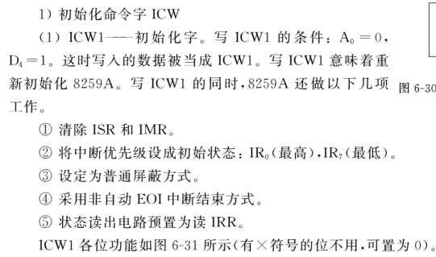
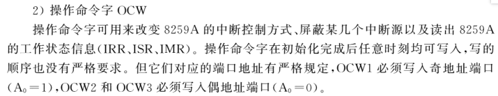

# 前言

本参考资料默认你有相关教材，基础知识一概不讲。什么？教材来不及买了？tm图书馆一百多本相关教材多少年都没人借过，唉！（被不学无术的同学们气晕）

# 速查

## 74ls138


(注意A2 A1 A0也可写为A B C)

习题：存储器系统连接如下图，请分别写出图中第一组（1#、2#）、第二组（3#、4#）的地址分配范围。（写出具体步骤）


答案：
                                
|A19|A18|A17|A16|A15|A14|A13|A12-A0|
|---|---|---|---|---|---|---|------|
|0|0|1|1|1|1|0|全0到全1|

第一组范围为：3C000H—3DFFFH  

|A19|A18|A17|A16|A15|A14|A13|A12-A0|
|---|---|---|---|---|---|---|------|
|0|0|1|1|0|1|1|全0到全1|

第二组范围为：36000H—37FFFH 

## 8259A







习题：按以下要求初始化8259A：
* 接口地址为20H和21H；
* 中断为上升沿触发；单片8259A；不写ICW4；
* 与IR0-IR3对应的中断向量码为08H-0BH；
* IR4-IR7不使用。

答案：

```assembly
INIT8259A：
	MOV	DX，20H	；A0=0，写ICW1
	MOV	AL，12H	；上升沿触发，单片，不写ICW4
	OUT	DX，AL
	MOV	DX，21H	；A0=1，写ICW2，OCW1
	MOV	AL，08H	；ICW2
	OUT	DX，AL
	MOV	AL，0F0H；OCW1：屏蔽IR4-IR7
	OUT	DX，AL
```

## 8253


