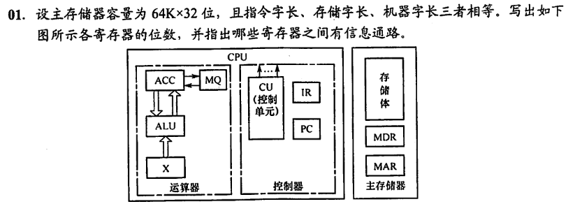
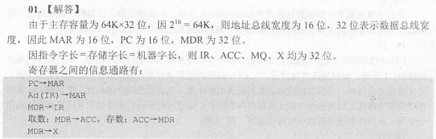

你把试卷塞满王道题和考研题的样子很靓仔，但你tm复习课里写的那些玩意是真TM逆天，你tm自己好好看看那tm是考研重点吗？题目是这样出的吗？

# 第一章 计算机系统概论

## 计算机系统和计算机系统的层次结构：

计算机系统由“硬件”和“软件”两大部分组成。

计算机的软件通常又可以分为两大类：系统软件和应用软件。

#

## 冯诺依曼计算机的特点

1. 计算机由五大部件组成
2. 指令和数据以同等地位存于存储器，可按地址寻访
3. 指令和数据用二进制表示
4. 指令由操作码和地址码组成
5. 存储程序
6. 以运算器为中心

## 计算机系统结构、计算计组成和实现

1. 计算机系统结构的定义

计算机体系结构就是程序员所看到的计算机的基本属性，即概念性结构与功能特性。

（指令系统、数据类型、寻址技术、I/0机理）

例如：有无乘法指令

2. 计算机组成的定义

计算机组成是指实现体系结构功能特性的操作部件及其内在联系，包括机器内部的数据流和控制流的组成以及逻辑设计等。

例如：如何实现乘法指令

3. 计算机实现的定义

计算机实现是指计算机组成的物理实现。它着眼于器件技术与组装技术

4. 计算机系统结构、组成、实现三者的关系

计算机系统结构、计算机组成和计算机实现是三个不同的概念。

计算机系统结构是指计算机系统的软件与硬件之间的接口

计算机组成是指计算机系统结构的逻辑实现

计算机实现是指计算机组成的物理实现。

三者包含的内容不同，但却有着紧密的联系。

## 计算机工作过程和硬件组成框图

自己画一遍！！！

## 性能度量指标和基本概念：机器字长、指令字长、存储字长、CPU,PC,IR,CU,ALU, ACC,MQ,X, MAR, MDR,MM,I/O,MIPS,CPI,FLOPS等等

这还要解释那你不用看这个了，准备重修吧

# 第二章 计算机的发展与应用

无

# 第三章 系统总线

## 基本概念

1. 总线

总线是连接各个部件的信息传输线，是各个部件共享的传输介质

2. 总线分类

    1. 片内总线：芯片内部的总线
    2. 系统总线：计算机各部件之间的信息传输线

        1. 数据总线：双向传输，传输数据
        2. 地址总线：单向传输，传输地址
        3. 控制总线：双向传输，传输控制信息

    3. 通信总线：用于 计算机系统之间或 计算机系统与其他系统（如控制仪表、移动通信等）之间的通信。按传输方式分为：串行通信总线和并行通信总线

3. 总线特性

    1. 机械特性：尺寸、形状、管脚数及排列顺序
    2. 电气特性：传输方向和有效的电平范围
    3. 功能特性：每根传输线的功能
    4. 时间特性：信号的时序关系

4. 总线的性能指标

    1. 总线宽度：数据线的根数
    2. 标准传输率：每秒传输的最大字节数（MBps）
    3. 时钟同步/异步：同步、不同步
    4. 总线复用：地址线与数据线复用
    5. 信号线数：地址线、数据线和控制线的总和
    6. 总线控制方式：并发、自动、仲裁、逻辑、计数
    7. 其他指标：负载能力

5. 总线主设备/从设备：主设备就是控制总线的设备，从设备就是响应主设备发来的总线命令的设备

## 总线结构

没法考

## 总线控制

1. 总线判优

总线判优分为集中式和分布式

集中式又分为：链式查询、计数器定时查询，独立请求方式

1. 总线通信

总线传输周期分为四个阶段：申请分配阶段、寻址阶段、传数阶段、结束阶段

总线通信分四种方式：同步通信、异步通信、半同步通信、分离式通信

异步通信又分为：不互锁、半互锁、全互锁

# 第四章 存储器

## 概念和名词解释

### 3.1 储存器概述

按作用，分为主存，辅存，Cache（高速缓存）

主存：主储存器，也称内存，用于存放当前正在执行的程序与数据。CPU可以直接进行随机读写，访问速度较高

辅存：辅助储存器，也称外存，用于存放当前暂不执行的程序与数据，以及其他需要长期保存的信息。

Cache:高速缓存储存器，介于CPU与主存之间，用于解决CPU和主存之间速度不匹配的问题

按存取方式，分为随机储存器（RAM），只读存储器（ROM），串行访问存储区（分为顺序存取存储器（SAM，如磁带）和直接存取存储器（DAM，如磁盘，光盘））

### 3.2 主储存器

主储存器使用DRAM实现，Cache使用SRAM实现。DRAM价格低速度慢。

#### 3.2.1 SRAM和DRAM芯片

SRAM：静态半导体随机存取存储器

DRAM：动态半导体随机存取存储器

SRAM使用双稳态触发器实现，可实现非破坏性读出。SRAM的存取速度快，但集成度低，功耗较大，价格昂贵，一般用于高速缓冲存储器。

DRAM使用电容实现，需要定时刷新，存取速度慢，但集成度高，功耗小，价格低廉，一般用于主存储器。

DRAM电容上的电荷一般只能维持1～2ms，因此即使电源不断电，信息也会自动消失。为此，每隔一定时间必须刷新，通常取2ms，称为刷新周期。常用的刷新方式有3种：

1. 集中刷新
2. 分散刷新
3. 异步刷新

#### 3.2.2 只读存储器

ROM结构简单，具有非易失性，根据制造工艺的不同，可分为：

1. MROM：掩模式ROM，制造芯片时直接将内容写入。
2. PROM：一次可编程ROM
3. EPROM：可擦除可编程ROM。编程次数有限，写入时间长
4. EEPROM：电擦写可编程只读存储器
5. CDROM：只读型光盘
6. Flash：在EPROM与$E^2PROM$基础上发展来的闪存，一般做U盘之类的移动设备
7. SSD：固态硬盘，由控制单元和存储单元（Flash）组成。

## 如何提高访存速度

提高访存速度可以采取三种措施：

（1）采用高速器件，选用存取周期短的芯片，可提高存储器的速度；

（2）采用缓存，CPU将最近期要用的信息先调入缓存，而缓存的速度比主存快得多，这样CPU每次只需要从缓存中取出（或）存入信息，从而缩短了访存时间；

（3）调整主存结构，采用单体多字结构（在一个存取周期内读出多个存储字，可增加存储器的带宽），或采用多体结构存储器。

## 虚拟存储器基本原理

* 虚拟存储器是建立在主存—辅存层次上的
* 原理：程序局部性访问
* 作用：扩大存储空间

# 第五章 输入输出

## I/O的基本组成

1. IO软件，包括IO指令与通道指令
2. IO硬件，包括IO接口与设备控制器

## 后面都是笔记内容

# 其他未总结的简答题

## 比较链式查询方式、计数器定时查询方式和独立请求方式各自的特点。

唐书课后题3.4：

3.4 为什么要设置总线判优控制?常见的集中式总线控制有几种，各有何特点，哪种方式响应时间最快，哪种方式对电路故障最敏感?

答：

(1)如多个主设备同时要使用总线时,就由总线控制器的判优、仲裁逻辑按一定的优先级顺序,确定那个主设备能使用总线,只有获得总线使用权的主设备才能开始传送数据。

(2)常见的集中式总线控制有三种

① 链式查询:其特点是只需很少几根线就能按一定优先次序实现总线控制,并且很容易扩充设备,但对电路故障很敏感。

② 计数器定时查询:其特点是,计数可以从“0”开始,设备的优先次序固定，优先次序可以改变。此外,对电路故障不如链式查询方式敏感,但增加了主控线数,控制也较复杂。

③ 独立请求方式:其特点是:响应速度快,优先次序控制灵活(通过程序改变),但控制线数量多,总线控制更复杂。

④ 独立请求方式响应时间最快,链式查询对电路故障最敏感。

## 试比较同步通信和异步通信。

唐书课后题3.6原题

答：

同步通信：指由统一时钟控制的通信，控制方式简单，灵活性差，当系统中各部件工作速度差异较大时，总线工作效率明显下降。适合于速度差别不大的场合。

异步通信：指没有统一时钟控制的通信，部件间采用应答方式进行联系，控制方式较同步复杂，灵活性高，适合于速度差别较大的场合

## 试比较缓存-主存和主存-辅存两个层次的相同点和不同点。

作业题。

相同点：

（1）二者都是为了提高存储系统的性能价格比而构造的层次性存储体系。

（2）二者都利用了程序访问的局部性原理。

不同点：

（1）缓存-主存层次主要解决CPU与主存的速度差异问题，主存-辅存层次主要解决存储系统的容量问题；

（2）CPU可直接访问缓存-主存层次中的缓存和主存，但是CPU只能访问主存-辅存层次中的主存，当主存不命中时，也不能直接访问辅存；

（3）缓存-主存层次的管理是有硬件完成，主存-辅存层次的管理由硬件和操作系统共同完成；

（4）二者未命中时的损失不同。主存未命中时，系统的损失远大于缓存未命中时的损失。

## 中断服务程序的流程 

## DMA相关内容

你就记住一句话：DMA只有在传送结束时才发送一次中断请求。其他不用背。

## 试比较程序查询、程序中断和DMA三种方式的综合性能。

| ---- | 程序查询 | 程序中断 | DMA |
| ---- | -------- | -------- | --- |
| 数据传送 | 依赖软件 | 依赖软件 | 依赖硬件 |
| 传送数据的基本单位 | 字或字节 | 字或字节 | 数据块 |
| 并行性 | CPU与I/O设备串行工作 | CPU与I/O设备并行工作，现行程序与I/O传送串行进行 | CPU与I/O设备并行工作，现行程序与I/O传送并行进行 |
| 主动性 | 主动 | 被动 | 被动 |
| 传输速度 | 比中断快 | 最慢 | 最快 |
| 经济性 | 费用低 | 介于查询和DMA之间 | 费用高 |
| 应用对象 | 中、低速 | 中、低速 | 高速成批传输 |

## 指令的寻址方式 

记住基址寻址用于程序浮动，变址寻址用于数组

## RISC的特点，CISC的特点，RISC和CISC的比较

理解即可

## 指令流水、指令流水受阻一般有哪些情况

愿意看笔记看笔记，不愿意看了跳过

## 一个完整的指令周期包含哪些CPU工作周期？中断周期前和中断周期后各是CPU的什么工作周期？DMA周期前和后各是CPU的什么周期？

>   1）一个完整的指令周期包括取指周期、间址周期、执行周期和中断周期。
>      其中取指周期和执行周期是每条指令均有的。
>
>   2）中断周期前是执行周期，中断周期后是下一条指令的取指周期。
>
>   3）DMA周期前可以是取指周期、间址周期、执行周期或中断周期，
>      DMA周期后也可以是取指周期、间址周期、执行周期或中断周期。
>      总之，DMA周期前后都是机器周期。

## 指令周期、时钟周期、机器周期，及其相互关系 

这要不会建议抓紧申请重修

## 试比较同步控制、异步控制和联合控制的区别

唐书9.9原题

同步控制方式是指，任何一条指令或指令中任何一个微操作的执行都是事先确定的，并且都是受统一基准时标的时序信号所控制的方式，每一个操作出现的时间与基准时标保持一致。

异步控制方式不存在基准时标信号，没有固定的周期节拍和严格的时钟同步，执行每条指令和每个操作需要多少时间就占用多少时间。这种方式微操作的时序由专门的应答线路控制，因需要采用各种应答电路，故其结构比同步控制方式复杂。

同步控制和异步控制相结合就是联合控制方式。这种方式对各种不同指令的微操作实行大部分统一、小部分区别对待的办法。例如，对每条指令都有的取指令操作、CPU内部各操作，采用同步方式控制；对那些时间难以确定的微操作，如I/O操作，则采用异步控制。

## 解释概念：组合逻辑控制单元和微程序控制单元，机器语言程序和微程序，机器指令和微指令，微指令和毫微指令，微操作命令和微操作，主存储器和控制存储器，MAR和CMAR，串行微程序设计和并行微程序设计，水平型微指令和垂直型微指令，静态微程序设计和动态微程序设计。

不给答案了，但你得会，选择题要用

## 写在最后

我知道你觉得很难，但当你真的跑去做考研真题的时候，你就知道上面这都是小儿科。