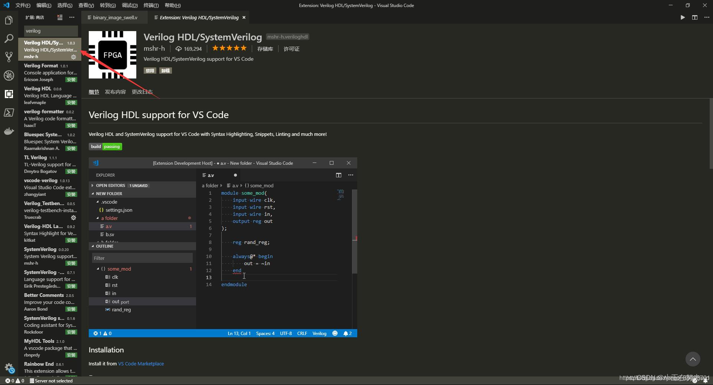

# 一.VSCode安装

……这用教？

# 二.VSCode配置

## 1.更换Vivado自带文本编辑器

**第一步 ：打开Vivado 再Tool菜单中 打开Settings**


**第二步： 在Settings里更换默认的文本编辑器**


这里需要键入的表达式是： C:/Program Files/Microsoft VS Code/Code.exe -g [file name]:[line number] 前面是VsCode应用程序的绝对路径。

这样双击工程下面的.v文件，Vivado会自动使用VSCode打开文件。

****

【注】若用vivado打开vscode会卡死，则在进行编辑前，首先打开VScode，打开后再进行编辑不会卡顿，或者删除:[line number] 。

****

## 2.安装Verilog插件

### 2.1 Verilog HDL/SystemVerilog

在VsCode扩展商店搜索verilog，选择Verilog HDL/SystemVerilog，他能帮你实现的功能：语法高亮，自动补齐，列出端口。



### 2.2 vivado使用xvlog进行纠错

vivado安装目录下的xvlog所在的目录放置在系统的环境变量，以便VsCode能够方便的调用他。具体的目录就是Vivado的bin文件夹。
搜索环境变量->点击编辑环境变量->用户变量->Path 就会出现下图，不要在用户变量里添加，要在path里添加。


添加完成之后，在命令行输入xvlog -version检测是否生效


接下来我们在设置里，找到刚才安装的verilog扩展，将verilog的Linter更换成xvlog。


需要注意的是，编译器需要您手动保存，才会开启xvlog解析，也就是说观看最新错误之前，需要保存一下。

### 2.3 Rainbow End

安装扩展实现不同组begin…end变换颜色


### 2.4 Verilog highlight

大写字符高亮显示


### 2.5 （可选） Indent-Rainbow

vscode中每个Tab距离显示不同的颜色


### 2.6 （可选） SystemVerilog and Verilog Formatter

解决格式化问题

安装扩展后，按下Ctrl+Shift+P，点击 首选项：打开设置（JSON），在settings.json中添加如下代码：

```json
{
  "systemverilogFormatter.commandLineArguments": "--column_limit 80 --indentation_spaces 4"
}
```

## 解决可能出现的中文乱码问题

1. 选择左下角的“设置”→“设置”


2. 在“文本编辑器”下拉菜单找到“文件”，勾选“Auto Guess Encoding”（或者直接在搜索栏输入：Auto Guess Encoding，也能快速找到）→之后重启VSCode设置即可生效

