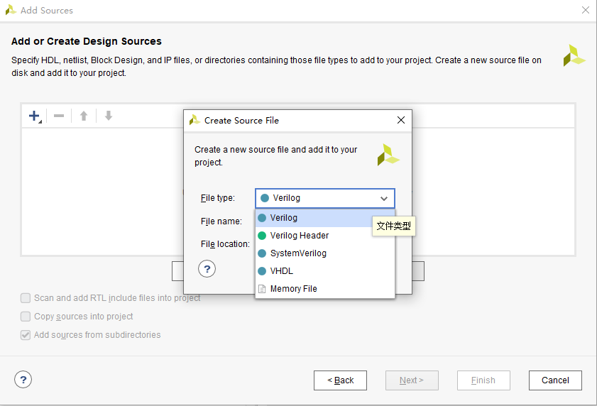

# 事前准备

参照[vscode配置](vscode配置.md)进行配置

# 1. copy源代码

1. 源文件要自己新建，define要作为头文件创建

# 2. 分析波形图

加入如下波形：

clk，rst：不必多说

pc：

    branch_flag_i,  // 是否发生转移
    branch_target_address_i,  //转移地址

if_id：

    if_pc，if_inst：输入的指令地址，指令；
    id_pc，id_inst：输出的指令地址，指令
    （正好错开一个周期）

id_ex:
    
    id_aluop：输入译码得到的操作码；
    id_reg1，id_reg2：输入译码得到的源寄存器的值；
    id_wd：输入译码得到的写入寄存器的编号；
    id_wreg：输入写入寄存器的使能信号；

    ex_aluop
    ex_reg1，ex_reg2
    ex_wd

    // 分支跳转相关
    id_link_address：输入，译码得到的跳转地址；
    id_is_in_delayslot：输入，当前是否在延迟槽中；
    next_inst_in_delayslot_i：输入，下一条指令是否在延迟槽中；
    
    ex_link_address
    ex_is_in_delayslot
    is_in_delayslot_o

ex_mem:

	ex_wd: 输入，写入寄存器的编号；111
	ex_wreg: 输入，写入寄存器的使能信号；
	ex_wdata: 输入，写入寄存器的数据；

	mem_wd,
	mem_wreg,
	mem_wdata,
	
	// load/store相关输入口
	ex_aluop: 输入，操作码, 判断load/store指令；
	ex_mem_addr: 输入，load/store指令访问的地址；
	ex_reg2: 输入，store指令要写入的数据；
	
	mem_aluop,
	mem_mem_addr,
	mem_reg2,

data_ram:

    ce:读使能
    we:写使能
    addr[31:0]：地址
    data_i[31:0]：写入数据
    data_o[31:0]：读出数据

mem_wb:
	
	mem_wd: 输入，写入寄存器的编号；
	mem_wreg: 输入，写入寄存器的使能信号；
	mem_wdata: 输入，写入寄存器的数据；

	wb_wd,
	wb_wreg,
	wb_wdata,	

regfile:

    regs[31:0]：寄存器

# 3. 篡改设计图

链接，更改布局，来点颜色

# 4. 看懂源代码

## 1. 七条新增指令的分析

1. addiu 正常加法，立即数在reg2中输入
2. lw与sw：操作一路传到mem，怎么读写
3. 四条分支指令：在id阶段，根据译码的结果，判断是否跳转，跳转到哪里，并把下一条指令作为延迟槽指令（实际没实现），pc更新位置，alu保存返回地址

## 全面改造的时序逻辑电路

# 4. 清理无关代码

