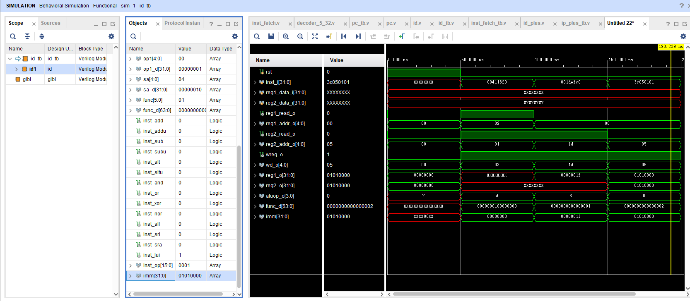

# 译码器本体

```verilog
`timescale 1ns / 1ps

module id(
    input wire rst,
    input wire[31:0] inst_i,
    input wire[31:0] reg1_data_i,
    input wire[31:0] reg2_data_i,
    
    output wire reg1_read_o,
    output wire[4:0] reg1_addr_o,
    output wire reg2_read_o,
    output wire[4:0] reg2_addr_o,
    output wire wreg_o,

    output wire[4:0] wd_o,
    output wire[31:0] reg1_o,
    output wire[31:0] reg2_o,
    output wire[3:0] aluop_o
    );
    
    wire[5:0] op;
    wire[63:0] op_d;
    wire[4:0] op1;
    wire[31:0] op1_d;
    wire[4:0] sa;
    wire[31:0] sa_d;
    wire[5:0] func;
    wire[63:0] func_d;
    
    assign op=inst_i[31:26];
    assign op1=inst_i[25:21];
    assign sa=inst_i[10:6];
    assign func=inst_i[5:0];
    
    decoder_6_64 dec0(op,op_d);
    decoder_5_32 dec1(op1,op1_d);
    decoder_5_32 dec2(sa,sa_d);
    decoder_6_64 dec3(func,func_d);

    wire inst_add;
    wire inst_addu;
    wire inst_sub;
    wire inst_subu;
    wire inst_slt;
    wire inst_sltu;
    wire inst_and;
    wire inst_or;
    wire inst_xor;
    wire inst_nor;
    wire inst_sll;
    wire inst_srl;
    wire inst_sra;
    wire inst_lui;

    assign inst_add=op_d[0]&&sa_d[0]&&func_d[6'b100000];
    assign inst_addu=op_d[0]&&sa_d[0]&&func_d[6'b100001];
    assign inst_sub=op_d[0]&&sa_d[0]&&func_d[6'b100010];
    assign inst_subu=op_d[0]&&sa_d[0]&&func_d[6'b100011];
    assign inst_slt=op_d[0]&&sa_d[0]&&func_d[6'b101010];
    assign inst_sltu=op_d[0]&&sa_d[0]&&func_d[6'b101011];
    assign inst_and=op_d[0]&&sa_d[0]&&func_d[6'b100100];
    assign inst_or=op_d[0]&&sa_d[0]&&func_d[6'b100101];
    assign inst_xor=op_d[0]&&sa_d[0]&&func_d[6'b100110];
    assign inst_nor=op_d[0]&&sa_d[0]&&func_d[6'b100111];
    
    assign inst_sll=op_d[0]&&op1_d[0]&&func_d[0];
    assign inst_srl=op_d[0]&&op1_d[0]&&func_d[6'b000010];
    assign inst_sra=op_d[0]&&op1_d[0]&&func_d[6'b000011];
    assign inst_lui=op_d[6'b001111]&&op1_d[0];
    
    wire [15:0] inst_op;
    assign inst_op={0,0,
                        inst_add,
                        inst_addu,
                        inst_sub,
                        inst_subu,
                        inst_slt,
                        inst_sltu,
                        inst_and,
                        inst_or,
                        inst_xor,
                        inst_nor,
                        inst_sll,
                        inst_srl,
                        inst_sra,
                        inst_lui
    };
    encoder_16_4 enc0(inst_op,aluop_o);
    assign reg1_read_o=(rst==1)?0:!(inst_sll||inst_srl||inst_sra||inst_lui);
    assign reg2_read_o=(rst==1)?0:!(inst_lui);
    assign wreg_o=(rst==1)?0:1;
    assign reg1_addr_o=(rst==1)?0:inst_i[25:21];
    assign reg2_addr_o=(rst==1)?0:inst_i[20:16];
    assign wd_o=(rst==1)?0:(inst_lui?inst_i[20:16]:inst_i[15:11]);
    
    wire[31:0] imm;
    assign imm=inst_lui?{inst_i[15:0],16'b0}:{27'b0,inst_i[10:6]};
    
    assign reg1_o=(rst==1)?0:(reg1_read_o?reg1_data_i:imm);
    assign reg2_o=(rst==1)?0:(reg2_read_o?reg2_data_i:imm);
endmodule
```
# 6-64译码器

```verilog

`timescale 1ns / 1ps
module decoder_6_64(
        input[5:0] in,
        output[63:0]out
    );
    assign out[0]=(in==6'd0);
    assign out[1]=(in==6'd1);
    assign out[2]=(in==6'd2);
    assign out[3]=(in==6'd3);
    assign out[4]=(in==6'd4);
    assign out[5]=(in==6'd5);
    assign out[6]=(in==6'd6);
    assign out[7]=(in==6'd7);
    assign out[8]=(in==6'd8);
    assign out[9]=(in==6'd9);
    assign out[10]=(in==6'd10);
    assign out[11]=(in==6'd11);
    assign out[12]=(in==6'd12);
    assign out[13]=(in==6'd13);
    assign out[14]=(in==6'd14);
    assign out[15]=(in==6'd15);
    assign out[16]=(in==6'd16);
    assign out[17]=(in==6'd17);
    assign out[18]=(in==6'd18);
    assign out[19]=(in==6'd19);
    assign out[20]=(in==6'd20);
    assign out[21]=(in==6'd21);
    assign out[22]=(in==6'd22);
    assign out[23]=(in==6'd23);
    assign out[24]=(in==6'd24);
    assign out[25]=(in==6'd25);
    assign out[26]=(in==6'd26);
    assign out[27]=(in==6'd27);
    assign out[28]=(in==6'd28);
    assign out[29]=(in==6'd29);
    assign out[30]=(in==6'd30);
    assign out[31]=(in==6'd31);
    assign out[32]=(in==6'd32);
    assign out[33]=(in==6'd33);
    assign out[34]=(in==6'd34);
    assign out[35]=(in==6'd35);
    assign out[36]=(in==6'd36);
    assign out[37]=(in==6'd37);
    assign out[38]=(in==6'd38);
    assign out[39]=(in==6'd39);
    assign out[40]=(in==6'd40);
    assign out[41]=(in==6'd41);
    assign out[42]=(in==6'd42);
    assign out[43]=(in==6'd43);
    assign out[44]=(in==6'd44);
    assign out[45]=(in==6'd45);
    assign out[46]=(in==6'd46);
    assign out[47]=(in==6'd47);
    assign out[48]=(in==6'd48);
    assign out[49]=(in==6'd49);
    assign out[50]=(in==6'd50);
    assign out[51]=(in==6'd51);
    assign out[52]=(in==6'd52);
    assign out[53]=(in==6'd53);
    assign out[54]=(in==6'd54);
    assign out[55]=(in==6'd55);
    assign out[56]=(in==6'd56);
    assign out[57]=(in==6'd57);
    assign out[58]=(in==6'd58);
    assign out[59]=(in==6'd59);
    assign out[60]=(in==6'd60);
    assign out[61]=(in==6'd61);
    assign out[62]=(in==6'd62);
    assign out[63]=(in==6'd63);
endmodule
```

# 5-32译码器

```verilog
`timescale 1ns / 1ps

module decoder_5_32(
    input[4:0] in,
    output[31:0] out
    );
    genvar i;
    
    generate 
        for(i=0;i<32;i=i+1)
        begin:test
            assign out[i]=(in==i);
        end
    endgenerate
    
    
endmodule
```

# 16-4编码器

```verilog
`timescale 1ns / 1ps
module encoder_16_4(
    input wire[15:0] in,
    output wire[3:0] out
    );
    assign out=in[0]?0:
                in[1]?1:
                in[2]?2:
                in[3]?3:
                in[4]?4:
                in[5]?5:
                in[6]?6:
                in[7]?7:
                in[8]?8:
                in[9]?9:
                in[10]?10:
                in[11]?11:
                in[12]?12:
                in[13]?13:
                in[14]?14:
                in[15]?15:
                15;
endmodule
```

# 简单粗暴选用add、sll与lui指令的便宜仿真

```verilog
`timescale 1ns / 1ps

module id_tb();
    reg rst;
    reg[31:0] inst_i;
    reg[31:0] reg1_data_i;
    reg[31:0] reg2_data_i;
    
    wire reg1_read_o;
    wire[4:0] reg1_addr_o;
    wire reg2_read_o;
    wire[4:0] reg2_addr_o;
    wire wreg_o;

    wire[4:0] wd_o;
    wire[31:0] reg1_o;
    wire[31:0] reg2_o;
    wire[3:0] aluop_o;
    
    id id1(rst,inst_i,reg1_data_i,reg2_data_i,reg1_read_o,reg1_addr_o,reg2_read_o,reg2_addr_o,wreg_o,wd_o,reg1_o,reg2_o,aluop_o);

    initial begin
        rst = 1;
        #50 rst = 0;
        #150 $finish;
    end
    
    initial begin
        #50;
        inst_i=32'h00411820;
        #50
        inst_i=32'h001defc0;
        #50
        inst_i=32'h3C050101;
        #50
        $finish;
    end

endmodule
```

# 仿真结果参考


# 课上所写代码
```verilog
`timescale 1ns / 1ps

module id_tb();
    reg rst;
    reg[31:0] inst_i;
    reg[31:0] reg1_data_i;
    reg[31:0] reg2_data_i;
    
    wire reg1_read_o;
    wire[4:0] reg1_addr_o;
    wire reg2_read_o;
    wire[4:0] reg2_addr_o;
    wire wreg_o;

    wire[4:0] wd_o;
    wire[31:0] reg1_o;
    wire[31:0] reg2_o;
    wire[3:0] aluop_o;
    
    id id1(rst,inst_i,reg1_data_i,reg2_data_i,reg1_read_o,reg1_addr_o,reg2_read_o,reg2_addr_o,wreg_o,wd_o,reg1_o,reg2_o,aluop_o);

    reg[31:0] roms[13:0];
    initial begin
        $readmemh("你自己放置rom.data的文件目录",roms);
    end
    integer i;
    initial begin
        rst = 0;
        #50 rst = 1;
        #50 rst = 0;
        reg1_data_i=32'h10101010;
        reg2_data_i=32'h01010101;
        for(i=0;i<14;i=i+1) begin
            inst_i = roms[i];
            #20;
        end
    end

endmodule

```

# 课上的没有参考
