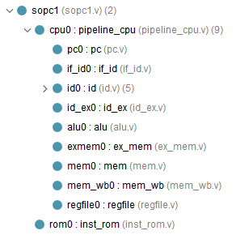

# 代码部分

总览项目结构：



## pipeline_cpu
```verilog
`timescale 1ns / 1ps

module pipeline_cpu(
    input wire rst,
    input wire clk,
    input wire[31:0] rom_inst_i,
    output wire rom_ce_o,
    output wire[31:0] rom_addr_o
    );
    
    pc pc0(rst,clk,rom_addr_o,rom_ce_o);
    
    wire[31:0] inst_i;
    wire[31:0] reg1_data_i;
    wire[31:0] reg2_data_i;
    
    wire reg1_read_o;
    wire[4:0] reg1_addr_o;
    wire reg2_read_o;
    wire[4:0] reg2_addr_o;
    wire wreg_o;

    wire[4:0] wd_o;
    wire[31:0] reg1_o;
    wire[31:0] reg2_o;
    wire[3:0] aluop_o;
    
    if_id if_id0(clk,rom_inst_i,inst_i);
    
    id id0(rst,inst_i,reg1_data_i,reg2_data_i,reg1_read_o,
    reg1_addr_o,reg2_read_o,reg2_addr_o,wreg_o,
    wd_o,reg1_o,reg2_o,aluop_o);

    wire[3:0] alu_control;
    wire[31:0] alu_src1;
    wire[31:0] alu_src2;
    wire[4:0] wd_i;
    wire wreg_i;
     
    wire[31:0] alu_result;
    wire[4:0] wd_o0;
    wire wreg_o0;
    
    id_ex id_ex0(clk,aluop_o,reg1_o,reg2_o,wd_o,wreg_o,
    alu_control,alu_src1,alu_src2,wd_i,wreg_i);
    
    alu alu0(alu_control,alu_src1,alu_src2,wd_i,wreg_i,alu_result,wd_o0,wreg_o0);
    
    wire[31:0] wdata_i;
    wire[4:0] wd_i1;
    wire wreg_i1;
    wire[31:0] wdata_o;
    wire[4:0] wd_o1;
    wire wreg_o1;
    
    ex_mem exmem0(clk,alu_result,wd_o0,wreg_o0,wdata_i,wd_i1,wreg_i1);
    mem mem0(wdata_i,wd_i1,wreg_i1,wdata_o,wd_o1,wreg_o1);

    wire[31:0] wb_wdata;
    wire[4:0] wb_wd;
    wire wb_wreg;
    
    mem_wb mem_wb0(clk,wdata_o,wd_o1,wreg_o1,wb_wdata,wb_wd,wb_wreg);

    regfile regfile0(rst,clk,wb_wd,wb_wdata,wb_wreg,
    reg1_addr_o,reg1_read_o,reg1_data_i,
    reg2_addr_o,reg2_read_o,reg2_data_i);

endmodule

endmodule
```

## if_id 等参照第七次实验“五级流水CPU前置代码”，那个就是对的

## sopc
```verilog
`timescale 1ns / 1ps

module sopc1(
    input wire clk,
    input wire rst
    );
    wire rom_ce_o;
    wire[31:0] rom_addr_o;
    wire[31:0] inst_i;
    
    pipeline_cpu cpu0(rst,clk,inst_i,rom_ce_o,rom_addr_o);
    
    inst_rom rom0(rom_ce_o,rom_addr_o,inst_i);
endmodule
```

其他代码参照前几次实验。不做任何改动。

## 仿真代码 改个名字就行了

# 仿真前的准备

你先等等