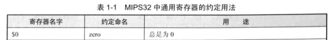

# 代码部分

总览项目结构：


## singleCycle_cpu
```verilog
`timescale 1ns / 1ps

module singleCycle_cpu(
    input wire rst,
    input wire clk,
    input wire[31:0] rom_inst_i,
    
    output wire rom_ce_o,
    output wire[31:0] rom_addr_o
    );
    
    pc pc0(rst,clk,rom_addr_o,rom_ce_o);
    
    wire[31:0] reg1_data;
    wire[31:0] reg2_data;
    wire[3:0] id_aluop_o;
    
    wire[31:0] id_reg1_o;
    wire[31:0] id_reg2_o;
    wire[4:0] id_wd_o;
    wire id_wreg_o;
        
    wire reg1_read;
    wire[4:0] reg1_addr;
    wire reg2_read;
    wire[4:0] reg2_addr;
    
    id id0(rst,rom_inst_i,reg1_data,reg2_data,
    reg1_read,reg1_addr,reg2_read,reg2_addr,
    id_wreg_o,id_wd_o,id_reg1_o,id_reg2_o,id_aluop_o);
    
    wire ex_wreg;
    wire[4:0] ex_wd;
    wire[31:0] ex_wdata_o;
    
    regfile regfile0(rst,clk,ex_wd,ex_wdata_o,ex_wreg,
    reg1_addr,reg1_read,reg1_data,reg2_addr,reg2_read,reg2_data);
    
    alu alu0(id_aluop_o,id_reg1_o,id_reg2_o,
    id_wd_o,id_wreg_o,ex_wdata_o,ex_wd,ex_wreg);

endmodule
```

## sopc
```verilog
`timescale 1ns / 1ps

module sopc(
    input wire clk,
    input wire rst
    );
    wire rom_ce_o;
    wire[31:0] rom_addr_o;
    wire[31:0] inst_i;
    
    singleCycle_cpu cpu0(rst,clk,inst_i,rom_ce_o,rom_addr_o);
    
    inst_rom rom0(rom_ce_o,rom_addr_o,inst_i);
endmodule
```

其他代码参照前几次实验。不做任何改动。

## 仿真代码
```verilog
`timescale 1ns / 1ps

module sopc_tb();

    reg clk;
    reg rst;
    sopc sopc0(clk,rst);
    initial begin
        clk=1;
        forever begin
            #10 clk=~clk;
        end
    end
    
    initial begin
        rst=0;
        #50;
        rst=1;
        #50;
        rst=0;
    end
endmodule
```

# 仿真前的准备

为便于仿真，应在测试之前向寄存器堆中写入数据，且保证inst_rom模块读入的指令为自己能确定其意义的指令。

参照下发文件中的“14条MIPS指令.pdf”，做如下修改：（请同学们参照样例自行改动数据）

由于在仿真开始前，整个寄存器堆中的数据均为0，因此先使用多条lui指令，向寄存器堆中写入数据：

根据lui指令格式，向1、2、3号寄存器中分别写入5，3，2，指令如下：

001111 00000 00001 0000000000000101 （ 3c010005 H）

001111 00000 00010 0000000000000011 （ 3c020003 H）

001111 00000 00011 0000000000000010 （ 3c030002 H）

（什么？你问我为什么不从0开始编号？还是看看指导书和代码吧同学）




由于lui指令将立即数保存到寄存器的高16位，因此在执行完上述三条指令后，寄存器1、2、3的值还需要通过移位指令右移16位，才能得到正确的值,因此需要再加入三条sri指令：

000000 00000 00001 00001 10000 000010 （ 00010c02 H）

000000 00000 00010 00010 10000 000010 （ 00021402 H）

000000 00000 00011 00011 10000 000010 （ 00031C02 H）

接下来修改其他指令

第一条add指令：将两操作数rs（25-21位）和rt（20-16位）改为 00001（5 D） 和 00010（3 D），将目的地址rd（15-11）改为 11000（24 D），修改后指令为：

000000 00001 00010 11000 00000 100000 （ 0022C020 H）

（什么？你问我为什么要把目的寄存器设为24号？还是再看看指导书吧同学）


第二条addu指令修改与第一条相同。为 000000 00001 00010 11000 00000 100001 （ 0022C021 H）

同理，第三条sub指令修改为 000000 00001 00010 11000 00000 100010 （ 0022C022 H）

第四条subu指令修改为 000000 00001 00010 11000 00000 100011 （ 0022C023 H）

第五条slt指令修改为 000000 00010 00001 11000 00000 101010 （ 0041C02A H）（这里让3<5，因此结果为1）

第六条sltu指令修改为 000000 00010 00001 11000 00000 101011 （ 0041C02B H）（同上）

第七条and指令修改为 000000 00001 00010 11000 00000 100100 （ 0022C024 H）（101&011=001）

第八条or指令修改为 000000 00001 00010 11000 00000 100101 （ 0022C025 H）（101|011=111）

第九条xor指令修改为 000000 00001 00010 11000 00000 100110 （ 0022C026 H）（101^011=110）

第十条nor指令修改为 000000 00001 00010 11000 00000 100111 （ 0022C027 H）（~(101|011)=000,前面全1，结果fffffff8）

第十一条sll指令修改为 000000 00000 00001 00001 00010 000000 （ 00010880 H）（将寄存器1的值左移2位）

第十二条srl指令修改为 000000 00000 00010 00010 00001 000010 （ 00021042 H）（将寄存器2的值右移1位）

第十三条sra指令修改为 000000 00000 11000 11000 00100 000011 （ 0018c103 H）（将寄存器24的值算术右移4位,因此时符号位为1，结果为ffffffff）

最终文件里的指令如下：

    3c010005
    3c020003
    3c030002
    00010c02
    00021402
    00031C02
    0022C020
    0022C021
    0022C022
    0022C023
    0041C02A
    0041C02B
    0022C024
    0022C025
    0022C026
    0022C027
    00010880
    00021042
    0018c103

仿真结果如图所示：


（以防大家不知道如何添加波形，这里附上添加波形的方法：点击模块，在你想展示的波形上右键：）


（如图所示，点击第一个（Add to Wave Window），即可添加到波形中）

图中添加的波形有：rom0模块的addr（取指令的地址），inst（取到的指令）


id0模块的所有输出信号：从aluop_o到reg1_read_o


alu0模块的所有输出信号：alu_result，wd_o，wreg_o


从波形图中可以看出（请参照自己复现得到的仿真结果），从100ns开始，取指令的地址开始递增，指令开始执行。220ns时，寄存器1、2、3的值分别为5、3、2，之后寄存器24的值依次为5+3（持续两个指令）、5-3（持续两个指令）、1（3<5,结果为1）、1（3<5,结果为1）、1（101&011=001）、7（101|011=111）、6（101^011=110）、fffffff8（~(101|011)=000,前面全1，结果fffffff8）

此时来到440ns,寄存器1的值变为00000014（5左移2位），460ns时寄存器2的值变为00000001（3右移1位），480ns时寄存器24的值变为ffffffff（算术右移4位,因此时符号位为1，结果为ffffffff）

恭喜！你已经完美复现了单周期CPU的仿真结果！快去写报告吧！记得把数字改成你自己的哦！