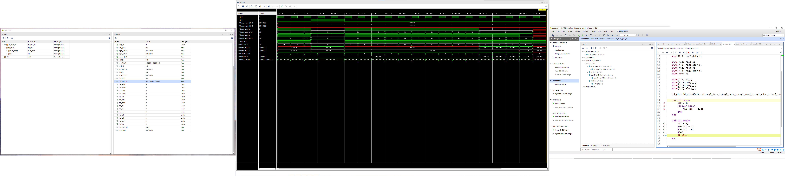

# 简单版中的代码原封不动，新增一个idplus模块结合pc与id
# 所以，本次实验不再提供完成模板！

# 译码器-plus
```verilog
`timescale 1ns / 1ps

module id_plus(
    input wire clk,
    input wire rst,
    //input wire[31:0] inst_i,
    input wire[31:0] reg1_data_i,
    input wire[31:0] reg2_data_i,
    
    output wire reg1_read_o,
    output wire[4:0] reg1_addr_o,
    output wire reg2_read_o,
    output wire[4:0] reg2_addr_o,
    output wire wreg_o,

    output wire[4:0] wd_o,
    output wire[31:0] reg1_o,
    output wire[31:0] reg2_o,
    output wire[3:0] aluop_o
    );
    
    wire [31:0]inst_o;
    
    inst_fetch inst_fetch0(clk,rst,inst_o);
    id id1(rst,inst_o,reg1_data_i,reg2_data_i,reg1_read_o,reg1_addr_o,reg2_read_o,reg2_addr_o,wreg_o,wd_o,reg1_o,reg2_o,aluop_o);
    
endmodule
```

# 完美仿真
```verilog
`timescale 1ns / 1ps

module ip_plus_tb();

    reg clk;
    reg rst;
    
    reg[31:0] reg1_data_i;
    reg[31:0] reg2_data_i;
    
    wire reg1_read_o;
    wire[4:0] reg1_addr_o;
    wire reg2_read_o;
    wire[4:0] reg2_addr_o;
    wire wreg_o;

    wire[4:0] wd_o;
    wire[31:0] reg1_o;
    wire[31:0] reg2_o;
    wire[3:0] aluop_o;
    
    id_plus id_plus0(clk,rst,reg1_data_i,reg2_data_i,reg1_read_o,reg1_addr_o,reg2_read_o,reg2_addr_o,wreg_o,wd_o,reg1_o,reg2_o,aluop_o);
    
    initial begin
        clk = 1;
        forever begin
            #10 clk = ~clk;
        end
    end
    
    initial begin
        rst = 0;
        #50 rst = 1;
        #50 rst = 0;
        #300
        $finish;
    end
endmodule
```

# 仿真结果参考
