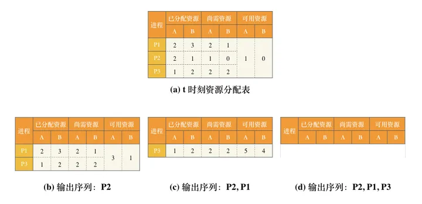
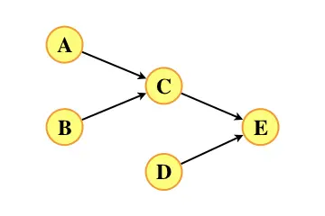

# 一、单项选择题

第01~40小题，每小题2分，共80分。下列每题给出的四个选项中，只有一个选项是最符合题目要求的。

## 23.
若多个进程共享同一个文件F，则下列叙述中，正确的是（ ）。

A. 各进程只能用“读”方式打开文件F

B. 在系统打开文件表中仅有一个表项包含F的属性

C. 各进程的用户打开文件表中关于F的表项内容相同

D. 进程关闭F时，系统删除F在系统打开文件表中的表项

解答：

A错误。各进程可以以读或写的方式打开文件F，取决于进程的操作需求和权限。

B正确。系统打开文件表 (System Open File Table) 是操作系统内核中维护的数据结构，用于跟踪和管理所有打开的文件。系统打开文件表记录了每个打开的文件的相关信息，包括文件描述符 (File Descriptor)、文件状态标志 (File Status Flags)、文件指针位置 (File Position Pointer) 等。系统打开文件表使得操作系统能够在多个进程之间共享已经打开的文件。整个系统只有一张系统打开文件表，其中有一个表项包含文件F的属性。

C错误。用户打开文件表 (User Open File Table) 是每个进程在用户空间维护的数据结构，用于跟踪和管理该进程打开的文件。每个进程在其用户地址空间中都有一个用户打开文件表，用于记录该进程打开的文件的相关信息，包括文件描述符 (File Descriptor)、文件状态标志 (File Status Flags)、文件指针位置 (File Position Pointer) 等。其中的表项与系统打开文件表的表项相对应，不同用户进程打开文件表关于同一个文件的表项不一定相同，例如读写指针位置不一定相同。这种设计使得多个进程能够独立地管理和访问同一个文件，而不会相互干扰。

D错误。当进程关闭文件 F 时，并不会立即删除系统打开文件表中关于该文件的表项。系统打开文件表中的表项只有在所有的进程都关闭了文件 F 之后才会被删除。这样可以确保其他进程在需要访问文件时仍能够找到相应的信息。

本题选B。


## 24.
下列选项中，支持文件长度可变、随机访问的磁盘存储空间分配方式是（ ）。

A. 索引分配

B. 链接分配

C. 连续分配

D. 动态分区分配

解答：

A正确。索引分配是一种磁盘存储空间分配的方式，它使用一个索引表来映射文件中每个数据块的物理位置。索引表通常存储在磁盘上，每个文件都有一个对应的索引表。在索引分配中，文件的长度可以是可变的，因为可以根据需要增加或删除索引表中的条目。这样，可以动态地增加或缩小文件的大小。由于索引表中存储了每个数据块的物理位置信息，因此通过索引表，可以快速定位到指定的数据块，实现对文件的随机访问。

B错误。链接分配将文件的数据块通过链表的方式连接起来，支持文件长度可变、不支持随机访问。

C错误。连续分配将文件占用的存储空间连续地分配给文件，不适合长度可变的文件，支持随机访问。

D错误。动态分区分配用于管理主存中的区域划分和分配，并不涉及磁盘文件的存储空间分配。

本题选A。


## 25.
下列与中断相关的操作中，由操作系统完成的是（ ）。

Ⅰ. 保存被中断程序的中断点

Ⅱ. 提供中断服务

Ⅲ. 初始化中断向量表

Ⅳ. 保存中断屏蔽字

A. 仅Ⅰ、Ⅱ

B. 仅Ⅰ、Ⅱ、Ⅳ

C. 仅Ⅲ、Ⅳ

D. 仅Ⅱ、Ⅲ、Ⅳ

解答：

I错误。被中断程序的中断点由中断隐指令完成，中断隐指令并不是指令系统中的一条真正的指令，它没有操作码，所以中断隐指令是一种不允许、也不可能为用户使用的特殊指令。

Ⅱ正确。提供中断服务由中断服务程序完成。中断服务程序是由操作系统提供和管理的，它们处理各种中断事件，并根据需要执行相应的操作。

Ⅲ正确。中断向量表是一个数据结构，用于存储不同中断类型的中断向量地址（即中断服务程序的入口地址）。初始化中断向量表通常是在系统启动时由操作系统完成，为每个中断类型分配相应的中断服务程序的入口地址。初始化中断向量表由操作系统提供的中断初始化子程序完成。

Ⅳ正确。中断屏蔽字是一种设置，用于控制哪些中断能够被允许进入处理器执行，哪些中断被禁止。保存中断屏蔽字由中断服务程序完成。中断服务程序是由操作系统提供和管理的。

综上，仅Ⅱ、Ⅲ、Ⅳ正确。

本题选D。

**计组交叉题目**

**重复性题目**

## 26.
下列与进程调度有关的因素中，在设计多级反馈队列调度算法时需要考虑的是（ ）。

Ⅰ. 就绪队列的数量

Ⅱ. 就绪队列的优先级

Ⅲ. 各就绪队列的调度算法

Ⅳ. 进程在就绪队列间的迁移条件

A. 仅Ⅰ、Ⅱ

B. 仅Ⅲ、Ⅳ

C. 仅Ⅱ、Ⅲ、Ⅳ

D. Ⅰ、Ⅱ、Ⅲ和Ⅳ

解答：

I正确。就绪队列的数量需要合理设置，数量过多会浪费系统资源，数量过少会导致进程无法充分执行。

Ⅱ正确。不同就绪队列具有不同的优先级。较高优先级的队列中的进程将被优先选择执行，而较低优先级的队列则是后备队列。

Ⅲ正确。对于每个就绪队列，可以使用不同的调度算法来选择下一个要执行的进程。通常，较高优先级的队列使用抢占式调度算法，而较低优先级的队列使用非抢占式调度算法。这些调度算法的选择与各就绪队列的特性和调度目标密切相关。

Ⅳ正确。多级反馈队列调度算法允许进程在不同的就绪队列之间迁移。迁移条件可以是时间片用尽、优先级的变化、等待时间等。这些条件决定了一个进程何时从一个队列迁移到另一个队列，以便重新调度和执行。

综上，Ⅰ、Ⅱ、Ⅲ和Ⅳ正确。

本题选D。


## 27.
某系统中有A、B两类资源各6个，t时刻资源分配及需求情况如下表所示。


| 进程 | A已分配数量 | B已分配数量 | A需求总量 | B需求总量 |
| :--: | :--: | :--: | :--: | :--: |
| P1 | 2 | 3 | 4 | 4 |
| P2 | 2 | 1 | 3 | 1 |
| P3 | 1 | 2 | 3 | 4 |

t时刻安全性检测结果是（ ）。

A. 存在安全序列P1、P2、P3

B. 存在安全序列P2、P1、P3

C. 存在安全序列P2、P3、P1

D. 不存在安全序列

解答：

在将表格转化为已分配资源、尚需资源、可用资源三栏的形式。进程Pi尚需资源=进程Pi资源最大需求-进程Pi已分配资源，可用资源=资源总数-所有进程已分配资源之和，如图(a)所示。

使用银行家算法，保证可用资源大于或等于某进行尚需资源，该进程可以输出到序列，并回收该进程已分配资源。若所有进程均可被输出到序列，则存在安全序列，该输出序列为安全序列，否则不存在安全序列。

模拟过程如图(b)、(c)、(d)所示。存在安全序列P2、P1、P3。


本题选B。

**重复性题目**

## 28.
下列因素中，影响请求分页系统有效（平均）访存时间的是（ ）。

Ⅰ. 缺页率

Ⅱ. 磁盘读写时间

Ⅲ. 内存访问时间

Ⅳ. 执行缺页处理程序的CPU时间

A. 仅Ⅱ、Ⅲ

B. 仅Ⅰ、Ⅳ

C. 仅Ⅰ、Ⅲ、Ⅳ

D. Ⅰ、Ⅱ、Ⅲ和Ⅳ

解答：

I正确。较低的缺页率意味着较少的页面置换操作，从而减少了系统的I/O开销和额外的访存开销，从而减少平均访存时间。

Ⅱ正确。在请求分页系统中，当发生缺页时，需要从磁盘读取相应的页面到内存中。磁盘读写时间是影响有效访存时间的重要因素之一。较低的磁盘读写时间可以加快页面的加载和替换操作，从而减少平均访存时间。

Ⅲ正确。内存访问时间指的是从CPU发出一个访存请求到得到相应数据的时间。较低的内存访问时间能够提高请求分页系统的响应速度，从而减少平均访存时间。

Ⅳ正确。执行缺页处理程序所需的CPU时间会影响有效访存时间。较低的CPU时间可能导致请求分页系统的响应速度变慢，从而增加平均访存时间。

综上，Ⅰ、Ⅱ、Ⅲ和Ⅳ正确。

本题选D。


## 29.
下列关于父进程与子进程的叙述中，错误的是（ ）。

A. 父进程与子进程可以并发执行

B. 父进程与子进程共享虚拟地址空间

C. 父进程与子进程有不同的进程控制块

D. 父进程与子进程不能同时使用同一临界资源

解答：

A正确。当一个父进程创建子进程时，父进程和子进程可以并发地执行各自的任务，彼此之间相对独立。

B错误。在常见的进程模型中，父进程与子进程通常拥有各自独立的虚拟地址空间。这意味着它们在内存中有不同的地址空间，彼此之间的数据不共享。当父进程创建子进程时，子进程会复制父进程的地址空间，但之后它们是独立的，对地址空间的修改不会相互影响。

C正确。进程控制块是操作系统用于管理和跟踪进程的数据结构。它包含了进程的各种属性和状态信息，例如进程ID、父进程ID、进程状态、程序计数器、寄存器状态、内存分配信息、打开文件列表等。当父进程创建子进程时，操作系统会为子进程分配一个新的进程控制块，以维护子进程的独立状态信息和程序执行上下文。虽然子进程可以继承父进程的一些属性（如文件描述符表），但它们有不同的进程ID和父进程ID，并且拥有各自的程序计数器、寄存器状态和其他进程控制块信息。通过不同的进程控制块，操作系统可以独立地管理和调度父进程和子进程的执行，实现进程的并发执行和协作。

D正确。临界资源 (Critical Resource) 是指在多个进程或线程之间共享使用的一种资源。由于临界资源的共享特性，需要采取特殊的保护机制来确保在任意时刻只有一个进程或线程可以访问该资源，以防止并发访问导致的数据不一致性和竞态条件。在父进程和子进程之间，如果需要同时使用同一临界资源，可以通过各种同步机制实现对该资源的互斥访问。

本题选B。


## 30.
对于具备设备独立性的系统，下列叙述中，错误的是（ ）。

A. 可以使用文件名访问物理设备

B. 用户程序使用逻辑设备名访问物理设备

C. 需要建立逻辑设备与物理设备之间的映射关系

D. 更换物理设备后必须修改访问该设备的应用程序

解答：

A正确。在设备独立性的系统中，每个物理设备都会被视为一个文件，拥有一个对应的设备文件路径和文件名。通过使用文件名，应用程序可以通过标准的文件操作接口（如打开、读取、写入等）来访问和操作物理设备，而无需直接与设备的底层硬件驱动程序进行交互。

B正确。当用户程序使用逻辑设备名来访问物理设备时，系统提供了一种映射机制，将逻辑设备名映射到相应的物理设备。

C正确。具备设备独立性的系统需要建立逻辑设备与物理设备之间的映射关系。这种映射关系允许系统将用户程序对逻辑设备的操作转换为对实际物理设备的操作。

D错误。对于具备设备独立性的系统，系统根据抽象的逻辑设备名来访问物理设备，而不依赖于具体的物理设备。这样，当更换物理设备时，只需要进行逻辑设备与新物理设备之间的映射关系的修改，而不需要修改应用程序。

本题选D。


## 31.
某文件系统的目录项由文件名和索引结点号构成。若每个目录项长度为64字节，其中4字节存放索引结点号，60字节存放文件名。文件名由小写英文字母构成，则该文件系统能创建的文件数量的上限为（ ）。

A. $2^{26}$

B. $2^{32}$

C. $2^{60}$

D. $2^{64}$

解答：

因为索引结点号占4B=32bit，最多可以表示 $2^{32}$ 个索引结点号，所以该文件系统能创建的文件数量的上限为 $2^{32}$ 。

本题选B。

## 32.
下列准则中，实现临界区互斥机制必须遵循的是（ ）。

Ⅰ. 两个进程不能同时进入临界区

Ⅱ. 允许进程访问空闲的临界资源

Ⅲ. 进程等待进入临界区的时间是有限的

Ⅳ. 不能进入临界区的执行态进程立即放弃CPU

A. 仅Ⅰ、Ⅳ

B. 仅Ⅱ、Ⅲ

C. 仅Ⅰ、Ⅱ、Ⅲ

D. 仅Ⅰ、Ⅲ、Ⅳ

解答：

I正确。进入临界区意味着要访问临界资源，临界资源 (Critical Resource) 是指在多个进程或线程之间共享使用的一种资源。由于临界资源的共享特性，需要采取特殊的保护机制来确保在任意时刻只有一个进程或线程可以访问该资源，以防止并发访问导致的数据不一致性和竞态条件。

Ⅱ正确。Ⅱ描述的是空闲让进原则：临界区空闲时，允许一个请求进入临界区的进程立即进入临界区。

Ⅲ正确。Ⅲ描述的有限等待原则：对请求访问的进程，应保证能在有限时间内进入临界区（保证不会饥饿）。

Ⅳ错误。Ⅳ描述的让权等待原则：进程不能进入临界区，应当立即释放处理机，防止进程忙等待。让权等待并非必须实现，例如Peterson算法。

综上，仅Ⅰ、Ⅱ、Ⅲ正确。

本题选C。


# 二、综合应用题
第41~47小题，共70分。

## 45.
（7分）

现有5个操作A、B、C、D和E，操作C必须在A和B完成后执行，操作E必须在C和D完成后执行，请使用信号量的wait()、signal()操作（P、V操作）描述上述操作之间的同步关系，并说明所用信号量及其初值。

解答：

列出前置关系：

| 任务 | 前置任务 |
| :--: | :--: | 
| A | 无 |
| B | 无 |
| C | A、B |
| D | 无 |
| E | C、D |

可以画出AOV网：



进行拓扑排序：

A, B, D, C, E


每个同步关系一个信号量，即每个AOV网中每条有向边（表示一个同步关系）构造一个信号量，默认初始为0。

```c
semaphore S_AC = 0;    //控制操作A和C的执行顺序
semaphore S_BC = 0;    //控制操作B和C的执行顺序
semaphore S_CE = 0;    //控制操作C和E的执行顺序
semaphore S_DE = 0;    //控制操作D和E的执行顺序

cobegin
Process A() {
    完成操作A;
    signal(S_AC);    // V(S_AC);
}
Process B() {
    完成操作B;
    signal(S_BC);    // V(S_BC);
}
Process C() {
    wait(S_AC);    // P(S_AC);
    wait(S_BC);    // P(S_BC);
    完成操作C;
    signal(S_CE);    // V(S_CE);
}
Process D() {
    完成操作D;
    signal(S_DE);    // V(S_DE);
}
Process E() {
    wait(S_CE);    // P(S_CE);
    wait(S_DE);    // P(S_DE);
    完成操作E;
}
coend
```


## 46.
（8分）

某32位系统采用基于二级页表的请求分页存储管理方式，按字节编址，页目录项和页表项长度均为4字节，虚拟地址结构如下所示。

| 页目录号(10位) | 页号(10位) | 页内偏移(12位) |
| :--: | :--: | :--: |

某C程序中数组a[1024][1024]的起始虚拟地址为1080 0000H，数组元素占4字节，该程序运行时，其进程的页目录起始物理地址为0020 1000H，请回答下列问题。

(1) 数组元素a[1][2]的虚拟地址是什么？对应的页目录号和页号分别是什么？对应的页目录项的物理地址是什么？若该目录项中存放的页框号为00301H，则a[1][2]所在页对应的页表项的物理地址是什么？

(2) 数组a在虚拟地址空间中所占区域是否必须连续？在物理地址空间中所占区域是否必须连续？

(3) 已知数组a按行优先方式存放，若对数组a分别按行遍历和按列遍历，则哪一种遍历方式的局部性更好？

解答：

(1) 第一问。数组元素a[i][j]的虚拟地址 = 数组a的起始虚拟地址+(i×数组a的行数+j)×数组元素占地址单元数。数组a[1024][1024]的起始虚拟地址为1080 0000H，行数为1024，每个数组元素占4字节，按字节编址，每个数组元素占4个地址单元。数组元素a[1][2]的虚拟地址 = 1080 0000H + (1024×1+2)×4=1080 1008H 。

第二问。数组元素a[1][2]的虚拟地址1080 1008H = 0001 0000 1000 0000 0001 0000 0000 1000B，虚拟地址结构如下所示。

| 页目录号(10位) | 页号(10位) | 页内偏移(12位) |
| :--: | :--: | :--: |
| 0001000010（042H） | 0000000001（001H） | 000000000100（004H） |

第三问。因为该程序运行时，其进程的页目录起始物理地址为0020 1000H，页目录项长度为4字节，按字节编址，每个页目录项占4个地址单元，数组元素a[1][2]所在页目录号为042H，所以对应的页目录项的物理地址是0020 1000H+4×042H=0020 1108H。

第四问。因为该目录项中存放的页框号为00301H，页表项长度为4字节，按字节编址，每个页表项占4个地址单元，数组元素a[1][2]对应页号是001H，页内偏移为4×001H=004H，根据虚拟地址结构，页内偏移占12位，拼接页框号00301H和页内偏移004H得到a[1][2]所在页对应的页表项的物理地址为00301004H。

(2) 第一问。因为数组要求支持随机访问，所以数组a在虚拟地址空间中所占区域必须连续。

第二问。因为系统采用请求分页存储管理方式，操作系统使用地址映射技术将虚拟地址映射到物理地址，这种映射关系可以是灵活的，不一定要求数组a在物理内存中占据连续的区域。所以数组 a 在物理地址空间中所占区域不必连续。

(3) 因为数组a在虚拟地址空间连续存放，系统采用请求分页存储管理方式，操作系统使用地址映射技术将虚拟地址映射到物理地址，数组a在同一页框中的元素连续存放，所以当访问方式和数组存放方式一致时，对数组遍历局部性更好。因为数组a按行优先方式存放，所以对数组a按行遍历局部性更好。