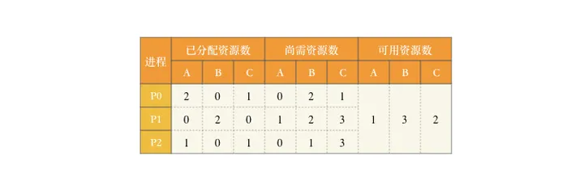
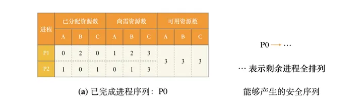
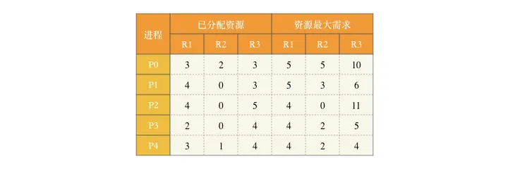
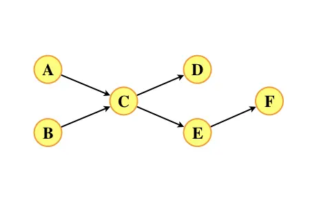

# 一、单项选择题

第01~40小题，每小题2分，共80分。下列每题给出的四个选项中，只有一个选项是最符合题目要求的。

## 23.
下列关于多道程序系统的叙述中，不正确的是（ ）。

A. 支持进程的并发执行

B. 不必支持虚拟存储管理

C. 需要实现对共享资源的管理

D. 进程数越多CPU利用率越高

解答：

A正确。多道程序系统可以同时运行多个进程，使它们在系统中并发执行。通过调度算法，系统可以在不同进程之间进行快速切换，实现并发执行。

B正确。在计算机的早期，多道程序系统中CPU一次读取多个程序放入内存，不必支持虚拟存储管理。

C正确。在多道程序系统中，多个进程可能同时访问和使用共享资源，如内存、文件系统、设备等。为了避免冲突和资源竞争，操作系统需要实现对共享资源的管理，例如使用锁机制或信号量等机制来协调进程对共享资源的访问。

D不正确。进程数越多，由于竞争CPU的资源，实际上可能降低CPU利用率。

本题选D。


## 24.
下列选项中，需要在操作系统进行初始化过程中创建的是（ ）。

A. 中断向量表

B. 文件系统的根目录

C. 硬盘分区表

D. 文件系统的索引节点表

解答：

A正确。中断向量表是用于处理各种硬件中断和异常的数据结构。在操作系统初始化过程中，需要创建中断向量表并初始化其中的中断向量。中断向量表将每个中断的唯一编号映射到相应的中断处理程序地址，以便在发生对应的中断或异常时，能够正确地进行处理。

B错误。文件系统的根目录是文件系统的最顶层目录，包含着文件和子目录的层次结构。根目录通常是在文件系统格式化或创建的过程中创建的，而不是在操作系统初始化过程中创建。操作系统初始化时可能会加载和初始化文件系统，但根目录本身通常是在文件系统创建过程中创建的。

C错误。硬盘分区表是记录硬盘上分区信息的数据结构，用于标识硬盘上的分区位置和大小，并记录每个分区的起始扇区和类型等信息。硬盘分区表通常是在磁盘分区或格式化过程中创建的，而不是在操作系统初始化过程中创建。

D错误。文件系统的索引节点表是记录文件元数据和索引信息的数据结构，用于记录文件的属性（如权限、大小、创建时间等）以及文件数据在存储设备上的位置，以实现对文件的管理和访问控制。索引节点表通常是在文件系统格式化或创建的过程中创建的，并在操作系统初始化时加载和初始化。

本题选A。


## 25.
进程P0、P1、P2和P3进入就绪队列的时刻、优先级（值越小优先权越高）及CPU执行时间如下表所示。

| 进程 | 进入就绪队列的时刻 | 优先级 | CPU执行时间 |
| ---- | ------------------ | ------ | ----------- |
| P0   | 0ms                | 15     | 100ms       |
| P1   | 10ms               | 20     | 60ms        |
| P2   | 10ms               | 10     | 20ms        |
| P3   | 15ms               | 6      | 10ms        |


若系统采用基于优先权的抢占式进程调度算法，则从0ms时刻开始调度，到4个进程都运行结束为止，发生进程调度的总次数为（ ）。

A. 4

B. 5

C. 6

D. 7

解答：

按时间序列进程分析：

0ms时刻，只有P0进入就绪队列，开始运行P0。

10ms时刻，P1、P2进入就绪队列，P0运行了10ms-0ms=10ms，其CPU执行时间为100ms，剩余CPU执行时间为100ms-10ms=90ms。就绪队列中存在P0、P1、P2三个进程。系统采用基于优先权的抢占式进程调度算法，三个进程中P2的优先级值最小，值越小优先权越高，P2抢占执行。

15ms时刻，P3进入就绪队列，P2运行了15ms-10ms=5ms，其CPU执行时间为20ms，剩余CPU执行时间为20ms-5ms=15ms。就绪队列中存在P0、P1、P2、P3四个进程，此时所有进程都以就绪，系统采用基于优先权的抢占式进程调度算法，值越小优先权越高，优先级值从小到大依次为P3、P2、P0、P1，此时P3抢占执行。

综上，从0ms开始到4个进程都运行结束为止，进程执行序列为P0、P2、P3、P2、P0、P1，发生进程调度的总次数为6。

本题选C。


## 26.
系统中有三个进程P0、P1、P2及三类资源A、B、C。若某时刻系统分配资源的情况如下表所示，则此时系统中存在的安全序列的个数为（ ）。



A. 1

B. 2

C. 3

D. 4

解答：

使用银行家算法，保证可用资源大于或等于某进程尚需资源，该进程可以输出到序列，并回收该进程已分配资源。若所有进程均可被输出到序列，则存在安全序列，该输出序列为安全序列，否则不存在安全序列。

该时刻可用资源只能满足P0的需求，将资源分配给P0，P0完成后，系统分配资源的情况如表(a)所示，此时可用资源能满足剩余所有进程，即P1和P2。



系统中存在的安全序列的个数为1×2!=2。

本题选B。

举一反三

**改编自2012年题27**

假设5个进程P0、P1、P2、P3、P4共享三类资源R1、R2、R3，这些资源总数分别为18、6、22。T0时刻的资源分配情况如下表所示，此时存在的安全序列的个数为（ ）。



参考答案：66


## 27.
下列关于CPU模式的叙述中，正确的是（ ）。

A. CPU处于用户态时只能执行特权指令

B. CPU处于内核态时只能执行特权指令

C. CPU处于用户态时只能执行非特权指令

D. CPU处于内核态时只能执行非特权指令

解答：

在计算机系统中，CPU有两种运行模式：用户态和内核态（也称特权态）。

用户态是指进程执行在受限的环境下，只能访问自己的地址空间和受限的资源，不能直接访问操作系统核心代码或硬件资源。在用户态下运行的进程执行的指令被称为非特权指令，因为这些指令没有对系统的底层资源进行直接的控制和访问权限。

内核态是指操作系统内核执行在特权模式下，具有对系统的完全控制和访问权限，可以执行特权指令和访问系统的底层资源。在内核态下运行的代码可以执行特权指令，控制系统的运行和访问所有资源。

CPU处于用户态时只能执行非特权指令。CPU处于内核态时即能执行非特权指令也能特权指令。

综上，C正确，A、B和D错误。

本题选C。

**重复性题目**

## 28.
下列事件或操作中，可能导致进程P由执行态变为阻塞态的是（ ）。

Ⅰ. 进程P读文件

Ⅱ. 进程P的时间片用完

Ⅲ. 进程P申请外设

Ⅳ. 进程P执行信号量的wait()操作

A. 仅Ⅰ、Ⅳ

B. 仅Ⅱ、Ⅲ

C. 仅Ⅲ、Ⅳ

D. 仅Ⅰ、Ⅲ、Ⅳ

解答：

I正确。进程P需要读文件，说明进程P不具有执行所需的所有系统资源，进入阻塞态。

Ⅱ错误。进程P的时间片用完，说明进程P不占用CPU，进入就绪态。

Ⅲ正确。进程P申请外设，说明进程P不具有执行所需的所有系统资源，进入阻塞态。

Ⅳ正确。进程P执行信号量的wait()操作，说明进程P不具有执行所需的所有系统资源，如果信号量条件不满足，进入阻塞态。

综上，仅Ⅰ、Ⅲ、Ⅳ正确。

本题选D。

**重复性题目**

29.
某进程访问的页b不在内存中，导致产生缺页异常，该缺页异常处理过程中不一定包含的操作是（ ）。

A. 淘汰内存中的页

B. 建立页号与页框号的对应关系

C. 将页b从外存读入内存

D. 修改页表中页b对应的存在位

解答：

缺页异常处理过程是指在访问某个页时，发现该页不在内存中而需要从外存中调入的情况。

A正确。淘汰内存中的页并不是缺页异常处理的必要步骤。淘汰页是在内存空间不足时，为了给新的页腾出空间而选择淘汰一些旧的页。在处理缺页异常时，并不一定需要进行淘汰操作。

B错误。在处理缺页异常时，需要建立页号与页框号之间的对应关系，以便将对应的页调入内存或者进行其他操作。这是确保后续内存访问可以正确映射的步骤，是缺页异常处理过程中一定包含的操作。

C错误。当发生缺页异常时，需要将缺失的页从外存读入到内存中，以满足进程的访问需求。是缺页异常处理过程中一定包含的操作。

D错误。在页表中，通常会使用一位存在位来表示该页是否在内存中，当发生缺页异常处理完成时，需要修改页表中相应页的存在位，将其置为1，表示该页已经调入内存。

本题选A。


30.
下列选项中，不会影响系统缺页率的是（ ）。

A. 页面置换算法

B. 工作集的大小

C. 进程的数量

D. 页缓冲队列的长度

解答：

A错误。页面置换算法的选择会直接影响到系统的缺页率。不同的页面置换算法具有不同的策略和性能指标，会对缺页率产生影响。

B错误。工作集是指进程在其过去的t个虚拟执行时间中访问的页的集合。如果工作集较小，可以更容易将常用页面保留在内存中，从而减少缺页率。因此工作集的大小会对缺页率产生影响。

C错误。较多的进程意味着可能会有更多的内存页被占用，如果这些进行被分配的内存有限，则对内存资源的竞争会更加激烈，从而增加了发生页面置换的机会，导致更高的缺页率。

D正确。页缓冲队列是一种用于缓存磁盘上常用页数据的数据结构，通过减少对磁盘的直接访问，提高了系统的IO性能和响应速度。与缺页率无关。

本题选D。


31.
执行系统调用的过程涉及下列操作，其中由操作系统完成的是（ ）。

Ⅰ. 保存断点和程序状态字

Ⅱ. 保存通用寄存器的内容

Ⅲ. 执行系统调用服务程序

Ⅳ. 将CPU模式改为内核态

A. 仅Ⅰ、Ⅲ

B. 仅Ⅱ、Ⅲ

C. 仅Ⅱ、Ⅳ

D. 仅Ⅱ、Ⅲ、Ⅳ

解答：

在x86架构的处理器上，将CPU模式从用户态切换为内核态可以通过系统调用或陷阱来实现。以下是通常的步骤：

用户程序通过发起系统调用或触发异常，例如访问特权指令或引发保护异常。

CPU接收到异常或中断信号后，会暂停用户态的执行，并保存用户态下的程序状态（如程序计数器、标志寄存器等）。

CPU切换到内核态，并将控制权交给内核。这通常通过将程序计数器指向内核代码的入口地址来实现。
在内核态下，操作系统可以处理具体的系统调用或异常，并执行相应的内核代码。

处理完系统调用或异常后，CPU可以将返回值等结果保存在合适的位置。

CPU通过加载用户程序保存的程序状态，将控制权切回用户态，恢复用户程序的执行。

I错误。保存断点和程序状态字由中断隐指令完成。中断隐指令并不是指令系统中的一条真正的指令，它没有操作码，所以中断隐指令是一种不允许、也不可能为用户使用的特殊指令。

Ⅱ正确。保存通用寄存器的内容由中断服务程序完成。中断服务程序是由操作系统提供和管理的。

Ⅲ正确。当用户程序发起系统调用时，CPU会切换到内核态，进入操作系统指定的系统调用服务程序中。在系统调用服务程序中，操作系统会根据系统调用号和参数来执行相应的操作，并返回结果给用户程序。

IV错误。将CPU模式从用户态改为内核态由硬件完成，硬件会执行一系列操作，包括将栈指针切换到内核栈，修改指令指针以跳转到相应的内核代码，修改特权级别等，从而实现CPU模式从用户态到内核态的切换。

综上，仅Ⅱ、Ⅲ正确。

本题选B。

**计组交叉题目**

32.
下列关于驱动程序的叙述中，不正确的是（ ）。

A. 驱动程序与I/O控制方式无关

B. 初始化设备是由驱动程序控制完成的

C. 进程在执行驱动程序时可能进入阻塞态

D. 读/写设备的操作是由驱动程序控制完成的

解答：

驱动程序是与硬件设备交互的软件模块，它负责控制和管理设备的操作。驱动程序的设计和实现通常与设备的I/O控制方式密切相关。不同类型的设备可能采用不同的I/O控制方式，例如内存映射I/O、端口映射I/O、DMA等。驱动程序需要与设备的特定I/O控制方式进行交互，以正确地进行设备操作。

A不正确。驱动程序与I/O控制方式是相关的。

B正确。驱动程序负责设备的初始化工作，包括设置设备的寄存器、配置设备参数、启动设备等。

C正确。在驱动程序执行期间，可能需要等待设备的操作完成或等待其他资源的可用性。这可能导致执行驱动程序的进程进入阻塞态，直到条件满足。

D正确。驱动程序提供对设备的读/写操作的接口，应用程序可以通过系统调用调用驱动程序提供的读/写方法以与设备进行数据交换。

本题选A。


二、综合应用题
第41~47小题，共70分。

45.
（7分）

某文件系统的磁盘块大小为4KB，目录项由文件名和索引节点号构成，每个索引节点占256字节，其中包含直接地址项10个，一级、二级和三级间接地址项各1个，每个地址项占4字节。该文件系统中子目录stu的结构如题45(a)图所示，stu包含子目录course和文件doc，course子目录包含文件course1和course2。各文件的文件名、索引节点号、占用磁盘块的块号如图所示。


| 文件名 | 索引节点号 | 磁盘块号 |
| ------ | ---------- | -------- |
| stu    | 1          | 10       |
| course | 2          | 20       |
| course1 | 10         | 30       |
| course2 | 100         | 40       |
| doc    | 10         |  x       |


请回答下列问题。

(1) 目录文件stu中每个目录项的内容是什么？

(2) 文件doc占用的磁盘块的块号 x  的值是多少？

(3) 若目录文件course的内容已在内存，则打开文件course1并将其读入内存，需要读几个磁盘块？说明理由。

(4) 若文件course2的大小增长到6MB，为了存取course2需要使用该文件索引节点的哪几级间接地址项？说明理由。

解答：

(1) 由题45(a)图可知，stu目录下有course和doc两个文件，查题45(b)图中的表可知，course的索引节点号为2，doc的索引节点号为10。因为目录项由文件名和索引节点号构成，所以目录文件stu中两个目录项的内容是：

| 文件名 | 索引节点号 |
| ------ | ---------- |
| course | 2          |
| doc    | 10         |

(2) 查题45(b)图中的表可知，文件doc和文件course1的索引节点号都是10，说明两者共享同一个索引节点，指向同一个文件，所以两者的磁盘块号相同。文件course1占用的磁盘块的块号为30，所以文件doc占用的磁盘块的块号 x 的值为30。

(3) 需要读2个磁盘块。先读course1的索引节点所在的磁盘块，再读course1的内容所在的磁盘块。若目录文件course的内容已在内存，course1的目录项在文件course的目录中，根据course1的目录项可知其索引节点号为10，首先读取10号索引节点所在的磁盘块，索引节点中包含文件的地址项，然后读取30号磁盘块的内容。

(4) 存取course2需要使用索引节点的一级和二级间接地址项。文件course2的大小增长到6MB，磁盘块大小为4KB，文件course2需占用6MB/4KB=1536个磁盘块。每个地址项占4B，一个磁盘块可容纳4KB/4B=1024个地址项。

每个索引节点包含直接地址项10个，一级、二级和三级间接地址项各1个。所以直接地址项可记录 $10×1=10$ 个磁盘块，直接地址项和一级间接地址可记录 $10×1+1×1024=1034$ ，直接地址项、一级间接地址和二级间接地址可记录 $10×1+1×1024+1×1024×1024=1049610$ 个磁盘块。

文件course2中的地指项位于100号索引节点，即对应一个索引节点，占用1536个磁盘块，1034<1536≤1049610。所以存取course2需要使用到索引节点的的间接地址项包括一级和二级间接地址项。


46.
（8分）

某进程的两个线程T1和T2并发执行A、B、C、D、E和F共6个操作，其中T1执行A、E和F，T2执行B、C和D。下图表示上述6个操作的执行顺序所必须满足的约束：C在A和B完成后执行，D和E在C完成后执行，F在E完成后执行。请使用信号量的wait()、signal()操作描述T1和T2之间的同步关系，并说明所用信号量的作用及其初值。




解答：

题目已经给出了AOV网。

列出前置关系：

| 任务 | 前置任务 |
| ---- | -------- |
| A    | 无       |
| B    | 无       |
| C    | A、B     |
| D    | C        |
| E    | C        |
| F    | E        |

进行拓扑排序：

A, B, C, D, E, F

每个同步关系一个信号量。即每个AOV网中每条边（表示一个同步关系）构造一个信号量，默认初始为0。

```c

semaphore S_AC = 0;    //控制操作A和C的执行顺序
semaphore S_BC = 0;    //控制操作B和C的执行顺序
semaphore S_CD = 0;    //控制操作C和D的执行顺序
semaphore S_CE = 0;    //控制操作C和E的执行顺序
semaphore S_EF = 0;    //控制操作E和F的执行顺序

cobegin
Process T1() {
    // process A
    完成操作A;
    signal(S_AC);    // V(S_AC);
    // process E
    wait(S_CE);    // P(S_CE);
    完成操作E;
    signal(S_EF);    // V(S_EF);
    // process F
    wait(S_EF);    // P(S_EF);
    完成操作F;
}
Process T2() {
    // process B
    完成操作B;
    signal(S_BC);    // V(S_BC);
    // process C
    wait(S_AC);    // P(S_AC);
    wait(S_BC);    // P(S_BC);
    完成操作C;
    signal(S_CD);    // V(S_CD);
    signal(S_CE);    // V(S_CE);
    // process D
    wait(S_CD);    // P(S_CD);
    完成操作D;
}
coend

```

上述同步关系可以进行简化，同一个线程中的同步关系可以不用设置信号量，跨线程执行的只有 C 的前置 A 和 E 的前置 C。只需要删除不跨线程的信号量即可，简化后如下：

```c
semaphore S_AC = 0;    //控制操作A和C的执行顺序
semaphore S_CE = 0;    //控制操作C和E的执行顺序

cobegin
Process T1() {
    // process A
    完成操作A;
    signal(S_AC);    // V(S_AC);
    // process E
    wait(S_CE);    // P(S_CE);
    完成操作E;
    // process F
    完成操作F;
}
Process T2() {
    // process B
    完成操作B;
    // process C
    wait(S_AC);    // P(S_AC);
    完成操作C;
    signal(S_CE);    // V(S_CE);
    // process D
    完成操作D;
}
coend
```

当然，考场上时间紧迫，没有优化到最简也是没有关系的。